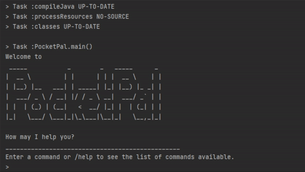

<h1 align="center" style="border-bottom: none">
PocketPal
</h1>

<p align="center">
   
</p>

<hr />

<p align="center">
   <a href="https://github.com/AY2223S2-CS2113-W15-2/tp/actions/workflows/gradle.ym">
     
   </a>
   <a href="https://codecov.io/github/AY2223S2-CS2113-W15-2/tp" >
      
   </a>
</p>

<p align="center">
   <a href="https://ay2223s2-cs2113-w15-2.github.io/tp/UserGuide.html">User Guide</a>
   ·
   <a href="https://ay2223s2-cs2113-w15-2.github.io/tp/DeveloperGuide.html">Developer Guide</a>
</p>

Welcome to PocketPal, a money-management application designed to help users to easily track their expenses.
Users can log and access their expenses quickly with our command-line based application. You will be able to add new expenses and categorise
them by type, and all these expenses can be easily accessed based on date, category, or recent entries!

## Getting Started

- Ensure that you have Java `11` and above
- Download our latest release [here](https://github.com/AY2223S2-CS2113-W15-2/tp/releases)
- Run the application with `java -jar PocketPal.jar`
- You should see the following welcome screen
   ```
   Welcome to
   _____           _        _   _____      _
   |  __ \         | |      | | |  __ \    | |
   | |__) |__   ___| | _____| |_| |__) |_ _| |
   |  ___/ _ \ / __| |/ / _ \ __|  ___/ _` | |
   | |  | (_) | (__|   <  __/ |_| |  | (_| | |
   |_|   \___/ \___|_|\_\___|\__|_|   \__,_|_|

   How may I help you?
   ________________________________________________
   Enter a command or /help to see the list of commands available.
   > 
   ```

## Development

For more information, please refer to our developer guide at https://ay2223s2-cs2113-w15-2.github.io/tp/

