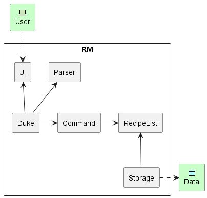
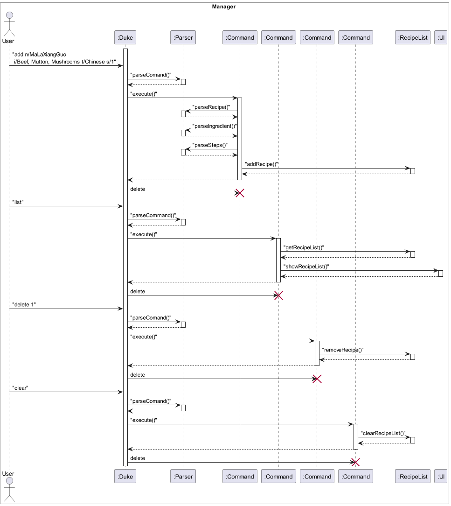

# Developer Guide
- [Developer Guide](#developer-guide)
  - [Acknowledgements](#acknowledgements)
  - [Setup \& Prerequisites](#setup--prerequisites)
  - [Design \& implementation](#design--implementation)
    - [Architecture](#architecture)
    - [UI component](#ui-component)
    - [Recipe Manage Feature](#recipe-manage-feature)
    - [Recipe Search Feature](#recipe-search-feature)
    - [Recipe View Feature](#recipe-view-feature)
      - [Implementation](#implementation)
      - [Example Usage](#example-usage)
    - [Recipe Storage Feature](#recipe-storage-feature)
    - [Help Feature](#help-feature)
  - [Appendix A - Product scope](#appendix-a---product-scope)
    - [Target user profile](#target-user-profile)
    - [Value proposition](#value-proposition)
  - [Appendix B - User Stories](#appendix-b---user-stories)
  - [Appendix C - Non-Functional Requirements](#appendix-c---non-functional-requirements)
  - [Appendix D Glossary](#appendix-d-glossary)
  - [Appendix E - Instructions for manual testing](#appendix-e---instructions-for-manual-testing)

## Acknowledgements

{list here sources of all reused/adapted ideas, code, documentation, and third-party libraries -- include links to the original source as well}

## Setup & Prerequisites
1. Ensure you have `Java 11` installed.
2. Ensure your local repository is synced with the main repository at [AY2223S2-CS2113-F13-1/tp](https://github.com/AY2223S2-CS2113-F13-1/tp)
3. Download the latest `tp.main.jar` from [here](https://github.com/AY2223S2-CS2113-F13-1/tp/releases/tag/v1.0).
4. Copy the file to the folder you want to use as home folder for the recipe manager.
5. Use `Win+R` to open the command prompt and type `cmd` and press Enter.
6. Then `cd` into the folder where you copied the jar file. e.g. `cd C:\Users\Lee\Desktop\MyRecipe`
7. Type `java -jar tp.main.jar` and press Enter to start the program.

## Design & implementation

### Architecture

**Main components of the architecture**

The ***Architecture Diagram*** given above explains the high-level design of the App.

Given below is a quick overview of Duke(main) components and how they interact with each other.
It is responsible for,
* At app launch: Initializes all other components in the correct sequence, and connects them up with each other.
* At shut down: Shuts down the components and invokes cleanup methods where necessary.

The rest of the App consists of five components.

* [**`UI`**](#ui-component): The UI of the App.
* [**`Parser`**](#parser-component): Parses user input.
* [**`Command`**](#command-component): The command executor.
* [**`RecipeList`**](#recipelist-component): Holds the recipe data in the recipe manager by an ArrayList. 
* [**`Storage`**](#storage-component): Reads data from, and writes data to, the hard disk.

### UI component

### Recipe Manage Feature
The recipe manage feature is facilitated by the `command`,`parser`,`recipe` package. It implements the following operations: 

- `RecipeList#addNewRecipe()` - Add a new recipe to the recipe list.
- `RecipeList#getRecipeList()` - Get the recipe list.
- `RecipeList#removeRecipe()` - Delete a recipe from the recipe list.
- `RecipeList#clearRecipeList()` - Clear all recipes from the recipe list.

Given below is an example usage scenario and how the recipe manage mechanism behaves at each step.

**Step 1.** The user launches the application for the first time, then inputs `add n/MaLaXiangGuo i/Beef, Mutton, Mushrooms t/Chinese s/1` to add a new recipe to the recipe manager. `Duke` calls the `parseCommands()` method in the `Parser` class to parse the user input, which will return a `Command` object. The `Command` object will then be executed by calling the `Command#execute()` method, which will call the `Parser#parseSteps()` method to get the steps of the recipe. 

**Step 2.** The user inputs `chop beef` to add a step for the recipe. `Parser#parseSteps()` receives all the steps and returns a `StepList` object. Then we return to the `Command#execute()` method in the `Command` class and call the `RecipeList#addNewRecipe()` to add the recipe to the recipe list.

**Step 3.** The user inputs `list` to list all the recipes in the recipe list. `Duke` calls the `parseCommands()` method in the `Parser` class to parse the user input, which will return a `Command` object. The `Command` object will then be executed by calling the `Command#execute()` method, which will call the `RecipeList#getRecipeList()` to get the recipe list. Then we return to the `Command#execute()` method in the `Command` class and call the `Ui#showRecipeList()` to show the recipe list.

**Step 4.** The user inputs `delete 1` to delete the first recipe in the recipe list. `Duke` calls the `parseCommands()` method in the `Parser` class to parse the user input, which will return a `Command` object. The `Command` object will then be executed by calling the `Command#execute()` method, which will call the `RecipeList#removeRecipe()` to remove the recipe from the recipe list.

**Step 5.** The user executes the `clear` to clear all the recipes in the recipe list. `Duke` calls the `parseCommands()` method in the `Parser` class to parse the user input, which will return a `Command` object. The `Command` object will then be executed by calling the `Command#execute()` method, which will call the RecipeList#clearRecipeList()` to clear all the recipes from the recipe list.

> The following sequence diagram shows how the recipe manage feature works:

### Recipe Search Feature

### Recipe View Feature
#### Implementation

Viewing recipes is handled by the `command`, `recipe` and `ui` classes
The following operations are implemented:
* `RecipeList#getRecipeFromList()` - Retrieves a Recipe from the RecipeList
* `Recipe#getIngredientList()` - Retrieves the IngredientList for the Recipe
* `Recipe#getStepList()` - Retrieves the StepList for the Recipe
* `UI#showRecipeViewed()`- Prints the IngredientList and StepList for the recipe

#### Example Usage
The example usage is based on the assumption that there currently exists at least
one Recipe stored in the RecipeList.

**Step 1.** In the command line, the user inputs `view 1` to view the first `Recipe` object
in the `RecipeList`. `Duke` calls the `parseCommands()` method in the `Parser` class to
parse the user input, which returns a `Command` object of type `VIEW`. Under
`Command#execute()`, this object will be executed.

**Step 2** Under the `VIEW` case, the second part of the user's input `1` is parsed to an `int` to obtain the item
number in the list. 

**Step 3.** The method `RecipeList#getRecipeFromList()` is called to retrieve the desired recipe
to be viewed. This method then converts the 1-based item number to the 0-based indexing of `RecipeList`,
then returns the `Recipe` object stored at that index using `recipeList.get()`

**Step 4.** The `Command#execute()` method under case `VIEW` then calls `UI#ShowRecipeViewed` with the retrieved
`Recipe` object as an input parameter. This method calls `Recipe#getIngredientList()` to obtain the
`IngredientList` object for the Recipe, then calls `IngredientList#showList()` to print out the ingredients
for the recipe. The method then follows a similar approach for the steps in the recipe, calling `Recipe#getStepList`
and then `StepList#showStepList()`.

### Recipe Storage Feature

### Help Feature

## Appendix A - Product scope
### Target user profile

Product is geared towards users who are familiar with CLI (e.g. Computing professionals, university students).
The user is ideally someone who is conscious about their health and would like to learn/improve their cooking

### Value proposition

The user will be able to keep a database of recipes for home cooking, and be able to view both the recipes as well as 
attributes such as calorie count and required ingredients. 
It will also allow them to follow recipes in a step-by-step fashion with additional assistance functions such as timers. 
The user will be able to keep close tabs on their nutrition based on the recipes that they decide to cook and add to their meal plans.

## Appendix B - User Stories

| Version |     As a ...    |                                      I want to be able to ...                                     |                                  So that I can...                                 |
|:-------:|:---------------:|:-------------------------------------------------------------------------------------------------:|:---------------------------------------------------------------------------------:|
|   v1.0  | potential user  | read the User Guide easily                                                                        | I get to know the feature of the app and get started quickly                      |
|   v1.0  | potential user  | add ingredients list to a particular recipes                                                      | refer to it when I go shopping for ingredients                                    |
|   v1.0  | new user        | initially see the estimated cooking time for recipes                                              | choose the faster ones when in a rush                                             |
|   v1.0  | new user        | see basic instructions for the first time I use the app                                           | avoid having to keep referring back to the user guide.                            |
|   v1.0  | new user        | ask the app to provide a format guide for me when I type the wrong format for an instruction      | get started quickly.                                                              |
|   v1.0  | new user        | see a full list of recipes currently available                                                    | get an overview of what is already available                                      |
|   v1.0  | new user        | add recipes                                                                                       | add the ones i like                                                               |
|   v1.0  | new user        | delete recipes                                                                                    | remove the ones i don't like                                                      |
|   v1.0  | new user        | edit the recipe                                                                                   | correct spelling mistakes when typing the recipe                                  |
|   v1.0  | new user        | go through the recipe line by line                                                                | follow the recipe in real time while i cook                                       |
|   v1.0  | long-term user  | mark the steps I have done for the recipe                                                         | be aware of my next steps as I am cooking.                                        |
|   v2.0  | proficient user | trigger certain recipes to be displayed once the app launches                                     | get quick access to my regular cooking recipes                                    |
|   v2.0  | proficient user | customize the shortcut commands                                                                   | customize the keystrokes to my own preferences                                    |
|   v2.0  | potential user  | see the app with sample data and can easily manage to delete it after the exploration of the app. |  Iunderstand the function of the app easily.                                      |
|   v2.0  | potential user  | craft meal plans for different days                                                               | plan my meals ahead for the week                                                  |
|   v2.0  | new user        | register my dietary requirements / restrictions                                                   | avoid eating food I cannot eat.                                                   |
|   v2.0  | new user        | start an automatic timer when required                                                            | avoid forgetting to set a timer when the recipe calls for it                      |
|   v2.0  | new user        | see that the app can provide fuzzy search                                                         | access recipes even if I type the name wrongly                                    |
|   v2.0  | new user        | learn more about the shortcut commands                                                            | easily navigate through the app interface quicker                                 |
|   v2.0  | long-time user  | press any key if prompted to continue to the next step                                            | use my elbow instead of my oily hands on the keyboard                             |
|   v2.0  | long-time user  | get warnings if my fat/sugar intake based on recent dishes is too high                            | better regulate my diet                                                           |
|   v2.0  | long-term user  | sort through stored recipes based on the dishes' nutritional value.                               | better regulate my diet.                                                          |
|   v2.0  | long-term user  | sort by cuisines.                                                                                 | select a particular cuisine                                                       |
|   v2.0  | long-term user  | add my own notes when I’m done cooking                                                            | comment about and adjust the recipe to my liking (e.g. less sweet, less salty)    |
|   v2.0  | long-term user  | hide dishes that I am tired of or tried and do not like                                           | spend less time filtering through dishes                                          |
|   v2.0  | long-term user  | “favorite” dishes that I enjoy                                                                    | quickly select them                                                               |
|   v2.0  | expert user     | get the app to randomly suggest one of my favorite snacks                                         | have help in making decisions on what snacks to eat when I hesitate to choose one |
|   v2.0  | expert user     | rate and comment on the recipe                                                                    | choose my favorite recipe by using the ratings                                    |
|   v3.0  | new user        | the option to mark recipes as drinks/cocktail                                                     | also use the app to find and refer to drinks recipes quickly                      |
|   v3.0  | long-term user  | get encouragement to avoid unhealthy food                                                         | better control my diet                                                            |
|   v3.0  | long-term user  | sort by portion size                                                                              | prep dishes catered to groups when I have friends over                            |
|   v3.0 | long-term user  | have the app to warn me if my laptop battery life is not enough to finish the recipe              | avoid scrambling for a charger while cooking                                      |

## Appendix C - Non-Functional Requirements

* Users should be able to run on **any common operating system (Windows, Mac, Linux).**
* Users should not need to manipulate any files in the directory **manually**.
* Users should be able to run all functions of the program **on the CLI only (i.e. keyboard inputs only)**.
## Appendix D Glossary

* *Recipe* - A set of instructions for preparing a food item. In our implementation it should contain the dish's name,
ingredients required and steps to make the dish
* *Cuisine* - A category of food originating from a given country or religion

## Appendix E - Instructions for manual testing

Sample inputs should be placed into the input.txt file, and an expected output in the EXPECTED.txt file.
Run `./runtest.bat` to automatically get a result of whether the actual output follows the expected.
The resultant output can be found under ACTUAL.txt
   
Manual test cases should include scenarios of the following
1. correct input parameters
2. missing input parameters
3. wrong format input parameters (i.e. substituting an expected number for a word)

