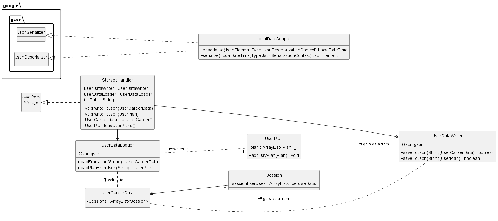

* Table of Contents
  {:toc}

# Developer Guide

## Acknowledgements

* The CS2113 Team (Professor and Teaching Assistants) For their guidance in teaching us concepts of Software
  Engineering and OOP

* Exercise Data retrieved from: [Wrkout](https://github.com/wrkout/exercises.json) (open source MIT license)
  Used to generate the data.json file containing all the exercises data used

* IPPT functions retrieved from : [ninest](https://github.com/ninest/ippt-utils) (open source MIT license)
  Used to implement the IPPT calculator feature in the program

## Design & implementation

### UI Component

Represented by the Ui class, it handles the interactions between the user and the program. In addition, it also displays
a basic overview of what the program does.

Types of pre-defined messages:

1. Information messages that describe the functionalities of the program (`Greet` , `Bye`, `PrintExercises` classes)
2. Help messages that details the usage of the possible commands available in the program (`PrintHelpMessage` class)
3. Error messages that trigger when a user's input is incorrect and provides an explanation to the
   user. (`ErrorMessages` class)

### Storage Component

API: [```StorageHandler.java```](../src/main/java/seedu/duke/storage/StorageHandler.java)

The *Storage* component handles the reading and writing of user data to and from the local hard disk in the form of
a json file.

Key Aspects:

* Handles the serialization and deserialization of user data into a json file using
  the [Gson Library](https://github.com/google/gson)
* Handles the creation of user data file when previous one is missing or corrupted

The class diagram as shown in *Figure X.1* illustrates the structre of the different classes in Storage.
<div align="center">

<p>
Figure X.1
</p>
</div>

The StorageHandler interacts with the other classes as shown in the *Sequence Diagram*
where it shows how the StorageHandler loads the local user data json file upon the resumption of the program.
<div align="center">

<p>
Figure X.2
</p>
</div>

### Exceptions

Accounts for the different scenarios that may trigger an error during user's interactions with the program

### Additional features to be added

1. An IPPT calculator to integrate with Fitness Duke to facilitate users who want to train for their IPPT fitness
   assessments.

## Product scope

### Target user profile

Fitness Duke targets individuals who are looking for a smarter way to keep fit, as well as adding a greater diversity
to their workout routines.

### Value proposition

With the recent emphasis of healthy lifestyles in Singapore, the Singapore Government has initiated the Healthier SG
initiative
[Healthier SG](https://www.healthiersg.gov.sg/). To encourage more fitness activities to be carried out by Singaporeans
as a form of preventive care, Fitness Duke aims to help Singaporeans to kick-start their journeys towards
a healthier lifestyle, regardless of their knowledge in exercises or their individual fitness levels.
Through this program, it aims to not only help users learn new workouts, while also keep track of their fitness
progress.

## User Stories

| Version | As a ...                                                                                       | I want to ...                                                                                                                   | So that I can ...                                                              |
|---------|------------------------------------------------------------------------------------------------|---------------------------------------------------------------------------------------------------------------------------------|--------------------------------------------------------------------------------|
| v1.0    | - User who wants to start working out<br/>- User who wants to train a specific part of my body | - Select a specific intensity workout<br/>- Request a workout that comprises exercises that thoroughly exercises that body part | - Exercise according to selected intensity<br/> - Work on my target body part. |
| V1.1    | - User who likes to see my progress                                                            | - Take note my history of workouts                                                                                              | - track my progress of my fitness so far                                       |

## Non-Functional Requirements

| Categories  | Requirement                                                                                          |
|-------------|------------------------------------------------------------------------------------------------------|
| Performance | - The program should be able to generate a list of exercises within 5 seconds                        |
| Technical   | - The program should be able to run on any PC (i.e. different OS)                                    |       
| Others      | - The program is not required to ensure the workouts are carried out safely and properly by the user |

## Glossary

* *FitnessDuke* - The name of our application
* *OS* - Operating Systems - Linux, MacOS, Windows

## Instructions for manual testing

{Give instructions on how to do a manual product testing e.g., how to load sample data to be used for testing}
