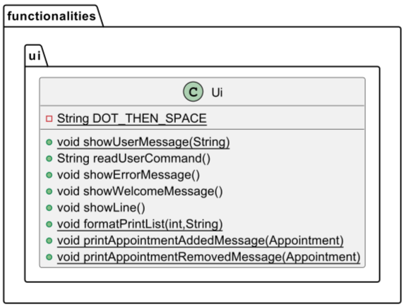

# Developer Guide

## Acknowledgements

{list here sources of all reused/adapted ideas, code, documentation, and third-party libraries -- include links to the original source as well}

## Design & implementation

### User Interface (UI) - Class Implementation
! <br>
**Figure 1: UML Diagram of User Interface (UI) Class**
1. The **`UI class`** named `Ui` belongs to the package functionalities.ui. The class contains several static and non-static methods that display messages to the user such as **`showUserMessage()`**, **`showErrorMessage()`**, and **`showWelcomeMessage()`**. The class is also used to read user input, format and print appointment lists, and add or remove appointments from the **`sniff appointment manager`**. The **`Ui`** class has a **`showLine()`** method that displays a divider line to the user.
2. The **`UI class`** has a private static final String DOT_THEN_SPACE field that is used as a constant string value to format user messages. It has a **`readUserCommand()`** method that returns a string value that is entered by the user through the Command Line Interface (CLI).
3. The class imports the **`SniffException`** class from the exception package and utilizes it in the **`showErrorMessage()`** method to display an error message to the user.

### Command - Class Implementation
 <br>
**Figure 2: UML Diagram of Command Class**
1. The **`Command class`** named `Command` belongs to the package functionalities.commands. The class is an abstract class that provides a basic template for implementing commands in the command-line interface. This class is designed to be extended by subclasses that implement specific commands, such as **ListCommand** and **ConsultationCommand**.
2. The **`Command class`** has a boolean isExit field that can be set to true and exit the entire programme, or remain as false to continue running the programme. It has a **`isExit()`** method that sets that field to false initially. It also has a **`executeCommand()`** method that takes an instance of SniffTasks as a parameter and throws a SniffException if an error occurs during execution. Subclasses override this method in order to run other commands that the user inputs.

 <br>
**Figure 3: Sequence Diagram showing the logical implementation of executeCommand() for the Consultation Command**
1. The 

 <br>
**Figure 4: Sequence Diagram showing the logical implementation of executeCommand() for the Vaccination Command**

 <br>
**Figure 5: Sequence Diagram showing the logical implementation of executeCommand() for the Surgery Command**

The Sequence Diagram below shows how the components interact with each other for the scenario where the user removes an appointment.
 <br>
**Figure 6: Sequence Diagram showing the logical implementation of executeCommand() for the Remove Command**
The remove command is facilitated by `SniffTasks` which stores all the current appointments as `APPOINTMENTS`. It then implements the following operation:
* `Snifftasks.removeAppointment()` -- Removes the appointment with the specified UID.


 <br>
**Figure 7: Sequence Diagram showing the logical implementation of executeCommand() for the List Command**

### Parser - Class Implementation
 <br>
**Figure 8: UML Diagram of Parser Class**
1. The Parser class takes in a user command and generates a corresponding Command object for veterinary management system tasks such as **add consultation, vaccination or surgery, find, remove, list, and exit**. This implementation makes use of the Command design pattern to encapsulate the behavior of different types of commands, and the parser serves as a factory for creating these commands based on the user input.
2. The Parser class contains several static methods that parse different types of commands, such as **`ConsultationCommand`**, **`VaccinationCommand`**, **`SurgeryCommand`**, **`FindCommand`**, **`RemoveCommand`**, **`ListCommand`**, and **`ExitCommand`**.
3. The **`parse()`** method takes a user command as a String named **`task`** and determines the type of command based on the first word of the command. If it matches any of the known command types, it delegates parsing to the corresponding parse method.
4. If the first word of the command does not match any known type, it throws a **`SniffException`**. Each parse method takes the command String as input and uses substring operations to extract the various parameters of the command. It then creates a new Command object with these parameters and assigns it to the "command" static variable.
5. Finally, the parse method returns the command object. If an exception occurs during parsing, it throws a **`SniffException`**.

## Product scope
### Target user profile

{Describe the target user profile}

### Value proposition

{Describe the value proposition: what problem does it solve?}

## User Stories

|Version| As a ... | I want to ... | So that I can ...|
|--------|----------|---------------|------------------|
|v1.0|new user|see usage instructions|refer to them when I forget how to use the application|
|v2.0|user|find a to-do item by name|locate a to-do without having to go through the entire list|

## Non-Functional Requirements

1. Should work on any mainstream OS as long as it has Java 11 or above installed.
2. Should be able to hold up to 1000 appointments without a noticeable change in performance for typical usage.
3. A user with above average typing speed for regular English text (i.e. not code, not system admin commands) should
   be able to accomplish most of the tasks faster using commands than using the mouse.

## Glossary

* **Mainstream OS**: Windows, Linux, Unix, OS-X
* **Main Command**: The first WORD that a user types in. `e.g. consultation, list` etc
* **Argument**: A word that is a parameter is prefixed by `/`. `e.g. at/, cd/`

## Instructions for manual testing
Given below are the instructions to test Sniff manually

### Launch
1. Ensure you have Java 11 or above installed.
2. Download the latest copy of `Sniff.jar` [here](https://github.com/AY2223S2-CS2113-W12-1/tp/releases)
3. Move the jar file to a folder where you want to run Sniff
4. Open the command terminal and change the directory to the address of the folder containing Sniff.jar
5. Use the following command in the command terminal to run Sniff:
   `java -jar sniff.jar`
6. If Sniff runs successfully, you will see the following welcome message:

```
______________________________________________________________________
 Hello! I'm Sniff, your personal appointment manager.
 What can I do for you?
______________________________________________________________________
```

### Sample test cases

#### Adding appointments

1. Definitions:
   1. 3 types of appointments: `consultation`, `vaccination`, `surgery`.
   2. Animal type: `at/`.
   3. Animal name: `an/`.
   4. Owner name: `on/`.
   5. Contact number: `cn/`.
   6. Dates: `cd`, `vd`, `sd`, `ed`, in the format of **YYYY-MM-DD**.
   7. Times: `ct`, `vt`, `st`, `et`, in the format of **HH:MM**.
   8. Vaccine: `v/`.
   9. Priority: `p/`, in the format of **H**, **M**, or **L**.
   
2. Test case: `consultation at/Cat an/Lulu on/Jon cn/91919191 cd/2023-12-12 ct/19:00`<br>
   Expected output: A consultation appointment has been added successfully, details shown in the status message.
   Example:
```
______________________________________________________________________
 This appointment has been added to your appointment manager: 
 UID: C84120821A
 Date: 2023-12-12 | Time: 19:00
 Animal Name: Lulu | Animal Type: Cat
 Owner Name: Jon | Contact Number: 91919191
 Consultation added successfully!
______________________________________________________________________
```

3. Test case: `consultation at/an/Lulu on/Jon cn/91919191 cd/2023-12-12 ct/19:00`<br>
   Expected output: A consultation appointment is not added due to invalid description.
   Example:
```
______________________________________________________________________
 Sorry, an error was encountered! Here is the error description:
 The consultation description is invalid!
______________________________________________________________________
```

4. Test case: `vaccination at/Dog an/Russ on/Abel cn/92929292 v/Covid vd/2023-12-12 vt/19:00`
   Expected output: A vaccination appointment has been added successfully, details show in the status message.
   Example:
```
______________________________________________________________________
 This appointment has been added to your appointment manager: 
 UID: V12400172X | vaccine: Covid
 Date: 2023-12-12 | Time: 19:00
 Animal Name: Russ | Animal Type: Dog
 Owner Name: Abel | Contact Number: 92929292
 Vaccination added successfully!
______________________________________________________________________
```

5. Test case: `vaccination at/Dog an/Russ on/Abel cn/92929292 v/Covid vd/12-12-2023 vt/19:00`
   Expected output: A vaccination appointment is not added due to invalid date description.
   Example: 
```
______________________________________________________________________
 Sorry, an error was encountered! Here is the error description:
 The date/time description is invalid.
______________________________________________________________________
```

6. Test case: `surgery at/Hamster an/Polly on/Sam cn/93939393 sd/2023-12-12 st/19:00 ed/2023-12-12 et/20:00 p/H`
   Expected output: A surgery appointment has been added successfully, details shown in the status message.
   Example:
```
______________________________________________________________________
 This appointment has been added to your appointment manager: 
 UID: S14837641R | Priority: HIGH
 Animal Name: Polly | Animal Type: Hamster
 Owner Name: Sam | Contact Number: 93939393
 Start Date: 2023-12-12 | Start Time: 19:00
 End Date: 2023-12-12 | End Time: 20:00
 Surgery added successfully!
______________________________________________________________________
```

7. Test case: `surgery at/Hamster an/Polly on/Sam cn/93939393 sd/2023-12-12 st/19:00 ed/2023-12-12 et/19:00 p/H`
   Expected output: A surgery appointment is not added due to invalid date description.
   Example:
```
______________________________________________________________________
 Sorry, an error was encountered! Here is the error description:
 The start time cannot be the same as the end time!
______________________________________________________________________
```

#### Listing appointments

1. Prerequisites: Add an appointment using any of the add commands. At least one appointment in the list.
2. Test case: `list`<br>
   Expected output: A list of all previously added appointments.
   Example:
```
______________________________________________________________________
1.  UID: C84120821A
 Date: 2023-12-12 | Time: 19:00
 Animal Name: Lulu | Animal Type: Cat
 Owner Name: Jon | Contact Number: 91919191
2.  UID: V12400172X | vaccine: Covid
 Date: 2023-12-12 | Time: 19:00
 Animal Name: Russ | Animal Type: Dog
 Owner Name: Abel | Contact Number: 92929292
3.  UID: S14837641R | Priority: HIGH
 Animal Name: Polly | Animal Type: Hamster
 Owner Name: Sam | Contact Number: 93939393
 Start Date: 2023-12-12 | Start Time: 19:00
 End Date: 2023-12-12 | End Time: 20:00
______________________________________________________________________
```

#### Finding appointments

1. Prerequisites: Add an appointment using any of the add commands. At least one appointment in the list.
2. Test case: `find a/Dog`
   Expected output: A list of all previously added appointments with the animal type.
   Example:
```
______________________________________________________________________
1.  UID: V12400172X | vaccine: Covid
 Date: 2023-12-12 | Time: 19:00
 Animal Name: Russ | Animal Type: Dog
 Owner Name: Abel | Contact Number: 92929292
______________________________________________________________________
```

3. Test case: `find t/consultation`
   Expected output: A list of all previously added appointments with the appointment type.
   Example:
```
______________________________________________________________________
1.  UID: C84422868K
 Date: 2023-12-12 | Time: 19:00
 Animal Name: Lulu | Animal Type: 
 Owner Name: Jon | Contact Number: 91919191
______________________________________________________________________
```

#### Removing appointments

1. Prerequisites: The UID of the appointment you want to remove. Use `list` or `find` to help you get the specific UID.
2. Test case: `remove C84120821A`<br>
   Expected output: The appointment with the specified UID is removed, details shown in the status message.
   Example:
```
______________________________________________________________________
 This appointment has been removed your appointment manager: 
 UID: C84120821A
 Date: 2023-12-12 | Time: 19:00
 Animal Name: Lulu | Animal Type: Cat
 Owner Name: Jon | Contact Number: 91919191
 Task removed successfully!
______________________________________________________________________
```

#### Mark/Unmark appointments

1. Prerequisites: The UID of the appointment you want to remove. Use `list` or `find` to help you get the specific UID.
2. Test case: `mark V12400172X`<br>
   Expected output: The appointment with the specified UID is marked as done, details shown in the status message.
   Example:
```

```
3. Test case: `unmark V12400172X`<br>
   Expected output: The appointment with the specified UID is unmarked as done, details shown in the status message.
   Example:
```

```

