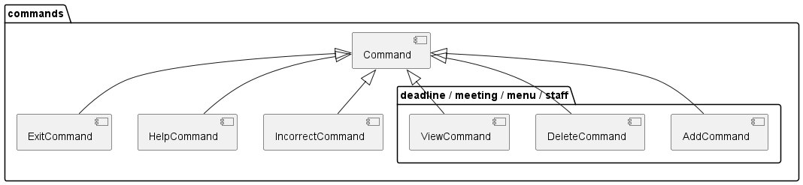

# Developer Guide

## Acknowledgements
Credits to [Personbook](https://github.com/nus-cs2113-AY2223S2/personbook)
for some reused skeleton code and inspiration on OOP implementation.

{list here sources of all reused/adapted ideas, code, documentation, and third-party libraries -- include links to the original source as well}

## Setting up

## Design 
### Architecture

The **Architecture Diagram** given above explains the high-level design of DinerDirector. 
Given below is a quick overview of main components and how they interact with each other. 

**Architecture of Main Components** <br/>
`DinerDirector` entry point to the application is DinerDirector. Initially, `DinerDirector` class interact with `UI` class to 
prompt user for inputs. Once user keys in the input text, the input will be redirected to `Parser` class. `Parser` class will manage the error 
handling of user's input. Next, any logic will be executed by `Command` object. If there exists any interaction with `Entity`, `Command` will 
request to `Manager` to assist the CRUD operations.  


### Command Component (Zheng Rong)

##### The command component consists of the following:



- 4 subcomponents: Command, HelpCommand, ExitCommand, IncorrectCommand

- 4 sub packages with the following names: deadline, meeting, menu and staff
    - Each package contains the 3 general commands: 
        - AddCommand 
        - DeleteCommand
        - ViewCommand
    - The general commands have specific names depending on the package it is in.

##### Command
It is an abstract class consisting of abstract methods ```execute``` and ```isExit```. These classes are implemented by the 4 sub components as well as the general commands in the 4 sub packages.
The general functions for the methods are as follows:
- execute: To run the functionality specific to the Command class it is implemented in.
- isExit: To return a boolean value that indicates whether the program should exit when the command is called.

##### HelpCommand
HelpCommand inherits from the abstract ```Command``` class.
It has the following functions:
- Prints out the list of commands available for the user to type to the console.
- Returns whether the program should exit when this command is called.

##### ExitCommand
ExitCommand inherits from the abstract ```Command``` class.
It has the following functions:
- Sets the boolean variable that decides whether the program should exit when this command is called to <b>true</b>.
- Returns whether the program should exit when this command is called.

##### IncorrectCommand
IncorrectCommand inherits from the abstract ```Command``` class.
It has the following functions:
- Prints out the error message to the console when an invalid command is keyed in.
- Returns whether the program should exit when this command is called.

##### AddCommand
AddCommand inherits from the abstract ```Command``` class.
AddCommand is the placeholder name for the commands in the sub packages that are of this type. For example, the AddCommand class in the deadline package is ```AddDeadlineCommand```. 
It has the following functions:
- Calls the respective method in the respective manager Class in the manager package. For example: addDishCommand in the DishManager Class is called when AddDishCommand is called.
- Returns whether the program should exit when this command is called.

##### DeleteCommand
DeleteCommand inherits from the abstract ```Command``` class.
DeleteCommand is the placeholder name for the commands in the sub packages that are of this type. For example, the DeleteCommand class in the deadline package is ```DeleteDeadlineCommand```. 
It has the following functions:
- Calls the respective method in the respective manager Class in the manager package. For example: DeleteDishCommand in the DishManager Class is called when DeleteDishCommand is called.
- Returns whether the program should exit when this command is called.

##### ViewCommand
ViewCommand inherits from the abstract ```Command``` class.
ViewCommand is the placeholder name for the commands in the sub packages that are of this type. For example, the ViewCommand class in the deadline package is ```ViewDeadlineCommand```. 
It has the following functions:
- Calls the respective method in the respective manager Class in the manager package. For example: ViewDishCommand in the DishManager Class is called when ViewDishCommand is called.
- Returns whether the program should exit when this command is called.

### Manager Component (PeiHao)
### Ui Component (HuiQi)
The Ui Component consists of the TextUi class that handles interactions between the app and the user.

The `TextUi`class performs the following functions:
1. Reading the user input (Empty inputs will be ignored)

    method: `getUserInput()`
2. Printing messages generated by the app to the terminal

    method: `printBanner()`, `printMessage()`

### Utils Component (Darren)

(Insert Class Diagram)  
The Utils Component consists of the Parser class that will handle the parsing and preparing of commands within the DinerDirector application.  

The `Parser` class performs the following functions:  
* Parse the command given the user input and extracts out the necessary information related to the command.
* Returns the appropriate Command Class based on the parsed input.

## Implementation
### Parsing Feature (Darren)

(Insert Sequence Diagram)  
How the parsing works:
1. When the `parseCommand()` method is called from `DinerDirector` class, the `parseCommand()` will split the given userInput first.
2. With the `userInputSplit[]`, the `0` index will be extracted out. That will be used as identification for the command the user typed in.
3. The `commandWord` will be used in the switch statement to select the appropriate command. returning `IncorrectCommand` class is the default behavior.
4. If the `commandWord` is valid, it will run the appropriate `prepareXYZCommand()`.
5. Each of the individual `prepareXYZCommand()` will take in the userInput without the command portion. The variable is named `userInputNoCommand`. The `prepareXYZCommand()` will check the userInput to see if all the appropriate values are added, and return `XYZCommand` class if the values are correct. `prepareXXXCommand()` will return `IncorrectCommand` class if there are some missing values or inappropriate values.

### Meeting Feature (PeiHao)
### Deadline Feature (HuiQi)
The Deadline Feature allows user to add Deadline objects in a deadline list.
Deadline objects consists of a description String and a dueDate String.
The User will also be able to delete deadlines, view deadline list.

When the user input a deadline command, it will be parsed into Parser to determine which deadline command will be called.
Then, the deadline command will be executed, and the respective method in the DeadlineManager class will be called, which are:
1. addDeadline 

    Adds the deadline object to the ArrayList `deadlines`.
    
    A deadline object can only be added to the deadlines list if it has a valid description and dueDate String.
    
    If the addition was a success, a message will be printed through TextUi class to notify the reader that the deadline object has been added.


2. deleteDeadline

    Removes a deadline object from the ArrayList `deadlines` using the index given.
    A deadline object can only be removed if the index is a valid index in the list.
    If the deletion was a success, a message will be printed through TextUi class to notify the reader that the deadline object has been deleted.

3. printDeadlines

    Prints the ArrayList `deadlines` through TextUi class.
### Staff Feature 
The `Staff` Feature allows user to create, read, update, delete (CRUD) `Staff` objects in the list of staffs. 
`Staff` list is managed by `StaffManager` Class similar to other entity objects. Here are hot it works for each functionality: 

1. add_staff  

    It first checks whether the parameter needed to add `Staff` is already given in the correct format. If it passes the format checking, 
    the `Parser` object will return `AddStaffCommand` to be executed by `DinerDirector`. Internally, `AddStaffCommand` redirect the requests to 
    `StaffManager` to add the `Staff` object to the list of `Staff` 
2. delete_staff 

    It first finds the corresponding `Staff` object to be deleted using its name in the list in `StaffManager`. 
    If it is found, it will delete the correct corresponding `Staff`. 

3. view_staff

    It prints all of `Staff` objects in `StaffManager`'s staffs. 

### Dish Feature (Zheng Rong)

The Dish feature consists of three functions:

##### Adding dish to list:
- When the ```AddDishCommand()``` constructor is called, it stores the dish name, price and the list of ingredients in an entity called Dish. 
- When the ```execute()``` command in ```AddDishCommand``` is called, it calls the ```addDishCommand()``` in ```DishManager``` class that adds the Dish into an arraylist of Dishes.
- It then prints out a message to the console that informs the user that a dish has been added. 

##### Deleting dish on the list:
- When the ```DeleteDishCommand()``` constructor is called, it stores the index of the Dish to be deleted from the arraylist of Dishes. 
- When the ```execute()``` command in ```DeleteDishCommand``` is called, it calls the ```DeleteDishCommand()``` in ```DishManager``` class that deletes the Dish at the specified index in the arraylist of Dishes
- It then prints out a message to the console that informs the user that a dish has been added.

##### Viewing the list of dishes:
- When the ```execute()``` command in ```ViewDishCommand``` is called, it calls the ```ViewDishCommand()``` in ```DishManager``` class that returns the formatted string of all the dishes in the arraylist. 
- It then prints out the formatted string to the console.

## Product scope
### Target user profile
Restaurant Managers  
1. The purpose of the product is to help restaurant managers to manage their restaurant in a more convenient manner.
2. We aim to create an all in application where the restaurant manager can keep track of what is needed to run a restaurant daily.

### Value proposition
There are too many things to keep track of in a restaurant. We want to create an application that will allow the restaurant manager to have a place to quickly refer to, and keep track of the things that allow the restaurant to function on a daily basis.


## User Stories

|Version| As a ...                                                 | I want to ... | So that I can ...                                                                      |
|--------|----------------------------------------------------------|---------------|----------------------------------------------------------------------------------------|
|v1.0| forgetful restaurant manager                             |get reminded of the things I need to keep track of| not miss any important deadlines that may affect my business                           |
|v1.0| forgetful restaurant manager                             |schedule meeting and show the timetable| know when the meeting is going to occur                                                |
|v1.0| newcomer restaurant manager                              |view the help list of the app| get to know this application easier                                                    |
|v1.0| newcomer restaurant manager                              |view all the workers information| get to know all the workers better                                                     |
|v1.0| restaurant manager managing a 3-Michelin star restaurant |keep track of current menu prices, ingredients, and name| be more particular about details on my menu                                            |
|v2.0| restuarant manager                                       |find a to-do item by name| locate a to-do without having to go through the entire list                            |
|v2.0| restuarant manager                                       |find information about a specific worker| I know the worker's details and when he is working without going through the whole list |
|v2.0| restuarant manager                                       |find information about a specific dish I added| I can find what ingredients I added to the dish  without going through the whole list  |
|v2.0| restuarant manager                                       |find information about a specific meeting| so that I can look up information about that meeting without going through the whole list |
|v2.0| restuarant manager                                       |find information about a specific deadline| I can find details about the deadline date  without going through the whole list       |
|v2.0| restuarant manager                                       |view what I typed into the app previously| I don't need to retype everything everytime I enter the app                            |
|v2.0| restaurant manager                                       |keep track of tips that the servers get|split the tips amongst the backend crew as well|
|v2.0| restaurant manager                                       |be forgetful about what commands I typed|I can refer to what command I typed in previously|

## Non-Functional Requirements

{Give non-functional requirements}

## Glossary

* *glossary item* - Definition

## Instructions for manual testing

{Give instructions on how to do a manual product testing e.g., how to load sample data to be used for testing}
