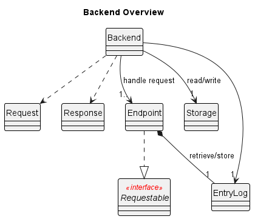
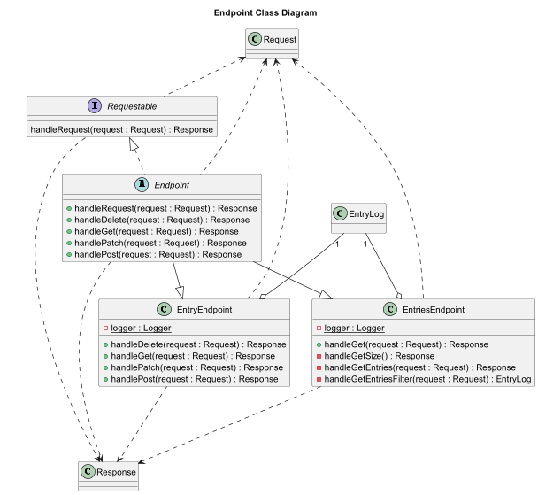

# Developer Guide

## Acknowledgements

### Documentation

- [Github REST API documentation](https://docs.github.com/en/rest/quickstart?apiVersion=2022-11-28)
- [Diagrams.net](https://app.diagrams.net/)
- PlantUML

### Storage

- [Function `makeFileIfNotExists` - StackOverflow](https://stackoverflow.com/questions/9620683/java-fileoutputstream-create-file-if-not-exists)
- [Deleting files - w3Schools](https://www.w3schools.com/java/java_files_delete.asp)
- [BufferedReader - Baeldung](https://www.baeldung.com/java-buffered-reader)

### Unit Tests

- [Assert Exceptions Thrown - Baeldung](https://www.baeldung.com/junit-assert-exception)
- [Arrange, Act, Assert](https://java-design-patterns.com/patterns/arrange-act-assert)


## Design & implementation

### Architecture



### Communication
This project uses a simplified HTTP model, where the frontend sends a `Request` to the backend to perform data-related operations. The backend returns a `Response`, which is then processed by the frontend


### Data
We use the `EntryLog` data structure to keep track of the entries entered by the user.


### Backend

The backend uses a simplified RESTful API approach. This allows us to decouple code using the proven industry practices.


To find out more, visit the following sections:
- [API](#api)
- [Add, modify, view or delete an entry - `GET`](#add-modify-view-or-delete-an-entry)
- [Access all entries available - `DELETE`, `GET`, `PATCH`, `POST`](#access-all-entries-available)

### API
#### Endpoints



Each endpoint is an child class `Endpoint`. Currently there are 2 endpoints available:

| Endpoint   | Method to call          |
| ---------- | ----------------------- |
| `/entry`   | `callEntryEndpoint()`   |
| `/entries` | `callEntriesEndpoint()` |

##### Creating a request

- To create a request, simply instantiate `seedu.pocketpal.communication.Request`
  with the desired request method.
- If there are any parameters associated with the request, you may add them using `addParam()`

```java
Request req = new Request(RequestMethod.PATCH);
req.addParam(RequestParams.EDIT_DESCRIPTION, "mango juice");
```

##### Making a request

- To call each endpoint, pass the `Request` into its corresponding method in the frontend.
- A `Response` will be returned to the frontend.

> All request body and parameter data should be serialised with `String.valueOf()` if not specified.

```java
Backend backend = new Backend();
Response res = backend.callEntryEndpoint(req);

if (res.getResponseStatus() != ResponseStatus.OK) {
// handle status        
}

Entry entry = EntryParser.deserialise(res.getData());
// process entry
```

#### Access all entries available
##### Get recent or all entries

`GET /entries`

__Body__

Number of recent entries to view if present, otherwise all entries will be returned.

__Parameters__

__`GET_SIZE`__ boolean

- If present, response will contain the number of entries.
- Otherwise, the following filters will be applied to the entries:

__`FILTER_BY_AMOUNT_START`__ double

- If this is the only parameter, it will be used as a minimum amount filter.
- If both filter amount parameters are present, it will be used as a amount range filter.

__`FILTER_BY_AMOUNT_END`__ double

- If this is the only parameter, it will be used as a maximum amount filter.
- If both filter amount parameters are present, it will be used as a amount range filter.

__`FILTER_BY_CATEGORY`__ Category

- Filter entries by category

__`FILTER_BY_QUERY`__ String

- Filter entries by user query

__Responses__

| Status Code | Description           | Remarks                                                                       |
| ----------- | --------------------- | ----------------------------------------------------------------------------- |
| `200`       | OK                    | Gson-serialised `List<Entry>`, deserialise with `EntryLogParser::deserialise` |
| `422`       | Unprocessable Content | -                                                                             |


#### Add, modify, view or delete an entry
##### Add an entry

`POST /entry`

__Body__

- Gson-serialised `Entry`, obtained using `Entry::serialise`

__Parameters__

N/A

__Responses__

| Status Code | Description | Remarks |
| ----------- | ----------- | ------- |
| `201`       | Created     | -       |


##### View a specific entry

`GET /entry`

__Body__

- 1-based index of entry to view _Required_

__Parameters__

N/A

__Responses__

| Status Code | Description | Remarks                                                              |
| ----------- | ----------- | -------------------------------------------------------------------- |
| `200`       | OK          | Gson-serialised `Entry`, deserialise with `EntryParser::deserialise` |
| `404`       | Not Found   | -                                                                    |


##### Delete an entry

`DELETE /entry`

__Body__

- 1-based index of entry to be deleted _Required_

__Parameters__

N/A

__Responses__

| Status Code | Description | Remarks                                                              |
| ----------- | ----------- | -------------------------------------------------------------------- |
| `200`       | OK          | Gson-serialised `Entry`, deserialise with `EntryParser::deserialise` |
| `404`       | Not Found   | -                                                                    |


##### Modify an entry

`PATCH /entry`

__Body__

- 1-based index of entry to be deleted _Required_

__Parameters__

__`EDIT_AMOUNT`__ int

- The updated entry amount

__`EDIT_CATEGORY`__ Category

- The updated entry category

__`EDIT_DESCRIPTION`__ string

- The updated entry description

__Responses__

| Status Code | Description           | Remarks                                                              |
| ----------- | --------------------- | -------------------------------------------------------------------- |
| `200`       | OK                    | Gson-serialised `Entry`, deserialise with `EntryParser::deserialise` |
| `404`       | Not Found             | -                                                                    |
| `422`       | Unprocessable Content | -                                                                    |  |


### Automated Testing

We adopt the Arrange, Act, Assert pattern for unit tests in this project. 
This allows us to achieve a structured unit tests while balancing code readability and maintainability, and allowing a clear separation of the setup, operations and results. 
For backend testing, we use utility classes such as `EntryTestUtil` and `BackendTestUtil` to reduce code repetition and to simplify the testing process.

__Example:__
  ```java
  @DisplayName("Test /entries [GET]")
  class TestEntriesGet extends EntryTestUtil {
      private static final EntryLog expectedEntryLog = new EntryLog();

      @BeforeEach
      void init() {
          TEST_BACKEND.clearData();
          expectedEntryLog.clearAllEntries();
      }

      @Test
      void entriesEndpointGET_recentEntries_correctEntries() {
          // Arrange
          addEntry(ENTRY_1);
          addEntry(ENTRY_2);
          addEntry(ENTRY_3);
          addEntry(ENTRY_4);
          expectedEntryLog.addEntry(ENTRY_3);
          expectedEntryLog.addEntry(ENTRY_4);

          // Act
          Request request = new Request(RequestMethod.GET); // recent 2 entries
          request.addParam(RequestParams.NUM_ENTRIES, "2");
          Response response = TEST_BACKEND.requestEndpointEntries(request);
          EntryLog returnedEntryLog = EntryLogParser.deserialise(response.getData());

          // Assert
          assertEquals(response.getResponseStatus(), ResponseStatus.OK);
          assertTrue(isSameEntryLog(expectedEntryLog, returnedEntryLog));
      }
  }
  ```

## Product scope
### Target user profile

{Describe the target user profile}

### Value proposition

{Describe the value proposition: what problem does it solve?}

## User Stories

| Version | As a ... | I want to ...             | So that I can ...                                           |
| ------- | -------- | ------------------------- | ----------------------------------------------------------- |
| v1.0    | new user | see usage instructions    | refer to them when I forget how to use the application      |
| v2.0    | user     | find a to-do item by name | locate a to-do without having to go through the entire list |

## Non-Functional Requirements

{Give non-functional requirements}

## Glossary

* *glossary item* - Definition

## Instructions for manual testing

{Give instructions on how to do a manual product testing e.g., how to load sample data to be used for testing}
