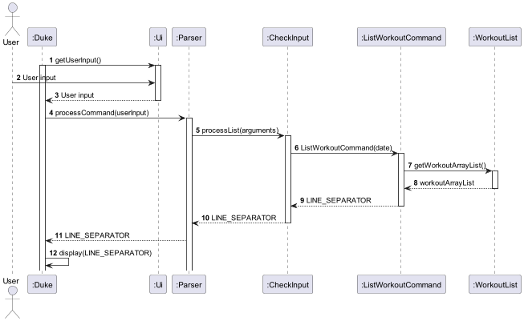
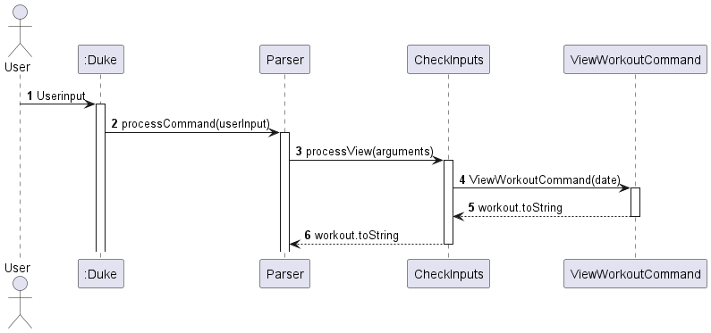
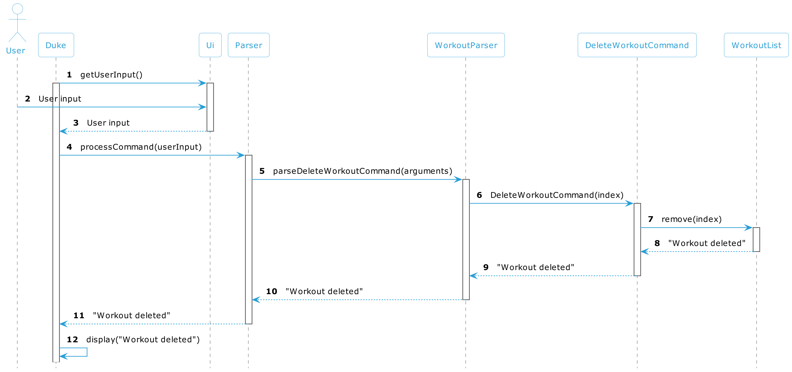

# Developer Guide

## Table of Contents

<!-- TOC -->
* [Acknowledgements](#acknowledgements)
* [Product Scope](#product-scope) 
  * [Target User Profile](#target-user-profile)
  * [Value Proposition](#value-proposition)
* [Design & Implementation](#design--implementation)
  * [Architecture](#architecture)
  * [UI component](#ui-component)
  * [Start component](#start-component)
  * [Add component](#add-component)
  * [List component](#list-component)
  * [View component](#view-component)
  * [Delete component](#delete-component)
  * [Exit component](#exit-component)
* [User Stories](#user-stories)
  * [V1.0](#v10)
  * [V2.0](#v20)
* [Non-Functional Requirements](#non-functional-requirements)
* [Glossary](#glossary)
* [Instruction for Manual Testing](#instructions-for-manual-testing)
<!-- TOC -->

## Acknowledgements

{list here sources of all reused/adapted ideas, code, documentation, and third-party libraries -- include links to the original source as well}
###### [Back to table of contents](#table-of-contents)

## Product Scope

### Target User Profile
* People who go to gym and do exercise
* People who want to lose weight or strength muscles

### Value Proposition
Help our target users to record down the exercise, and they can check the exercise whenever they want.
Besides, this fitness app also help them to calculate the calories consumption for each workout.

###### [Back to table of contents](#table-of-contents)

## Design & Implementation
{Describe the design and implementation of the product. Use UML diagrams and short code snippets where applicable.}

### Architecture

###### [Back to table of contents](#table-of-contents)

We aim to help fellow gym enthusiasts and new gym members to help keep
track of their future and present training.
=======
### UI component

###### [Back to table of contents](#table-of-contents)

### Start component

###### [Back to table of contents](#table-of-contents)

### Add component

The add mechanism is facilitated by `AddCommand`. 
It extends `Command` and modifies the execute function to add an exercise.

Given below is an example usage scenario and how the add mechanism behaves at each step.

Step 1. The user enters the add command with the necessary arguments.

Step 2. The input is processed by the `Parser` to separate out the arguments and creates the exercise to be added, 
`toAdd`.

Step 3. The `AddCommand` calls `execute()` which calls `WorkList#getCurrentWorkout()` to return `currentWorkout`.

Step 4. Finally, `addExercise()` is called and `toAdd` is added to `currentWorkout`.

###### [Back to table of contents](#table-of-contents)

### List component
The deletion mechanism is facilitated by 'Parser', 'ListCommand', 'WorkoutList' and 'UI', where a Workout object will be deleted according to the command inputted by the user and removed from the workout list.

Below is an example usage scenario and how the List mechanism behaves at each step:

Step 1: Assume that the user has already added a workout on 21/03/23 into the WorkoutList using the following command, /start 21/03/23
        Assume the user add another workout on 22/03/23 by entering /start 22/03/23

Step 2: The user input of /list will be taken in for the parser and an object of class ListCommand will be returned.

Step 3: The execute method in the ListWorkoutCommand class that is overrides will be called and print out all the dates that while iterating the workoutList.
###### [Back to table of contents](#table-of-contents)

### Workout view component
The View component is facilitated by `Parser`,`Ui`,`WorkoutList`,`Command` and `ViewCommand`, where the user will 
enter a specific workout date and the number of exercises on that date will be displayed

Below are the specific steps on how to use the view function and how the mechanism will flow:

* Step 1: We will assume that the user has started a workout on two specific dates, `11/02/22` which was added with the following command `/start 11/02/22`
  and `12/02/22`, which was added with the following command `/start 12/02/22`.
* Step 2: The user will then use the following command `/view 11/02/22` will be taken into the parser
  and will return a list of exercises done on that specified date.

###### [Back to table of contents](#table-of-contents)

### Delete component
The deletion mechanism is facilitated by 'Parser', 'DeleteCommand', 'Workout', 'WorkoutList' and 'UI', where a Workout object will be deleted according to the command inputted by the user and removed from the workout list.

Below is an example usage scenario and how the deletion mechanism behaves at each step:

Step 1: Assume that the user has already added a workout on 21/03/23 into the WorkoutList using the following command, /start 21/03/23

Step 2: The user input of /delete 21/03/23 will be taken in for the parser and an object of class DeleteCommand will be returned.

Step 3: The execute method in the DeleteCommand class that is overrides will be called with parameter date and will iterate through workoutList looking for a workout that matches. It will then remove the workout from the workoutList.
### Calories view component
###### [Back to table of contents](#table-of-contents)

### Exit component

###### [Back to table of contents](#table-of-contents)

## User Stories
### V1.0

| As a     | I want to ...                                                             | So that I can ...                 |
|----------|---------------------------------------------------------------------------|-----------------------------------|
| user     | record down my exercise for each workout                                  | check the workout whenever l want |
| new user | know how to use the app                                                   |                                   |
| user     | know which days l have done exercise                                      | have clear insight of myself      |
| user     | know how many workouts l have done for a day                              | make exercise plan based on this  |
| user     | remove some workouts that have been incorrectly recorded                  |                                   |

### V2.0

| As a | I want to ...                                             | So that I can ...                          |
|------|-----------------------------------------------------------|--------------------------------------------|
| user | know the amount of calories I consume each day            | control the calories intake                |
| user | know the workout l have done in last month                | make a exercise plan for next month        |
| user | know the frequency l do exercise for one month            | inspire myself                             |
| user | know the amount of calories I have consumed for one month | have better insights of my calories intake |

###### [Back to table of contents](#table-of-contents)

## Non-Functional Requirements

{Give non-functional requirements}
###### [Back to table of contents](#table-of-contents)

## Glossary

* *glossary item* - Definition

###### [Back to table of contents](#table-of-contents)

## Instructions for manual testing

{Give instructions on how to do a manual product testing e.g., how to load sample data to be used for testing}

###### [Back to table of contents](#table-of-contents)