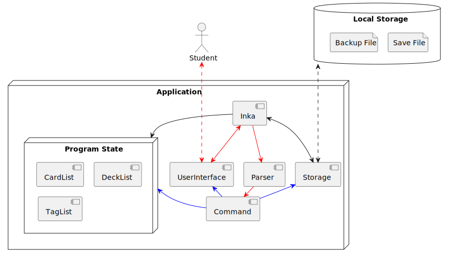
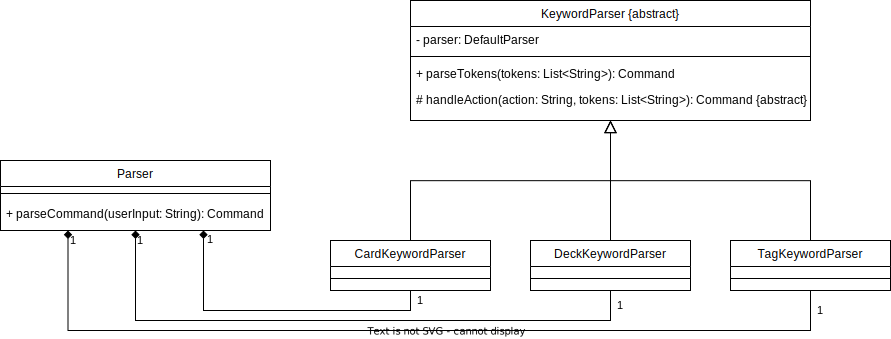
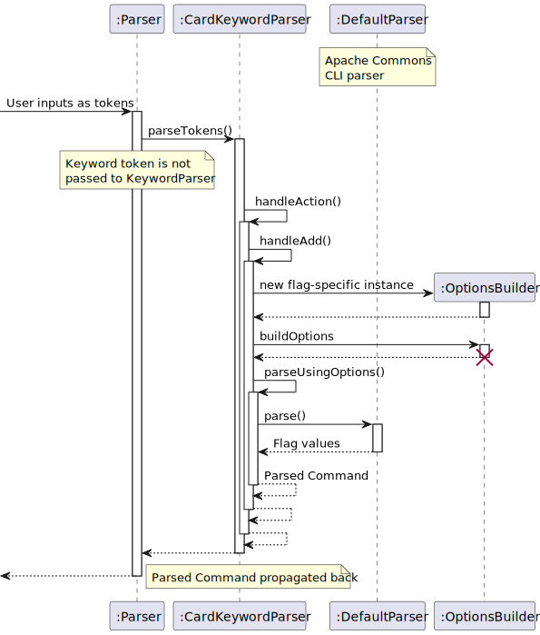
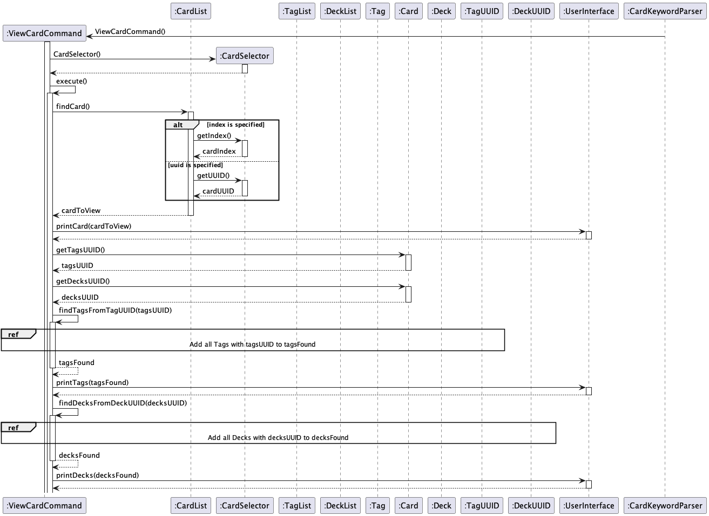
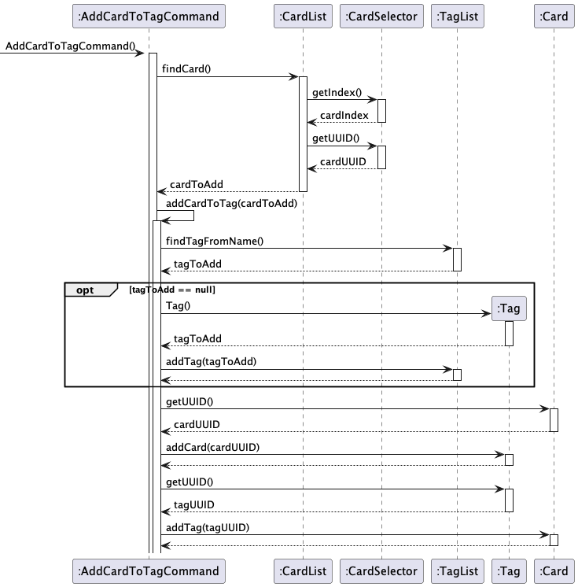

# Developer Guide

- [Acknowledgements](#acknowledgements)
- [Setting up, getting started](#setting-up-getting-started)
- [Design](#design)
    - [Architecture](#architecture)
    - [UI Component](#ui-component)
    - [Parser Component](#parser-component)
    - [Storage Component](#storage-component)
    - [CardList Component](#cardlist-component)
    - [TagList Component](#taglist-component)
- [Implementation](#implementation)

    - [card feature](#card-feature)
    - [tag feature](#tag-feature)
    - [[Proposed] deck feature](#deck-feature)

- [Appendix: Requirements](#appendix-requirements)
    - [Product scope](#product-scope)
    - [Target user profile](#target-user-profile)
    - [Value proposition](#value-proposition)
    - [User Stories](#user-stories)
    - [Non-Functional Requirements](#non-functional-requirements)
    - [Glossary](#glossary)

---

## Acknowledgements

Third-party libraries:

- [Apache Commons CLI](https://commons.apache.org/proper/commons-cli/)
- [gson](https://github.com/google/gson)

{list here sources of all reused/adapted ideas, code, documentation, and third-party libraries --
include links to the original source as well}

---

## Setting up, getting started

---

## Design

- [Architecture](#architecture)
- [UI Component](#ui-component)
- [Parser Component](#parser-component)
- [Storage Component](#storage-component)
- [CardList Component](#cardlist-component)
- [TagList Component](#taglist-component)

### Architecture

The following diagram describes the architecture of Inka:


- Red arrows show the path taken to parse user input
- Blue arrows show possible side-effects of executing the command

### UI Component

API: Ui.java

### Parser Component

API: `Parser.java`

Inka's parser has a hierarchical design built on top of Apache Commons CLI which allows for parsing of flags in any
order. Modularity also allows for new commands to be easily added.



The user's command is interpreted with the following structure:

```
<keyword> <action> [flag(s)]
```

For example, a command such as `card add -q QN -a ANS` would be broken down as:

- Keyword: `card`
- Action: `add`
- Flags
    - `-q`: Question text
    - `-a`: Answer text

When the user's input is passed to `Parser`:

1. User input is split into a series of _tokens_
2. `Parser` looks at the keyword token and dispatches the appropriate `KeywordParser`
3. `KeywordParser` looks at the action token and calls `OptionBuilder` to create an `Options` object for the flags it
   expects
4. Apache Commons CLI Parser is called with `Options`
5. The Apache Parser returns the arguments of the flags
6. The respective `Command` is constructed and returned through the parser chain
7. The `Command` is executed to modify state (`CardList`, `TagList` and `DeckList`), and may interact with
   the `UserInterface` and `Storage` objects to print output or save the program state respectively.

The following is the sequence diagram for parsing `card add -q QN -a ANS`:


### Storage Component

API: Storage.java

### CardList Component

API: CardList.java

Inka's Cards are stored inside `CardList` Component. Each Card has a reference to its own randomly generated `uuid` as
well as a reference to `tags` and `decks`, which are essentially the UUIDs of the tags and decks that each card is
associated with.
`uuid` and `tags` and `decks` are stored in the form of `CardUUID`, `TagUUID` and `DeckUUID` class and all of them
inherit from the `InkaUUID` class.

The following describes the class diagram for CardList Component :


### TagList Component

API: `TagList.java`

Inka's TagList Component stores a list of `Tag` as tags. Each `Tag` contains its own uuid, which is auto generated in
the constructor of `Tag`, as well as the cards and decks that it
is associated with in the form of `CardUUID` and `DeckUUID`. All `CardUUID`, `TagUUID`, and `DeckUUID` inherit
from `InkaUUID` as they all
share the same methods and implementations.

The following describes the class diagram for TagList Component :


## Implementation

- [card feature](#card-feature)
- [tag feature](#tag-feature)
- [export feature](#export-feature)
- [[Proposed] deck feature](#deck-feature)

### Card Feature

The current functionalities:

- add a new Card (questions and answers) to the cardlist
- delete card from the cardlist
- show all cards the cardlist contains
- view the card by its uuid
- add tag to a card

#### Card View

The implementation of `card view {-c {cardUUID} | -i {cardIndex}}` will be shown below :

- When the user enters `card view {-c {cardUUID} | -i {cardIndex}}`, the input is passed to `Parser` class which
  calls `Parser#parseCommand()`. The parser detects the keyword "card", then calls the `Parser#CardKeywordParser()` on
  the user inputs excluding the "
  card" keyword. The `Parser#CardKeywordParser()` uses the Apache Commons CLI library to parse the remaining user input
  and call `CardKeywordParser#handleView()` method which in turn returns
  a `ViewCardCommand`. The sequence diagram for this section has been
  shown [above](#parser-component).


- This `ViewCardCommand` will first find the card that is to be viewed by calling
  the `CardList#findCard()` which will in turn call the `CardSelector#getIndex()`
  and `CardSelector#getUUID()` depending on the flags and parameter specified by the user. `CardSelector` will then
  return the `cardToView` to `CardList` and then
  to `ViewCardCommand`.

- If the `cardToView` is not null, it will be passed to `UserInterface#printCard()` to be printed. `ViewCardCommand`
  will proceed to call `Card#getTagsUUID()` which will
  return `tagsUUID` and `Card#getDecksUUID()` which will return `decksUUID`.

- Once the `tagsUUID`  is ready, `ViewCardCommand` will then call  `ViewCardCommand#findTagFromTagUUID` which will loop
  through each element `Tag` of `TagList`, call `Tag#getUUID()` and match it with every element of the `tagsUUID`
  previously.
  If the `Tag` element's uuid matches the uuid in `tagsUUID`, then the `Tag` will be added to a `tagsFound` and returned
  to `ViewCardCommand`.

- Similarly, once the `decksUUID` is ready, `ViewCardCommand` will then call  `ViewCardCommand#findDeckFromDeckUUID`
  which will loop through each element `Deck` of `DeckList`, call `Deck#getUUID()` and match it with every element of
  the `decksUUID` previously.
  If the `Deck` element's uuid matches the uuid in `decksUUID`, then the `Deck` will be added to a `decksFound` and
  returned to `ViewCardCommand`.

- The `tagsFound` and `decksFound` will then be passed to the `UserInterface#printTags()`
  and `UserInterface#printDecks()` to be printed.

1. When the user enters `card add -q ... -a ...`, the input is passed to `Parser` class which
   calls `Parser#parseCommand()`.
2. The parser detects the keyword "card", then calls the `Parser#CardKeywordParser()` on the user inputs excluding the "
   card" keyword.
3. The `Parser#CardKeywordParser()` uses the Apache Commons CLI library to parse the remaining user input.

The sequence diagram below shows how this feature works:


### Tag Feature

Tag Feature currently supports the following functionalities :

- add a tag to a card
- delete a tag from the tagList and all the associated cards
- list all the existing tags in the tagList
- list all the cards under a tag
- edit the tag name

#### Tag a Card

The implementation of the `card tag` feature is as follows :

- When the user enters `card tag -c {cardUUID} -t {tagName}`, the input is passed to `Parser` class which
  calls `Parser#parseCommand()`. The parser detects the keyword `card` and process the remaining input and pass them
  to  `Parser#CardKeywordParser` class which calls `HandleTag()` method and returns a `AddCardToTagCommand`. The
  sequence diagram for this section has been
  shown [above](#parser-component).

- This `AddCardToTagCommand` will first find the card to which the tag should be added to by calling
  the `CardList#findCard()` which will in turn call the `CardSelector#getIndex()`
  and `CardSelector#getUUID()`. `CardSelector` will then return the `cardToAdd` to `CardList` and
  to `AddCardToTagCommand`.

- After finding the card on which to add the tag, `AddCardToTagCommand` will check if the tag has already existed by
  calling `TagList#findTagFromName` which will return a `tagToAdd`. If the `tagToAdd` currently does not
  exist, `AddCardToTagCommand` will then create a new `Tag` and add it to `TagList` by
  calling `TagList#addCard(tagToAdd)`. If it already exists, it will just use the
  existing `tagToAdd`.

- Once the `tagToAdd` and `cardToAdd` are ready, `AddCardToTagCommand` will then call `Card#getUUID()` and add the
  returned `cardUUID` into `tagToAdd` by calling `Tag#addCard(cardUUID)`.

- Similarly, `AddCardToTagCommand` will also call `Tag#getUUID()` and add the returned `tagUUID` into `cardToAdd` by
  calling `Card#addTag(tagUUID)`.



#### Untag a Card

The implementation of the `card untag` feature is as follows :

- When the user enters `card untag {-c {cardUUID} | -i {cardIndex}} {-t {tagName} | -i {tagIndex}}`, the input is passed
  to `Parser` class which
  calls `Parser#parseCommand()`. The parser detects the keyword `card` and process the remaining input and pass them
  to  `Parser#CardKeywordParser` class which calls `HandleUntag()` method and returns a `RemoveTagFromCardCommand`. The
  sequence diagram for this section has been
  shown [above](#parser-component).

- This `RemoveTagFromCardCommand` will first find the card to remove the tag from by calling
  the `CardList#findCard()` which will in turn call the `CardSelector#getIndex()`
  and `CardSelector#getUUID()` depending on the flags and parameter specified by the user. `CardSelector` will then
  return the `cardAffected` to `CardList` and then back
  to `RemoveTagFromCardCommand`.

- `RemoveTagFromCardCommand` will then find the tag to delete from the card by calling `TagList#findCard()` which will
  in turn call the
  `TagSelector#getIndex()` and `TagSelector#getTagName()`  depending on the flags and parameter specified by the
  user. `TagSelector` will return the `tagToRemove` to `TagList` and then back to `RemoveTagFromCardCommand`.
-
- After `cardAffected` and `tagToRemove` is ready, `RemoveCardFromTagCommand` will
  call `RemoveTagFromCardCommand#removeTagFromCard(cardAffected, tagToRemove)` which will in turn remove the reference
  to the tag from the card and remove the reference to the card from the tag
  by calling `Card#getUUID()`, `Tag#removeCard()`, `Tag#getUUID()`,`Card#RemoveTag()`.

- Finally, `RemoveTagFromCardCommand` will then call `UserInterface#printRemoveTagFromCard()` to print successful
  removal of `tagToRemove` from `cardAffected`.

### List Cards under Tag

The implementation of the `tag list {-t {tagName} | -i {tagIndex}}`

### Deck Feature

---

## Appendix: Requirements

### Product scope

### Target user profile

- Person who wants a convenient, versatile and portable way to revise concepts while doing coding assignments
- Person who wants to effectively learn a new language while doing coding assignments
- Person who wants to be challenged to come up with answers quickly against time pressure.

### Value proposition

User will be able to revise while coding or using the terminal so they don&#39;t have to switch between apps. This will
maximize their productivity and refresh their memory instantly whenever they want to recall some topics suddenly appear
on their mind.

### User Stories

| Version | As a ... | I want to ...                                   | So that I could ...                                              |
|---------|----------|-------------------------------------------------|------------------------------------------------------------------|
| v1.0    | new user | add a card containing the questions and answers | store the question in the system for later revision              |
| v1.0    | new user | see a list of all cards                         | I can see what are all the cards I have regardless of their tags |
| v1.0    | new user | delete some cards                               | I can remove unwanted cards                                      |
| v1.0    | new user | save cards to a local file                      | I can reuse the cards the next time I use the software           |
| v1.0    | new user | load questions and answers from a file          | I can use the database of flashcards                             |
| v1.0    | new user | save cards to a local file                      | I can reuse the cards the next time I use the software           |
| v1.0    | new user | load questions and answers from a file          | I can use the database of flashcards                             |
| v2.0    | new user | update the content of the card                  | I can ensure that the content of the card is up-to-date          |
| v2.0    | new user | group my cards according to my will into "Deck" | I can easily access all of my cards in a certain category        |
| v2.0    | new user | tag each card into one or more topics           | I can organize my cards according to the topics associated       |
| v2.0    | new user | remove the tag from a card                      | I can ensure that my cards have the correct tag                  |
| v2.0    | new user | see a list of existing tags                     | I can know what are the tags I have                              |
| v2.0    | new user | see the list of cards under a certain tag       | I can know what are the cards I have under a certain tag         |
| v2.0    | new user | rename an existing tag                          | I can update the tag with a more accurate naming                 |

### Non-Functional Requirements

{Give non-functional requirements}

### Glossary

- _glossary item_ - Definition

### Instructions for manual testing

{Give instructions on how to do a manual product testing e.g., how to load sample data to be used
for testing}
