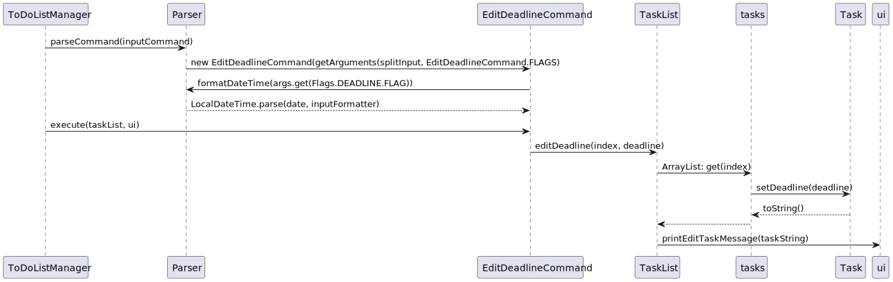

# Developer Guide

## Acknowledgements

Adapted from AddressBook Level 3 Developer Guide (https://se-education.org/addressbook-level3/DeveloperGuide.html)

## Design

{Describe the design and implementation of the product. Use UML diagrams and short code snippets where applicable.}

## Implementation
### Edit Deadline feature
#### Implementation
The edit deadline function extends NUS To-do List with an edit feature for the deadlines assigned to tasks. It is facilitated
by the TaskList and Command classes. It implements the following operations:

TaskList#editDeadline()    - Edits deadline of task at assigned index

Given below is an example usage scenario and how the edit deadline mechanism will behave at each step.

Step 1. The user launches the application for the first time. There are no existing tasks read by the program.

Step 2. The user executes <mark>add survey -d 20/03/2023 23:59</mark> command to add a task to the To-do List.
The <mark>add</mark> command calls TaskList#addTask(), which causes a new Task to be added to the existing TaskList.

Step 3. The user has received an update about an extension to the deadline for the task, and decides to change
the deadline by executing the <mark>edit 1 -d 25/03/2023 15:00</mark> command. The <mark>edit</mark> will call 
TaskList#EditDeadline(), which updates the value of deadline for the Task item saved at index 1 to the new updated deadline.

The following sequence diagram shows how the edit operations works:

## Product scope
### Target user profile

Forgetful NUS students who used to rely on LumiNUS’s deadline reminders.

### Value proposition

With the transition to Canvas, the most important feature of LumiNUS’s deadline reminders is gone! Our project aims to 
bring an application to keep you aware of your deadlines and not miss them.

## User Stories

| Version | As a ... | I want to ...                                                                                                    | So that I can ...                                                         |
|---------|----------|------------------------------------------------------------------------------------------------------------------|---------------------------------------------------------------------------|
| v1.0    | user     | add tasks to my to-do list                                                                                       ||
| v1.0    | user     | add a time/deadline to a task                                                                                    | record when a task needs to be done                                       |
| v1.0    | user     | list all tasks by ascending date                                                                                 | view tasks that have an earlier deadline                                  |
| v1.0    | user     | remove tasks                                                                                                     | remove finished/wrong tasks                                               |
| v1.0    | user     | mark/unmark tasks                                                                                                | check off unfinished tasks                                                |
| v1.0    | user     | edit the time/deadline of existing tasks                                                                         | update tasks with changed deadlines (postponed/brought forward)           |
| v2.0    | student  | add tags/module codes to each task                                                                               | group related tasks together                                              |
| v2.0    | student  | set reminders at the start of the day                                                                            | do not forget what I have to achieve by the end of the day/week           |
| v2.0    | user     | list all the tasks in chronological order/grouped by module code/grouped by type of work (individual/group work) | have a “birds’ eye view” of all my tasks. (i.e different sorting methods) |
| v2.0    | user     | filter the tasks by their properties (description, deadline, tags, …)                                            | find them easily                                                          |
| v2.0    | user     | view the tasks in a calendar view                                                                                | view them in a summarised layout                                          |
| v2.0    | user     | add the email of the professor/TA in charge of the task                                                          | can email them to clarify if needed                                       |
| v2.0    | user     | attach a list of files/links to refer to                                                                         | know where the materials I can refer to are                               |
| v2.0    | user     | set a task to repeat                                                                                             | create 1 task to represent repeating tasks every week                     |
| v2.0    | user     | set priority level and can sort the tasks based on the priority level                                            | identify high priority tasks                                              |
| v2.0    | user     | see a progress bar                                                                                               | track my progress of unfinished tasks                                     |
| v2.0    | user     | view up to 10 previously completed tasks tied with the completion date and time                                  | track my progress of finished tasks                                       |

## Non-Functional Requirements

1. Should work on any mainstream OS assuming it has Java 11 or above installed.
2. A user with above average typing speed for regular English text (i.e. not code, not system admin commands) should be 
able to accomplish most of the tasks faster using commands than using the mouse.

## Glossary

* *glossary item* - Definition

## Instructions for manual testing

{Give instructions on how to do a manual product testing e.g., how to load sample data to be used for testing}
