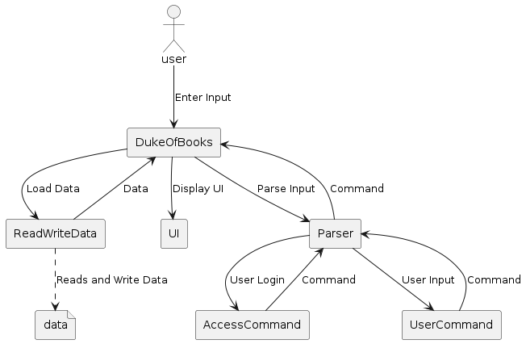
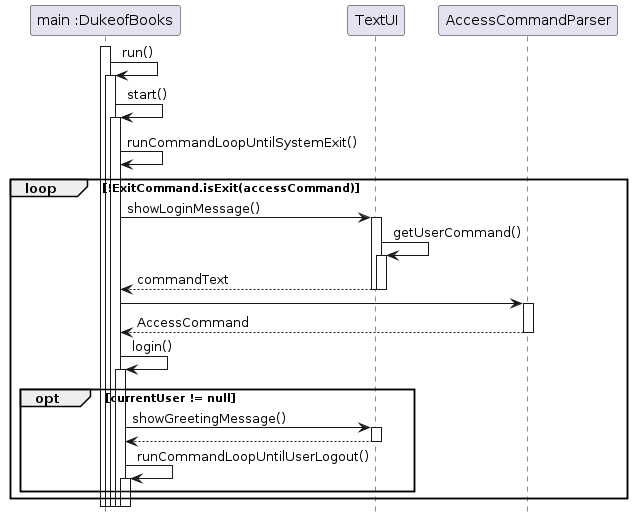

# Developer Guide

<!-- TOC -->
- [Acknowledgements](#acknowledgements)
- [Design & Implementation](#design--implementation)
    - [Search book by title](#search-book-by-title)
    - [Search book by topic](#search-book-by-topic)
    - [Check book availability](#check-book-availability)
    - [Borrow book](#borrow-book)
    - [Renew borrow period of book](#renew-borrow-period-of-book)
    - [Check borrowing status](#check-borrowing-status)
    - [Return book](#return-book)
    - [Add book](#add-book)
    - [Delete book](#delete-book)
    - [List book](#list-book)
    - [View history](#view-history)
    - [Make payment](#make-payment)
- [Product Scope](#product-scope)
    - [Target user profile](#target-user-profile)
    - [Value proposition](#value-proposition) 
- [User Stories](#user-stories)
- [Non-Functional Requirements](#non-functional-requirements)
- [Glossary](#glossary)
- [Instructions for Manual Testing](#instructions-for-manual-testing)
  <!-- TOC -->

## Acknowledgements

- NUS SC2113 Duke project
- [NUS SC2113 tp](https://github.com/nus-cs2113-AY2223S2)

## Design & Implementation

**Access commands** (those related to accounts) will be fetched by the `getUserCommand()` method in the *TextUi* class.
These commands will be parsed using `parseAccessCommand()` method in the *AccessCommandParser* class and parse to 
the respective command classes. The command classes will be responsible for executing the relevant features.

Access commands will return an AccessResponse object after executing, which contains a User object and a message. 
The User object will be null if log in/sign up is not successful, and will return the signed-in
User object if log in / sign up is successful. The accompanied message will display related message to the user.

Null User will be returned regardless of the result of changing password, but the message will be different depends 
on the result.

User data are stored in a hashmap mapping from unique usernames to *User* objects. *User* stores person information 
as well as username and hash code of the password. Passwords are not explicit stored for security reasons.

The user can only execute user commands such as history, borrow after successfully logged in to the system, and they 
need to log out before exiting the application.

### Log in
  
Description: Log in to the account using saved username and password

Format: `login -username USERNAME -password PASSWORD`  

Example: 
- `login -username me -password mypassword`  

For successful logging in, the application will print a welcome message and allow the user to execute user commands 
such as borrowing and returning books. Only exact match will be allowed.

If the logging in is unsuccessful, the application will wait for the next access command(login again or signup).

### Sign up
Description: For users who do not have an account in the system, they need to sign up their account with a unique 
username, a password and a name. The username and password can only contain letters and numbers, but name can 
contain spaces.

Format: `signup -username USERNAME -password PASSWORD -NAME FULL_NAME`

Example:
- `signup -username me -password apassword -name my name`

If the username is unique in the database and password is valid, the user has created account successfully. But if 
the username is already in the database or the username/password contains invalid characters (e.g. '$', '^'), the 
signing up will be unsuccessful.

### Change Password
Description: For existing users who want to change their passwords, they can change it with their username, old 
password and new password.

Format: `password -username USERNAME -old OLD_PASSWORD -new NEW_PASSWORD`

Examples:
- `password -username joe123 -old 123456 -new 654321`

The password changing is successful only if the username exist in the database, the old password match with the 
username, and new password is valid (does not contain invalid characters).

## Design & Implementation for Users Commands
All commands will be fetched by the getUserCommand() method in the TextUi class. The parseCommand() method in the Parser class will then parse the command and pass it to the respective command classes. The command classes will be responsible for executing the relevant features.

### Search book by title
  

Description: Searches for a book using its title.  
Format: `search -title TITLE`  
Example:  
- `search -title Python Programming`  

For successful searches, the program will output the relevant book along with the book details: ISBN, Title, Author, Topic. For unsuccessful searches, the program will output a string informing the user that there is no match with the input title from the inventory.  
Note: Partial string matching will not be considered in this application. Exact match of title and topic will be done, and if match is found, the book object will be returned.

### Search book by topic
 
Description: Searches for a book by its topic  
Format: `search -topic TOPIC`  
Example:
- `search -topic Business`  

For successful searches, the program will output the relevant books along with the book details: ISBN, Title, Author, Topic. For unsuccessful searches, the program will output a string informing the user that there is no match with the input topic from the inventory.

### Check book availability
Description: Check if a book is available for borrowing  
Format: `check -title TITLE`  
Example:
- `check -title Python Programming`  

The program will indicate whether the book is available for borrowing. The program will also handle the case that there is no such book in the inventory.

### Borrow book
Description: Borrow a book from the library  
Format: `borrow -title TITLE`  
Example:
- `borrow -title Python Programming`  

For successful borrowing, the program will output a string showing that the action is successful and, at the same time, mark the book as borrowed in the system. For unsuccessful borrow requests, the program will either output that there is no such book in the inventory or a message showing that the book is already on loan at the time of the borrow request.

### Renew borrow period of book
  
Description: Renew borrowing of books for a fixed duration  
Format: `renew -title TITLE`  
Example:
- `renew -title C++Primer`  

For successful renewal of books, the program will output a string showing that the action is successful and also change the due period of borrow in the system. The program will handle error cases such as incorrect titles provided or books not available for renewal.

### Check borrowing status
 
Description: Check status of borrowed book  
Format: `status -title TITLE`  
Example:
- `status -title C++Primer`  

The program will output the details of the relevant book being borrowed and also show the due date of the loan. The program will handle cases where there is no such book in the borrow history.

### Return book
Description: Return a book to the library  
Format: `return -title TITLE`  
Example:
- `return -title C++Primer`  

For successful returns of books, the program will output a string showing that the action is successful and mark the book as available for borrowing by other users in the system. The program will handle cases of incorrect title input and unsuccessful returns.

### Add book  
  

Description: Add new books into the system  
Format: `librarian -title TITLE -topic TOPIC -author AUTHOR -isbn ISBN -action add`  
Example:
- `librarian -title C++Primer -topic Programming -author James -isbn 12345 -action add`  

This feature is only applicable for admin. For successful addition of new book, the program will output a message to inform the librarian. The new book will also be added into the inventory of the system so that users can now borrow the book from the library. Error inputs and missing inputs will be handled accordingly.
 

### Delete book
Description: Remove books from the system  
Format: `librarian -title TITLE -topic TOPIC -author AUTHOR -isbn ISBN -action delete`  
Example:
- `librarian -title C++Primer -topic Programming -author James -isbn 12345 -action delete`  

This feature is only applicable for admin. For successful deletion of book, the program will output a message to inform the librarian. The book will also be deleted from the inventory of the system so that it will not be able to be borrowed by users anymore. Error inputs and missing inputs will be handled accordingly.

### List book
 
Description: List all the books in the library  
Format: `list`  
Example:
- `list`  

The program will list out all the books in the library inventory. If the inventory is empty, the program will output a message indicating that there is currently no book in the library system.

### View history
Description: Check the borrow history of the books (admin and user versions). The admin version will allow admin to access the whole borrow history, while users can only view their own borrow history.  
Format: `history`  
Example:
- `history`  

The program will output the borrow history of books according to the accessibility as mentioned in the description above. The output includes the book title and other book details, the status of the book (either it is available for borrowing or it has been borrowed at the moment), and also details of the loan, which include the date and time of borrowing and returning.

### Make payment
Description: Make payment for overdue loans.  
When returning item(s) which is/are overdue, the user will be prompted to make payment. Failure to do so will result in returning action unsuccessful.

## Product Scope
### Target user profile

NUS computer science (CS) students who wish to borrow and read CS related books.

### Value proposition

CS students are incredibly busy and hence having a command line interface (CLI) program without GUI makes finding the books they want quick and efficient. This software will also help them track loans and return dates.

## User Stories

|Version| As a ... | I want to ... | So that I can ...|
|--------|----------|---------------|------------------|
|v1.0|user|be able to search for a book|borrow a book to read|
|v1.0|libriarian|add or remove book|change the books in the inventory|
|v1.0|user|return book i borrowed|remove the borrow status taged to my account|
|v2.0|libriarian|pay my fine|continue to borrow more books and see my exam results|

## Non-Functional Requirements

1. Data should be stored in text file so that information like borrowed books and inventory are not lost
2. System should run on Java 11

## Glossary

* *librarian* - Admin user
* *user* - Normal user

## Instructions for Manual Testing

1. Download the jar file *tp.jar* in release v2.0
2. Launch the jar file using the command `java -jar tp.jar`

