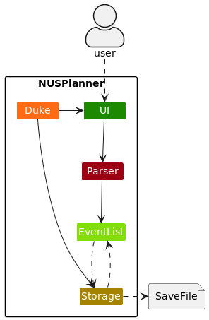
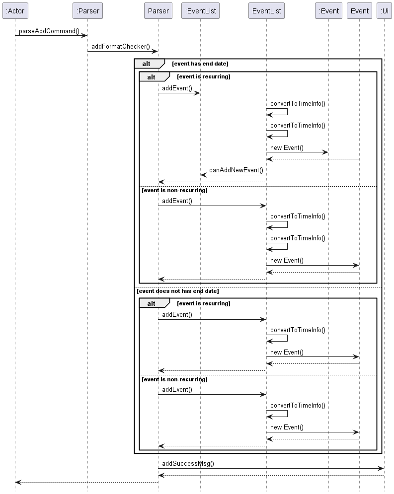
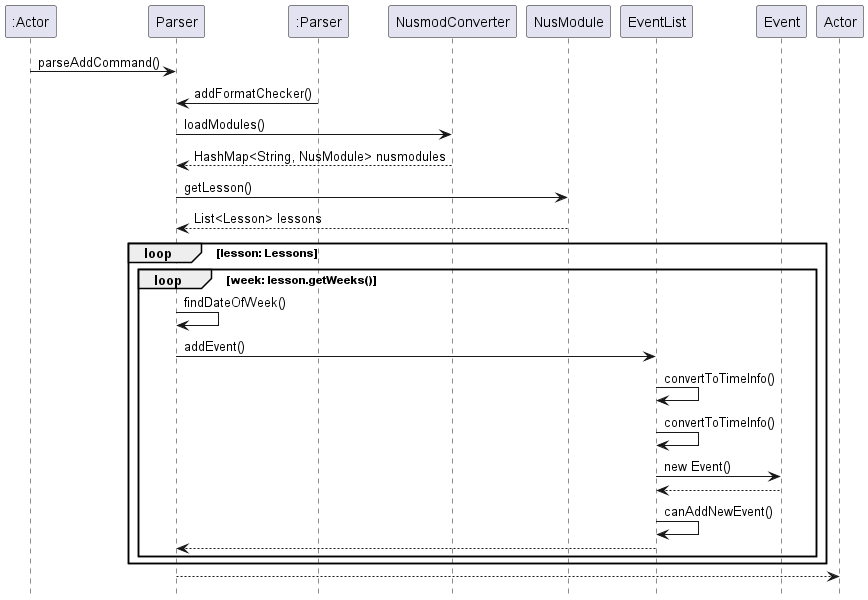
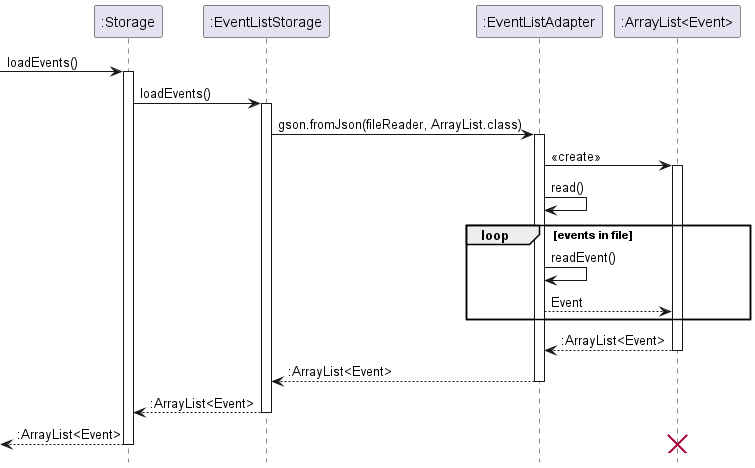
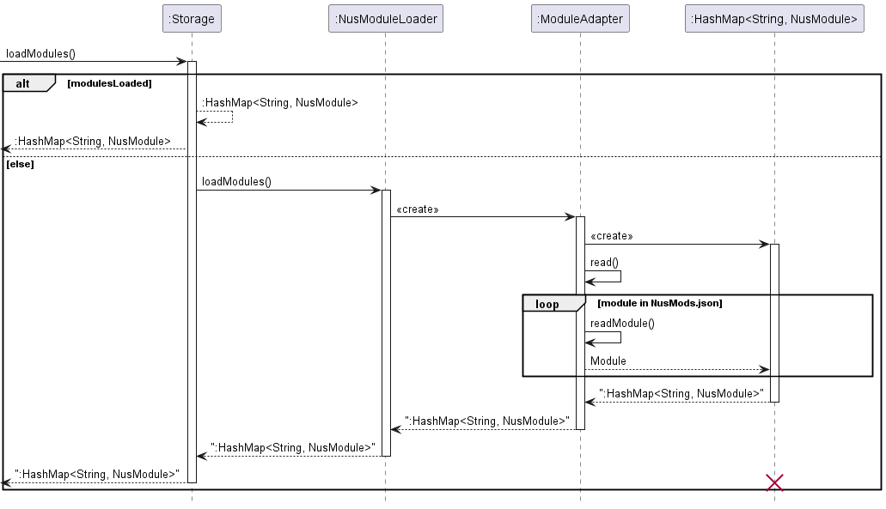
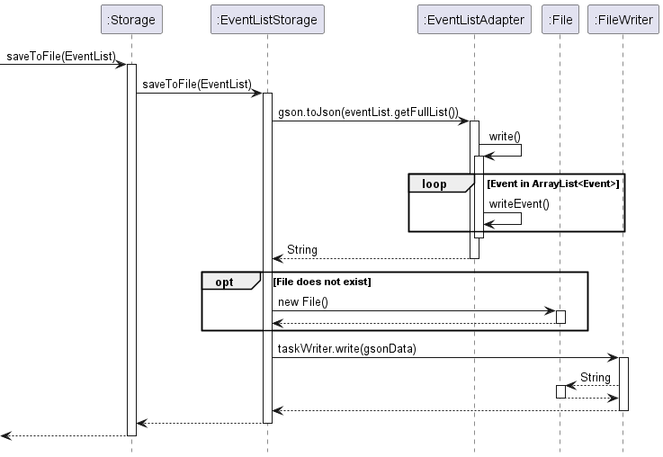

# Developer Guide
Welcome to the NUSPlanner Developer Guide!
We hope this documents serves useful to understand the behind-the-scenes working of our product. 

## Table of Contents

## Acknowledgements

1. GSON - [Documentation](https://sites.google.com/site/gson/gson-user-guide)

{list here sources of all reused/adapted ideas, code, documentation, and third-party libraries -- include links to the original source as well}'

## Getting started

Refer to the user guide [here](https://github.com/AY2223S2-CS2113-F13-3/tp/blob/master/docs/UserGuide.md).

## Design & implementation
### Architecture

The **Architecture Diagram** above explains the high-level design of NusPlanner. 
Below is an overview of how the main components interact with each other.

#### Main Components of the architecture

`Duke` is the "Main" of the application. It is responsible for:
* At app launch: Initializes components in the correct sequence, and connects them to each other
* At shut down: Saves the current state of the EventList.

The rest of the app consists of four components:
* `UI`: The UI of the app
* `Parser`: The command executor
*  `EventList`: Holds the data of the app in memory
* `Storage`: Reads data from and writes data to the hard disk

### Parser Component
The component will return the correct command based on what the user inputs into the application.

#### How is the feature implemented?

The Parser component parses the command of the user input and breaks the user input into different parts based on the flags.
This component also ensures to validate that user input is correct.

The Parser component handles the following methods:
* Add event
* Add module
* List event list
* Delete event
* Edit event
* Find date of week
* Format checker
* Revise information using index
* Revise information using name

##### Add Events Diagram
The diagram below illustrates the flow of how the application adds events:

When the user adds an event, the application checks if the format of the command is correct before proceeding further.

It will then go through different processes depending on if the event has an end date.

Following that, it will go through another process to check if the event is set to be recurring before finally creating a new event and displaying a success message to the user.

##### Add Modules Diagram
The diagram below illustrates the flow of how the application adds modules:

When the user adds an event, the application checks if the format of the command is correct before proceeding further.

Modules are then loaded and the application uses getLesson() to access modules from a Hash Map. 

Then, according to the information provided by the user, the application will convert it to fit the event method before adding a new event.

#### Why is the feature implemented this way?

This component should be able to guide the user to inputting the correct format of the command to do data validation.
It should be able to perform basic data validation checks to ensure that the user does not enter any invalid commands.
This makes life easier to developers in the future if they wish to add new features that requires users to use new commands.

### Storage Component
API: `Storage.java`

The storage component reads and writes user data from a local save in the form of a `.json` file.
The Storage component:
* Serializes and deserializes user data into a `.json` file format through the use of the Gson library
* Loads data from `NusMods.json` into a HashMap for use by other classes.
* Inherits from both `EventListStorage` and `NusModuleLoader`, and can be treated as either one.
* Saves and loads information from the local hard disk
* Depends on some classes (the `storage` component saves and retrieves objects)

The class diagram below illustrates the structure of the storage package

#### How the feature is implemented:

##### Load Events

When the application starts up, the storage loadEvents() function will be called to load contents in the save file. 

##### Load Modules

When any component requires reading the NUS module files, the loadModules() is called.

##### Save Events

Similarly, the state of the user's event list is saved when the user exits the application by calling saveToFile().

#### Justification for using gson
The Gson library was chosen as it allowed for flexible adaptation of its TypeAdapter class, allowing for custom 
serialization and deserialization of data to be saved. 

### EventList component

API: `EventList.java`

this component maintains a list of Schedule instance. It receives commands from Parser.java and adds/deletes/edits tasks and their information in the list according to the commands.

#### How is the feature implemented:

the main functions are

> - add new task (accepts event without starting time/ending time/ending date).
> - delete a single tasks / delete all tasks.
> - edit the time information of task (starting time/ending time/ending date can be omitted).
> - search for a event by index / description.
> - get all the detail of a event in the list in String form.

The class diagram below illustrates the structure of the EventList component.

And below is a sequential diagram showing a event being added, revised, checked for information and finally deleted.

#### Why implemented in this way:

It is necessary to have a list which contains all the current event/class so that we can show/ batch process events more efficiently. Moreover, this component serves intermediary functions and avoids other classes access deep into the functionality of classes (Event, Schedule e.t.c) inside the ArrayList, thus reduces the coupling of the code base. Additionally, this component also converted all the String parameters parsed by Parser into various Types that required by other classes that the EventList contains, further reducing the coupling.

### Target user profile

Our target user profile is students studying in NUS.

### Value proposition

{Describe the value proposition: what problem does it solve?}

## User Stories

| Version | As a ...     | I want to ...                             | So that I can ...                                                                  |
|---------|--------------|-------------------------------------------|------------------------------------------------------------------------------------|
| v1.0    | As a user    | Add, edit, delete and view events         | Plan my schedule and have an understanding of what's upcoming                      |
| v1.0    | As a user    | Save my events                            | Revisit them at a later time without having to reenter them                        |
| v2.0    | As a student | Add modules and view my schedule in a list or table format by weeks | Plan my schedule around modules (lectures, tutorials and labs) and upcoming events |
| v2.0    | As a user    | Set an event to be recurring              | Easily add recurring events to my schedule                                         |
| v2.0    | As a user    | Save the location of an event             | Remember where I need to go for the next event                                     |

## Non-Functional Requirements
1. The program should be able to run on any computer regardless of OS.
2. The program should be able to handle data corruption.
3. The program is not required to return an accurate timetable for modules that only have one or two lectures in the whole semester.
4. The program should be lightweight and fast.

## Glossary

* *glossary item* - Definition

## Instructions for manual testing

{Give instructions on how to do a manual product testing e.g., how to load sample data to be used for testing}

