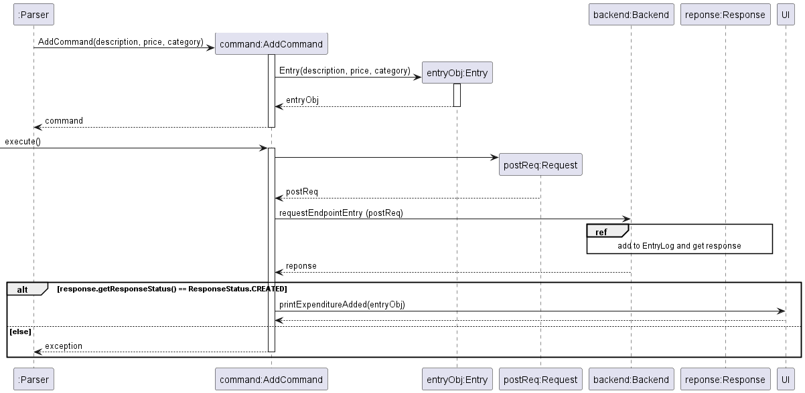
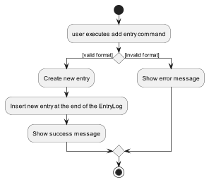

# Developer Guide

## Acknowledgements

{list here sources of all reused/adapted ideas, code, documentation, and third-party libraries -- include links to the
original source as well}

## Design & implementation

{Describe the design and implementation of the product. Use UML diagrams and short code snippets where applicable.}

### Parser

The `Parser` class is a fundamental component instantiated as soon as PocketPal is initialised. Its __purpose__ is to
convert the user's input into structured data which then produces clear instructions for the rest of the program.

Some of its core features include:

- Breaking down user input and extracting the relevant data for further processing.
- Performing input validation and error handling to ensure that input data is in the correct format and ready to be
  processed.
- Converting the input data into the correct format and returning it as a `Command` class to be further processed by the
  application.

Here's a class diagram that shows the core structure of the `Parser` class.


How `Parser` works:

1. When a user enters a command, the `Frontend` uses `Parser` to resolve the user input via `parseUserInput()`.
2. Within `parseUserInput()`, the corresponding `parseXCommand()` (`X` is a placeholder for the various command
   names[^1] e.g. `parseAddCommand()`, `parseDeleteCommand()`.)  is invoked to validate that the user input is in the
   correct format. Any exceptions will be thrown and their corresponding error messages will be shown to the user via
   the `ui` class.
2. If the user input is valid, an `XCommand` object containing the relevant data is created and returned.
   E.g. `parseAddCommand()` would create a `AddCommand` object containing the description, price and category.
3. From there, the `XCommand` is ready to be executed by the program. (All `XCommand` classes inherit from `Command` and
   have corresponding `execute()` that carry out their specific instructions.)

[^1]: A list of currently supported commands in PocketPal can be found [here](../../UserGuide.html/features/)

The Sequence Diagram below illustrates the interactions within the `Parser` component when a user inputs the following
command: `/add McDonalds -c Food -p 10.50`


## Add Command
The add entry mechanism is facilitated by `EntryLog`. Every instance of AddCommand is created with an Entry instance.

The following sequence diagram shows how the add command work:


Given below is an example usage scenario and how the add mechanism behaves at each step.

Step 1. The user launches the application for the first time. The `EntryLog` will be initialized and contains no entry.

Step 2. The user executes `/add Lunch at McDonalds -category Food -price 19.9` command to add an `Entry` to the `EntryLog`.

_***Note.*** The command will fail its execution if its format is incorrect, and no `Entry` will be added to the `Entrylog`. An error message will be displayed informing the user._

Step 3. The command will be resolved by `Parser`, which would create an `AddCommmand` object.

Step 4. The `AddCommand` constructor creates and returns an `Entry` object containing the description, price and category to be added.

Step 5. When `execute()` method is called, a `Request` object is created.

Step 6. From there, the `Request` is ready to be handled, which will add the new `Entry` to the `EntryLog`.

Step7. A success message is after the new `Entry`

The following activity diagram summarizes what happens when a user executes an add command:



## Delete Command
The delete entry mechanism is facilitated by `EntryLog`.

Every instance of DeleteCommand is created with an Entry instance.

## Product scope

### Target user profile

{Describe the target user profile}

### Value proposition

{Describe the value proposition: what problem does it solve?}

## User Stories

| Version | As a ... | I want to ...             | So that I can ...                                           |
|---------|----------|---------------------------|-------------------------------------------------------------|
| v1.0    | new user | see usage instructions    | refer to them when I forget how to use the application      |
| v2.0    | user     | find a to-do item by name | locate a to-do without having to go through the entire list |

## Non-Functional Requirements

{Give non-functional requirements}

## Glossary

* *glossary item* - Definition

## Instructions for manual testing

## Testing with sample data (from file)

PocketPal stores data in a *storage.txt* file under the "*data/*" directory. Each row in the "*storage.txt*" file
represents a single expense Entry. Each column in each row should have 3 columns, representing the *description* of the
Entry, *amount* associated with the Entry and *category* of the Entry in that order, and are separated with the ","
delimiter. All of them are in the String format.

An example *storage.txt* file that will be readable by PocketPal is as such:

'''
Apple Juice,5.50,Food
Bus Card,50,Transportation
Paracetamol,10.39,Medical
'''

which will give us 3 Entries.

As of the time of writing, the available categories are:

- Clothing
- Entertainment
- Food
- Medical
- Others
- Personal
- Transportation
- Utilities
- Income

An empty input for category is not allowed. If necessary, use the "Others" category.

## Exceptions

Exceptions are thrown for a couple of cases where files are being read. If you wish to test the exceptions, they can be
replicated as follows:

1. Delimiter is invalid: If the delimiter is not the comma (","), it is not recognised as a delimiter and will not be
   processed correctly.
   Example row: Apple Juice|5.50|Food - In this case, the pipe ("|") is used as a delimiter, which is not allowed.
2. Amount is invalid: If the amount is not a numeric, it is not recognised as a valid amount and will not be processed
   correctly.
   Example row: Apple Juice,5A6B,Food - In this case, the amount is "5A6B", which is not a numeric and therefore not
   allowed.
3. Category is invalid: If the category is not a string from the list of allowed categories (see above), it is not
   recognised as a valid category and will not be processed correctly.
   Example row: Apple Juice,5.50,Drink - In this case, the category is "Drink", which is not a valid category and
   therefore not allowed.
4. Not enough columns: If a row has insufficient columns compared to what is needed, the Entry cannot be created.
   Example row: Apple Juice,5.50 - In this case, there are only two categories which is not allowed.

# Launching of PocketPal

First, place the downloaded *PocketPal.jar* into an empty folder. Launch Windows Powershell in the
directory of *PocketPal.jar* and run the following command to launch PocketPal.

`java -jar PocketPal.jar`

# Feature Testing

The following section provides instructions and code snippets for the manual testing of all currently supported features
in PocketPal.

---

**Do note that the test cases provided are not exhaustive and may not cover all possible outcomes.**

---

## Add expense: /add

**Usage:** `/add <DESCRIPTION> <-c | -category CATEGORY> <-p | -price PRICE>`

##### Test Case 1 (All required flags are provided):

**Prerequisites:** None

`/add McDonalds -c Food -p 10.50`

Expected output:

```
________________________________________________
The following expenditure has been added:
Description: McDonalds
Price: $10.50
Category: Food
________________________________________________
Enter a command or /help to see the list of commands available.
```

##### Test Case 2 (Missing price flag):

**Prerequisites:** None

`/add McDonalds -c Food`

Expected output:

```
________________________________________________
Please specify the description, category and price!
________________________________________________
Enter a command or /help to see the list of commands available.
```

## View expense: /view

**Usage:** `/view [COUNT] [-c | -category CATEGORY]`

##### Test case 1 (No expenses exist):

**Prerequisites:** None.

`/view`

Expected output:

```
________________________________________________
There are no entries available.
________________________________________________
Enter a command or /help to see the list of commands available.
```

##### Test case 2 (Multiple expenses exist):

**Prerequisites:** At least **3** existing expenses.

```/view 3```

Expected output:

```
________________________________________________
These are the latest 3 entries.
<1>: McDonalds (Food) - $10.50
<2>: Air Jordan 1 (Clothing) - $200.00
<3>: Birthday Dinner (Food) - $150.00
________________________________________________

Enter a command or /help to see the list of commands available.
```

## Delete expense: /delete

**Usage:** `/delete <EXPENSE_ID>`

---
You may view the list of existing expenses along with their corresponding indexes with
`/view`.
---

##### Test case 1:

**Prerequisites:** At least **3** expenses pre-added into the program, with the 3rd expense matching the one shown
in the example above.

`/delete 3`

```
________________________________________________
The following expenditure has been deleted:
Description: Birthday Dinner
Price: $150.00
Category: Food
________________________________________________
Enter a command or /help to see the list of commands available.
```

##### Test case 2:

**Prerequisites:** Fewer than **5** expenses pre-added into the program

`/delete 20`

Expected output:

```
________________________________________________
Please enter a valid numerical index!
________________________________________________
Enter a command or /help to see the list of commands available.
```

## Edit expense: /edit

**Usage:** `/edit <EXPENSE_ID> [FLAG...]`

##### Test case 1 (Editing all flags):

**Prerequisites:** At least **2** expenses pre-added into the program.

`/edit 2 -p 300.50 -c others -d MacBook Air`

Expected output:

```
________________________________________________
The following expenditure has been updated:
Description: MacBook Air
Price: $300.50
Category: Others
________________________________________________
Enter a command or /help to see the list of commands available.
```

##### Test case 2 (Editing price only):

**Prerequisites:** At least **2** expenses pre-added into the program, with the 2nd expense matching the one shown
in the example above.

`/edit 2 -p 300.50`

Expected output:

```
________________________________________________
The following expenditure has been updated:
Description: MacBook Air
Price: $300.50
Category: Others
________________________________________________
Enter a command or /help to see the list of commands available.
```

## Show help menu: /help

**Usage:** `/help`

##### Test case:

**Prerequisites:** None.

`/help`

Expected output:

```
________________________________________________
PocketPal is a expense tracking app, optimised for use via a Command Line Interface.
Users can take advantage of the input flags for entering entries quickly.
Listed below are the various commands that are currently supported.

Add - Adds an expense to your current expenditure.
Usage: /add <DESCRIPTION> <-c CATEGORY> <-p PRICE>

Delete - Deletes a specified expense from your expenditure.
Usage: /delete <EXPENSE_ID>

Edit - Edits a specified expense in your current expenditure.
Usage: /edit <EXPENSE_ID> [FLAG...]

View - Displays a list of your current expenditure.
Usage: /view [COUNT]

Help - Displays the help menu.
Usage: /help

Exit - Terminates PocketPal.
Usage: /bye
________________________________________________
Enter a command or /help to see the list of commands available.
```

## Terminate program: /bye

**Usage:** `/bye`

##### Test case:

**Prerequisites:** None.

`/delete 3`

Expected output:

```
________________________________________________
Bye. See you again :)
________________________________________________
```

---
More test cases will be added as more features are introduced.
