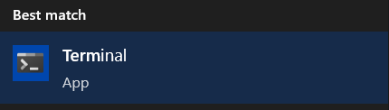
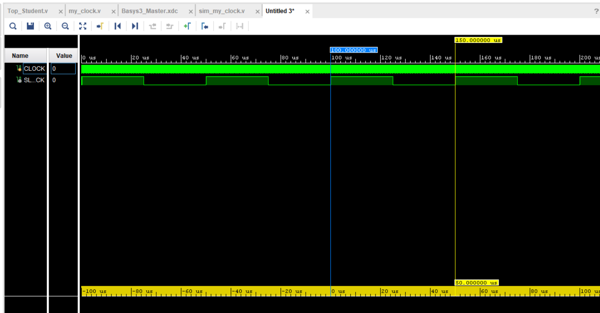
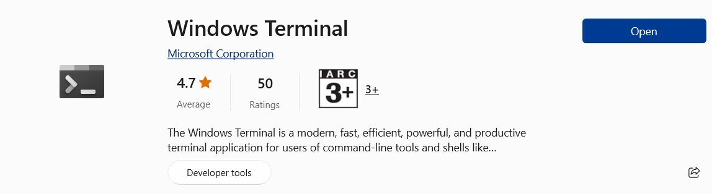

# Developer Guide

## Acknowledgements

The CS2113 Team (Professor Akshay <3) for the guidance and teaching us concepts of Software Engineering and OOP

## Design & implementation

### Main overview of the system:

* Main Components
  * Ui: Deals with user input/output
  * Storage: Deals with data management on hard disk
  * Parser: Deals with parsing user input
  * Command: Deals with handling command input logic

Fig 1

### Ui 

Ui class involves all the methods that display messages to the user when the user is interacting with the program.

Types of methods:

1. Greeting Messages: Messages shown to welcome user and acknowledge their exit
2. Confirmation Messages: Messages shown to inform user that their desired action has been carried out
3. Exception Messages: Messages shown to inform user of their invalid actions and its reasons

Figure 1 below shows the class diagram of the `Ui` class. There are no attributes for the `Ui` class.

Fig 1

Figure 2 below shows the sequence diagram for when `showWelcome` is called by `Eventus` during the startup of the application.

!

Fig 2

### Storage

<code>sequence diagram</code>

### Parser

Parser involves dealing with parsing user input to understand what the user wants to do. It returns a 
<code>Command</code> class that it executed during the run-time.

### Command
Command classes are executed after the parser class has processed the user input. The figure below shows a typical class 
diagram, AddCommand, which inherits from Command.

We also have an example of a sequence diagram for the AddCommand as shown in the figure below.

!

The following <code>Command</code> classes inherits from the main <code>Command</code> class and 
executes different code.

#### Add Command
Every implementation of the `add` command is created with 4 instances of user input, the strings 
<code>companyName</code>, <code>contactEmail</code>, <code>industry</code> and integer <code>contactNumber</code>.
AddCommand will add the Company class to CompanyList through the <code>CompanyList.add(Company)</code> and
the CompanyList will be updated through CompanyListEncoder through <code>CompanyListEncoder.write(CompanyList)</code>.

#### Choose Venue Command
Every implementation of `ChooseVenueCommand` creates and stores an integer <code>venueNum</code>. It will then
run `execute` where venue chosen will be updated via <code>event.updateVenue(venueList, venueNum)</code> and
updates the chosen venue in the storage files through <code>EventDetailsStorage.updateFile(event, venueNum)</code>.

#### Confirm Command
Every implementation of `ConfirmCommand` creates and store an integer <code>companyNum</code> which is the
specific company to be marked confirmed in the CompanyList. It will then run `execute` which will mark a company as
confirmed through <code>companyList.markConfirm(companyNum)</code> and <code>CompanyListEncoder.write(companyList)</code>.

#### Unconfirm Command
Every implementation of `UnconfirmCommand` creates and store an integer <code>companyNum</code> which is the
specific company to be marked unconfirmed in the CompanyList. It will then run `execute` which will mark a company as
unconfirmed through <code>companyList.markUnconfirm(companyNum)</code> and <code>CompanyListEncoder.write(companyList)</code>.

#### Delete Command
Every implementation of `DeleteCommand` creates and store an integer <code>taaskNum</code> which is the
specific company to be deleted in the CompanyList. It will then run `execute` which will delete a company from the companyList
through <code>companyList.deleteCompanyInformation(taskNum)</code> and <code>CompanyListEncoder.write(companyList)</code>.

#### Find Company Command
Every implementation of `FindCompanyCommand` creates and store a String <code>targetCompany</code> which is the
specific company to be found in the CompanyList. It will then run `execute` which will find a company from the companyList
through <code>companyList.findCompany(targetCompany)</code>.

#### Find Industry Command
Every implementation of `FindIndustryCommand` creates and store a String <code>targetIndustry</code> which is the
specific company to be found in the CompanyList. It will then run `execute` which will find companies from a specific 
industry from the companyList through <code>companyList.findIndustry(targetIndustry)</code>.

#### List Company Command
Every implementation of `ListCompanyCommand` shows all the companies currently stored in the CompanyList. It will then run 
`execute` which will print out each company through <code>companyList.printCompanyInformation()</code>.

#### List Company Command
Every implementation of `ListUnconfirmedCommand` shows all the unconfirmed companies currently stored in the CompanyList.
It will then run `execute` which will print out each unconfirmed company through <code>companyList.printUnconfirmed()</code>.

#### List Venue Command
Every implementation of `ListVenueCommand` shows all the venues currently stored in the venueList.
It will then run `execute` which will print out each venue through <code>venueList.printVenueInformation()</code>.

#### Load Sample Company Command
Every implementation of `LoadSampleCompanyCommand` loads all the sample company list for user testing and updates it into
the file. It will then run `execute` which will load the samples into companyList and the save file through
<code>companyList.loadSampleCompanyInformation()</code> and <code>CompanyListEncoder.write(companyList)</code>.

#### Purge Command
Every implementation of `PurgeCompanyCommand` deletes the information of companies already stored in the companyList. 
It will then run `execute` which will delete each company in the companyList through <code>companyList.purgeData()</code>
and <code>CompanyListEncoder.write(companyList)</code>.

#### Update Event Name Command
Every implementation of `UpdateEventNameCommand` creates a new string <code>newEventName</code> which stores the new name
for the Event. It will then run `execute` which will update the Event name through <code>event.updateEventName(newEventName)</code>.
A new integer, <code>venueIndex</code>, is created and stored with the return value of <code>event.getVenue().getVenueIndex()</code>.
Lastly, the file within storage is updated through <code>EventDetailsStorage.updateFile(event, venueIndex)</code>.

### [DONE] Duplication checker feature
#### Implementation
The proposed <code>duplicationChecker</code> is facilitated by <code>CompanyList</code>. It will check against the existing
<code>CompanyList</code> to check if the company has already been added. The check is done in 3 ways: `company name`,
`contact number`, and `contact email`. If any one of the above-mentioned details are identical to the ones already present
in the <code>CompanyList</code>, it will inform the user by displaying a message to the user. Otherwise, it will proceed to 
format the data that was entered by the user so that the parameters that are passed into <code>addCommand</code> are
standardized to remove any potential duplicated addition issues. Figure 3 below shows the sequence diagram for the 
duplication checker feature.

Fig 3

### [DONE] Storing company list feature
#### Implementation
The proposed Storing company list feature will allow the user to save the information of companies to disk. A text file will be 
created to store all the company information the user wishes to save. This text file will be overwritten everytime the 
user makes changes to the stored information. When relaunching EventUS, the program will check if there is a text file 
which contains the information of previously saved companies. If the text file exists, the information of the companies 
stored will be copied over to a local ArrayList. If there is no text file, a text file will be created as soon as the 
user tries to add company information.

### [DONE] Add feature
#### Implementation
The proposed <code>CompanyList.add</code> is facilitated by <code>AddCommand</code>. It will add new company to existing 
list of companies. It has three parameters, <code>String companyName </code>, <code>Int contactNumber </code>, and <code>
String contactEmail</code>. Using this information, <code>CompanyList.add</code> creates new Company object and adds it 
at the end of the company list. After successfully executing the command, it will show successful addition message using
the related method in the <code>Ui</code>.

### [DONE] Delete feature
#### Implementation
The proposed <code>CompanyList.deleteCompanyInformation(index)</code> is facilitated by <code>DeleteCommand</code>. 
It will delete the company at the specified index in the list of companies. After successfully executing the command, 
it will show successful deletion message using the related method in the <code>Ui</code>.

### [DONE] Storing event details feature
#### Implementation
The proposed eventDetailStorage feature will allow users to save the event details of the current session to hard disk. 
A text file will be created to store information such as event name and venue information. This text file will be 
overwritten everytime the user makes changes to the stored information, such as renaming the event name or changing the 
venue of the event. When relaunching EventUS, the program will check if there is a text file which contains the 
information of an event. If the text file exists, the information of the Event instance will be updated with the event 
details. If there is no text file, a text file will be created.

### [DONE] List companies feature
#### Implementation
The proposed <code>CompanyList.printCompanyInformation</code> is facilitated by <code>ListCompanyCommand</code>. It will
print out the companies that are stored in an ArrayList called companyList. The Company object is then printed out with 
an integer denoting its index, four parameters, <code>String companyName </code>, <code>String industry </code>, 
<code>Int contactNumber </code>, and <code>String contactEmail </code>, and its confirmation status. It will print out 
each company from the entire companyList from index 0 to the final index of the last company stored in companyList.

### [DONE] Store Company information to text file feature
#### Implementation
The proposed <code>CompanyListEncoder.write()</code> feature checks if a text file of name "companyList.txt" exists.
If the text file does not exist, it is created when the programme boots up.
If the text file exists, this method iterates through the list of company information in the list of companies and 
stores the companies' information in the text file. Prior to writing the company information to this text file, all 
previously saved text in this file is overwritten.

### [DONE] Load Company information from text file feature
#### Implementation
The proposed <code>CompanyListDecoder.load()</code> feature checks if a text file of name "companyList.txt" exists.
If the text file does not exist, a message is printed to the user indicating that the file is not found.
If the text file exists, this method iterates through the text file line by line and parses the input. Then the parsed
input is added to the list of companies using the method <code>CompanyList.add</code>.

## Product scope
### Target user profile

EveNtUS targets career fair event managers who are looking to better manage the companies attending the career fair, as well as managing the venue and crowd size. 

### Value proposition

EveNtUS is a desktop application designed for career fair managers to manage career fairs, with a focus on efficient operation through the Command-Line Interface(CLI).

## User Stories

| Version | As a ...   | I want to ...                                                                                                                                                        | So that I can ...                                                                        |
|---------|------------|----------------------------------------------------------------------------------------------------------------------------------------------------------------------|------------------------------------------------------------------------------------------|
| v1.0    | new user   | see usage instructions                                                                                                                                               | refer to them when I forget how to use the application                                   |
| v1.0    | basic user | be able to delete company information                                                                                                                                | keep track of only the companies who are attending the event                             |
| v2.0    | basic user | load some sample data                                                                                                                                                | so that I can get familiar with the application                                          |
| v2.0    | basic user | select a venue for the event                                                                                                                                         | keep track of the venue information                                                      |
| v2.0    | basic user | purge the sample data                                                                                                                                                | start to input my data                                                     |
| v2.0    | basic user | save and retrieve my data                                                                                                                                            | continue past sessions                                                     |
| v2.0    | basic user | search for companies attending the career fair                                                                                                                       | easily confirm their attendance without having to manually look through the entire list. |
| v2.0    | basic user | filter the companies based on the industries they belong                                                                                                             | easily look for a company in a specific industry                                         |
| v2.0    | basic user | prevent me from adding the same company twice                   | prevent overlap of data                                        |
| v2.0    | basic user | tag the companies attendance status as confirmed/unconfirmed | ensure there are sufficient companies and any further follow-up action can be taken accordingly                                                     |

## Non-Functional Requirements

1. The programme should run even without the existence of the text file at the start
2. The programme should be able to handle user changing the text files
3. The programme should run on different Operating System

## Glossary

* *EveNtUS* - Name of our application
* *Ui* - Name of the class that deals with user input/output

## Instructions for manual testing

1. To load sample company data, run <code>load samples</code> to load some companies into company list
2. Type <code>help</code> for more information on the commands
2. To reset the company list and purge all company list data, run <code>purge</code>
