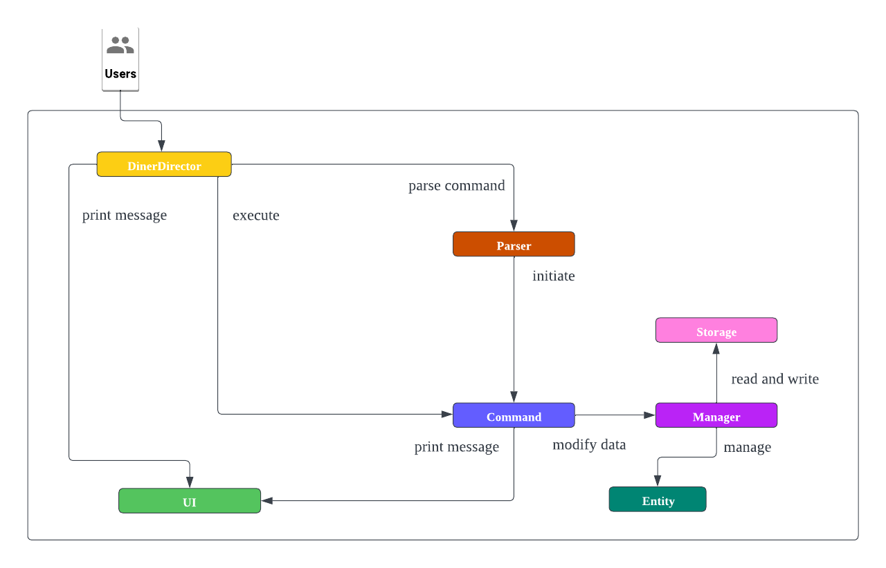
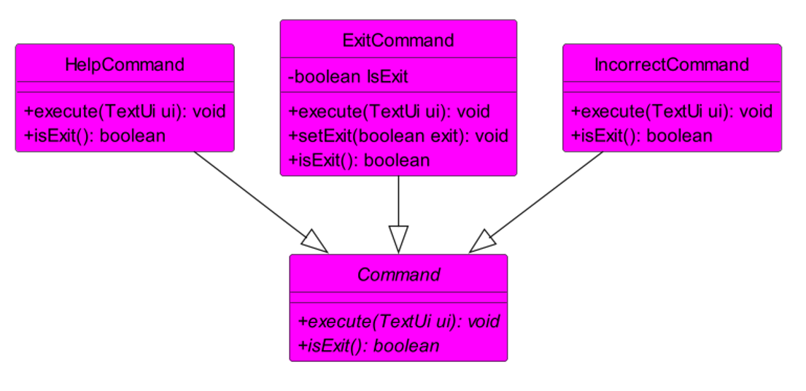
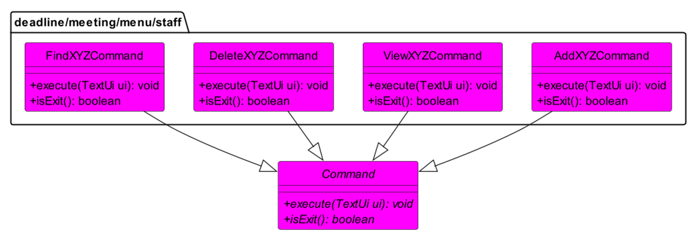
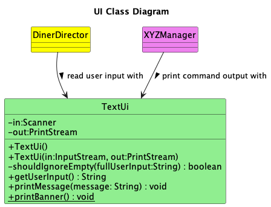
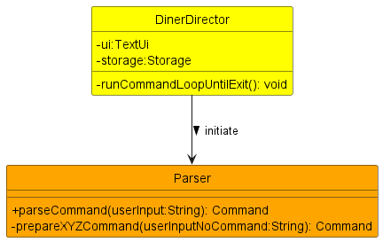
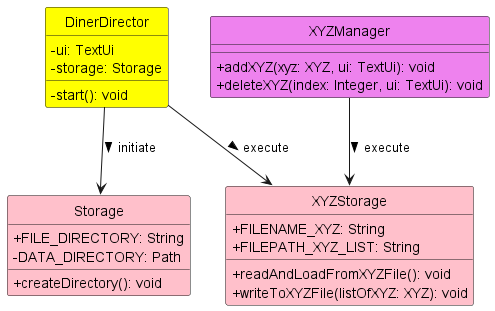
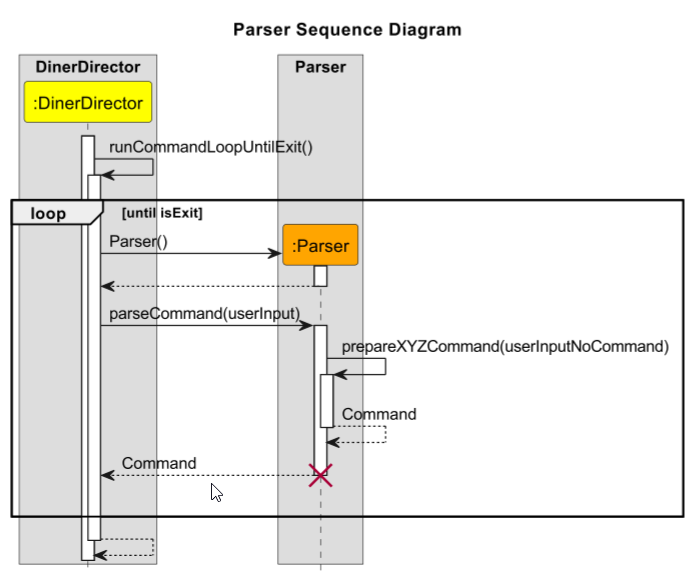
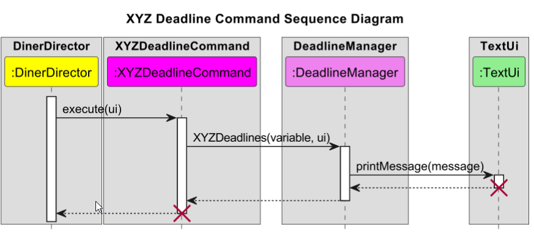
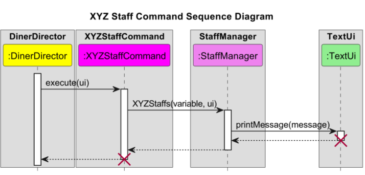

# Developer Guide
## Table of Contents
- [Acknowledgements](#acknowledgements)
- [Setting up](#setting-up)
  - [Prerequisite](#prerequisite)
  - [Setting up the project in your computer](#setting-up-the-project-in-your-computer)
- [Design](#design)
  - [Architecture](#architecture)
  - [Command Component](#command-component)
  - [Manager Component](#manager-component)
  - [Ui Component](#ui-component)
  - [Utils Component](#utils-component)
- [Implementation](#implementation)
  - [Parsing Feature](#parsing-feature)
  - [Meeting Feature](#meeting-feature)
  - [Deadline Feature](#deadline-feature)
  - [Staff Feature](#staff-feature)
  - [Dish Feature](#dish-feature)
  - [Storage Feature](#storage-feature)
- [Glossary](#glossary)
- [Appendix A: Requirements](#appendix-a-requirements)
- [Appendix B: Instructions for manual testing](#appendix-b-instructions-for-manual-testing)

## Acknowledgements
Credits to [Personbook](https://github.com/nus-cs2113-AY2223S2/personbook)
for some reused skeleton code and inspiration on OOP implementation.  
Credits to [addressbook-level3](https://github.com/se-edu/addressbook-level3) for providing a guide on how to write Developer and User Guide.

## Setting up
### Prerequisite
Ensure you have the following installed:
1. [JDK 11](https://docs.aws.amazon.com/corretto/latest/corretto-11-ug/downloads-list.html)
2. [Intellij IDEA](https://www.jetbrains.com/idea/download)

### Setting up the project in your computer
1. **Fork** this repo, and **clone** the fork into your computer.
2. Open the application `Intellij IDEA`.
   1. On the top left of the navigation bar, select `File` > `Open...`.
   2. Navigate to the folder, and select the folder containing the `DinerDirector` files that was cloned.
   3. By default, if there is a `build.gradle` in the project root, Intellij treats it as a Gradle project by default. Just in case it didn't work follow the guide [Importing a Gradle project](https://se-education.org/guides/tutorials/intellijImportGradleProject.html).
3. Once the project is opened, **Configure the JDK**: Follow the guide [JetBrains Intellij IDEA: Configure JDK](https://www.jetbrains.com/help/idea/sdk.html#set-up-jdk) to ensure Intellij is configured to use **JDK 11**.
4. Verify the setup
   1. Once the above steps are completed, locate the file `src/main/java/dinerdirector/DinerDirector.java`, right-click and select `Run 'DinerDirector.main()'`
   2. If setup is correctly done, this is what you should see:
   ```
    Welcome to DinerDirector! Please type "help" for a list of valid commands.
    What can I do for you?
    >
   ```
   
## Design 
### Architecture



The **Architecture Diagram** given above explains the high-level design of DinerDirector. 
Given below is a quick overview of main components and how they interact with each other. 

**Architecture of Main Components** <br/>
`DinerDirector` entry point to the application is DinerDirector. Initially, `DinerDirector` class interact with `UI` class to 
prompt user for inputs. Once user keys in the input text, the input will be redirected to `Parser` class. `Parser` class will manage the error 
handling of user's input. Next, any logic will be executed by `Command` object. If there exists any interaction with `Entity`, `Command` will 
request to `Manager` to assist the CRUD operations.  

### Command Component

The command component consists of the following:



- 4 subcomponents: Command, HelpCommand, ExitCommand, IncorrectCommand

The above commands are contained in the `commands` package.

In addition to that, within the `commands` package, there are also 4 packages named `deadline`, `meeting`, `menu` and `staff`, all of which contains their own specific command classes as shown below:



- 4 sub packages with the following names: deadline, meeting, menu and staff
    - Each package contains the 4 general commands:
        - AddXYZCommand
        - DeleteXYZCommand
        - ViewXYZCommand
        - FindXYZCommand
    - The general commands have specific names depending on the package it is in.

The command component consist of the Abstract `Command` class.
It has multiple child `Command` classes that inherits from the Abstract `Command` Class.
Each child `Command` class accepts arguments that are parsed from the `Parser` class and set those arguments to private variables in their respective classes, if there is any private variables to be set.
An `execute` method will execute the operations needed for each individual commands.
An `isExit` method will return a boolean value that decides whether the program should exit after this command is called.

### Manager Component


The manager component consists of four different managers, in which the list 
of entity is initialized and the methods implementing the entity are written inside.
XYZ represents Meeting, Deadline, Staff and Dish.
The Manager class diagram above omits methods that are unique to the individual manager classes
for simplification.
- DeadlineManager: This class contains an ArrayList of deadlines and methods implementing the deadlines shown in the class diagram.
- DishManager: This class contains an ArrayList of dishes and methods like isInsideDishes for judging whether a dish is inside the dish list,
stringOfDish which returns the dish information,isInsideDishesWithIndex which returns the dish information
with index and getDishesSize which returns the size of the dishes, apart from methods in the diagram.
- MeetingManager: This class contains an ArrayList of meetings and methods implementing the meetings shown in the class diagram.
- StaffManager: This class contains an ArrayList of staffs and methods like getStaffs with returns the staff list,
apart from the methods in the diagram.

### Ui Component



The Ui Component consists of the `TextUi` class that handles interactions between the app and the user.

The `TextUi`class performs the following functions:
* Reading the user input through `DinerDirector` class (Empty inputs will be ignored)

    method: `getUserInput()`
* Printing messages generated by the app to the terminal through 'XYZManager', where XYZ stands for each of the entity in our app.

    methods: `printBanner()`, `printMessage()`

### Utils Component

    
The Utils Component consists of the `Parser` class that will handle the parsing and preparing of commands within the DinerDirector application.  

The `Parser` class performs the following functions:  
* Parse the command given the user input and extracts out the necessary information related to the command.
* Returns the appropriate Command Class based on the parsed input.

  
The Utils Component also consists of the `Storage` class and the individual `XYZStorage` that will handle storage related operations within the DinerDirector application.  

The `Storage` class performs the following functions:
* Create a directory in the root folder of where the application is running.

The `XYZStorage` class performs the following functions:
* Read and load data from the file.
* Write to the file if any changes occur to the list.

## Implementation
### Parsing Feature
  

How the parsing works:
1. The `Parser()` class will be called to create a new instance of `Parser`.
2. Afterwards, when the `parseCommand()` method is called from `DinerDirector` class, the `parseCommand()` will split the given userInput first.
2. With the `userInputSplit[]`, the `0` index will be extracted out. That will be used as identification for the command the user typed in.
3. The `commandWord` will be used in the switch statement to select the appropriate command. returning `IncorrectCommand` class is the default behavior.
4. If the `commandWord` is valid, it will run the appropriate `prepareXYZCommand()`.
5. Each of the individual `prepareXYZCommand()` will take in the userInput without the command portion. The variable is named `userInputNoCommand`. The `prepareXYZCommand()` will check the userInput to see if all the appropriate values are added, and return `XYZCommand` class if the values are correct. `prepareXXXCommand()` will return `IncorrectCommand` class if there are some missing values or inappropriate values.

### Meeting Feature
The 'Meeting' Feature allows users to add a meeting, delete a meeting, find a meeting and print all the meetings.
The 'Meeting' class in the entity package shows the attributes that a meeting object has: time and issue, both are of String type.
An ArrayList of meetings is initialized in the MeetingManager. Three methods that implement the meetings are also inside.
- addMeeting: Add a meeting to the meeting list.
  
- deleteMeeting: Delete a meeting in the meeting list by its index. The sequence diagram follows the same pattern as above.
- printMeetings: Print all the meetings in the meeting list.The sequence diagram follows the same pattern as above.

When the user input a meeting command, the Parser will determine which command it is and return a command object.
One of the meeting commands will be called from `AddMeetingCommand`, `DeleteMeetingCommand` and `ViewMeetingCommand`.
Inside the command, the execute function will call the corresponding methods inside the MeetingManager and implement on the meeting list.

### Deadline Feature
The Deadline Feature allows user to add Deadline objects in a deadline list.
Deadline objects consists of a description String and a dueDate String.
The User will also be able to delete deadlines, view deadline list.



(XYZ stands for the respective command name.)

Step 1: After the parser returns a `XYZDeadlineCommand`, `DinerDirector` will call the `execute()` method of the command called.  

Step 2: In `execute(ui)` method, the corresponding `XYZdeadline` method of `DeadlineManager` will be called.  

Step 3: After the `XYZdeadline` method completed the task given, a message will be printed through the `TextUi` class with the `printMessage()` method. 


#### Add deadline to deadline list

   Adds the `Deadline` object to the ArrayList `deadlinelist`.

   The variable here is the `Deadline` object to be added.

   A `Deadline` object can only be added to the `deadlinelist`if it has a valid `description` and `dueDate` String.

   If the addition was a success, a message will be printed through `TextUi` class to notify the reader that the `Deadline` object has been added.


#### Delete a deadline from the deadline list

   Removes a `Deadline` object from the ArrayList `deadlinelist` using the index given.

   The variable here refers to the index of the `Deadline` object that will be deleted.

   A `Deadline` object can only be removed if the index is a valid index in the list.

   If the deletion was a success, a message will be printed through `TextUi` class to notify the reader that the `Deadline` object has been deleted.

#### Printing the deadline list
   
    
Prints an ArrayList through `TextUi` class.

For `viewDeadline`, the entire deadline list `deadlinelist` will be printed.
    
For `findDeadline`, a separate list, `matchingDeadlines`, containing only deadlines with matching keywords will be created and printed.

The variable here refers to the keyword String for `findDeadline`, whereas `viewDeadline` do not require a variable.

The message here refers to the list that will be printed.

If any of the list is empty, a separate message notifying the user that the list is empty will be printed.


### Staff Feature 
The `Staff` Feature allows user to create, read, update, delete (CRUD) `Staff` objects in the list of staffs. 
`Staff` list is managed by `StaffManager` Class similar to other entity objects. Here are how it works for each functionality: 



#### Adding staff to the list:

It first checks whether the parameter needed to add `Staff` is already given in the correct format. If it passes the format checking, 
the `Parser` object will return `AddStaffCommand` to be executed by `DinerDirector`. Internally, `AddStaffCommand` redirect the requests to 
`StaffManager` to add the `Staff` object to the list of `Staff` 

#### Deleting staff on the list:

It first finds the corresponding `Staff` object to be deleted using its name in the list in `StaffManager`. 
If it is found, it will delete the correct corresponding `Staff`. 

#### Viewing the list of staffs:

It prints all of `Staff` objects in `StaffManager`'s staffs. 

### Dish Feature

The Dish feature consists of three functions:

#### Add dish to list:


- When the ```AddDishCommand()``` constructor is called, it stores the dish name, price and the list of ingredients in an entity called Dish.
- When the ```execute()``` command in ```AddDishCommand``` is called, it calls the ```addDish()``` in ```DishManager``` class that adds the Dish into an arraylist of Dishes.
- It then prints out the dish that was added to the console.
 
#### Delete dish on the list:


- When the ```DeleteDishCommand()``` constructor is called, it stores the index of the Dish to be deleted from the arraylist of Dishes.
- When the ```execute()``` command in ```DeleteDishCommand``` is called, it calls the ```deleteDish()``` in ```DishManager``` class that deletes the Dish at the specified index in the arraylist of Dishes
- It then prints out the dish that was deleted to the console.

#### View the list of dishes:

- When the ```execute()``` command in ```ViewDishCommand``` is called, it calls the ```viewDish()``` in ```DishManager``` class that returns the formatted string of all the dishes in the arraylist.
- It then prints out the formatted string containing all the dishes to the console.

#### Find a dish in the list of dishes

- When the ```FindDishCommand()``` constructor is called, it stores the keyword that is going to be used to search for dishes.
- When the ```execute()``` command in ```FindDishCommand``` is called, it calls the ```findDish()``` in ```DishManager``` class and searches through all the descriptions of dishes in the arraylist of dishes.
- It then prints out the formatted string containing all the dishes with the keyword to the console.

### Storage Feature 

#### Create directory, Read and load from XYZ file
  

1. The `Storage()` class will be called to create a new instance of `Storage`.
2. The `createDirectory()` method in the `Storage()` class will be called next. A directory called `data` will be created in the same folder as the application if the folder does not exist.

#### Read and load from XYZFile


1. The `XYZStorage()` class will be called to create a new instance of `XYZStorage`.
2. The `readAndLoadFromXYZFile()` method in the `XYZStorage()` class is called to read and load data if any application related text files exists.

#### Write to XYZ file


1. The `XYZStorage()` class will be called to create a new instance of `XYZStorage`.
2. The `writeToXYZFile()` method in the `XYZStorage()` class is called to write the contents in the list into the respective file.
3. The `writeToXYZFile()` method is called in `addXYZ()` method in the `XYZManager` class.
4. The `addXYZ()` method is called from outside `XYZManager()` class.
5. The above process is listed only for `addXYZ()`, but `deleteXYZ()` follows the same process as the above sequence diagram.

## Glossary

* *Any Operating System* - Windows, Linux, Unix, OS-X

## Appendix A: Requirements
### Product scope
**Target user profile**  
- Restaurant Managers.
- Wants to manage their restaurant better.
- Wants to track their restaurant daily operations.
- Can type fast.
- Comfortable using CLI interface.

**Value proposition**
- There are too many things to keep track of in a restaurant. 
- We want to create an application that will allow the restaurant manager to have a place to quickly refer to, and keep track of the things that allow the restaurant to function on a daily basis.


### User Stories

| Version | As a ...                                                 | I want to ...                                            | So that I can ...                                                                         |
|---------|----------------------------------------------------------|----------------------------------------------------------|-------------------------------------------------------------------------------------------|
| v1.0    | forgetful restaurant manager                             | get reminded of the things I need to keep track of       | not miss any important deadlines that may affect my business                              |
| v1.0    | forgetful restaurant manager                             | schedule meeting and show the timetable                  | know when the meeting is going to occur                                                   |
| v1.0    | newcomer restaurant manager                              | view the help list of the app                            | get to know this application easier                                                       |
| v1.0    | newcomer restaurant manager                              | view all the workers information                         | get to know all the workers better                                                        |
| v1.0    | restaurant manager managing a 3-Michelin star restaurant | keep track of current menu prices, ingredients, and name | be more particular about details on my menu                                               |
| v2.0    | restaurant manager                                       | find a to-do item by name                                | locate a to-do without having to go through the entire list                               |
| v2.0    | restaurant manager                                       | find information about a specific worker                 | I know the worker's details and when he is working without going through the whole list   |
| v2.0    | restaurant manager                                       | find information about a specific dish I added           | I can find what ingredients I added to the dish  without going through the whole list     |
| v2.0    | restaurant manager                                       | find information about a specific meeting                | so that I can look up information about that meeting without going through the whole list |
| v2.0    | restaurant manager                                       | find information about a specific deadline               | I can find details about the deadline date  without going through the whole list          |
| v2.0    | restaurant manager                                       | view what I typed into the app previously                | I don't need to retype everything everytime I enter the app                               |

### Non-Functional Requirements
- The application should be able to run on any operating systems (OS) with `Java 11` installed.
- The application should be responsive.
- The application should be able to hold up to at least 100 items in the different lists without lagging.
- The application should be easy to learn and pick up by reading the User Guide.
- When using the application, a user with above average typing speed should be able to complete tasks faster as compared to using a mouse.

## Appendix B: Instructions for manual testing

### Launch and shutdown
1. Initial launch
   1. Download the latest version of `DinerDirector` from [here](https://github.com/AY2223S2-CS2113-W15-4/tp/releases).
   2. Copy the file to the folder you want to use as the home folder for your `DinerDirector`.
   3. Open a command terminal, `cd` into the folder you put the jar file in, and use the `java -jar dinerdirector.jar` command to run the application.
   4. Once the welcome message is displayed, `DinerDirector` is ready for use.
2. Shutdown
   1. To exit `DinerDirector`, type the command `exit` and press enter.

### Meeting Feature
1. Users can `add_meeting`, `view_meetings`, `delete_meeting`, `find_meeting`.
2. Test case: `add_meeting n/Meeting with boss t/3pm` 

    Expected: Meeting will be added to the list.
3. Test case: `view_meetings`

    Expected: All meetings will be displayed.
4. Test case: `delete_meeting 1`

   Expected: The meeting at index 1 will be deleted.
5. Test case: `find_meeting boss`

   Expected: Meetings with `boss` in the name will be displayed.
6. Incorrect commands to try: 
   1. `add_meeting` (No meeting added)
   2. `view_meetings abc` (No meetings shown)
   3. `delete_meeting -1` (Invalid index for delete)

### Deadline Feature
1. Users can `add_deadline`, `view_deadlines`, `delete_deadline`, `find_deadline`.
2. Test case: `add_deadline n/Fix broken pipes t/6th April 6pm`

   Expected: Deadline will be added to the list.
3. Test case: `view_deadlines`

   Expected: All deadlines will be displayed.
4. Test case: `delete_deadline 1`

   Expected: The deadline at index 1 will be deleted.
5. Test case: `find_deadline Fix`

   Expected: Deadline with `Fix` in the name will be displayed.
6. Incorrect commands to try:
    1. `add_deadline` (No deadline added)
    2. `view_deadlines abc` (No deadlines shown)
    3. `delete_deadline -1` (Invalid index for deadline)

### Dish Feature
1. Users can `add_dish`, `view_dish`, `delete_dish`, `find_dish`
2. Test case: `add_dish n/Chicken Burger pc/1099 [tomatoes;chicken fillet;cheese;bread with sesame seeds;]`

   Expected: Dish will be added to the list.
3. Test case: `view_dish`

   Expected: All dishes will be displayed.
4. Test case: `delete_dish 1`

   Expected: The dish at index 1 will be deleted.
5. Test case: `find_dish Burger`

   Expected: Dish with `Burger` in the name will be displayed.
6. Incorrect commands to try:
   1. `add_dish` (No dish added)
   2. `view_dish abc` (No dish shown)
   3. `delete_dish -1` (Invalid index for dish)

### Staff Feature
1. Users can `add_staff`, `view_staff`, `delete_staff`, `find_staff`
2. Test case: `add_staff n/John Doe w/Tuesday d/1990-08-28 p/88193213`

   Expected: Staff will be added to the list.
3. Test case: `view_staff`

   Expected: All staffs will be displayed.
4. Test case: `delete_staff 1`

   Expected: The staff at index 1 will be deleted.
5. Test case: `find_staff John`

   Expected: Staff with `John` in the name will be displayed.
6. Incorrect commands to try:
   1. `add_staff` (No staff added)
   2. `view_staff abc` (No staff shown)
   3. `delete_staff -1` (Invalid index for staff)
