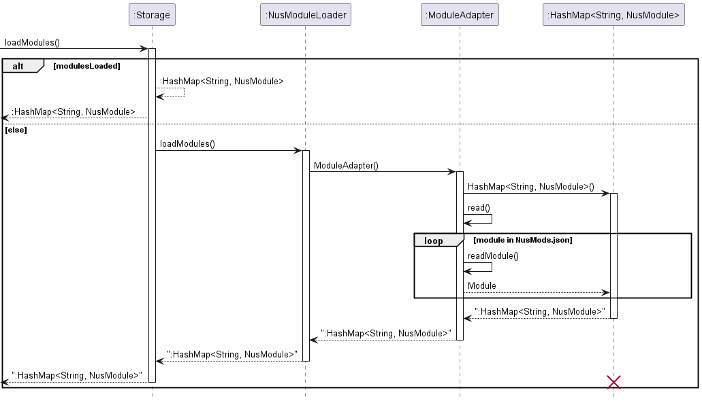

# Developer Guide
Welcome to the NUSPlanner Developer Guide!
We hope this documents serves useful to understand the behind-the-scenes working of our product. 

## Table of Contents
* [1. Introduction](#1-introduction)
   * [1.1 About this Document](#11-about-this-document)
   * [1.2 Getting Started](#12-getting-started)
* [2. Design & Implementation](#2-design-and-implementation)
  * [2.1 Architecture](#21-architecture)
  * [2.2 Parser Component](#22-parser-component)
    * [2.2.1 How is the feature implemented](#221-how-is-the-feature-implemented)
    * [2.2.2 Add Events Diagram](#222-add-events-diagram)
    * [2.2.3 Add Modules Diagram](#223-add-modules-diagram)
    * [2.2.4 Why is the feature implemented this way?](#224-why-is-the-feature-implemented-this-way)
  * [2.3 Storage Component](#23-storage-component)
    * [2.3.1 How the feature is implemented and design considerations](#231-how-the-feature-is-implemented-and-design-considerations)
    * [2.3.2 Load Events Sequence Diagram](#232-load-events-sequence-diagram)
    * [2.3.3 Load Modules Sequence Diagram](#233-load-modules-sequence-diagram)
    * [2.3.4 Save Events Sequence Diagram](#234-save-events-sequence-diagram)
    * [2.3.5 Justification for using gson](#235-justification-for-using-gson)
  * [2.4 EventList Component](#24-eventlist-component)
    * [2.4.1 How is the feature implemented](#241-how-is-the-feature-implemented)
    * [2.4.2 Why is it implemented in this way](#242-why-is-it-implemented-in-this-way)
  * [3. Testing the application](#3-testing-the-application)
    * [3.1 Instructions for manual testing](#31-instructions-for-manual-testing)
      * [Launching and shutdown of program](#launching-and-shutdown-of-program)
      * [Manually testing functions of the application:](#manually-testing-functions-of-the-application)
* [Appendix A: Product Scope](#appendix-a-product-scope)
* [Appendix B: User Stories](#appendix-b)
* [Appendix C: Non-Functional Requirements](#appendix-c)
* [Appendix D: Glossary](#appendix-d)
* [Appendix E: Acknowledgements](#appendix-e-acknowledgements)

---
# 1. Introduction:

## 1.1 About this Document
NUSPlanner is an all-in-one app featuring an event planner with built in support for modules offered by the National University of Singapore (NUS).
It is optimized for use through a Command Line Interface(CLI). 

This document aims to onboard developers onto NUSPlanner, giving them a better understanding of how the application works. 
It will share how the project is set up as well as the general architecture used and the finer details regarding each component 
critical to the app's function. We hope that this document will serve you well in fixing bugs, or adding new features to NUSPlanner.

## 1.2 Getting started

Refer to the user guide [here](https://github.com/AY2223S2-CS2113-F13-3/tp/blob/master/docs/UserGuide.md).
 
[Back to contents page](#table-of-contents)

&nbsp;

# 2. Design and Implementation
## 2.1 Architecture

The **Architecture Diagram** above explains the high-level design of NusPlanner. 
Below is an overview of how the main components interact with each other.

#### Main Components of the architecture

`Duke` is the "Main" of the application. It is responsible for:
* At app launch: Initializes components in the correct sequence, and connects them to each other
* At shut down: Saves the current state of the EventList.

The rest of the app consists of four components:
* `UI`: The UI of the app
* `Parser`: The command executor
*  `EventList`: Holds the data of the app in memory
* `Storage`: Reads data from and writes data to the hard disk
 
[Back to contents page](#table-of-contents)

&nbsp;

### 2.2 Parser Component
The component will return the correct command based on what the user inputs into the application.

#### 2.2.1 How is the feature implemented?

The Parser component parses the command of the user input and breaks the user input into different parts based on the flags.
This component also ensures to validate that user input is correct.

The Parser component handles the following methods:
* Add event
* Add module
* List event list
* Delete event
* Edit event
* Find date of week
* Format checker
* Revise information using index
* Revise information using name

&nbsp;

##### 2.2.2 Add Events Diagram
The diagram below illustrates the flow of how the application adds events:

When the user adds an event, the application checks if the format of the command is correct before proceeding further.

It will then go through different processes depending on if the event has an end date.

Following that, it will go through another process to check if the event is set to be recurring before finally creating a new event and displaying a success message to the user.

##### 2.2.3 Add Modules Diagram
The diagram below illustrates the flow of how the application adds modules:

When the user adds an event, the application checks if the format of the command is correct before proceeding further.

Modules are then loaded and the application uses getLesson() to access modules from a Hash Map. 

Then, according to the information provided by the user, the application will convert it to fit the event method before adding a new event.

#### 2.2.4 Why is the feature implemented this way?

This component should be able to guide the user to inputting the correct format of the command to do data validation.
It should be able to perform basic data validation checks to ensure that the user does not enter any invalid commands.
This makes life easier to developers in the future if they wish to add new features that requires users to use new commands.

[Back to contents page](#table-of-contents)
---
### 2.3 Storage Component
API: `Storage.java`

The storage component reads and writes user data from a local save in the form of a `.json` file.
The Storage component:
* Serializes and deserializes user data into a `.json` file format through the use of the Gson library
* Loads data from `NusMods.json`, a scraped version of the NUSMods API, into a HashMap for use by other classes.
* Inherits from both `EventListStorage` and `NusModuleLoader`, and can be treated as either one.
* Saves and loads information from the local hard disk
* Depends on some classes (the `storage` component saves and retrieves objects)

The class diagram below illustrates the structure of the storage package

#### 2.3.1 How the feature is implemented and design considerations:

The Storage component uses a custom type adapter to serialize and deserialize data from java to json and vice versa using
a gson, a third party library for Json serialization/deserialization. The custom type adapter allows for finer controls over
how objects are deserialized and serialized.

`NusMods.json` is stored in the resources folder and is deserialized into a hash table storing all module information. A 
hash map was used to prevent the slow processing of the program each time a module needed to be searched up as it is a feature
that is likely to see high amounts of usage given the target user.

##### 2.3.2 Load Events Sequence Diagram

When the application starts up, the storage loadEvents() function will be called to load contents in the save file. 

##### 2.3.3 Load Modules Sequence Diagram

When any component requires reading the NUS module files, the loadModules() is called.

##### 2.3.4 Save Events Sequence Diagram

Similarly, the state of the user's event list is saved when the user exits the application by calling saveToFile().

#### 2.3.5 Justification for using gson
The Gson library was chosen as it allowed for flexible adaptation of its TypeAdapter class, allowing for custom 
serialization and deserialization of data to be saved. 

[Back to contents page](#table-of-contents)
---
### 2.4 EventList component

API: `EventList.java`

this component maintains a list of Schedule instance. It receives commands from Parser.java and adds/deletes/edits tasks and their information in the list according to the commands.

#### 2.4.1 How is the feature implemented:

the main functions are

> - add new task (accepts event without starting time/ending time/ending date).
> - delete a single tasks / delete all tasks.
> - edit the time information of task (starting time/ending time/ending date can be omitted).
> - search for a event by index / description.
> - get all the detail of a event in the list in String form.

The class diagram below illustrates the structure of the EventList component.

And below is a sequential diagram showing a event being added, revised, checked for information and finally deleted.

#### 2.4.2 Why is it implemented in this way:

It is necessary to have a list which contains all the current event/class so that we can show/ batch process events more efficiently. Moreover, this component serves intermediary functions and avoids other classes access deep into the functionality of classes (Event, Schedule e.t.c) inside the ArrayList, thus reduces the coupling of the code base. Additionally, this component also converted all the String parameters parsed by Parser into various Types that required by other classes that the EventList contains, further reducing the coupling.

[Back to contents page](#table-of-contents)

# 3 Testing the application
## 3.1 Instructions for manual testing

### Launching and shutdown of program
1. Download the latest version of the `.jar` file and copy the file to a folder of your preference that you want NUSPlanner to run in.
   Note that the save file will be in the same directory.
2. Run the .jar file based on the instructions as provided on the User Guide. You should expect to see the CLI displaying a welcome message.

### Manually testing functions of the application:

When manual testing, the developer should attempt to call commands as specified in the user guide and visually confirm the expected behaviour
from a user's standpoint. Following that, the developer should iteratively check edge cases and push the program's boundaries. This is to confirm
that unexpected behaviours from the user is accounted for and handled appropriately. Below are some such examples. The tests listed are not exhaustive and
the developer is encouraged to expand upon them.

#### User Input
Attempt to enter commands that are not specified in the User Guide. Some examples are: `testing 123`, `beep boop`.
Expected behaviour: Error details are shown on the terminal

#### `Add` Command:
1. Add commands without specifying flags, Test Case: `add helloWorld 20:00 2023/04/11` Expected Behaviour: Error details shown on terminal
2. Add commands with duplicate flags, Test Case: `add -e testing123 -st 20:00 -sd 2023/04/11 -st 18:00` Expected Behaviour: Error details shown on terminal
3. Add commands with invalid format, Test Case: `add -e testing3211 -st 20:00 -sd 11-04-2023` Expected Behaviour: Error details shown in terminal

#### `list` Command:
1. Add a valid event(s)), with starting and ending times on the same day, to the list.
2. Test Case: `list` Expected Behaviour: Terminal displays list of events added as was added
3. Test Case: `list -w X` where X is the week in question. Expected Behaviour: The terminal displays a timetable with
   events of the week in question accurately reflected.

## Appendix A: Product Scope

### Target user profile

Our target user profile is students studying in NUS, who are looking for a convenient and easy way to keep track and 
manage their schedule.  

### Value proposition

NUSPlanner aims to help students who are studying in the National University of Singapore better manage their hectic schedules, 
allowing them to take charge of their schedules and ensure that they have their upcoming events well-planned out. 

[Back to contents page](#table-of-contents)
# Appendix B:
## User Stories

| Version | As a ...     | I want to ...                                                       | So that I can ...                                                                  |
|---------|--------------|---------------------------------------------------------------------|------------------------------------------------------------------------------------|
| v1.0    | As a user    | Add, edit, delete and view events                                   | Plan my schedule and have an understanding of what's upcoming                      |
| v1.0    | As a user    | Save and load my events                                             | Revisit them at a later time without having to reenter them                        |
| v2.0    | As a student | Add modules and view my schedule in a list or table format by weeks | Plan my schedule around modules (lectures, tutorials and labs) and upcoming events |
| v2.0    | As a user    | Set an event to be recurring                                        | Easily add recurring events to my schedule                                         |
| v2.0    | As a user    | Save the location of an event                                       | Remember where I need to go for the next event                                     |

[Back to contents page](#table-of-contents)
# Appendix C: 
## Non-Functional Requirements
1. The program should be able to run on any computer regardless of OS.
2. The program should be able to handle data corruption.
3. The program is not required to return an accurate timetable for modules that only have one or two lectures in the whole semester.
4. The program should be lightweight and fast.

[Back to contents page](#table-of-contents)
# Appendix D: 
## Glossary

* *NUSPlanner* - The name of our application
* *OS* - Operating System (ie Windows, Linux, AppleOS) of the computer
* *CLI* - Command Line Interface, the terminal of an OS
* *Ui* - User Interface
* *NUSMods* - NUSMods is a module manager and organiser tool used by NUS Students.

[Back to contents page](#table-of-contents)
# Appendix E: Acknowledgements

Special thanks to the following libraries and APIs for making the development of **NUSPlanner** possible
1. GSON (Third Party Library) - [Documentation](https://sites.google.com/site/gson/gson-user-guide)
2. NUSMods API - [Documentation](https://api.nusmods.com/v2/)

[Back to contents page](#table-of-contents)
