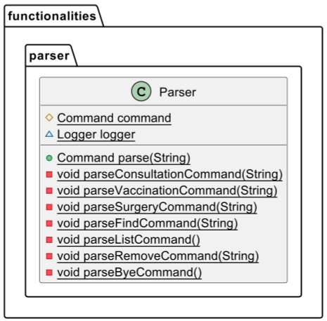

[DeveloperGuide.md](DeveloperGuide.md)
# Developer Guide

## Acknowledgements

{list here sources of all reused/adapted ideas, code, documentation, and third-party libraries -- include links to the
original source as well}

## Design & implementation

### Command Mechanisms:
For all valid commands, the mechanism of implementation are as follows:
1. Read input - ```runBagPacker()``` method in ```BagPacker``` calls the ```Parser``` class to read user input command
2. Create command object - The ```Parser``` class creates a corresponding command object of the relevant command
3. Execute command object - ```runBagPacker()``` method executes the ```.execute()``` method (overridden by child classes) of the command object 
   which runs the actual command function

#### Add Command

Add command is used to add a quantity of item(s) to the packing list.

Mechanism: ```AddCommand.execute()``` calls the ```PackingList.addItem()``` method from the ```PackingList``` class which executes the ```ArrayList.add()``` method to add the item to the ```PackingList``` ArrayList. 
It then updates the ```quantity``` variable according to the quantity inputted by the user.


#### Delete Command

Delete command is used to delete an item from the packing list.

Mechanism: ```DeleteCommand.execute()``` calls the ```PackingList.deleteItem()``` method from the ```PackingList``` class which executes the ```ArrayList.remove()``` method to remove the item from the ```PackingList``` ArrayList.


#### Help Command
Help command is used to exit the BagPacker application.

Execute: ```HelpCommand.execute()``` prints the following help message.

```
All Commands:
1. add : Adds a quantity of items to the packing list.
	Example: add 3 toothbrushes
2. delete : Deletes an item from the packing list.
	Example: delete 1
3. list : List all items in packing list.
	Example: list
4. pack : Marks an item as packed in the packing list.
	Example: pack 2 of 3
	Meaning: packs 2 quantities of the third item in the packing list
5. unpack : Marks an item as unpacked in the packing list.
	Example: unpack 1 of 2
	Meaning: unpacks 1 quantity of the second item in the packing list
6. bye : Stops the BagPacker Application
	Example: bye
____________________________________________________________
```

#### Bye Command
```ByeCommand``` is used to exit the BagPacker application.

Mechanism: ```ByeCommand.execute()``` updates the static boolean ```isBagPackerRunning``` to be false. 
The ```runBagPacker()``` method will continually parse and execute relevant commands (refer to Command Mechanisms in DG) until
```isBagPackerRunning == false``` which occurs upon the execution of the ```byeCommand```.

#### DeleteList Command
```DeleteListCommand``` is used to delete a whole packing list in the BagPacker application.

Mechanism: ```DeleteListCommand.execute()``` reassigns the existing ```packingList``` to a new empty ArrayList of Items, thus deleting the ```packingList```.

#### Preventing duplicate items

When using the `add` function, we have decided to implement a passive function that checks whether the item with the same name already exists in the packingList.

This is done through the `contains()` method in class `PackingList()`, which is called during `execute` in an `AddCommand` object.

Below is the UML diagram showing what occurs during `add` function.

When `execute()` is called in `a`(object of class `AddCommand`), the `addItem(item)` method is called in the object `packingList`. This method will see if method `contains()` will return `true`.

The `contains()` method, which is shown as a reference on the right of the UML diagram, is a boolean method that loops through all items in the packingList, and returns `true` if any of the existing items have the same description as the item to be added in `toAdd`, and `false` otherwise.

When `contains()` returns `true`, method `addItem(item)` will be interrupted and a `DuplicateItemException` will be thrown from `packingList`, which will be caught by `a`. If `contains()` returns false, the item will be added onto `packingList`.

In both scenarios, `ui.printToUser` will be called to print a message to the user. In the former case, `ExistItemError` will be printed, while `AddSuccess` will be shown if the item was added with no issues.


## Product scope

### Target user profile

BagPacker is for NUS students, in particular, exchange students who travel a lot and want a simple CLI to keep track of their packing.

### Value proposition

BagPacker aims to help busy students simplify their packing process by allowing easy adding of items to pack and record of the items they have already packed so that they can be organised and aboard their travels with ease.


## User Stories

| Version | As a ... | I want to ...                                  | So that I can ...                                                            |
|---------|----------|------------------------------------------------|------------------------------------------------------------------------------|
| v1      | user     | Add an item to my packing list                 | update my packing list                                                       |
| v1      | user     | Remove an item from my packing list            | update my packing list                                                       |
| v1      | user     | view a list of my packed and unpacked items    | keep track of my packing list                                                |
| v1      | user     | mark an item as packed                         | keep track of what is packed                                                 |
| v1      | user     | mark an item as unpacked                       | keep track of what is unpacked                                               |
| v1      | new user | see usage instructions                         | refer to them when I forget how to use the application                       |
| v2a     | user     | find an item by name                           | find the pack status of an item without having to go through the entire list |
| v2a     | user     | remove my packing list                         | clear my list once I am done packing                                         |
| v2a     | user     | Specify the quantity of an item I need to pack | keep track of individual item quantities being packed                        |
| v2b     | user     | Save my packing list                           | keep track of my packing list even after leaving the app                     |

## Non-Functional Requirements

{Give non-functional requirements}

## Glossary

* *glossary item* - Definition

## Instructions for manual testing

{Give instructions on how to do a manual product testing e.g., how to load sample data to be used for testing}
