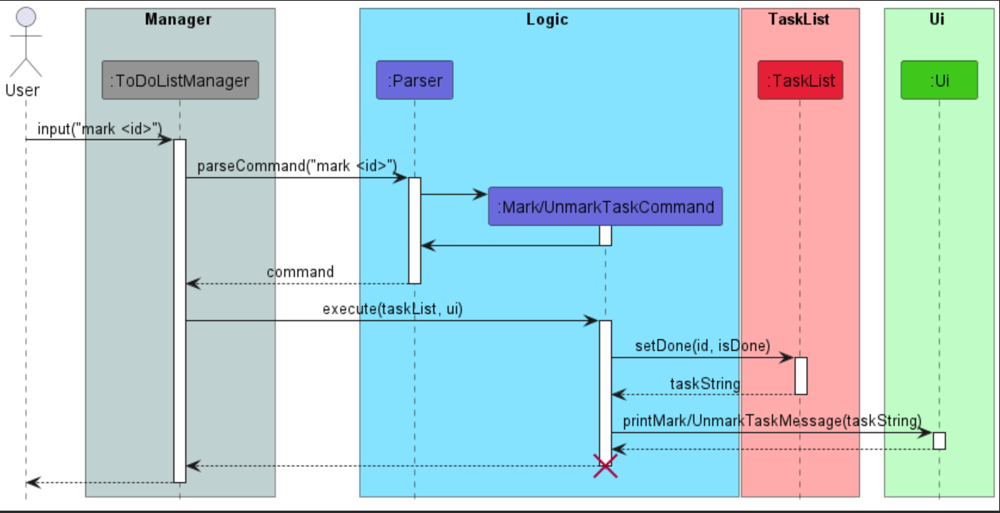

# Developer Guide

## Table of Contents

- [Developer Guide](#developer-guide)
  - [Acknowledgements](#acknowledgements)
  - [Setup](#setup)
    - [Setting up the project on your computer](#setting-up-the-project-on-your-computer)
  - [Design](#design)
  - [Implementation](#implementation)
    - [Delete task feature](#delete-task-feature)
    - [Edit task deadline feature](#edit-task-deadline-feature)
  - [Appendix: Requirements](#appendix--requirements)
    - [Product Scope](#product-scope)
    - [User Stories](#user-stories)
    - [Non-functional Requirements](#non-functional-requirements)
    - [Glossary](#glossary)
  - [Appendix: Instructions for manual testing](#instructions-for-manual-testing)

## Acknowledgements

Adapted from AddressBook Level 3 Developer Guide (https://se-education.org/addressbook-level3/DeveloperGuide.html)

## Setup

### Setting up the project on your computer

First, **fork** this repo, and **clone** the fork into your computer.

If you plan to use Intellij IDEA (highly recommended):
1. **Configure the JDK**: Follow the guide [_[se-edu/guides] IDEA: Configuring the JDK_](https://se-education.org/guides/tutorials/intellijJdk.html) to ensure Intellij is configured to use **JDK 11**.
1. **Import the project as a Gradle project**: Follow the guide [_[se-edu/guides] IDEA: Importing a Gradle project_](https://se-education.org/guides/tutorials/intellijImportGradleProject.html) to import the project into IDEA. 
   :exclamation: Note: Importing a Gradle project is slightly different from importing a normal Java project.
1. **Verify the setup**: Run `Main` and try a few commands.

## Design

{Describe the design of the product. Use UML diagrams and short code snippets where applicable.}

### Storage component

The Storage component can save the task list as TaskList objects in a .txt file format using Serialization and read it 
back into a TaskList object.

## Implementation

### Delete task feature

The DeleteTaskCommand extends NUS To-do List with a delete feature for the removal of tasks from the task list.
It is facilitated by ToDoListManager, Parser, exception, TaskList and Storage classes.
It implements the `TaskList#deleteTask()` operation.

Given below is an example usage scenario and how the DeleteTaskCommand mechanism behaves at each step.

Step 1: The user launches the program for the first time. The ToDoListManager will be initialised. This in turn will
then initialise the Parser, TaskList and Storage. Take it as there are no existing tasks read/stored by the program.

Step 2: The user executes `add survey -d 20/03/2023 23:59` command to add a task for the To-do List.
The add command calls `TaskList#addTask()`, which causes a new Task to be added to the existing TaskList.

Step 3: The user now then decides that adding this task was a mistake, and decides to remove the task from the
To-do List. The user does this by inputting the command `delete 1` into the terminal to delete a task in the task list.
The command will then call the `TaskList#deleteTask()`, which removes the task at index 1 of the TaskList.

The following sequence diagram shows how the delete task operation works:

Step 4: The user then decides to execute the command list. This command does not modify the TaskList.
Thus, the TaskList will return to its initial state where there are no tasks stored in the TaskList.

### Mark/unmark task feature

Step 1: The user launches the program for the first time. The ToDoListManager will be initialised. This in turn will
then initialise the Parser, TaskList and Storage. Take it as there are no existing tasks read/stored by the program.

Step 2: The user executes `add survey -d 20/03/2023 23:59` command to add a task for the To-do List.
The add command calls `TaskList#addTask()`, which causes a new Task to be added to the existing TaskList.

Step 3: The user wants to mark the task as completed by inputting the command `mark 1` into the terminal
to mark the task as done. The command will then call the `TaskList#setDone`, which marks the task at index 1
of the TaskList as done.

For the unmark command, the user can instead input the command `unmark 1` to set the task as incomplete.
The command also calls `TaskList#setDone` which sets the task at index 1 to be not done.

The following sequence diagram shows how the mark/unmark task operation works:

### Edit task deadline feature

The edit deadline function extends NUS To-do List with an edit feature for the deadlines assigned to tasks.
It is facilitated by the TaskList and Command classes. It implements the `TaskList#editDeadline()` operation,
which edits deadline of task at assigned index.

Given below is an example usage scenario and how the edit deadline mechanism will behave at each step.

Step 1. The user launches the application for the first time. There are no existing tasks read by the program.

Step 2. The user executes `add survey -d 20/03/2023 23:59` command to add a task to the To-do List.
The `add` command calls `TaskList#addTask()`, which causes a new Task to be added to the existing TaskList.

Step 3. The user has received an update about an extension to the deadline for the task, and decides to change
the deadline by executing the `edit 1 -d 25/03/2023 15:00` command. The `edit` will call `TaskList#EditDeadline()`,
which updates the value of deadline for the Task item saved at index 1 to the new updated deadline.

The following sequence diagram shows how the edit operations works:

### Storage feature

The storage feature is facilitated by the `Storage` class.

The Storage class implements the following operations:
* `Storage#saveData(TaskList)` --- Saves the current task list.
* `Storage#loadData()` --- Loads a task list from the previously saved file, if there is one.

Given below is an example usage scenario and how the Storage mechanism behaves at each step.

Step 1. The user launches the application (not for the first time). The program loads the previously saved task list 
data as there is a saved file `'./data.txt'` that Storage can find.

Step 2. The user executes `list` command. The `list` command calls `Ui#printTaskList()` which lists all tasks in the 
task list. `ToDoListManager` calls `storage#saveData()`, so the task list is saved into `'./data.txt'`.

Step 3. The user executes `add cg2023 assignment -d 18/12/2023` command. The `add` command calls `TaskList#addTask()`, 
which adds a new Task to the existing task list. `ToDoListManager` calls `storage#saveData()`, so the task list is saved
into `'./data.txt'`.

Step 4. The user executes `exit` command and exits the program. The `exit` command calls `Ui#printGoodByeMessage` to 
notify the user that (s)he is exiting the program. `ToDoListManager` calls `storage#saveData(taskList)`, so the task 
list is saved into `'./data.txt'` again before the program exits.

#### Design considerations:
* <b>Alternative 1</b>: Save task list as a self-formatted .txt file which can be printed and used as a physical task list.
    * Pros: Can get a physical task list to use.
    * Cons: Difficult to maintain as Storage class has to be updated whenever more fields are added to Task class. For
          example, if we add a "tag" field to Task, the formatting for the saved .txt file has to be updated to reflect
          that change.
* <b>Alternative 2</b>: Append rather than overwrite when saving the task list.
    * Pros: Will likely be able to save the task list much faster.
    * Cons: Difficult to implement, especially when considering the current mark task operation.
* <b>Alternative 3 (current choice)</b>: Save task list as a Serializable TaskList object in a .txt file. 

    * Pros: Easy to implement and easy to maintain as Storage class does not have to be updated whenever new fields are 
            added to Task class. Do not need to consider whether we use append or overwrite when saving task list as it is 
            irrelevant when using this implementation.
    * Cons: No physical task list to use as the saved .txt file is practically unreadable.

* <b>Main reasons for choosing Alternative 3: It is much easier to implement and maintain than the other 2 alternatives
and we found that the lack of a physical task list to use is not a very significant issue.</b>

### [Proposed] History feature

The proposed history feature is facilitated by the `Storage`, `TaskList` and `Command` classes. Internally, there will 
be 2 task lists stored - `completedTasks` and `uncompletedTasks`. There will be a rework to how marking tasks as done 
works, a removal of the operation `TaskList#setDone()` and a new command for users to input to the CLI: `history`.

There will be 2 new operations:
* `TaskList#markTask(index i)` - Moves the task at index i of `uncompletedTasks` to `completedTasks`.  
* `TaskList#unmarkTask(index i)` - Moves the task at index i of `completedTasks` to `uncompletedTasks`.

Given below is an example usage scenario and how the history mechanism works.

Step 1. The user launches the application for the first time. Both `completedTasks` and `uncompletedTasks` are empty.

Step 2. The user executes `add cg2023 assignment -d 18/12/2023` command to add a task that (s)he has to complete. The
`add` command causes the task to be added to `uncompletedTasks`.

Step 3. The user executes `mark` command to mark a task that (s)he has completed. The `mark` command causes the task to
be added to `completedTasks` and removed from `uncompletedTasks`.

Step 4. The user executes `list` command to see what tasks (s)he has still not completed. The `list` command causes the 
tasks in `uncompletedTasks` to be listed for the user to see.

Step 5. The user executes `history` command to see what tasks (s)he has already completed. The `history` command causes 
the tasks in `completedTasks` to be listed for the user to see.
 

## Appendix: Requirements

### Product scope

#### Target user profile

Forgetful NUS students who used to rely on LumiNUS’s deadline reminders.

#### Value proposition

With the transition to Canvas, the most important feature of LumiNUS’s deadline reminders is gone! Our project aims to 
bring an application to keep you aware of your deadlines and not miss them.

### User Stories

| Version | As a ... | I want to ...                                                                                                    | So that I can ...                                                         |
|---------|----------|------------------------------------------------------------------------------------------------------------------|---------------------------------------------------------------------------|
| v1.0    | user     | add tasks to my to-do list                                                                                       ||
| v1.0    | user     | add a time/deadline to a task                                                                                    | record when a task needs to be done                                       |
| v1.0    | user     | list all tasks by ascending date                                                                                 | view tasks that have an earlier deadline                                  |
| v1.0    | user     | remove tasks                                                                                                     | remove finished/wrong tasks                                               |
| v1.0    | user     | mark/unmark tasks                                                                                                | check off unfinished tasks                                                |
| v1.0    | user     | edit the time/deadline of existing tasks                                                                         | update tasks with changed deadlines (postponed/brought forward)           |
| v2.0    | student  | add tags/module codes to each task                                                                               | group related tasks together                                              |
| v2.0    | student  | set reminders at the start of the day                                                                            | do not forget what I have to achieve by the end of the day/week           |
| v2.0    | user     | list all the tasks in chronological order/grouped by module code/grouped by type of work (individual/group work) | have a “birds’ eye view” of all my tasks. (i.e different sorting methods) |
| v2.0    | user     | filter the tasks by their properties (description, deadline, tags, …)                                            | find them easily                                                          |
| v2.0    | user     | view the tasks in a calendar view                                                                                | view them in a summarised layout                                          |
| v2.0    | user     | add the email of the professor/TA in charge of the task                                                          | can email them to clarify if needed                                       |
| v2.0    | user     | attach a list of files/links to refer to                                                                         | know where the materials I can refer to are                               |
| v2.0    | user     | set a task to repeat                                                                                             | create 1 task to represent repeating tasks every week                     |
| v2.0    | user     | set priority level and can sort the tasks based on the priority level                                            | identify high priority tasks                                              |
| v2.0    | user     | see a progress bar                                                                                               | track my progress of unfinished tasks                                     |
| v2.0    | user     | view up to 10 previously completed tasks tied with the completion date and time                                  | track my progress of finished tasks                                       |

### Non-Functional Requirements

1. Should work on any mainstream OS assuming it has Java 11 or above installed.
2. A user with above average typing speed for regular English text (i.e. not code, not system admin commands) should be 
able to accomplish most of the tasks faster using commands than using the mouse.

### Glossary

* *glossary item* - Definition

## Instructions for manual testing

{Give instructions on how to do a manual product testing e.g., how to load sample data to be used for testing}
