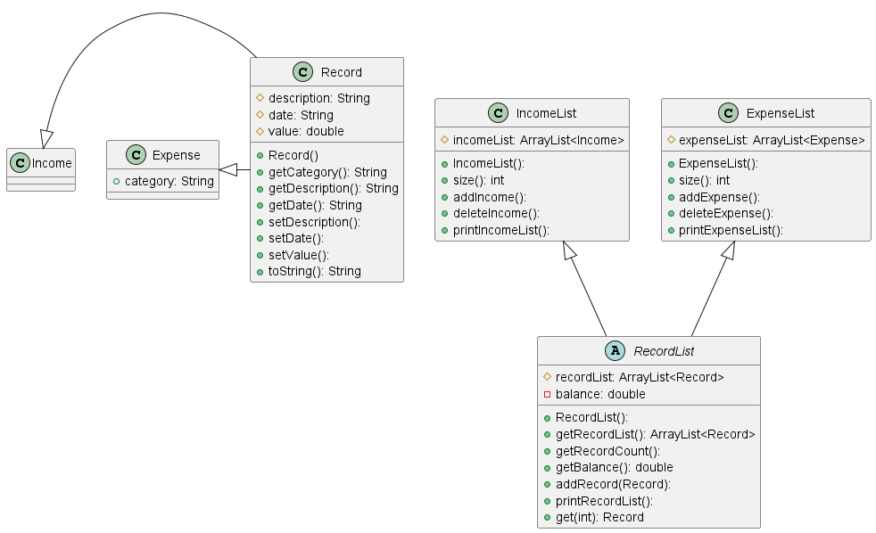
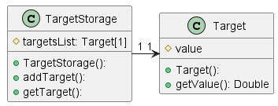

# Developer Guide

<!-- TOC -->

- [Developer Guide](#developer-guide)
  - [Acknowledgements](#acknowledgements)
  - [Design & implementation](#design-implementation)
  - [Implementation](#implementation)
    - [Record and RecordList](#record-and-recordlist)
    - [DeleteIncomeCommand](#deleteincomecommand)
    - [Target and TargetStorage](#target-and-targetstorage)
    - [[Proposed] EditIncomeCommand/EditExpenseCommand](#proposed-editincomecommandeditexpensecommand)
    - [AddIncomeCommand](#addincomecommand)
    - [ListExpenseCommand](#listexpensecommand)
    - [SetTargetCommand](#settargetcommand)
    - [SetCurrencyCommand](#setcurrencycommand)
  - [Product scope](#product-scope)
    - [Target user profile](#target-user-profile)
    - [Value proposition](#value-proposition)
  - [User Stories](#user-stories)
  - [Non-Functional Requirements](#non-functional-requirements)
  - [Glossary](#glossary)
  - [Instructions for manual testing](#instructions-for-manual-testing)
  <!-- TOC -->

## Acknowledgements

### ExchangeRateApi

The `LiveCurrencyApi` class uses the [ExchangeRateApi](https://www.exchangerate-api.com/) to retrieve the latest exchange rates.

## Design & implementation

{Describe the design and implementation of the product. Use UML diagrams and short code snippets where applicable.}

## Implementation

### Record and RecordList

The main class in our program is the `Record` and `RecordList` abstract classes, in which `Income`, `Expense` will inherit from `Record` and `IncomeList` and `ExpenseList` will inherit from `RecordList`. Most commands will act on instances of the `Income`, `Expense`,`IncomeList` and `ExpenseList` classes.

### DeleteIncomeCommand

The proposed DeleteIncomeCommand mechanism is facilitated by `System`, `Incomes`, `UI` and `ChChingException`.  
The command receives the instruction from `UI` and will call the `execute` method.  
If `index <= 0`, the command will throw a new ChChingException and print `"Zero/Negative index"`.  
If `index > incomes.size()`, the command will also throw a new ChChingException and print `"The number is too big"`  
Entering any of these optional lines will result in early termination of the command.  
Or else, the command will continue to delete the entry at the particular index.  
Afterwards, the `execute()` method will print `"Income deleted, here is the updated list:"` and prints the entries in the income list.

### Target and TargetStorage

The `Target` and `TargetStorage` class allows users to set a target for their ideal balance.

### [Proposed] EditIncomeCommand/EditExpenseCommand

The proposed edit income command is facilitated by `Parser`, `EditIncomeCommand`, `IncomeList`, while the proposed edit expense command is facilitated by `Parser`, `EditExpenseCommand` and `ExpenseList`.

Note that below highlights the implementation of the edit income command, with edit expense command following the same implementation.

Given below is how the edit income mechanism works at each step:

1. The user types in the command for edit income with the necessary arguments given to indicate which income record to edit and what fields to edit for the chosen income record.
2. The line inputted by the user will then be parsed by `Parser`, where it will check if the input contains a valid index with valid fields to edit. If they are valid, it will return `EditIncomeCommand`. Else it will throw a `ChChingException` indicating an error in the input from the user.
3. `EditIncomeCommand` will then perform its `execute` method, where for each field to be edited, it will call `editIncome` method from the `ExpenseList` class. This would then update the required income record accordingly.

The following sequence diagram shows how the edit income command works:
  

The edit expense command works in a similar way, with its sequence diagram as shown:
  

The following activity diagram summarises what happens when a user executes edit income command:
  
  Note that edit expense command produces the same activity diagram.

**Design Considerations**
 The following are the design alternatives we considered for edit income/expense command:

- **Alternative 1 (current choice):** Edit only the specific fields indicated in the input arguments.
  - Pros: Easier for the user to input an edit.
  - Cons: May introduce more bugs.
- **Alternative 2:** Edit to require user to rewrite all its fields.
  - Pros: Easier to implement.
  - Cons: Not any easier than having the user to just delete and add new expense/income.

### AddIncomeCommand

The AddIncomeCommand is facilitated by `Parser`, `AddIncomeCommand`, `IncomeList` and `Ui`.

1. The user inputs the command to add income. This input is handled by `parser` which if successful, returns the `AddIncomeCommand`.
2. `AddIncomeCommand` will call its `execute` method
   which calls the `IncomeList` method `addIncome` to add the input into `incomes`.
3. `execute` then calls the `Ui` method `showAdded` which makes use of `System`
   to print the `Income` added.

### ListExpenseCommand

The listExpenseCommand is facilitated by `Parser`, `ListExpenseCommand` and `ExpenseList`.

1. The user inputs the command to list expense. This input is handled by`Parser` which returns the
   `listExpenseCommand` if successful.
2. `ListExpenseCommand` will then call its `execute` method
   which makes use of `System` to print a new line `"Expenses:"`.
3. The `ExpenseList` method `printExpenseList`
   is called, which iterates through the expenseList, `expenses` and prints the index as well as a completed string of
   expenses in `expenses`.

### SetTargetCommand

The setTargetCommand is facilitated by `ChChing`, `Parser`, `TargetParser`, `TargetStorage`.
When the command receives to set target, the `parse()` method of the `Parser` object will read in the command and call the `parseTarget()` method from the TargetParser class
to instantiate a Target object and initializes a target value. Afterwards, `parse()` method calls the `AddTargetCommand` and instantiate a `SetTargetCommand` object and returns to the `Parser` object.
The `Parser` object then returns to `ChChing`. `ChChing` object then runs the `execute()` method of the SetTargetCommand object. The method then calls the `setTarget()` method of the `TargetStorage` object to store the previously initialized `Target` object.

### LiveCurrencyApi

`LiveCurrencyApi` class makes an API call to obtain the latest exchange rates from the [ExchangeRateApi](https://www.exchangerate-api.com/). The API call is made using the `HttpUrlConnection` class. The API key is used directly in the API call URL, and stored in the URL itself and not as a variable. The values response of the API call is then parse as a string, by formatting the string to obtain the exchange rates of the currencies and ignoring the other text. The currency name is then used as a key to see if it exist in the `selector` hashmap. If it does the exchange rate is added to the `converter` hashmap. The `converter` hashmap is then used to convert the currency of interest to SGD. If the API call somehow fails, there are hardcoded values in the `converter` hashmap that are outdated, but it allows the program to continue to run. The live currency rates are updated every time the user starts the program, however the API itself only updates the rates every 24 hours.

### SetCurrencyCommand

The setCurrencyCommand is facilitated by `System`, `Selector`, `UI`, `Parser` and `ExpenseList`.
The command receives the instruction from `UI` and will be parsed by the `parse()` method of the `Parser` object and `getCurrency()` method is called from the `Currency`
which returns the currency that the user wants to set. Then `SetCurrencyCommand` object is instantiated and returned and `execute()` is called.
The `execute()` method in setCurrencyCommand will then call the `containsCurrency(currency)` method from `Selector`.
If the method returns false, which indicates that the currency is not available, the command will throw a new ChChingException and print `"Currency not available"`.
If the method returns true, the command will continue to set the currency in the selector hashmap to true.
Afterwards, the `execute()` method will call the `printSelector()` method from `Selector`.
The `printSelector()` method will print all the available currencies in the selector hashmap.
The selected currencies will be marked with a `[X]` and the unselected currencies will be marked with a `[ ]`.

### UnsetCurrencyCommand

The unsetCurrencyCommand works in a similar way to the setCurrencyCommand.
The diagram below shows the sequence diagram for the unsetCurrencyCommand.

### Find

The FindCommand is facilitated by `System`, `UI`,`Parser`, `ExpenseList` and `IncomeList`.
The command receives instruction `UI` and the input will be parsed by `Parser` using `getType`,`getCategory`, `getDescription` and `getDate` to get the necessary search fields, before the `FindCommand` is instantiated by `Parser`.
The user can choose to search through incomes on description or date. The user can also choose to search through expenses on description, date or category.
The `execute()` method in `FindCommand` will check if the user is searching for income or expense, and ensure that at least one of the search fields are not empty.
By using a loop, the `execute()` method will then search through the `ExpenseList` or `IncomeList` and selected the expenses/incomes that matches the search fields.
The `execute()` method will then print out the selected expenses/incomes that matches the search fields using `showMatchedExpense()` or `showMatchedIncome()` method from `UI` to `System`

## Product scope

### Target user profile

Target users are people who are keen on improving their financial accountability

### Value proposition

The value proposition of ChChing is its ability to track income and expenses on a daily basis.

## User Stories

| Version | As a ...  | I want to ...                           | So that I can ...                                                                       |
| ------- | --------- | --------------------------------------- | --------------------------------------------------------------------------------------- |
| v1.0    | new user  | see usage instructions                  | refer to them when I forget how to use the application                                  |
| v1.0    | user      | add new expense to the records          | record all my expenses                                                                  |
| v1.0    | user      | add new income to the records           | record all my incomes                                                                   |
| v1.0    | user      | view all the records                    | refer to them when I forgot my expenses and incomes                                     |
| v1.0    | user      | edit the records                        | modify/fix if the records is changed/wrong                                              |
| v1.0    | user      | know current balance                    | aware how much money do I have left                                                     |
| v2.0    | user      | edit my existing entries                | rectify or update any entries without having to enter another entry and delete an entry |
| v2.0    | user      | find specific entries                   | refer to specific entries when necessary                                                |
| v2.0    | foreigner | view my entries in a different currency | read my incomes and expenses in a currency I am familiar with                           |
| v2.0    | user      | set a target for my balance             | improve my financial management                                                         |
| v2.0    | user      | see the target i have set               | remind myself of my target                                                              |
| v2.0    | user      | reset my income/expense lists or both   | have a fresh list                                                                       |

## Non-Functional Requirements

- Domain rules:

  - ChChing should not crash under normal circumstances.
  - Dates should be in the format of dd/mm/yyyy, it should be a valid date, and it should not be a future date.
  - Amount should be a positive number.
  - Only characters in the english keyboard should be used.

- Constraints:

  - Total Expense and Total Income should not exceed 2^31 - 1.
  - The '/' should not be used within any of the inputs, unless it is for specifying a category.

- Technical Requirements:

  - ChChing should be able to run on Windows, Mac, or Linux as long as it has Java 11 or above installed.

- Quality requirements:

  - ChChing should be usable to users of all skill and proficiency levels.

- Others:
  - Should user input additional arguments that are not within the scope of the command's input, ChChing would ignore them.
      e.g. category field would be ignored for command: `add income /c income /de salary /da 12-12-2022 /v 3.50`
  - Should the arguments be in the wrong order, ChChing would still be able to parse the arguments correctly.  However, should the command not be written first, ChChing would not be able to parse the command.
      e.g. `add income /de salary /c income /v 3.50 /da 12-12-2022` would successfully add an income entry.
      e.g. `/c income /de salary /da 12-12-2022 /v 3.50 add income` would return an error since command is not written first.

## Glossary

| Terminology | Definition                   |
| ----------- | ---------------------------- |
| Income      | Debit entry                  |
| Expense     | Credit entry                 |
| Balance     | Net Amount                   |
| Target      | Desired Net Amount           |
| Parser      | Class to take in inputs      |
| UI          | Class to interact with users |

## Instructions for manual testing

{Give instructions on how to do a manual product testing e.g., how to load sample data to be used for testing}

Given below are instructions to test the app manually.

### Launch and Shutdown

1. Initial launch
   1. Download the jar file and copy into an empty folder.
   2. Open a command prompt in the folder and run the command `java -jar tp.jar`. ChChing should start up.
2. Shutting down
   1. Type `exit` into the command prompt and press enter. ChChing should shut down and update the save file accordingly.

### Adding an income/expense

1. Adding an income/expense
   1. Test case:
        For income:`add income /de salary /da 12-12-2022 /v 350`
        For expense:`add expense /c meal /de food /da 13-12-2022 /v 3.50`
       Expected: The income/expense should be added to the income/expense list and the balance should be updated accordingly.
   2. Test case:
        For income: `add income /da 12-12-2022 /v 3.50`
        For expense: `add expense /de food /v 3.50`
       Expected: No income is added. Error details shown in the status message. 3. Other incorrect add income commands to try:
        no fields/missing fields - `add income` `add expense`.
        incorrect date format/invalid date/future date - `add income /de ang pao /da 30-02-2022 /v 10` `add expense /c transport /de bus fare /da 31-04-2029 /v 5.30`.
        negative value/zero value/1000000000 and above value/non-float value - `add income /de salary /da 12-12-2022 /v -3.50` `add expense /c transport /de bus fare /da 10-10-2019 /v 0`.
        Expected: Similar to previous.

### Editing an income/expense

1. Editing an income/expense
   1. Prerequisites: List already contains income/expense entry at specified index to be edited. Their index can be found using the `list` command. Note that index may vary after every `delete income`/`delete expense` command.
   2. Test case:
        For income: `edit income 1 /de bonus /da 12-12-2022 /v 350`
        For expense: `edit expense 1 /c meal /de food /da 13-12-2022 /v 3.50`
        Expected: The income/expense at index 1 should be edited with updated changes should be reflected in list and the balance should be updated accordingly.
   3. Test case:
        For income: `edit income /in 0 /de toto /da 12-12-2022 /v 100`
        For expense: `edit expense /in 0 /c meal /de food /da 13-12-2022 /v 3.50`
        Expected: income/expense will not be edited. Error details shown in the status message.
   4. Other incorrect delete commands to try:
        negative index/index over income/expense list size - `edit income /in -1 /de toto /da 12-12-2022 /v 100` `edit expense /in 100 /c drinks /de starbucks coffee /da 13-12-2022 /v 9.50`.
        missing index field/no fields to edit - `edit income` `edit expense`.
        incorrect date format/invalid date/future date - `edit income 1 /de ang pao /da 30-02-2022 /v 10` `edit expense 1 /c transport /de bus fare /da 31-04-2029 /v 5.30`.
        negative value/zero value/1000000000 and above value/non-float value - `edit income 1 /de salary /da 12-12-2022 /v -3.50` `edit expense 1 /c transport /de bus fare /da 10-10-2019 /v 0`.
        Expected: Similar to previous.

### Deleting an income/expense

1. Deleting an income/expense

   1. Prerequisites: List already contains income/expense entry at specified index to be deleted. Their index can be found using the `list` command. Note that index may vary after every `delete income`/`delete expense` command.
   2. Test case:
        For income: `delete income /in 1`
        For expense: `delete expense /in 1`
        Expected: The income/expense at index 1 should be deleted from the income/expense list and the balance should be updated accordingly.   Depending on the index of the deleted income/expense, the index of the other incomes/expenses after it will be updated accordingly.
   3. Test case:
        For income: `delete income /in 0`
        For expense: `delete expense /in 0`
        Expected: income/expense will not be deleted. Error details shown in the status message.
   4. Other incorrect delete commands to try:
        negative index/index over income/expense list size - `delete income /in -1` `delete expense /in 100`.
        missing index field - `delete income` `delete expense`.
        Expected: Similar to previous.

2. Clearing all incomes/expenses

   1. Prerequisites: List already contains income/expense entry/entries. Can be checked via `list income`/`list expense`/`list` command.
   2. Test case:
        For incomes: `clear income`
        For expenses: `clear expense`
        Expected: All incomes/expenses should be deleted from the income/expense list and the balance should be updated accordingly.

3. Clearing all incomes and expenses
   1. Prerequisites: List already contains income and/or expense entry/entries. Can be checked via `list income`/`list expense`/`list` command.
   2. Test case: `clear all`
        Expected: All incomes and expenses should be deleted from both the income and expense list and the balance should be updated to 0.

### Listing all income/expense & Viewing balance

1. List all incomes and/or expenses

   1. Prerequisites: Should there be a currency set, it will be shown based on the set currency. Otherwise, records will be displayed in SGD.
   2. Test case: should there be income/expense entries in the list
        For income: `list income`
        For expense: `list expense`
        For both: `list`
        Expected: All incomes and/or expenses should be listed. Note deleted incomes/expenses will not be shown.
   3. Test case: should there be no income/expense entries in the list
        For income: `list income`
        For expense: `list expense`
        For both: `list`
        Expected: No income/expense will be listed. Status message will indicate that the list is empty.

2. View balance
   1. Prerequisites: If the target has not been set by the user, it will be set to 0 by default. should there be no currency set, only SGD will be shown, else it will additionally show the set currency.
   2. Test case: `balance`
        Expected: The total expense, total income, current balance and current target will be shown. Should the current balance or equal to the current target, it will prompt a good job message, otherwise it will prompt a message that balance has not reached target.

### Finding income/expense

1. Finding income/expense
   1. Prerequisites: List already contains income/expense entry/entries. Can be checked via `list income`/`list expense`/`list` command.
   2. Test case:
        For income: `find /t income /de bonus`
        For expense: `find /t expense /c food /de sushi /da 03-03-2023 `
        Expected: All income with description containing "bonus" should be listed. All expense with category containing "food", description containing "sushi" and on date "03-03-2023" should be listed. Note deleted incomes/expenses will not be shown.
   3. Test case: Should there be no income/expense entries in the list
        For income: `find /t income /de bonus`
        For expense: `find /t expense /c food /de sushi /da 03-03-2023 `
        Expected: No income/expense will be listed. status message will indicate no matching record for these search terms.

### Setting target & Unsetting target

### Setting Currency & Unsetting Currency

1. Setting program to display currency of interest and not display unwanted currencies
   1. Prerequisites: List already contains income/expense entry/entries. Can be checked via `list income`/`list expense`/`list` command.
   2. Test case:
        For income: `set currency /cr HKD`
        For expense: `set currency /cr USD`
        Expected: All income/expense entries, balance and target will be displayed in the SGD as well as any set currencies.
   3. Test case: Program does not support the currency
        For income: `set currency /cr JPY`
        For expense: `set currency /cr EUR`
        Expected: Error message will be shown. No currency will be set.
