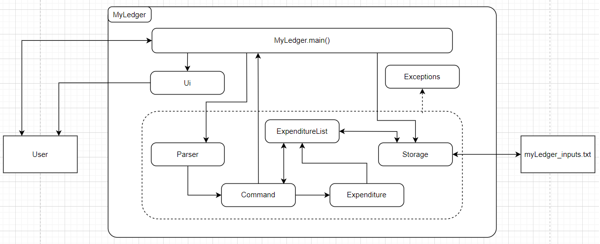
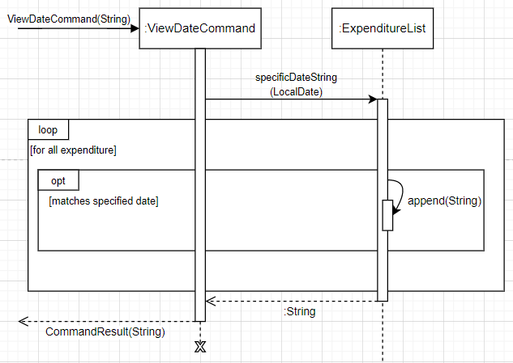

# MyLedger - Developer Guide

<p align="center">
    
</p>

- [1. Preface](#1-preface)
- [2. Acknowledgements](#2-acknowledgements)
- [3. Design & implementation](#3-design--implementation)
  * [3.1. Architecture](#31-architecture)
  * [3.2. Parser Component](#32-parser)
  * [3.3. Expenditures Component](#33-expenditure-categories)
  * [3.4 Command Component](#34-command-component)
  * [3.5. Storage Component](#35-storage)
  * [3.6. UI Component](#36-ui)
- [4. Command List](#4-command-list)
  * [4.1. Add a transaction](#adding-a-todo-todo)
  * [4.2. Edit a transaction](#adding-a-todo-todo)
  * [4.3. Delete a transaction](#adding-a-todo-todo)
  * [4.4. Find transactions](#adding-a-todo-todo)
  * [4.5. Duplicate a transaction](#adding-a-todo-todo)
  * [4.6. Sort transactions](#adding-a-todo-todo)
  * [4.7. View transactions](#adding-a-todo-todo)
  * [4.8. Set a budget](#adding-a-todo-todo)


## 1. Preface

MyLedger is a desktop app for managing finances, designed for university students studying locally or on exchange. It is optimized for use via a Command Line Interface (CLI). For students that can type fast, MyLedger can help them record and classify their transactions into categories. Students can expect to get an overview of their transactions at a glance,
which helps them to monitor their budget and expenses more effciently.

This developer guide provides a detailed view of the overall structure of MyLedger V2.0 and explains how its components and functions are implemented. Additionally, it outlines the specific parameters that were established before feature development began. The aim is to help developers gain a comprehensive understanding of the application's operation and how to maintain it without difficulty.

## 2. Acknowledgements

The format of this developer guide was adapted from SE-EDU AddressBook Level 3 Developer Guide. The class and sequence diagrams are styled using draw.io

## 3. Design & implementation

### 3.1. Architecture

<p align="center">
    
    <i>Figure 1: Architecture Diagram for MyLedger</i>
</p>

The Architecture Diagram shown above is a high-level components within MyLedger. The ```MyLedger``` class contains the main method which
is responsible for:

1. When MyLedger is launched, it will initialize the ```Storage``` to load the saved expenditures from the textfile and  ```Ui``` to print
   the welcome message.
2. When MyLedger is executing, it receives input for the user and sends it to ```Storage``` then ```Command``` which carries out the various
   commands. 
3. After the command has been carried out ```Command``` sends the result back to ```MyLedger.main()``` which would print the message back to the user.

The other components of MyLedger include:

* ```Ui```: The user interface that prints the welcome and help message.
* ```Parser```: Parser which process the user's command and calls the specific command.
* ```Command```: Executes the command given.
* ```Expenditure```: Constructs an expenditure and is added to ```ExpenditureList```.
* ```ExpenditureList```: An ArrayList of the current expenditures.
* ```Storage```: Uses ```MyLedger_inputs.txt``` to initialize ```ExpenditureList```, updates ```MyLedger_inputs.txt``` whenever ```ExpenditureList```
  changed.

### Main Components of MyLedger
`Parser:` Processes the inputs made by the user and converts into a sensible form for further processing.

`Commands:` Matches the input command with the respective commands created and executes the command result.

`Expenditure Type:` Expenditure information that allows the users to access their input data from the respective 
command classes.

`Storage:` Stores, reads and updates the user input into their hard disk.

The following section describes the implementation of certain features.

### 3.2. Parser
#### Processing an input
The main parser component `MainInputParser` is called whenever the user inputs a command line that requires action from 
the application. The command word will be read and further processed into further components depending on the type of 
command, such as `ParseAdd`, `ParseDelete`, `ParseIndividualValue` etc. 

How the parsing works: 

  `MainInputParser`:
- The `MainInputParser` is called and is expected to return an object with the `Command` class.
- The respective classes (eg `ParseAdd`, `ParseSort`) will be called.
- For commands that requires an additional input after the command work (excludes commands like `list`, `help` etc), the
  `ParseIndividualValue` class will be called to parse all the input fields by the user.

The following shows the UML diagram used for the parser component implemented in MyLedger.
To reduce complexity of the sequence diagram, only commands `exit`, `lend` and `borrow` 
will be displayed

<p align="center">
    
    <br/>
    <i>Figure 2: UML diagram for the parser component</i>
</p>

It must be noted that not all the existing parser commands are included in this sequence diagram for parsing, namely
the mark, unmark and edit commands. This is because they have a similar sequence diagram as the functions parseAdd and 
parseLendBorrow. The only difference is the condition, with the loop happening one, one and four time(s) respectively. 


### 3.3. Expenditure Categories
The **[API](https://github.com/AY2223S2-CS2113-T14-3/tp/blob/master/src/main/java/seedu/expenditure/Expenditure.java)** of this component is specified in the super abstract class `Expenditure.java` and its sub-classes. Its sub-classes represent the different expenditure categories. When users create a new expenditure record, one of these different expenditure categories are instantiated. After which, the expenditure is added to the expenditure list.

The **[API](https://github.com/AY2223S2-CS2113-T14-3/tp/blob/master/src/main/java/seedu/expenditure/ExpenditureList.java)** of the expenditure list is specified in the `ExpenditureList.java` class.

The `ExpenditureList` class description is as follows:
- A representation of a list of expenditures. It is an `ArrayList<Expenditure>` container
- The list is instantiated at the start of the program and stores expenditures of type `Expenditure`.

As for the expenditure types, their fields are as shown below.

`Expenditure`:
- Fields: `date`, `amount`, `description`

`AcademicExpenditure`**`: 
- Fields: `date`, `amount`, `description`

`AccommodationExpenditure`:
- Fields: `date`, `amount`, `description`, `isPaid`

`BorrowExpenditure`:
- Fields: `date`, `borrowerName`, `amount`, `deadline`, `description`

`EntertainmentExpenditure`:
- Fields: `date`, `amount`, `description`

`FoodExpenditure`: 
- Fields: `date`, `amount`, `description`

`LendExpenditure`:
- Fields: `date`, `borrowerName`, `amount`, `deadline`, `description`

`OtherExpenditure`:
- Fields: `date`, `amount`, `description`

`TransportExpenditure`:
- Fields: `date`, `amount`, `description`

`TuitionExpenditure`:
- Fields: `date`, `amount`, `description`, `isPaid`

The following shows the UML diagram used for the Expenditure Categories component implemented in MyLedger.

<p align="center">
    
    <br/>
    <i>Figure 3: UML diagram for the Expenditure Categories component</i>
</p>

In the diagram, the aforementioned expenditure categories inherit from the `Expenditure` class. The `ExpenditureList` class is a composition of expenditures of `Expenditure` type. 

`Expenditure` has a multiplicity of `*` to `ExpenditureList` as an empty expenditure list is instantiated at the beginning of the program, and any number of expenditures can be added to the expenditure list. Thus, it is also observed that the `ExpenditureList` class is an *composition* of `Expenditure`.

### 3.4. Command Component

The `Command` component is represented by the `command` package. The `command` package contains all the available user commands supported by the application. These commands are utilised by the user to interact with the expenditure types and the expenditure list. 

The `AcademicExpenditureCommand`, `AccommodationExpenditureCommand`, `BorrowExpenditureCommand`, `EntertainmentExpenditureCommand`, `FoodExpenditureCommand`, `LendExpenditureCommand`, `OtherExpenditureCommand`, `TransportExpenditureCommand`, `TuitionExpenditureCommand` commands contain the operations pertaining to adding a new expenditure into the list of expenditures.

The `CheckBudgetCommand` class class contains the operations pertaining to comparing the total expenditure amount with a budget set by the user. The budget is set with the `SetBudgetCommand`.

The `DeleteCommand` class contains the operations pertaining to deleting a specific expenditure from the list of expenditures.

The `DuplicateCommand` class contains the operations pertaining to duplicating a specific expenditure from the list of expenditures.

The `EditCommand` class contains the operations pertaining to editing a expenditure from the list of expenditures.

The `ExitCommand` class contains the operation that safely closes the application.

The `FindCommand`class contains the operations pertaining to searching the list of expenditures for expenditures that match the keyword entered by the user.

The `HelpCommand` class contains the operation pertaining to providing the user a user interface to the instructions on the use of the application.

The `InvalidCommand` class is instantiated when an unrecognised command is entered by the user.

The `SetBudgetCommand` class contains the operations in setting an amount of money users would like to budget.

The `SortCommand` class contains the operations pertaining to sorting the list of expenditures by amount or by date.

The `ViewDateExpenditureCommand` and `ViewTypeExpenditureCommand` classes contain the operations pertaining to displaying a filtered expenditure list by the expenditure date and type respectively.

Below shows the UML diagram representing the `command` package.
<p align="center">
    
    <br/>
    <i>Figure 4: UML diagram for the command package</i>
</p>

A more detailed coverage is explored in [Command List](#4-command-list).

### 3.5. Storage
The class `TxtFileStatus` and `ExpenditureList` are involved in storing the expenditure list.
After every user input is completed, saveExpenditureList is called, and the text file will be
updated with all the current expenditures in the expenditure array list.

<p align="center">
    
    <br/>
    <i>Figure 5: Sequence diagram for TxtFileStatus</i>
</p>

The following sequence diagram shows the details of the process for saveExpenditureList.

Likewise when MyLedger first runs, it instantiates ExpenditureList and stores a reference to it.
MyLedger then checks if the text file exists, else it gets created. Recorded expenditure stored 
as a string in the text file is then added to the array list in ExpenditureList by iterating through
the strings in the text file, instantiating an expenditure using the string received, and adding
the expenditure into the array list.

<p align="center">
    
    <br/>
    <i>Figure 6: Sequence diagram for the process of saveExpenditureList</i>
</p>

### 3.6. UI 

## 4. Command List

### 4.1. Add Expenditure Command 

The `AcademicExpenditureCommand`, `AccommodationExpenditureCommand`, `EntertainmentExpenditureCommand`, `FoodExpenditureCommand`, `OtherExpenditureCommand`, `TransportExpenditureCommand`, `TuitionExpenditureCommand` commands contain the operations to add an expenditure of a fixed category into the list of expenditures. As these expenditure types take in the same fields, the `BorrowExpenditureCommand` and `LendExpenditureCommand` have been isolated from these commands. 

This is due to the fact that the 7 formerly stated commands all take in the same fields, and hence can be parsed in a similar fashion to instantiate the **Expenditure Command**, and later the **Expenditure** itself. In other words, the 7 stated commands are instantiated in the same way and will be explained altogether in this section.

To instantiate the commands, the full commands are the following: 
`AcademicExpenditureCommand`: `academic d/<date> a/<amount> s/<description>`
- To create an academic expenditure.

`AccommodationExpenditureCommand`: `accommodation d/<date> a/<amount> s/<description>`
- To create an accommodation expenditure.

`EntertainmentExpenditureCommand`: `entertainment d/<date> a/<amount> s/<description>`
- To create an entertainment expenditure.

`FoodExpenditureCommand`: `food d/<date> a/<amount> s/<description>`
- To create a food expenditure.

`OtherExpenditureCommand`: `other d/<date> a/<amount> s/<description>`
- To create an expenditure with a category of "other".

`TransportExpenditureCommand`: `transport d/<date> a/<amount> s/<description>`
- To create a transport expenditure.

`TuitionExpenditureCommand`: `tuition d/<date> a/<amount> s/<description>`
- To create a tuition expenditure.

When the user inputs one of the 7 expenditure commands into the application, the `MainInputParser.java` takes in the input and determines the command's operations via switch statements. Next, the `ParseIndividualValue.java` class contains the operation to split the valid input given by the user. This splits the inputs into fields to instantiate the **Expenditure Commands**. In this instance, the 7 stated commands will be referred to `ExpenditureCommand`. After splitting, `MainInputParser.java` calls operations from `ParseAdd.java`. `ParseAdd.java` prepares the split inputs for the `ExpenditureCommand` as fields, and instantiates one of its seven commands based on the user's specified expenditure category. 

Below shows the sequence diagram for the aforementioned logic:

<p align="center">
    
    <br />
    <i>Figure 7: Sequence Diagram for edit Command</i>
</p>

To instantiate the commands, the full commands for `lend` and `borrow` are the following:

- To create a lend expenditure.
``` 
lend d/2023-04-07 n/Mr Bean a/400 b/2023-07-01 s/Flight ticket 
```
- To create a borrow expenditure.
```
borrow d/2023-04-07 n/Teddy a/400 b/2023-07-01 s/Flight ticket
```

The sequence diagram for lend and borrow has been previously shown as an example for the `Parser` class.

### 4.2. Edit Command

The ```EditCommand``` edits an existing expenditure in the record.

It cannot change the expenditure type of a record, only its fields

For editing an expenditure, the full command is  ```edit INDEX d/DATE a/AMOUNT s/DESCRIPTION```

For editing a borrow/lend record, the full command is  ```edit INDEX d/DATE n/(LEND/BORROW)_NAME a/AMOUNT b/DEADLINE s/DESCRIPTION```
       
The sequence diagram below shows the interactions of a successful execution of the EditCommand

<p align="center">
    
    <br />
    <i>Figure 7: Sequence Diagram for edit Command</i>
</p>

### 4.3. Delete Command

### 4.4. Find Command

### 4.5. Duplicate Command

### 4.6. Sort Command

### 4.7. View Command

The view command filters and lists the expenditures of a specified date or type.
At the end of the list, the total amount of the filtered expenditures are tabulated.
For viewing expenditures of specific date, the command is ```viewdate DATE```.
For viewing expenditures of specific type, the command is ```viewtype EXPENDITURE_TYPE```.

The sequence diagram below shows the details of the process for viewdate.

<p align="center">
    
    <br />
    <i>Figure 8: Sequence Diagram of the process for viewdate</i>
</p>

The process for viewtype is similar as viewdate with an additional step within ViewTypeExpenditureCommand
that converts the input string into a string recognisable for comparison in the opt block. 

### 4.8. Set Budget Command

## Product scope
### Target user profile

- University students studying locally or on exchange 
- has a need to monitor their budget and expenses
- prefer desktop CLI over other available types of expense tracking applications 
- prefers typing to mouse interactions

### Value proposition

Manage finances more efficiently than a typical mouse/GUI driven app

## User Stories

| Version | As a ...        | I want to ...                        | So that I can ...                                    |
|---------|-----------------|--------------------------------------|------------------------------------------------------|
| v1.0    | first time user | have access to a help page           | be familarized with the features available           |
| v1.0    | user            | add a expenditure recorded in a day  |                                                      |
| v1.0    | user            | delete an expenditure record         | get rid of expenditure that I no longer plan to use  |
| v1.0    | user            | edit an expenditure record           | correct previous expenditure records                 |
| v1.0    | user            | view all current expenses            | have a good overview of my spending to date          |
| v1.0    | user            | add a record for borrowing money     | keep track of how much money I borrowed to someone   |
| v1.0    | user            | add a record for lending money       | keep track of how much money I lent to someone       |
| v2.0    | user            | sort expenditures based on date      | better manage my expenditures                        |
| v2.0    | user            | sort expenditures based on amount    | better manage my expenditures                        |
| v2.0    | user            | add income earned                    | keep track of my current budget                      |
| v2.0    | user            | find expenditures using description  | better manage my spending                            |
| v2.0    | user            | duplicate a current expenditure      | update repeated purchases easily                     |
| v2.0    | user            | indicate a specific budget to follow | track my spending and make sure I stay within budget |
| v2.0    | user            | be able to view expenses by day      | see which day and why I am overspending              |
| v2.0    | user            | view my total expenses by categories | see which categories I am overspending on            |

## Non-Functional Requirements

{Give non-functional requirements}

## Glossary

* *glossary item* - Definition

## Instructions for manual testing

The following are instructions for testers to manual test:

### Launch and shutdown
#### Initial Launch
- Ensure that Java 11 is installed on your device.
- Download the JAR file and copy into an empty folder
- Open the command terminal on your device.
- Navigate to the folder in command terminal and run the command `java -jar [filename].jar`
- Alternatively, double click on the JAR file to run the app.
#### Adding a record
1. Adding an expenditure
- Test case : `academic d/2023-02-02 a/25.10 s/NUS`
- Expected : `Added academic expenditure: [Academic] || Date: 2 Feb 2023 || Value: 25.1 || Description: NUS`
<br /> An expenditure of type : `academic` will be added if all inputs are added in the correct format. 
<br /> Otherwise, error messages will be printed.


- Test case : `food d/2023-03-03 a/5.30 s/Fish Soup`
- Expected : `Added food expenditure: [Food] || Date: 3 Mar 2023 || Value: 5.3 || Description: Fish Soup`
<br /> An expenditure of type `food` will be added


- Test case : `transport d/13-03-2023 a/2 s/Bus`
- Expected : A status message highlighting the wrong format for date will be indicated. No expenditure will
be added. 


- Test case : `transport d/2023-03-13 a/two dollars s/Bus`
- Expected : Similar to previous, but with a different invalid message.

2. Adding a lend/borrow spending
- Test case : `lend d/2023-02-02 n/Bob a/25.10 b/2023-04-02 s/CS2113`
- Expected : `Added lend expenditure: [Lend] || Lent to: Bob || Date: 2 Feb 2023 || Value: 25.1 || 
Description: CS2113 || by: 2 Apr 2023`
<br /> Similar to add an expenditure, adding a lend/borrow will add the expenditure to the list. 
Details of all parameters will be shown to the user.


- Test case : `borrow d/2023-02-02 n/Mandy a/25.10 b/2023-04-02 s/payment for notes`
- Expected : `Added borrow expenditure: [Borrow] || Borrowed from: Mandy || Date: 2 Feb 2023 || Value: 25.1 
|| Description: payment for notes || By: 2 Apr 2023`
<br /> Similar to previous, but with a different expenditure type : `borrow`.

#### Deleting an expenditure
1. Deleting an expenditure from the list of inputs.
- Prerequisite: There should be at least one expenditure in the list for `delete` to work. The list can be checked
using the `list` command


- Test case : `delete 1`
- Expected : Message showing that input has been removed will be displayed. First expenditure will be removed from
the list.


- Test case : `delete -1`
- Expected : Message showing that input index is out of bounds or negative will be displayed. No expenditure will
be deleted.


- Test case : `delete 1.1`
- Expected : Error message will be shown, and no expenditure will be removed from the list.

#### Editing an expenditure
1. Editing a current expenditure within the list of inputs.
- Prerequisite : Similar to delete, an existing expenditure is required. 


- Assumption : Test cases provided are for expenditures with the corresponding parameters. Parameters for normal 
expenditures cannot to edit lend/borrow expenditures


- Test case : `edit 1 d/2023-02-12 a/8.00 s/Fast Food` 
- Expected : Assuming this test case is for a normal expenditure, all the previous parameters will be replaced with
the new input parameters. An edit message will be shown as well.


- Test case : `edit 2 d/2020-02-02 n/Carl a/22.2 b/2020-03-03 s/fishing`
- Expected : Assuming this test case is for a lend/borrow expenditure, all the previous parameters will be 
replaced with the new input parameters. An edit message will be shown as well.


- Test case : `edit 2 d/2020-02-02 n/Carl a/22.2 b/2020-03-03 s/fishing` on normal expenditures
- Expected : As the input parameters are different, an invalid message will be returned. Expenditure
will not be edited.


- Test case : `edit 2` 
- Expected : Invalid message prompting missing inputs will be shown. Expenditures will not be edited. 


- Other invalid `edit` commands: eg. `edit -1 d/2020-02-02 n/Carl a/22.2 b/2020-03-03 s/fishing`
- Expected : Invalid message similar to previous invalid cases will be provided.

#### Duplicate an expenditure
1. Duplicating an expenditure from the list of inputs.
- Prerequisite: There should be at least one expenditure in the list for `duplicate` to work. The list can be checked
  using the `list` command


- Test case : `duplicate 1`
- Expected : The duplicate expenditure will be shown to the user, and will be added to the last index in the list.


- Test case : `duplicate 1.2`
- Expected : Invalid message will be shown, indicating that the index indicated is not in the correct number format.


- Other invalid `duplicate` commands: eg. `duplicate`
- Expected : Similar to previous, an invalid message with the error will be displayed for the user.

#### Sorting the list
- Prerequisite : A list with more than 2 expenditures are saved, which can be checked with the `list` command

1. Sort amount in ascending order
- Test case : `sort ascend`
- Expected : The new list will be shown, where the items are sorted by ascending amount with the smallest 
amount at index 1

2. Sort amount in descending order
- Test case : `sort descend`
- Expected : In contrast to previous test case, item will be sorted in descending order with largest amount
at index 1

3. Sort amount from earliest date added
- Test case : `sort earliest`
- Expected : New list with the earliest date at index 1 

4. Sort amount from latest date added
- Test case : `sort latest`
- Expected : In contrast to previous test case, new list with the latest date at index 1

#### Set budget
1. Setting a temporary budget that the user might be on
- Test case : `set 1.0`
- Expected : A message will indicate that a new budget has been set. 


- Test case : `set -12.2`
- Expected : A message stating that the budget set is of a negative value will be returned. Input budget will not
be stored.


- Other invalid `set` commands: eg. `set 3-3`
- Expected : Similar to previous, an invalid message with the error will be displayed for the user.

#### Check budget
1. Checking the amount of spending and the intended budget.
- Prerequisite :  A budget must be set prior to calling `check` and the budget set cannot be of value 0.


- Test case : `check` where budget is more than total expenditures in list.
- Expected : The amount of money away from the set budget will be displayed with other information such as 
the total spending, budget and borrowed money.


- Test case : `check` where budget is less than total expenditures in list.
- Expected : Similar to previous test case, amount of money exceeded by and other information will be 
displayed in the message.

#### Find keyword
1. Finding keywords under the descriptions column in their list of expenditures

- Test case : `find bus`
- Prerequisite : There are existing expenditures with the description : `bus`
- Expected : List of items corresponding to the keyword will be displayed. 


- Test case : `find taxi`
- Prerequisite : There are no existing expenditures with the description : `taxi`
- Expected : Message showing that no matching records are found in the list.

2. View specific date expenditures under the date column

- Test case : `viewdate 2023-02-20`
- Prerequisite : There are current expenditures dated 20 Feb 2023.
- Expected : List of all expenditures with the corresponding date value, as well as the total amount spent
on that specific date


- Test case : `viewdate 2023-02-20`
- Prerequisite : There are no current expenditures dated 20 Feb 2023.
- Expected : Similar to previous, but there will not be any items shown in the list. The total amount will
be shown as 0.


- Test case : `viewdate 12 Jan 2021`
- Expected : Invalid message will be shown with the respective error message, in this case being a 
date time error.

- Other invalid `viewdate` commands: eg. `viewdate`
- Expected : Similar to previous, an invalid message with the error will be displayed for the user.

3. View specific type of expenditure under the expenditure column

- Test case : `viewtype transport`
- Prerequisite : There are current expenditures with the `transport` type.
- Expected : List of all expenditures under transport expenditure, as well as the total amount spent
  for that type of expenditure


- Test case : `viewtype transport`
- Prerequisite : There are no current expenditures with the `transport` type.
- Expected : Similar to previous, but there will not be any items shown in the list. The total amount will
  be shown as 0.


- Test case : `viewtype swimming`
- Expected : Invalid message will be shown with the respective error message, in this case an
invalid expenditure.