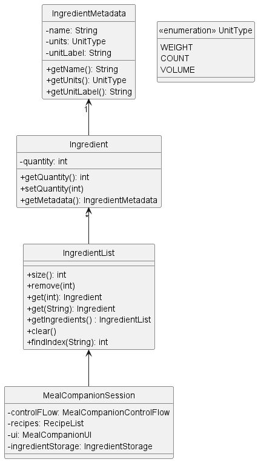

# Developer Guide
Welcome to the Meal Companion Developer Guide! Thank you for taking an interest in the behind-the-scenes working of our product, and we hope this document proves informative and useful for your work.

## Table of Contents
1. [Acknowledgements](#acknowledgements)
2. [Design & Implementation](#design--implementation)
    1. [Ingredient Class](#Ingredient-Class)
       1. [Add and Remove Command](#add-and-remove-command)
3. [Product Scope](#product-scope)
    1. [Target User Profile](#target-user-profile)
    2. [Value Proposition](#value-proposition)
4. [User Stories](#user-stories)
    1. [v1.0](#v10)
    2. [v2.0](#v20)
5. [Non-Functional Requirements](#non-functional-requirements)
6. [Glossary](#glossary)
7. [Instructions for Manual Testing](#instructions-for-manual-testing)

## Acknowledgements

{list here sources of all reused/adapted ideas, code, documentation, and third-party libraries -- include links to the original source as well}

###### [Back to table of contents](#table-of-contents)

## Design & Implementation

## Ingredient Class

Below shows the class diagram of how ingredients are being stored in our program

The current `MealCompanionSession` would keep track of the `IngredientList` which is an ArrayList of `Ingredient` objects. Each `Ingredient` object has a name and its associated quantity. This association would allow us to perform the adding and removal of ingredients by the user.

### Add and Remove Command

The add and remove command is facilitated by the methods in `IngredientList` and `Ingredient`. Given below is an example usage scenario and how the add and remove command behaves.

Step 1. The user inputs his command eg. `add egg /qty 5`, the name of the ingredient 'egg' would be crosschecked with our database of known ingredients

Step 2. Since 'egg' is a known ingredient in our database, `IngredientList` would be called to check if egg is already stored inside the list

Step 3. Suppose egg is not currently stored in `IngredientList`, a new `Ingredient` object would be created with the quantity, 5, and name, egg, specified by the user and added to `IngredientList` with the `add()` method.

Step 4. Now the user decides to remove 2 eggs and inputs his command eg. `remove egg /qty 2`, the `IngredientList` would be searched through to see if egg is in the list

Step 5. Since egg is in the list, its corresponding index in the list would be generated. 

Step 6. The current quantity of egg in the list would be obtained by calling `getQuantity()` and checked to see if it is greater or equals to '2' the quantity input by the user

Step 7. Since the quantity input by the user is smaller than the current quantity of egg, which is 3, in the `IngredientList`, the new quantity would be calculated to be 3 and updated by calling `setQuantity(3)` 

{Describe the design and implementation of the product. Use UML diagrams and short code snippets where applicable.}

###### [Back to table of contents](#table-of-contents)

## Product scope
### Target user profile
Our target user profile is the average School of Computing student that resides on campus, regardless of Residential College (RC), Halls, Residences or Houses. There is a focus on those who regularly cook in their hostels or would like to pick up cooking.

### Value proposition
Our product targets students who would like to save money on buying or ordering food, and also to save time by preparing their meals beforehand so they can eat immediately after a class without having to queue for food or look for a seat in a crowded canteen on campus. Aside from RCs, hostels on campus do not provide meal plans, so our product addresses this by helping users pick up cooking and manage the ingredients they have in their hostel refrigerators. Even within RCs, the meal plans do not cover lunch, meaning students need to source their own lunch, which is a problem that our product also aims to alleviate.

###### [Back to table of contents](#table-of-contents)

## User Stories

### v1.0

| As a ... | I want to ... | So that ... |
| -------- | ------------- | ----------- |
| User | see the list of items in the fridge | I can know what is/is not in my fridge |
| User | add an item of a specified quantity | I can put new items into my fridge |
| User | remove an item of a specified quantity | I can know which items I have already used |
| User | find recipes I can make with my current ingredients | I can cook without having to go shopping |
| User | see the list of recipes available | I can know which recipes are registered within the app |
| User | have a default list of recipes initialized at the start | I can at least prepare some default dishes without knowing any recipes |
| New User | immediately see how to interact with the app | I can begin using the app without needing to refer to external help |
| User with a new device | transfer the saved customized data to a new computer | I can use Meal Companion on a different computer without having to re-enter all the information |

### v2.0

| As a ... | I want to ... | So that ... |
| -------- | ------------- | ----------- |
| User with allergies | add my allergens to the app | I can avoid ingredients that I am allergic to |
| User with allergies | block recipes that include allergens | I can avoid a medical emergency because of not realizing the recipe included allergens |
| User | add recipes to a favourite section | I can easily see recipes that I like |
| User who wants to lose weight | see the calorie count of the recipes | I can keep track of my caloric intake |
| User who gets bored of the same recipe | randomly select a recipe | I can try new recipes from the list of existing recipes |
| User returning after a long period of not using the app | quickly clear all ingredients from the saved list | I can return to using the app without having to individually delete items that I no longer have |

###### [Back to table of contents](#table-of-contents)

## Non-Functional Requirements

{Give non-functional requirements}

###### [Back to table of contents](#table-of-contents)

## Glossary

* *glossary item* - Definition

###### [Back to table of contents](#table-of-contents)

## Instructions for manual testing

{Give instructions on how to do a manual product testing e.g., how to load sample data to be used for testing}

###### [Back to the top](#developer-guide)
