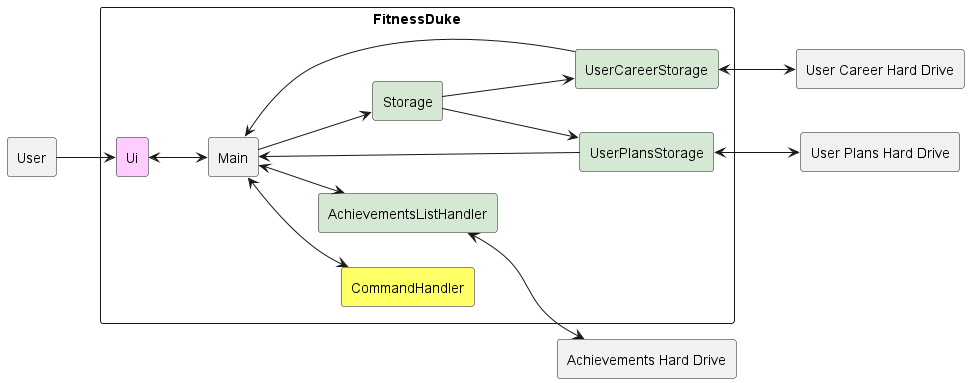
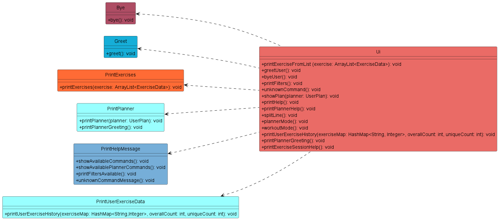
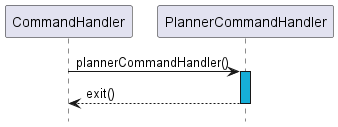

* Table of Contents
{:toc}

# Developer Guide

## Acknowledgements

* The CS2113 Team (Professor and Teaching Assistants) For their guidance in teaching us concepts of Software
  Engineering and OOP
* [AddressBook3](https://github.com/se-edu/addressbook-level3) Guidance and examples for OOP and project aspects were 
  used from this repository.

* Exercise Data retrieved from: [Wrkout](https://github.com/wrkout/exercises.json) (open source MIT license)
  Used to generate the data.json file containing all the exercises data used

## Design & implementation

### Architecture Component

<div align="center">

<p>
Figure 1.1
</p>
</div>

The architecture diagram as shown in Figure 1.1 shows us the high level design of Fitness Duke.

**Main Components**

The architecture comprises five main components.
* ```main```: Responsible for the initialisation of user data, app data and connection of various components together
* ```Ui```: The User Interface of the app
* ```CommandHandler```: The main logic controller of the app
* ```Storage```: Reading and Writing data to and from the hard disk

```Hard Drive``` represents the files in which user data are stored

**Interaction of components**

<div align="center">

<p>
Figure 1.2
</p>
</div>

The sequence diagram as shown in Figure 1.2 shows the interaction of all the main components when a user enters the 
```start``` command and subsequently enters the ```finish``` command to simulate the process of a workout session 
experienced by the user.

The five main components in the diagram shows the main classes participating in the process.

These classes will be defined into its own API as an ```interface``` in the upcoming iteration

More details on these components will be described below.

### UI Component

Represented by the Ui class, it handles the interactions between the user and the program. In addition, it also displays
a basic overview of what the program does.

Types of pre-defined messages:

1. Information messages that describe the functionalities of the program (`Greet` , `Bye`, `PrintExercises` classes)
2. Help messages that details the usage of the possible commands available in the program (`PrintHelpMessage` class)
3. Error messages that trigger when a user's input is incorrect and provides an explanation to the
   user. (`ErrorMessages` class)

The class diagram as shown in Figure *1.3* illustrates the structure of the different classes in Ui.

<div align="center">

<p>
Figure 1.3
</p>
</div>

### Storage Component

API: ```Storagejava```

The *Storage* component handles the reading and writing of user data to and from the local hard disk in the form of
a json file.

Key Aspects:

* Handles the serialization and deserialization of user data into a json file using
  the [Gson Library](https://github.com/google/gson)
* Handles the creation of user data file when previous one is missing or corrupted
* Handles the loading of user data and plans upon start of the program

The class diagram as shown in *Figure 1.4* illustrates the structure of the different classes in Storage.
<div align="center">

<p>
Figure 1.4
</p>
</div>

The Storage API interacts with the other classes as shown in the *Sequence Diagram*
where it shows how the Storage API loads the local user data json file as well as the user plans json file upon the 
resumption of the program.
<div align="center">

<p>
Figure 1.5
</p>
</div>

### Command Handler Component

The command handler component consists of multiple states that the program can be at any time. 
It controls where the user input is being processed.

#### Key Aspects: 

* Handles when there is an exercise ongoing, giving access to finishing and hence saving finished exercises, and keeping track of what exercises there are.
* Handles when there is no exercise ongoing, granting access to generating new exercises with different confines.

<div align="center">

<p>
Figure 1.6
</p>
</div>

### ExerciseSessionCommandHandler
The exercise Command Handler is engaged when the user has an ongoing workout.
Upon completion of the workout, the user can save their workout if completed, such
that the completed workout is logged and will be saved for future reference.

To manage this exists the ```ExerciseStateHandler```, which allows for saving, starting
ending, cancelling workouts.
<div align="center">

<p>
Figure 1.7
</p>
</div>

### PlannerCommandHandler
The planner Command Handler is engaged when the user enters the workout planner.
By implementing a separate Command Handler dedicated for the planning of work-outs, 
this simplifies the user experience by compartmentalising the secondary planner function,
and ensures that users will not be bombarded by a long list of commands in the help menu.

To manage this exists the ```PlannerCommandHandler```, which allows for adding, deleting, 
and viewing the workout plans.

<p>

<div align="center">

<p>
Figure X.X
</p>
</div>

<p>

<div align="center">

<p>
Figure X.X
</p>
</div>

### Exceptions

Accounts for the different scenarios that may trigger an error during user's interactions with the program

#### Error Message Handling
Enumeration: [```ErrorMessages.java```]
All error messages are stored in the ErrorMessage enumeration for easy access across different classes that could run into similar exceptions.

<div align="center">
<p>
Figure 1.8
</p>
</div>


### Additional features to be added

1. A workout planner for the user to add and customise their desired sequence or schedule of workouts.
2. An achievement list that will output messages to congratulate the user based on the different milestones of exercises he/she has achieved when using the program.

## Product scope

### Target user profile

Fitness Duke targets individuals who are looking for a smarter way to keep fit, as well as adding a greater diversity
to their workout routines.

### Value proposition

With the recent emphasis of healthy lifestyles in Singapore, the Singapore Government has initiated the Healthier SG
initiative
[Healthier SG](https://www.healthiersg.gov.sg/). To encourage more fitness activities to be carried out by Singaporeans
as a form of preventive care, Fitness Duke aims to help Singaporeans to kick-start their journeys towards
a healthier lifestyle, regardless of their knowledge in exercises or their individual fitness levels.
Through this program, it aims to not only help users learn new workouts, while also keep track of their fitness
progress.

## User Stories

| Version | As a ...                                                                                                 | I want to ...                                                                                                                   | So that I can ...                                                              |
|---------|----------------------------------------------------------------------------------------------------------|---------------------------------------------------------------------------------------------------------------------------------|--------------------------------------------------------------------------------|
| v1.0    | - User who wants to start working out<br/>- User who wants to train a specific part of my body           | - Select a specific intensity workout<br/>- Request a workout that comprises exercises that thoroughly exercises that body part | - Exercise according to selected intensity<br/> - Work on my target body part. |
| V1.0    | - User                                                                                                   | - be able to filter my exercises by body part                                                                                   | - train a specific part of my body                                             |
| V2.0    | - User                                                                                                   | - be able to start a workout and set it as complete and save it                                                                 | - reflect and track my progress                                                |
| V2.0    | - User looking for motivation                                                                            | - be able to track my workout history as statistics                                                                             | - better visualise my overall progress                                         |
| V2.0    | - user with little to no experience with exercise                                                        | - be given instructions for the specific exercise that I am working on                                                          | be educated on how to complete the exercise correctly                          |
| V2.0    | - User who wants to stay motivated to workout </br> - User who wants to feel good about my past workouts | - See myself be able to accomplish or achieve incrementally greater goals </br> - Keep track of all my exercises                | - Continue to stay motivated in making exercise a fun, long-lasting habit      |

## Non-Functional Requirements
1. The program should be able to generate a list of exercises within 5 seconds
2. The program should be able to run on any PC (i.e. different OS) <br/> - Be able to handle cases such as user data file corruption
3. The program is not required to ensure the workouts are carried out safely and properly by the user
4. Avoid giving repeated workouts in the same session

## Glossary

* *FitnessDuke* - The name of our application
* *OS* - Operating Systems - Linux, MacOS, Windows
* *CLI* - Command Line Interface - The terminal in the PC OS
* *ExerciseData* - Individual Exercise data from the ```data.json``` file
* *Ui* - User Interface

## Instructions for manual testing

{Give instructions on how to do a manual product testing e.g., how to load sample data to be used for testing}

### Launch and shutdown of program
1. Download the latest version of the .jar file and copy the file to the folder where you want the Fitness Duke program to run.
2. Run the .jar file based on the instructions on the User Guide.
Expected: Shows the CLI with the welcome message. alongside some logging messages.

### Input of commands 
1. Input of unlisted/unknown commands that are not listed in the help command:
Test cases:  ```o``` , ```hi```
Expected: Error details will be shown in the terminal
### ```find``` command
1. Find a set of exercises based on a specified keyword : ```find [keyword]```
2.  Test case: ```find```
Expected: The list of exercises will not be shown. Error details will be shown in the terminal.
3. Test case :```find arm```
Expected: The list of exercises containing keyword ```arm``` will be shown.
### ```generate``` command
1. Get a list of workouts
2. Test case: ```generate```
Expected: The list of exercises will not be shown. Error details will be shown in the terminal.
3. Test case: ```generate 2```
Expected: A list of 2 random exercises will be shown, alongside their respective IDs, names, difficulty levels, workout types and descriptions.
4. Test case: ```generate easy```
Expected: The list of exercises will not be shown. Error details will be shown in the terminal.
### ```quick``` command
1. Prerequisites : An existing plan under ```plans``` 
2. Test case: ```quick```
Expected: The list of exercises will not be shown. Error details will be shown in the terminal.
3. Test case: ```quick home_legs_day 3```
If plan ```home_legs_day``` is not in ```plans``` , error details will be shown in the terminal.
Otherwise, list of 3 exercises will be shown related to the workout type.