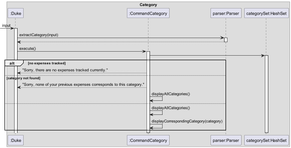

# Developer Guide

<!-- TOC -->
* [Developer Guide](#developer-guide)
  * [Acknowledgements](#acknowledgements)
  * [Design & implementation](#design--implementation)
  * [Design](#design)
  * [Implementation](#implementation)
    * ['Add' Feature](#-add-feature)
    * ['Delete' Feature](#-delete-feature)
    * [Monthly Overview](#monthly-overview)
    * [Yearly Overview](#yearly-overview)
    * ['Sort' Feature](#-sort-feature)
    * ['Total' Feature](#-total-feature)
    * ['Storage' Feature](#-storage-feature)
  * [Product scope](#product-scope)
    * [Target user profile](#target-user-profile)
    * [Value proposition](#value-proposition)
  * [User Stories](#user-stories)
  * [Non-Functional Requirements](#non-functional-requirements)
  * [Glossary](#glossary)
  * [Instructions for Manual Testing](#instructions-for-manual-testing)
<!-- TOC -->

## Acknowledgements

List here sources of all reused/adapted ideas, code, documentation, and third-party libraries
with links to the original sources included.

* [JSON-java](https://github.com/stleary/JSON-java)
* [three-ten-extra](https://www.threeten.org/threeten-extra/)
* [Requesting and Parsing of data from API into Java](https://www.youtube.com/watch?v=lDEfoSwyYFg)
* [Gson Type Adaptor](https://www.youtube.com/watch?v=Gf-Hx-Q0rOs)

## Design & implementation

{Describe the design and implementation of the product. Use UML diagrams and short code snippets where applicable.}

## Design

Our main `Duke` class is responsible for the instantiation and launch of our application.  
Our overall project design is split into 5 components, `command`, `common`,`data`, `storage` and `parser`.

- `command`: The command executor.
- `data`: Holds data and data structures of our application.
- `parser`: Reads data from the user input and parses it into an 'executable' command.
- `common`: Holds mainly static data that is used by multiple components.
- `storage`: Handles the reading and storing of our data.

## Account Implementation

### 'Login' Feature 

This mechanism is facilitated by `Account`, as well as `ParserAccount` and `Storage`. `ParserAccount` will scan the user
input, and then transfer that information to `Account`. `Account` will manage the login status of that account, and load 
the expense data via `Storage` from the user storage file (in .json) if the login status is successful, or stop access 
the file otherwise. Then, based on the login status, `ParserAccount` will show to the user the next step.

`ParserAccount` implements the following operations for `login`:

- `ParserAccount#caseLogIn()` -- Read in the username and password that the user type, and call a new `Account` object 
to process the `login` command.
- `ParserAccount#initialize()` -- Call the `ParserAccount#caseLogIn()` if command input is `login` when the user is not
inside an account.

`Account` implements the following operations:

- `Account#login()` -- A String functions reading the account list file to find if the username and password inputted by 
the user is matched or not. If it is matched, the function will call the `Storage` to load all the saved expenses 
in the stored .json file to the account's expense list, and return a String to denote that the log in status is 
successful. Else, it will return a String to denote that the log in status is not successful.

`Storage` implements the following operations:

- `Storage#loadExpenses(filePath)` -- Loading the expenses from the json file to the account's expense list, and save
it in the type of ExpenseList.
- `Storage#checkValidExpenseList(expenses, filePath)` -- Checking if the expenseList read from the json file is valid,
which helps to detect any data changes in the file or file corruption.
Given below is an example usage of the feature. 

Step 1. The user executes `login` command to log in to his / her account. `Duke` then calls `ParserAccount#initialize()`
to detect the command, and calls `PaserAccount#caseLogIn()`.

Step 2. `PaserAccount#caseLogIn()` instantiates a new `Account`, receiving the `username` and `password` from the user.
which then calls to `Account#login()`, and check if the username and password are matched.

Step 3. If the username and password are matched, `Account#login()` will call to `storage#loadExpenses(filePath)`, which 
then call a new ExpenseList() to store and load all the user expense list from the json file, and then display the
successful login message to the user and finish the login process.

### 'Signup' Feature

This mechanism is facilitated by `Account`, as well as `ParserAccount` and `Storage`. `ParserAccount` will scan the user
input, and then transfer that information to `Account`. `Account` will manage the signup status of that account, and 
call `Storage` to create a json file to store the data of the account if the signup status is successful, or print a 
message that the account can't be created since it does not follow the account creation requirement. 

`ParserAccount` implements the following operations for `signup`:

- `ParserAccount#caseSignUp()` -- Read in the username and password that the user type, and call a new `Account` object
  to process the `signup` command.
- `ParserAccount#initialize()` -- Call the `ParserAccount#caseSignUp()` if command input is `signup` when the user is 
not inside an account.

`Account` implements the following operations:

- `Account#signup()` -- Checking if the username and password meets the requirement. If it does, the function will call 
the `Storage` to create a new json file to be ready to store the account data, and print a message to show that the
username is created successfully. Else, it will print a message that denote the reason why the process is not successful.
- `Account#isUserNameTaken()` -- A boolean function to check if the username is taken or not, by scanning through the
account list file. If it is taken already, the function return true, and return false otherwise.

`Storage` implements the following operations:

- `Storage#createFile(filePath)` -- Create a new file with a given file path.

  Given below is an example usage of the feature. 

Step 1. The user executes `signup` command to sign up for a new account. `Duke` then calls `ParserAccount#initialize()` 
to detect the command, and calls `PaserAccount#caseSignUp()`.

Step 2. `PaserAccount#caseSignUp` instantiates a new `Account`, receiving the `username` and `password` from the user.
which then calls to `Account#signup()`, and check if the username is taken via `Account#isUsernameTaken`.

Step 3. If the username is valid, `Account#signup()` will call to `storage#createFile(filePath)` to create a file to 
store the user account expense list in a json file, and finish the signup process.

### 'Logout' Feature

This mechanism is facilitated by `Account`, as well as `ParserAccount` and `Storage`. `ParserAccount` will call 
`Account` to save the account data to its json file via `Storage`, and then `Account` will set the expenseList to be 
empty. After that, `Account` will print a message to denote that the process is successful, and `ParserAccount` will 
display the account command box to the user to log in, sign up or exit.

`ParserAccount` implements the following operations for `logout`:

- `ParserAccount#caseLogOut()` -- Call the `Account#saveLogOut()` first and then `ParserAccount#initialize()` after the 
logout process is completed.
- `ParserAccount#initialize()` -- Display the account command box to the user after logging out.

`Account` implements the following operations:

- `Account#saveLogOut()` -- Call the `Storage` to save the user expense list to the json file, and clear the expense 
list that store the account data inside the 'account process'.

`Storage` implements the following operations:

- `Storage#saveExpenses(filePath)` -- Save the expense list to the json file with given file path.

  Given below is an example usage of the feature.

Step 1. The user executes `logout` command to log out of his / her account. `Duke` then calls `ParserAccount#initialize()` to 
detect the command, and calls `PaserAccount#caseLogOut()`.

Step 2. `PaserAccount#caseLogOut` will call to `Account#saveLogOut`, which then calls to `storage.saveExpenses(filePath)`, 
`expenseList.showToUser(String)` to save the account's expenses list to a file and display the logout message to the user.

Step 3. `ParserAccount#initialize()` is called to let the user to the "outside account" mode and continue using the app.

### 'Exit' Feature (Outside the Account)

This mechanism is facilitated by `ParserAccount`, with just a simple task - exit the program.

`ParserAccount` implements the following operations for `exit`:

- `ParserAccount#initialize()` -- Call the `exit(0)` function to exit the program immediately when the user typed `exit`
before logged in or after logged out.

  Given below is an example usage of the feature. //TODO: img

## Implementation

### 'List' Feature

This mechanism is facilitated by `CommandList`, which extends `Command`. `CommanList` will access `expenseList` to 
print all the expenses in the user expense list when the command `list` is called.

`CommandList` implements the following operations:

- `CommandList#run()` -- A boolean functions return false and print a 'no-expense' message if there are no expenses in 
the expense list, or return true and print all the expenses if the expense list has at least 1 of them.

Given below is an example usage of the feature. 

Step 1. The user executes `list` command to list all expenses in the account. 

Step 2. `Duke` instantiates a new `CommandList` and calls `CommandList#run()`, which then calls
`expenseList.size()`, `expenseList.get(i).toString()` and `ExpenseList.getAllMessage(expenseList)`.

Step 3. `CommandList#run()` list all the expenses existing in the account for the user.

### 'Add' Feature

This mechanism is facilitated by `CommandAdd`, which extends `Command`, as well as `ParserAdd`. `ParserAdd` parses the
user input into a string of words `parsedInput[]` which `CommandAdd` then stores internally. `CommandAdd` also stores an
internal reference to the list of expenses `expenseList` to be added to.

`CommandAdd` implements the following operations:

- `CommandAdd#execute()` -- Instantiates the `Expense` object with the parsed inputs and adds it to `expenseList`
- `CommandAdd#roundInput(amount)` -- Rounds the expense amount to 2 decimal places.

`ParserAdd` implements the following operations:

- `ParserAdd#parseInput(userInput)` -- Parses the user input into an array of strings for `CommandAdd` to read.
- `ParserAdd#checkType(input)` -- Checks the type of the input corresponding to its index.
- `ParserAdd#substringIndex(type)` -- Returns the substring index of the start of the user input.

The `CommandAdd#execute()` operation is exposed in the main `Duke` class, while the operations in `ParserAdd` are
exposed in the `Parser` class.

Given below is an example usage of the feature.

Step 1. The user executes `add amt/24 t/02-02-2012` as the `userInput` to add a new `Expense` into the the list of
expenses. `Duke` calls `Parser#extractCommandKeyword(userInput)` to parse the input and determines that the `add`
command is called.

Step 2. `Duke` instantiates a new `CommandAdd` and calls `CommandAdd#execute()`, which in turn calls
`Parser#extractAddParameters(userInput)` and `ExpenseList#getExpenseList()`.

Step 3. `Parser#extractAddParameters(userInput)` then calls `ParserAdd#parseInput(userInput)` and returns the parsed
input as a string of words `parsedInput[]`.

Step 4. `CommandAdd#execute` instantiates a new `Expense` object with the returned `parsedInput[]` and adds it to
`expenseList`.

### 'Delete' Feature

This mechanism is facilitated by `CommandDelete`, which extends `Command`. It makes use of the output from `Parser`,
which takes in the user input as string and returns the index of the expense to be deleted, and the `CommandDelete`
proceeds to remove the respective expense from the list of expenses stored in `expenseList`.

`CommandDelete` implements the following operation:

- `CommandDelete#execute()` -- Removes expense based on the index specified by user.

`Parser` implements the following operation:

- `Parser#extractIndex(userInput)` -- Extracts the index of the expense to be deleted, as specified by the user.

The `CommandDelete#execute()` operation is exposed in the main `Duke` class. The `Parser#extractIndex(userInput)`
is exposed in the `parser` class.

Given below is an example usage scenario and how the 'delete' mechanism behaves at each step.

Step 1. The user executes `delete 1` command to delete the 1st expense in the expense list. `Duke#run()` calls
`Parser#extractCommandKeyword(userInput)` to parse the input and determine that the `delete` command is called.

Step 2. `Duke` instantiates a new `CommandDelete` and calls `CommandDelete#execute()`, which then calls
`expenseList.getExpenseList()` and `parser.extractIndex(input)`.

Step 3. `CommandDelete#execute()` removes the expense at index specified by the user.

### Monthly Overview

This mechanism is facilitated by `CommandOverview`, which extends `Command`. It makes use of output from `Parser`
to extract `month` and `year` from user input. It then calls on `MonthlyOverview` if both `month` and 'year'
are not null, which makes use of `MonthFilter` to filter out expenses in that specific month and returns sum by
category sorted in descending order before printing out the final overview in the intended format.

Given below is the partial sequence diagram to explain how the 'monthly overview' mechanism behaves once being called.

### Yearly Overview

Similar to `monthly overview`, this mechanism is facilitated by `CommandOverview`, which extends `Command`.
It makes use of output from `Parser` to extract `month` and `year` from user input. It then calls on `YearlyOverview`
if a year is specified but month is null, which makes use of `yearFilter` to filter out expenses in that specific year
and returns sum by month according to natural month order before printing out the final overview in the intended
format.

Given below is the partial sequence diagram to explain how the 'yearly overview' mechanism behaves once being called.

### 'Sort' Feature

This mechanism is facilitated by `CommandSort`.

`CommandSort` implements the following operations:

- `CommandSort#sortByDate()` -- Iterates through the given expense list and
  creates a new expense list that all the expenses are stably sorted by date.
- `CommandSort#displayByDate()` -- Traverse the expense list that is sorted by date, and print
  out all the expenses classified into different dates.
- `CommandSort#sortByCategory()` -- Iterates through the given expense list and creates a new expense list
  that all the expenses are sorted by category, which is a stable sort according to string comparison.
- `CommandSort#displayByCategory()` -- Traverse the expense list that is sorted by Category, and print
  out all the expenses classified into different categories.

Displayed below is a part of the class diagram for `CommandSort`as well as the class diagram for the main 
part of class `Time`.

Give below is an example usage of the feature.

Step 1. The user executes `sort (sortBy)`, indicating they want to sort the list by which criteria. Duke calls
on `CommandSort#execute()`with the help of `Parser#extractSortBy`, and pass the control to `CommandSort`
by `execute()`.

Step 2. The method will first check whether the expense list is empty or not. If empty, it will tell the user and
return.

Step 3. If the expense is not empty, it will base on the given criteria and sort the expense list either
using `CommandSort#sortByDate()`
or `CommandSort#sortByCategory()`, then display the result to user by calling `CommandSort#displayByDate()`
or `CommandSort#displayByCategory()`
accordingly.

### "Category" feature

This mechanism is facilitated by `CommandCategory`, it will first traverse the expense list and decide how many categories
are contained inside, no matter case sensitivity. If the expense doesn't indicate a specific category, it is named 
uncategorized by default. It will first tell the user what are the categories they stored in the expense list before. Such different categories will be stored in a HashSet. Then, the method will tell the user whether 
the expenses with such category they want to get are stored in the expense list before or not. If so, it will tell user all
the categories with corresponding category.

`CommandCategory` implements the following operation:
- `CommandCategory#displayAllCategories()` -- Display the number of categories as well as their name stored before
- `CommandCategory#displayCorrespondingCategory` -- Display the expense information with category specified by user

Given below is an example usage scenario and how the 'category' mechanism behaves at each step.

Step 1. The user executes `category Category`, indicating they want to get the expenses with which category. Duke calls on `CommandCategory#execute()`
with the help of `Parser#extractCategory`, and pass the control to `CommandCategory` by `execute()`.

Step 2. `CommandCategory` will first traverse the expense list and create a hashset stored all different categories. Base on the information of the expense list or 
the categorySet, it will decide what to respond to the user. If the expense is empty, it will tell the user and return to Duke. If the expense list is not empty but
doesn't contain the corresponding category, it will call `CommandCategory#displayAllCategory`, which traverse all the categories in the categorySet, and tell the user 
what are they and how many of them. Then return to Duke.

Step 3. If neither the above two conditions, it will call `CommandCategory#displayAllCategory` with mechanism mentioned above, and then it will call
`CommandCategory#displayCorrespondingCategory`, which traverse the expense list and display all expenses with corresponding categories no matter the case sensitivity.

### 'Total' feature

This mechanism is facilitated by `CommandTotal`.

`CommandTotal` implements the following operations:

- `CommandTotal#calculateTotal()` -- Iterates through the given expense list and calculates the total expenses from its
  amount and currency exchange rate.
- `CommandTotal#getTotal()` -- Returns the total in 2 decimal places.

Displayed below is a part of the class diagram for `CommandTotal`.

Given below is an example usage of the feature.

Step 1. The user executes `total`. Duke calls on `CommandTotal#execute()` to calculate the total expenses, which in turn
calls`expenseList#getExpenseList()` to retrieve the expense list.

Step 2. The expense list is iterated through and `total` is obtained by summing the product of each expenseAmount and
rate.

### 'Storage' Feature

The `storage` class is responsible for saving and loading of expenses to and from the json storage file.

- Loading expenses
    - Upon initialising of the programme, a `storage` class is created before an attempt to load the expenses in the
      json storage file is made. If the storage file do not exist, a new file is created in the designated path and a
      welcome message will be prompted to greet the user for the first time. If the file exists, data stored in the
      file will be retrieved and converted to an ArrayList of Expense. If the data file is non-empty, a check will
      be done to ensure the newly initialised ArrayList valid by detecting any potential file corruption and
      unintended data modification of the json file. Should there be further action required by the user for corrupted
      data file, messages will be prompted to provide instruction. A valid ArrayList is returned if it passes the
      validity test. An empty ArrayList of Expense will be returned if the data file is empty.
- Saving expenses
    - The ArrayList of Expense from `ExpenseList` class is converted to json object with the help of the `Gson` library.
      Saving is called every time an edit is made to the ExpenseList.

### 'Exit' Feature (Inside the Account)

This mechanism is facilitated by `ParserAccount` and `Account`.

`ParserAccount` implements the following operations:
- `ParserAccount#caseExit()` -- call the `Account#saveLogOut()` and show to the user a message that confirm the account
data is saved.

`Account` implements the following operations:
`Account#saveLogOut()` -- Call the `Storage` to save the user expense list to the json file, and clear the expense
list that store the account data inside the 'account process'.

`Storage` implements the following operations:

- `Storage#saveExpenses(filePath)` -- Save the expense list to the json file with given file path.

## Product scope

### Target user profile

- has a need to manage daily expenses
- travels overseas often and want to keep track of their expenses throughout their travels in different currencies
- prefer desktop apps over other types
- can type fast
- prefers typing to mouse interactions
- is reasonably comfortable using CLI apps

### Value proposition

{Describe the value proposition: what problem does it solve?}

- Our expense tracker is a simple program that allows users to track their expenses
- With simple commands and ease of use, users are able to use our tracker with little to no experience.

## User Stories

| Version | As a ...          | I want to ...                                               | So that I can ...                                                                        |
|---------|-------------------|-------------------------------------------------------------|------------------------------------------------------------------------------------------|
| v1.0    | new user          | add a new entry for my expenses                             | -                                                                                        |
| v1.0    | user              | delete specific expenses                                    | -                                                                                        |
| v1.0    | user              | add expenses with dates                                     | track how much I spend each day                                                          |
| v1.0    | user              | add expenses of different categories                        | keep track of what I spend on                                                            |
| v1.0    | user              | see all my past expenses                                    | plan my budget accordingly                                                               |
| v2.0    | user              | save all expenses added                                     | -                                                                                        |
| v2.0    | user              | add expenses with specified currencies                      | know the exact amount I spent in different currencies                                    |
| v2.0    | user              | sort my expenses by category/date                           | better keep track of my expenses through either date or category                         |
| v2.0    | user in Singapore | see my total spending in SGD                                | -                                                                                        |
| v2.0    | user in Singapore | see an overview of my expenses in a particular month in SGD | understand what categories I like to spend on and better plan my spending in the future. |                                                                                        |

## Non-Functional Requirements

{Give non-functional requirements}

* Expense tracker should function with or without an internet connection.
* Expense tracker should work even on days where the forex market is closed

## Glossary

* *glossary item* - Definition

## Instructions for Manual Testing

{Give instructions on how to do a manual product testing e.g., how to load sample data to be used for testing}
