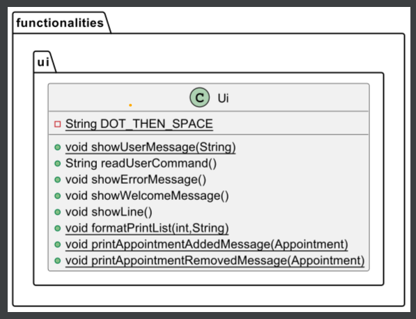

# Developer Guide
This developer guide will help you to get started with our product, BadMaths! 

BadMaths is an integrated study tool that performs Mathematical Operations and contains
various features for note-taking.

## Table of Contents

1. [Acknowledgements](#acknowledgements) 
2. [Design & implementation](#design--implementation)
   - [Solving Quadratic Equations](#solving-quadratic-equations) 
   - [Notes](#notes)
   - [Help](#help)
   - [Graph](#graph)
   - [Matrix](#matrix)
2. [Product Scope](#product-scope)
   - [Target user profile](#target-user-profile)
   - [Value proposition](#value-proposition)
3. [User Stories](#user-stories)
4. [Non-Functional Requirements](#non-functional-requirements)
5. [Glossary](#glossary)
6. [Instructions for manual testing](#instructions-for-manual-testing)
## Acknowledgements

{list here sources of all reused/adapted ideas, code, documentation, and third-party libraries -- include links to the original source as well}

## Design & implementation

### Solving Quadratic Equations
The Quadratic equation solver allows user to find the value of `x` in a simple quadratic equation.
The function is started when `solveQuadratic()` is called in the Command class.
Below is an  example of how it would be called.
```
Quadratic. 2x^2 + 3x + 1
```
Step 1. Parser class would split the user input into 2 parts, command and toDo. Command would be `Quadratic`,
thus `executeCommand` in the Command class would trigger `quadraticSolver`. `toDo` would be `2x^2 + 3x + 1`.

Step 2. The general formula of quadratic equations is `ax^2 + bx + c`, thus `findA`, `findB`, `findC` would be called from QuadraticParser
which extends from Quadratic. These methods would identify a, b and c from toDo.
- `findA` takes in `toDo` and uses substring function to isolate a from the rest of the equation. It would thus return a as
a `Double` data type.
- `findB` takes in `toDo` and calls `findSignOfB` and `findStringOfB` to identify the sign (+/-) and the number B as a `string`
This is done using substrings based on the index of the characters. `findB` then converts it into a `double` data type.
- `findC` takes in `toDo` and calls `findSignOfC` and `findStringOfC` to identify the sign (+/-) and the number C as a `string`
This is done using substrings based on the index of the characters, `findC` then converts it into a `double` data type.

Step 3. To solve the quadratic equation, `quadraticFormula(a,b,c)` is called with a, b and c as parameters. 
- The parameters are put into the equation `x = (-b±√(b²-4ac))/(2a)`. The output would be an ArrayList of Doubles that contains 2 values which 
are the possible values of x. 
- There is a possibility that the x values are imaginary, in this case, the ArrayList would simply store them as Nan values.

Step 4. minMaxPointFinder() is called to calculate the coordinates of the minimum or maximum point of the quadratic equation.
- The x-coordinate of the vertex is equal to `-b/2a`.
- The y-coordinate of the vertex can thus be found by substituting the x-coordinate value into the equation given by `toDo`
- The method then returns a string displaying the coordinates in the form of `(x,y)`.

Step 5. Then, `printAnswer` is called which would call upon the `UI` class's method: `printQuadraticAnswer(ArrayList<Double>)`.
- If the ArrayList contains NaN values, it would print `x is imaginary.`
- If the ArrayList contains Double data types, then it would print `x1 = 1st Answer` and `x2 = 2nd Answer`.
- If `a` is negative which means there is a maximum point, the appropriate message would be printed. Else it would print the message for
minimum point.
- The coordinates of the vertex would then be printed.


Step 5. If any exceptions are caught in the above steps, `printQuadraticFormulaError` would be called from UI to show an error message
to the user.
<details>
<summary>Sequence Diagram for solving Quadratic Equations</summary>
<div markdown="1">


</div>
</details>

### Notes
The Notes feature allows users to input their notes for note-taking purposes
and to keep track of their notes through various functionalities provided by BadMaths.

This feature is implemented by storing the notes input from users into 
the `data/notes.txt` file, and users are able to keep track
of their notes by reading the content from the `data/notes.txt file/`.

#### Note Class:
The Note class represents a note item, which includes information about the note, 
its priority level, its review count, and whether the note has been marked as completed or not.

##### Class Structure:
The Note class is defined with the following instance variables:

`text` (String): the note information
`reviewCount` (int): the number of times the note has been reviewed
`isDone` (boolean): whether the note is marked as complete or incomplete
`priority` (NotePriority.Priority): the priority level of the note

The class contains the following methods:

`Note`: constructor that initializes the instance variables with the given parameters
`getText`: returns the note's text
`setText`: sets the note's text to the given value
`getReviewCount`: returns the number of times the note has been reviewed
`incrementReviewCount`: increments the review count by 1
`getIsDone`: returns whether the note is marked as done or not
`getIsDoneIcon`: returns a string representation of the completion status ("Y" for done, "N" for not done)
`markAsDone`: marks the note as done
`markAsNotDone`: marks the note as not done
`getPriority`: returns the priority of the note
`setPriority`: sets the priority of the note to the given value
`setReviewCount`: sets the review count to the given value
`toString`: returns a string representation of the note in the format `[priority][completion status][review count]text`.

#### Notes Text:
The `notes.txt` file is a text file that contains the list of Notes stored by users using `BadMaths`.
It is located in the `data` directory of the project.
The purpose of this file is to allow users to keep a list of their notes stored 
and to display their notes item stored as and when is needed for their educational purposes.

##### Format:
The `notes.txt` file format consists of four fields separated by a tab character `\t`: priority, status, count, and text. 
These fields provide information about each note in the file.

###### Priority:
The priority field indicates the importance level of a certain note. It can have one of the three values: `HIGH`, `MEDIUM`, or `LOW`. 
This field helps users quickly identify notes that require more attention.

###### Status:
The status field indicates the current state of the note. It can have one of two values: `done`, denoted by `Y`, or `pending`, denoted by `N`.
If a note has been completed, the status field should be set to `done`. If a note is still in progress, the status field should be set to `pending`.

###### Count:
The count field indicates the number of times the note has been reviewed. Each time a note is reviewed, the count field is incremented by one. 
This allows the user to keep track of how many times a note has been reviewed.

###### Text:
The text field contains the actual content of the note. This can be any text-based information provide by the user.

###### Example of information displayed in `notes.txt`:

````
HIGH  Y  1  Note_Item_1
MEDIUM   N  2  Note_Item_2
LOW   Y  3  Note_Item_3
````

### Storage

#### NotesFileParser Class

The `NotesFileParser` class is responsible for loading notes from a file and returning them as an `ArrayList` of `Note` objects. 
It contains a single public static method `loadFile()` which takes the file path as a parameter and returns an `ArrayList<Note>`.

Step 1. The method starts by creating a new `ArrayList` of `Note` objects named `notes` that will contain the notes read from the file.

Step 2. The `loadFile()` method then opens the file specified by the path parameter using a `Scanner` object and reads each 
line of the file in a loop using the `hasNextLine` and `nextLine` methods of the `Scanner` object.

Step 3. For each line of the file, the method splits the line into four parts using the `split` method with a tab `\t` as the separator. 
This creates an array of four elements, each containing one part of the line. If the length of the resulting array is not `4`, 
the method throws an `InvalidFormatException`.

Step 4. If the length of the resulting array is `4`, the method continues to parse the four parts of the line.

a. The first part represents the `priority` of the note, and it is read as a string. The method checks if the string is one of the valid priority values (`LOW`, `MEDIUM`, `HIGH`), 
and if not, it throws an `InvalidFormatException`. If the string is valid, the method converts it to a `NotePriority.Priority` enum value.

b. The second part represents the `status` of the note (whether it is done or not), and it is read as a string. The method checks if the string is one of the valid status values (`Y`, `N`), 
and if not, it throws an `InvalidFormatException`. If the string is valid, the method converts it to a `boolean` value (true if the string is `Y`, false otherwise).

c. The third part represents the `review count` of the note, and it is read as a string. The method tries to parse the string as an integer using the `Integer.parseInt` method. 
If the string cannot be parsed as an integer, the method throws an `InvalidFormatException`. If the string is valid, the method stores the integer value in a variable named `reviewCount`.

d. The fourth part represents the `text` of the note, and it is read as a string.

Step 5. If the four parts of the line are valid, the method creates a new `Note` object with `text` and `priority`, 
updates its `status` and `review count` respectively with parsed values, and adds the `notes` ArrayList.

Step 6. After all lines of the file have been processed successfully, the method returns the `notes` ArrayList containing all the notes read from the specific file.

Step 7. If `InvalidFormatException` is caught during the reading and parsing process, the method handles it by enquiring the user whether to reset the file or not (`y` or `n`). 
If the user chooses to reset the file (`y`), the method clears the file contents using a `PrintWriter` object and prints a success message. 
If the user chooses not to reset the file (`n`), the method prints a message informing the user that the program will exit in 10 seconds and schedules a timer task to exit the program after the timeout. 
If the user enters an invalid input, the method prompts the user again until a valid input is entered.

#### NotesFileWriter Class

The `NotesFileWriter` contains a single public static method called `saveFile`, which takes in two arguments: 
a `String` representing the path to the file to be written, and an `ArrayList` of `Note` objects that will be written to the file.

Step 1. The method starts by creating a `File` object representing the file to be written based on the provided path.

Step 2. The method check whether the file exists or not. If the file does not exist, the method creates the file and its parent directory when necessary.

Step 3. The method creates a `FileWriter` object and passes the file path to it.

Step 4. The `fileContent` method of `NotesFileContentManager` class is called. 
It takes in the `ArrayList` of `Note` objects and returns a `String` representing the contents need to be written to the file. 

Step 5. The `String` returned from `fileContent` is then written to the file using the `write` method of the `FileWriter` object.

Step 6. The `FileWriter` is closed using `close` method.

#### NotesFileContentManager Class

The `NotesFileContentManager` class contains a static method `fileContent` that takes an `ArrayList` of `Note` objects and returns a formatted string that can be written to a file.

Step 1. The method starts by creating a `StringBuilder` object named `content` to accumulate the formatted string.

Step 2. The method then loops through each `Note` object in the input `ArrayList` using a for-each loop:

Step 3. For each `Note` object, the method extracts the `priority`, `status`, `review count`, and `text`, 
and appends them to the content string in the expected format: `priority` `\t` `stauts` `\t` `review count` `\t` `text`

Step 4. The `StringBuilder` object is converted to a string using the `toString` method and returned by the `f`ileContent` method:

#### NotesFileCleaner Class

The `NotesFileWriter` class contains a single public static method called `clearFile`. 
Its purpose is to clear the content of a file located at a specified path. 

Step 1. The method takes a string parameter that represents the path to the file that needs to be cleared.

Step 2. A new `FileWriter` object is created using the specified path.

Step 3. The `write` method of the `FileWriter` object is called with an empty string as the argument. This clears the content of the file.

### Store class:
The `Store` class takes in inputs from users and store these notes into the
`notes.txt` file. It consists of a static boolean method that detects invalid `todo` input entered by users
and a public method that stores notes to the notes list.

Step 1. The `Store` class takes in two variables `notes` and `todo`, and constructs a new `Store` instance
using the two variables.

Step 2. The `isInvalidTodo` static boolean method will check for the validity of the `todo` string input.

Step 3. The `storeNotes` public method will then store the note item input by users into the notes list.

### List class:
The `List` class takes in inputs from users and list either all the notes stored in notes list or specific notes
based on the index that users have input to BadMaths.
It consists of a few public boolean method that detects invalid `todo` input entered by users,
detects if `todo` provided is not an integer, and detects if `todo` provided is an invalid index.
It also consists of a public method that list notes stored in notes list.

Step 1. The `List` class takes in two variables `notes` and `todo`, and constructs a new `List` instance
using the two variables.

Step 2. The `isInvalidTodo`, `isInvalidIndex` and `isAnInt` boolean method will check for the validity of the `todo` string input.

Step 3. The `listNotes` public method will then list either all the notes stored in notes list or specific notes
based on the index that users have input to BadMaths.


### Delete class:
The `Delete` class takes in inputs from users and deletes the respective specific notes in the notes list
based on the index that users have input to BadMaths.
It consists of two static boolean methods that detects whether `todo` provided by users
is not an integer, and detects whether `todo` provided is an invalid index.
It also consists of a public method that deletes notes stored in notes list.

Step 1. The `Delete` class takes in two variables `notes` and `todo`, and constructs a new `Delete`
instance using the two variables.

Step 2. The `isInvalidIndex` and `isAnInt` static boolean methods will check for the validity of the `todo` string input.

Step 3. The `deleteNotes` public method will then delete the respective specific notes in the notes list
based on the index that users have input to BadMaths.

### CommandHistory class:
The `CommandHistory` class stores a list of all inputs entered by users during the current programme run session.
It consists of only a two public class methods, `storeCommand` and `displayHistory`. 

Step 1. The `CommandHistory` class takes in only one variable `historyCommand`, 
and constructs a new `CommandHistory` instance using that one variable.

Step 2. The `storeCommand` public method adds the input command given by users into the 
`historyCommand` ArrayList.

Step 3. The `displayHistory` public method outputs a list of past commands entered by users during
the current programme run.

### Command class:
The `Command` class takes in inputs from users
and executes relevant functions based on the inputs of the users. It consists of 
public methods such as `isInvalidTodo` and `executeCommand`.

Step 1. The `Command` class takes in a `command` and a `toDo` item and
based on both of these inputs, the `Command` class then identifies the relevant functions
to be executed.

Step 2. The `executeCommand` method does the executing of the relevant functions depending on the `command` that
was being input by users. There are several functionalities provided in the `executeCommand` for users, including but
not limited to the Storing and Deleting of Notes, Marking and Unmarking of notes items as completed or incomplete, and
the searching for notes through keywords or priorities of the notes. 

### Ui class:
The `Ui` class consists of several static methods which are used
to print user interface messages when users are performing the
operations of BadMaths such as the notes and calculation operations and functionalities.

The methods that are in the Ui class are as follows:
`printIncorrectFormatEntered()`: prints out a warning message to alert the 
user that an incorrect command format for badMaths has been entered.

`printNegativeAmplitudeEntered()`: prints out a warning message to alert that the user has input a negative amplitude.

`printAmplitude(double amplitude)`: prints out the amplitude of the Mathematical function provided by the user.

`printPhase(double phase)`: prints out the phase angle of the Mathematical function provided by the user.

`printVerticalShift(double verticalShift)`: prints out the vertical shift of the Mathematical function provided by the user.

`printFrequency(Double freq)`: prints out the frequency of the Mathematical function provided by the user.

`printMark(String text)`: prints out a message indicating that a note has been marked as done by the user.

`printUnmark(String text)`: prints out a message indicating that a note has been unmarked as incomplete by the user.

`printAddNote(String text, int size)`: prints out a message indicating that a note has been added by the user
and displays to the user the total current number of notes stored in the list.

`printDelete(String text, int size)`: prints out a message indicating that a note has been removed by the user
and displays to the user the total current number of notes stored in the list.

`printNotes(ArrayList<Note> notes)`: prints out all the notes currently stored in the list by the user.

`printSpecificNote(int index, ArrayList<Note> notes)`: prints out a specific note in the list based on 
its index provided by user.

`printFindNotes(ArrayList<Note> notes)`: prints out all the notes in the list
that matches the keyword provided by the user.

`printPriority(int index, ArrayList<Note> notes)`: prints out a message indicating to the user that the 
priority of a note item has been changed based on the user's preference.

`printNotesByReviewCount(ArrayList<Note> notes)`: prints out all the notes sorted based on the number of
review counts for each note item in a list format.

`printNotesByPriority(ArrayList<Note> notes)`: prints out all the notes sorted based on the
priority (high, medium, low) of the note items in a list format.

### NotePriority class:
The `NotePriority` class is utilised to set the priority level (LOW, MEDIUM, HIGH)
of the notes stored in the Notes List by users.

<details>
<summary>Sequence Diagram for Notes</summary>
<div markdown="1">


</div>
</details>

### Help
The Help feature allows users to view possible options by calling `Help.` which reads the content stored in the HelpManual.txt.

The feature implemented involves reading the content from HelpManual.txt file and logging the result of read operation using the Java Logging API.

#### HelpManual text:
`HelpManual.txt` is a text file that contains the help manual for BadMaths. It is located in the `src/main/resources` directory of the project.
The purpose of this file is to provide users with helpful instructions on how to operate BadMaths.

#### HelpManual class:
Step 1. Define the HelpManual class: The HelpManual class is defined as a public class with two static fields: filePath and logFilePath. 
These fields contain the file path of the HelpManual.txt file and the name of the log file, respectively.

Step 2. Setting up the Logger: The Logger is set up in the HelpManual class using the Java Logging API. 
The `setUpLogger()` method resets the LogManager, sets the logger's level to ALL, and creates a log file if it does not already exist. 
This method is called before the `readHelpManual()` method to ensure that the logger is properly configured.

Step 3. Reading the file:
The `readHelpManual()` method is implemented to read the content from the HelpManual.txt file.
It first calls the setUpLogger() method to configure the logger. Then it obtains an InputStream object that reads the content from the 
file using the `getResourceAsStream()` method. Before reading the file, the `readHelpManual()` method asserts that the input stream is not null to ensure that the file exists and is readable.
The file is then read line by line using a BufferedReader object, and each line is appended to a StringBuilder object. Otherwise,
the `getResourceAsStream()` method will return a null value, and an `AssertionError` will be thrown.

Step 4. Logging the result: After reading the file, the `readHelpManual()` method closes the BufferedReader and InputStream 
objects and logs the success or failure of the read operation using the logger. If the read operation is successful, a message
is logged to the console and log file indicating that the HelpManual file was successfully read. If an exception occurs during
the read operation, an error message is logged to the console and log file.

### Graph
The Graph feature allows users to analyse basic Trigonometry signals by calling `startGraphAnalysis()` which
creates a new instance of `TrigoGraphAnalyser` named `analyser`.

Below is an example usage scenario and how the `Graph` feature behaves at each step.

When user enters an input:
```
Graph. 2*sin(2*x+5)-1
```
#### Parser class, Command class:
Step 1. Parser class will split the input into `Graph.` and `2*sin(2*x+5)-1`, which are `command` and `toDo` respectively.
The command class creates a new instance of `TrigoGraph` and pass in `toDo` as a parameter for the constructor. It
then executes `trigoGraph.startGraphAnalysis()`based on `command` using switch-case statements.

#### TrigoGraph class:
<details>
<summary>Sequence Diagram for TrigoGraph class</summary>
<div markdown="1">



</div>
</details>

**"--->", empty headed arrow represents constructor call**

Step 2. Constructor for the TrigoGraph class takes in `2*sin(2*x+5)-1` and assigns it to `trigoEqn` of type String. When `startGraphAnalysis()`
is called from the command class, a new instance of `TrigoGraphAnalyser` called `analyser` is created in TrigoGraph, which accepts `trigoEqn`
as the parameter.

Step 3. When `analyser.canStartAnalyser()` is true, it will print out the amplitude, frequency, phase and vertical shift
to the user using the Ui class. Each of the method calls to the Ui class requires an input of type double which can
be achieved by calling `analyser.getAmplitude()`, `analyser.getFreq()` and so on.

#### TrigoGraphAnalyser class:
Step 4. In the `canStartAnalyser()` method, the trigo equation is split into various parts, and there
is a method call to create `setUpLogger()` to log exceptions when user enters
invalid trigo equation. `canStartAnalyser()` returns false if an exception is reached, else it returns true.

Step 5. `canStartAnalyser()` calls `splitAmplitudeFromTrigoEqn()`. This method will split
the input into `2` and `sin(2*x+5)-1` using `*` as the regex. 

Step 6. 2 tests are ran within `splitAmplitudeFromTrigoEqn()` to check for negative amplitude and multiple asterisk. 
In this case, both checks will return false.

Step 7. The separated String is passed into `String[] amplitudeAndEqn`. The string is then passed into `findAmplitude` 
to determine the amplitude. In `findAmplitude(eqn)`, `isAmplitudeEqualsToOne(eqn[0])` will check if the input string 
starts with `cos`, `sin` or `tan`, where `eqn[0]` is `2` and `eqn[1]` is `sin(2*x+5)-1`. 
If this is true, 1.0 will be assigned to `amplitude`. Else, string `2` will be converted to double `2.0` and assigned to 
`amplitude`.

Step 8. After finding `amplitude`, `canStartAnalyser()` calls `splitTrigoAndVerticalShift(amplitudeAndEqn[1])`, where
`amplitudeAndEqn[1]` is `sin(2*x+5)-1`. `splitTrigoAndVerticalShift` splits `sin(2*x+5)-1` into `sin(2*x+5` and `-1`
based on `)` and returns the separated string to `trigoAndVerticalShift`.

Step 9. `canStartAnalyser()` calls `findVerticalShift()` which takes in `sin(2*x+5` and `-1` as a string [] parameter. 
In `findVerticalShift()`, method call to `isVerticalShiftZero(-1)` is false and thus, 
`-1` is converted to double `-1.0` and assigned to `vertricalShift`.

Step 10. In `canStartAnalyser()`, string `trigo` is assigned `sin(2*x+5`. 

Step 11. `canStartAnalyser()` calls `splitTrigoIntoPhasors()` and takes in `trigo` as the parameter. In `splitTrigoIntoPhasors()`, 
`startPosOfPhase` is 4 while `endPosOfPhase` is 9. A new String variable `phase` is assigned the substring of trigo from 
4 to 9, resulting in `2*x+5`. `splitPhasorsIntoFreq()` is called and it accepts string `2*x+5` as input.

Step 12. In `splitPhasorsIntoFreq()`, `findFreqForPlus()` is called which takes in string `2*x+5` as input. 

Step 13. In `findFreqForPlus()`, `2*x+5` is split into `2*x` and `5` using the split function with `+` as the regex. 
`findPhase()` which accepts `5` and a boolean `false` as parameters, and `findFreq()` which accepts `2*x` and a boolean `false` are called.

Step 14. In `findPhase()`, `phase` is assigned the double of `5` and in `findFreq()`, `2*x` is substring into `2` and converted 
to double `2.0`. `Freq` is assigned the double value of `2.0 / (2 * Math.PI)`.

Step 15. Finally, `canStartAnalyser()` reaches the end and returns true.

#### TrigoGraphVisualiser class:
Step 16. The `TrigoGraphVisualiser` extends JPanel and overrides the `paintComponent()` method in JComponent. 

Step 17. A new instance of `TrigoGraphVisualiser` is created in `startGraphAnalysis` to assign corresponding values to the amplitude, phase, frequency, 
vertical shift, and the trigonometric function in `TrigoGraphVisualiser`. Next, `startVisualiser()` is called to create the frame 
for the graph.


Step 18. The frame is set half of the screen size using `setSize()` and `getScreenSize()`. 

Step 19. When the frame is created, `paintComponent` will be called. It sets up the scale factors which will scale the values
generated by the trigo function to that of the frame. It the sets up the x and y axis using `g.drawLine()`.

Step 20. Using the switch-case statements. `drawSinCurve()` will be executed and amplitudes will be labelled on the axis. 
The for loop will run from `xMin` to `xMax`, which are the negative frequency and positive frequency for one period respectively.
After getting the y value from the output of the sin equation, both *x* and *y* are scaled to *xPixel* and *yPixel* respectively. A horizontal line is drawn at every pixel, which
eventually forms the sine graph.

//{Describe the design and implementation of the product. 
//Use UML diagrams and short code snippets where applicable.}

### Matrix

The Matrix feature supports various basic matrix calculations below:
* Matrix multiplication
* Matrix element wise product
* Matrix addition
* Matrix subtraction

With calling `calculator.run()`, BadMaths parses the user's input and conducts the given command.

If you want to see the overall flow of the Matrix part, click the toggle button below:
<details>
<summary>See the Sequence Diagram</summary>
<div markdown="1">


</div>
</details>

Below is an example usage scenario and how the `Matrix` feature behaves at each step.

When user enters an input:
```
Matrix [1,2;3,4] .* [5,6;7,8]
```

#### Calculator class

step 1. `run()` function in `Calculator.class` firstly get `toDo` as the argument which is `[1,2;3,4] .* [5,6;7,8]` in the above example.
This `run()` function sequentially parses this string, executes the command and shows the result matrix to users.

#### Parser class

step 2. Firstly, `run()` function pass the `toDo` string to `parse()` function defined in `Parser.class`. 
This `parse()` function firstly identifies the type of the operator of this command with referring `toDo` string. 
And then, it divides the cases with this identified type with using `switch` statement.

#### Execute class

step 3. According to each case divided by operator types in the previous step, 
`parse()` function calls corresponding function defined in `Execute.class` for conducting calculation. 
In the case of the above example, `parse()` function calls `executeMul()` defined in `Execute.class` since the type of the 
operator is matrix multiplication. Finally, it passes the `toDo` string to `executeMul()` function as the argument.

step4. `executeMul()` function firstly extracts two operands from `toDo` string. And pass these two operands to `executeTranspose()` 
in `Execute.class` respectively. 

step 5. In this `executeTranspose()` function, function checks whether there is transpose mark in the given operand, and parses this
operand which is string type into `Tensor2D` type so that this operand could be internally calculated. In this parsing phase, 
`parseMatrix()` function defined in `Parser.class` is used. This function finally outputs this `Tensor2D` type operand to 
`executeMatrix()` function.

step 6. Regarding these two operands with `Tensor2D` type, `executeMul` function calls `mul()` function defined in `calculate.class`.

#### Calculate class

step 7. `mul()` function defined in `Calculate.class` internally conducts matrix multiplication with nested for-loop 
and outputs the result which is `Tensor2D` type.

step 8. This result is sequentially returned to `executeMul()`, `parse()` and `run()` function. Finally in the `run()` function,
the result is printed in terminal.


## Product Scope
### Target user profile
Mathematics students who are studying and practicing Mathematical topics on Matrices, Quadratic Equations 
or Sinusoidal Signals.

### Value proposition

Students can access mathematical tools like matrix calculator, quadratic equation solver, and trigonometry graph analyser
quickly when studying. Concurrently, students are also able to make use of the Notes function in BadMaths
to do note-taking and to keep track of their notes through the use of various Notes features in BadMaths.

This integrated mathematical tool aims to help users solve their mathematical doubts or clarifications quickly which saves time, as they do not
have to search for different tools online.


## User Stories

| Version | As a ...                                | I want to ...                         | So that I can ...                                                                      |
|---------|-----------------------------------------|---------------------------------------|----------------------------------------------------------------------------------------|
| v1.0    | student studying Linear Algebra         | be able to check my answers for Matrix multiplications | ensure that the method I am using for manual calculations is correct                   |
| v1.0    | student overwhelmed by math information | be able to store custom notes         | refer to them whenever I want to refresh my memory                                     |
| v1.0    | student studying Signals and Systems    | be able to find the characteristics of trigo graphs easily | save time when doing my tutorials and not have to worry about the tedious calculations |
| v2.0    | secondary school maths student          | be able to solve quadratic equations  | complete my homework as fast as possible and as correcetly as possible                 |
## Non-Functional Requirements

* Notes can be ported when program starts on a new device.
* The program should terminate and print an error message when it takes to long to process user inputs.
* The program should be straightforward and concise; No doubts on how to use the program.
* Capabilities of the program are made known to the users.
* Program is to implement features related to studying and maths only. E.g. A step tracker that tracks number of steps
walked is out of scope.

## Glossary

* *x* - input to the trigonometric function, sin(freqInHz* *x*+phase).
* *y* - output of the trigonometric function above.
* *xPixel* - *x* value is scaled to position of the x position of the screen.
* *yPixel* - *y* value is scaled to position of the y position of the screen.

## Instructions for manual testing

- Download the latest release of BadMaths [here](https://github.com/AY2223S2-CS2113-F10-2/tp/releases).
- Save the java file to a new folder.
- Open command prompt by typing `cmd` in the Windows search bar.
- Navigate to the folder via `cd "folder path"`. (eg. `cd C:\Users\your_name\Desktop\BadMaths`).
- Type `java -jar BadMaths.jar` to run BadMaths.
- Follow the `User Guide` to begin testing.