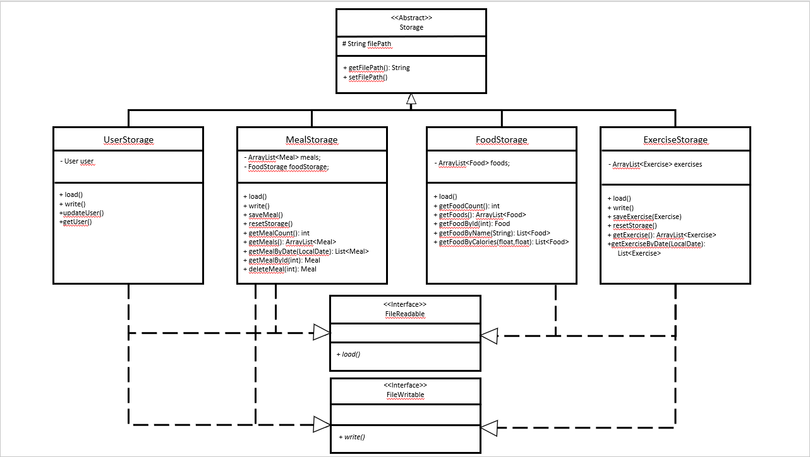

# Developer Guide

- [Acknowledgements](https://ay2223s2-cs2113-w15-1.github.io/tp/DeveloperGuide.html#acknowledgements)
- [Design](https://ay2223s2-cs2113-w15-1.github.io/tp/DeveloperGuide.html#design)
  - [Architecture](https://ay2223s2-cs2113-w15-1.github.io/tp/DeveloperGuide.html#architecture)
  - [UI Component](https://ay2223s2-cs2113-w15-1.github.io/tp/DeveloperGuide.html#ui-component)
  - [Command Component](https://ay2223s2-cs2113-w15-1.github.io/tp/DeveloperGuide.html#command-component)
  - [Storage Component](https://ay2223s2-cs2113-w15-1.github.io/tp/DeveloperGuide.html#storage-component)
  - [Interfaces](https://ay2223s2-cs2113-w15-1.github.io/tp/DeveloperGuide.html#interfaces)
- [Implementation](https://ay2223s2-cs2113-w15-1.github.io/tp/DeveloperGuide.html#implementation)
  - [ Add meal feature](https://ay2223s2-cs2113-w15-1.github.io/tp/DeveloperGuide.html#add-meal-feature)
    - [ Implementation](https://ay2223s2-cs2113-w15-1.github.io/tp/DeveloperGuide.html#implementation-1)
    - [Design considerations:](https://ay2223s2-cs2113-w15-1.github.io/tp/DeveloperGuide.html#design-considerations-1)
  - [List meal feature](https://ay2223s2-cs2113-w15-1.github.io/tp/DeveloperGuide.html#list-meal-feature)
    - [ Implementation](https://ay2223s2-cs2113-w15-1.github.io/tp/DeveloperGuide.html#implementation-2)
    - [Design considerations:](https://ay2223s2-cs2113-w15-1.github.io/tp/DeveloperGuide.html#design-considerations-1)
  - [ Delete meal feature](https://ay2223s2-cs2113-w15-1.github.io/tp/DeveloperGuide.html#delete-meal-feature)
    - [ Implementation](https://ay2223s2-cs2113-w15-1.github.io/tp/DeveloperGuide.html#implementation-3)
    - [Design considerations:](https://ay2223s2-cs2113-w15-1.github.io/tp/DeveloperGuide.html#design-considerations-2)
  - [View feature](https://ay2223s2-cs2113-w15-1.github.io/tp/DeveloperGuide.html#view-feature)
    - [ Implementation](https://ay2223s2-cs2113-w15-1.github.io/tp/DeveloperGuide.html#implementation-4)
    - [Design considerations:](https://ay2223s2-cs2113-w15-1.github.io/tp/DeveloperGuide.html#design-considerations-3)
  - [Update feature](https://ay2223s2-cs2113-w15-1.github.io/tp/DeveloperGuide.html#update-feature)
    - [ Implementation](https://ay2223s2-cs2113-w15-1.github.io/tp/DeveloperGuide.html#implementation-5)
    - [Design considerations:](https://ay2223s2-cs2113-w15-1.github.io/tp/DeveloperGuide.html#design-considerations-4)
  - [Nutrition feature](https://ay2223s2-cs2113-w15-1.github.io/tp/DeveloperGuide.html#nutrition-feature)
    - [ Implementation](https://ay2223s2-cs2113-w15-1.github.io/tp/DeveloperGuide.html#implementation-6)
    - [Design considerations:](https://ay2223s2-cs2113-w15-1.github.io/tp/DeveloperGuide.html#design-considerations-5)
  - [Filter feature](https://ay2223s2-cs2113-w15-1.github.io/tp/DeveloperGuide.html#filter-feature)
    - [ Implementation](https://ay2223s2-cs2113-w15-1.github.io/tp/DeveloperGuide.html#implementation-7)
    - [Design considerations:](https://ay2223s2-cs2113-w15-1.github.io/tp/DeveloperGuide.html#design-considerations-6)
  - [Exercise feature](https://ay2223s2-cs2113-w15-1.github.io/tp/DeveloperGuide.html#exercise-feature)
    - [ Implementation](https://ay2223s2-cs2113-w15-1.github.io/tp/DeveloperGuide.html#implementation-8)
    - [Design considerations:](https://ay2223s2-cs2113-w15-1.github.io/tp/DeveloperGuide.html#design-considerations-7)
  - [Track feature](https://ay2223s2-cs2113-w15-1.github.io/tp/DeveloperGuide.html#track-feature)
    - [ Implementation](https://ay2223s2-cs2113-w15-1.github.io/tp/DeveloperGuide.html#implementation-9)
    - [Design considerations:](https://ay2223s2-cs2113-w15-1.github.io/tp/DeveloperGuide.html#design-considerations-8)
  - [Examples feature](https://ay2223s2-cs2113-w15-1.github.io/tp/DeveloperGuide.html#examples-feature)
    - [ Implementation](https://ay2223s2-cs2113-w15-1.github.io/tp/DeveloperGuide.html#implementation-10)
    - [Design considerations:](https://ay2223s2-cs2113-w15-1.github.io/tp/DeveloperGuide.html#design-considerations-9)
- [Appendix: Requirements](https://ay2223s2-cs2113-w15-1.github.io/tp/DeveloperGuide.html#appendix-requirements)
  - [Product Scope](https://ay2223s2-cs2113-w15-1.github.io/tp/DeveloperGuide.html#product-scope)
    - [Target user profile:](https://ay2223s2-cs2113-w15-1.github.io/tp/DeveloperGuide.html#target-user-profile)
    - [Value proposition:](https://ay2223s2-cs2113-w15-1.github.io/tp/DeveloperGuide.html#value-proposition)
    - [User Stories](https://ay2223s2-cs2113-w15-1.github.io/tp/DeveloperGuide.html#user-stories)
  - [Non-Functional Requirements](https://ay2223s2-cs2113-w15-1.github.io/tp/DeveloperGuide.html#non-functional-requirements)
  - [Glossary](https://ay2223s2-cs2113-w15-1.github.io/tp/DeveloperGuide.html#glossary)
  - [Instructions for manual testing](https://ay2223s2-cs2113-w15-1.github.io/tp/DeveloperGuide.html#instructions-for-manual-testing)
    - [Launch and Shutdown](https://ay2223s2-cs2113-w15-1.github.io/tp/DeveloperGuide.html#launch-and-shutdown)
    - [View user profile](https://ay2223s2-cs2113-w15-1.github.io/tp/DeveloperGuide.html#view-user-profile)
    - [Update user profile](https://ay2223s2-cs2113-w15-1.github.io/tp/DeveloperGuide.html#update-user-profile)
    - [Adding a meal](https://ay2223s2-cs2113-w15-1.github.io/tp/DeveloperGuide.html#adding-a-meal)
    - [List meals or foods in database meals added](https://ay2223s2-cs2113-w15-1.github.io/tp/DeveloperGuide.html#list-or-foods-in-database-meals-added)
    - [Deleting a meal](https://ay2223s2-cs2113-w15-1.github.io/tp/DeveloperGuide.html#deleting-a-meal)
    - [Filtering foods based on calories](https://ay2223s2-cs2113-w15-1.github.io/tp/DeveloperGuide.html#filter-foods-based-on-calories)
    - [Find nutrition of a food](https://ay2223s2-cs2113-w15-1.github.io/tp/DeveloperGuide.html#find-nutrition-of-a-food)
    - [Add a exercise](https://ay2223s2-cs2113-w15-1.github.io/tp/DeveloperGuide.html#add-a-exericse)
    - [Track calorie intake](https://ay2223s2-cs2113-w15-1.github.io/tp/DeveloperGuide.html#track-calorie-intake)
    - [See examples of meal or exercise](https://ay2223s2-cs2113-w15-1.github.io/tp/DeveloperGuide.html#see-examples-of-meal-or-exercise)
    - [See list of available commands](https://ay2223s2-cs2113-w15-1.github.io/tp/DeveloperGuide.html#see-list-of-available-commands)
    - [Exiting the application](https://ay2223s2-cs2113-w15-1.github.io/tp/DeveloperGuide.html#exiting-the-program)
    - [Saving data](https://ay2223s2-cs2113-w15-1.github.io/tp/DeveloperGuide.html#saving-data)
    - [Dealing with missing/corrupted data files](https://ay2223s2-cs2113-w15-1.github.io/tp/DeveloperGuide.html#dealing-with-missingcorrupted-data-files)

---
### Acknowledgements

1. Command, Parser and UI java files are adapted from one of our group member's [Duke Project](https://github.com/MingEn82/ip)
---

## Design

---
### Architecture


**Main Components of LifeTracker**

`LifeTracker` is where users will access the application from. It is responsible for:

- At app launch: Initialise the Databases and UI classes
- At app closure: Saves all updated data to databases

The rest of the Application consists of three components:

- `UI`: Reponsible for I/O between user and application
- `Command`: Handles execution of user inputs
- `Storage`: Stores information of the user and meals eaten

---
### UI Component

API: ui.java

INSERT UI UML HERE

The UI is made up of five classes, `GeneralUi`, `CalorieUi`, `ExampleUi`,  `ExerciseUi` and `WeightUi`, and together,
they improve on the accessibility of the application.

The `UI` component,
- Displays what are the possible inputs at any one time
- Allows the user to check that a value added is correct
- Informs the user whenever there is an invalid input

### Command Component

API: commands.java


How the `Command` component works:
1. When a user first enters something into the CLI, the `CommandParser` subclass from the `Parser` class is used to parse the user command. 
2. Based on the results of the parsing, a specific command object is created (e.g. `AddMealCommand`) which inherits from the abstract `Command` and its `execute` method.
3. Every command uses the `execute` method differently according to its needs. (For example, `AddMealCommand` would require saving of meals to a single database, while 
   `TrackCalorieCommand` would require reading from various databases for the desired result)
4. The command can also communicate with the various storage components when it is executed, such as saving and loading of user, meals, foods, exercise data.
5. In addition, the command also communicates with the UI Component to display the results of the execution of the command back to the user. 
6. In the case of command execution failures, an Exception Object (more precisely, an object of one of its subclasses, e.g. LifeTrackerException) is thrown.

### Storage Component

API: storage.java



The `Storage` is the base class which all `Storage` components inherit from. There are currently four storages:

1. `FoodStorage`: For parsing and storing all of the foods supported by _LifeTracker_
2. `UserStorage`: For storing the user's profile
3. `MealStorage`: For storing the meals that the user ate
4. `ExerciseStorage`: For storing the exercises that the user did

#### Interfaces

To ensure that each `Storage` component only implements methods for writing and reading when needed, we created two interfaces

1. `FileReadable`: Has `load()` method for `Storage` component to be able to read from a database
2. `FileWritable`: Has `write()` method for `Storage` component to be able to write to a database

For example, `FoodStorage` is not meant to be edited by user, hence it does not implement `FileWritable`

# Implementation
This section describes some noteworthy details on how certain features are implemented.  

## Add meal feature

### Implementation

The proposed mechanism for adding a meal is facilitated by `AddMealCommand`. It extends `Command` and overrides the
`execute` method in the `Command` class.

In this command, there are 2 ways for the user to add a meal to storage. 
1. Using a one-line command in their CLI in the format `add [DATE] /on [MEAL_TYPE] /type [FOOD_INDEX] /foods`
2. Typing `add` into the CLI and following the printed prompts to enter the date in the specified format, type of meal and specific food.


Step 1. As seen from the sequence diagram above, when the AddMealCommand is executed via the `execute` method in 
LifeTracker, the user's input is first parsed to determine how he/she wants to input it. Either method sets the food, 
date and meal type features necessary to create a new meal.

Step 2. The constructor for the `Meal` class is called which instantiates a new instance of Meal using the
parameters provided.

Step 3. `mealStorage` saves the meal to the database and then `ui` prints out the confirmation of the meal added.

### Design considerations

#### Aspect: How to add meals

- Alternative 1 (current choice): Use a one-line command for the CLI.
  - Pros: Faster to input for experienced users.
  - Cons: Format might be difficult for new users.
- Alternative 2 (current choice): Follow printed prompts for data. 
  - Pros: Usage would be easier for new users.
  - Cons: Slower to input for experienced users.

Therefore, our group chose to implement both ways. 

## List feature

### Implementation

The proposed mechanism for listing stored foods, meals and exercises is facilitated by `ListCommand`. It extends `Command` and overrides the `execute` method in the `Command` class.

Step 1: The user will input either `list foods`, `list meals`, `list exercises` based on which information the user wants to retrieve.

Step 2: Based the input, `ListCommand` will call either `printAllFoods`, `printAllMeals`, or `printAllExercises` method of the `ui` object.

Step 3: The `ui` will retrieve the relevant information from the storage and print out their details.


### Design Considerations

#### Aspect: How to list all of the foods in the database, and the meals and the exercises of the user

- Alternative 1 (current choice): List information based on input command.
  - Pros: More concise, no unnecessary information.
  - Cons: Slightly slower to input command.
- Alternative 2: List all meals, exercises, and foods at once. 
  - Pros: Slightly faster to input command.
  - Cons: Lots of unnecessary information would be displayed. 

## Delete feature

### Implementation

In order to delete a meal or exercise from their meal history, a user has to type either `delete /meal [MEAL_INDEX]` or `delete /exercise [EXERCISE_INDEX]`into the CLI. Users can see 
which meal or exercise they want to delete by viewing the respective csv files or using the list command.


In the above implementation, DeleteMealCommand parses the user input to obtain the index to delete and proceeds to 
delete it via the method from mealStorage() and prints out the deleted meal to the user.

### Design considerations

#### Aspect: How to delete meals

- Alternative 1 (current choice): Delete items from list based on index.
  - Pros: Does not needlessly delete wanted items. 
  - Cons: Need to get the index from `list` command first.
- Alternative 2: Clears all data.
  - Pros: Faster input, no need for `list` command to retrive index.
  - Cons: Deletes data that user might want to keep.

## View feature

### Implementation

The proposed view mechanism is facilitated by `ViewUserCommand`. It extends `Command` and overrides the 
`execute` method in the `Command` class. 

It stores the user's data internally as `user` and the meals consumed by the user as `meals`. It also 
initializes the UI for calories as `calorieUI`.

Given below is an example usage scenario and how the view feature behaves at each step.

Step 1. The user launches the application and calls the `view` command. The `ViewUserCommand` will be initialized
with the current user and meal storage state. `user` and `meals` will point to the user storage and meal state 
respectively.


The user will then be presented with a menu showing the different user details he can view as seen in the code
snippet below.  

````
View user settings
1. View Name
2. View Weight
3. View Height
4. View Age      
5. View Gender
6. View Daily Caloric limit
7. View Calories left today
8. Back
````

Step 2. The user chooses to view his weight by inputting the number `2` to choose `View Weight`.
This calls the getter method `getWeight()` in the entity `User` to return the current weight of the user
and initializes the variable `weight` with that value. 


It then prints to screen the weight of the user like in the code snippet below.

````
Weight: {weight} kg

Continue viewing?
1. Yes
2. No
````
Step 3. The user chooses to continue viewing by inputting the number `1` and chooses `View Daily Caloric Limit` next
by inputting the number `6`. This calls the getter method `getCaloricLimit()` in the entity `User` to return the
current daily caloric limit of the user and initializes the variable `caloricLimit` with that value. 


It then prints to screen the daily caloric limit of the user like in the code snippet below.

````
This is your daily caloric limit: 
{caloricLimit} Kcal

Continue viewing?
1. Yes
2. No
````

Step 4. The user executes the command `update` to update his user details. The user is presented with a menu showing the
different user details he can update as seen in the code snippet below.

````
Update user settings
1. Update Name
2. Update Weight
3. Update Height
4. Update Age
5. Update Gender
````
The user chooses to update his weight by inputting the number `2`. This causes the state of the user's details to be 
modified and the user's weight as well as his caloric limit will be updated in accordance to the new weight entered.

> Insert UML diagram showing the update process

Step 5. The user then executes the command `view` to view his updated weight and daily caloric limits.

### Design considerations

#### Aspect: How to view user data

- Alternative 1 (current choice): 
  - Pros: 
  - Cons:
- Alternative 2: 
  - Pros: 
  - Cons: 

## Update feature

### Implementation

The proposed update mechanism is facilitated by `UpdateUserCommand`. It extends `Command` and overrides the `execute` method in the `Command` class.

### Design considerations:

#### Aspect:

- Alternative 1 (current choice): 
  - Pros:
  - Cons:
- Alternative 2:
  - Pros:
  - Cons:

## Nutrition feature

### Implementation

The proposed update mechanism is facilitated by `NutritionCommand`. It extends `Command` and overrides the `execute` method in the `Command` class.

Step 1: The user inputs `nutrition` into the command line. 

Step 2: The user will then be prompted to enter what food they would like to see the nutrition for. 

Step 3: A list of type `food` will then be created called `filteredFoods`, populated by foods from `foodStorage` that contains the user's input.

Step 4: The list will then be displayed to the user, who can pick which food by its index.

Step 5: The nutritional information for that food will then be displayed.


### Design considerations:

#### Aspect: How to update user data

- Alternative 1 (current choice): Follow prompts for information.
  - Pros: User can get accurate information about the food. 
  - Cons: Slower input.
- Alternative 2: Use a one line command for the CLI.
  - Pros: Faster input.
  - Cons: User might input food that's not in the database and therefore there is no nutritional information available. 

## Filter feature

### Implementation

This proposed mechanism for allowing the user to search for meals with a filter, facilitated by `FilterCaloriesCommand`. It extends `Command` and overrides the `execute` method in the `Command` class.

Step 1. The user calls the `filter` command, specifying a particular calorie range through a upper and lower bound.

Step 2. `FilterCaloriesCommand` will parse the lower and upper bound from the input.

Step 3. `FilterCaloriesCommand` will then retrieve the meals that fit within that range from `FoodStorage`.

Step 4. `FilterCaloiresCommand` will then print out the meals that has been filtered based on the lower and upper bound.


### Design considerations:

#### Aspect: How to find foods from the database based on calories

- Alternative 1 (current choice): Use a one line command for the CLI. 
  - Pros: Faster input for experienced users.
  - Cons: 
- Alternative 2: 
  - Pros:
  - Cons:

## Exercise feature

### Implementation

The proposed update mechanism is facilitated by `AddExerciseCommand`. It extends `Command` and overrides the `execute` method in the `Command` class.

### Design considerations:

#### Aspect: How to add exercises

- Alternative 1 (current choice): Use a one-line command for the CLI.
  - Pros: Faster to input for experienced users.
  - Cons: Format might be difficult for new users.
- Alternative 2 (current choice): Follow printed prompts for data. 
  - Pros: Usage would be easier for new users.
  - Cons: Slower to input for experienced users.

## Track feature

### Implementation

The mechanism for tracking net calorie intake is facilitated by `TrackCalorieCommand`. It extends `Command` and overrides the `execute` method in the `Command` class.

Step 1: The user will either input `track all` to view all history or  `track /start [DATE] /end [DATE]` to filter the results based on dates
Step 2a: Based the input, `TrackCalorieCommand` will either parse the start date from user input or set the start date to the earliest meal or exercise added by calling `getStartingDate`.
Step 2b: Based the input, `TrackCalorieCommand` will either parse the end date from user input or set the end date to the latest meal or exercise added by calling `getEndingDate`.
Step 3: `TrackCalorieCommand` will retrieve the meals and exercises filtered from the starting date by calling `getMealByDate` and `getExerciseByDate` respectively.
Step 4: `TrackCalorieCommand` will iterate through the filtered meals and exercises day by day and print out the net calorie intake for each day.


### Design considerations:

#### Aspect: How to track the calories of the user

- Alternative 1 (current choice): Use a one-line command for the CLI.
  - Pros: Faster to input for experienced users.
  - Cons: Format might be difficult for new users.
- Alternative 2 (current choice): Follow printed prompts for data. 
  - Pros: Usage would be easier for new users.
  - Cons: Slower to input for experienced users.

## Examples feature

### Implementation

The proposed mechanism for displaying examples of exercises and meals is facilitated by `ExamplesCommand`. It extends `Command` and overrides 
the `execute` method in the `Command` class.

Step 1. The user calls the `examples` command, specifying whether they wish for `meal` or `exercise` to be displayed.

Step 2. `ExamplesCommand` will parse the user input.

Step 3. `ExamplesCommand` will retrieve either the examples of `meal` or examples of `exercise` based on the user input, from the `ExampleData` database.

Step 4. The examples of `meal` or `exercise` will then be printed out and displayed for the user.


### Design considerations: How to list examples of exercises and meals

#### Aspect:

- Alternative 1 (current choice): List examples based on input command.
  - Pros: More concise, no unnecessary information.
  - Cons: Slightly slower to input command.
- Alternative 2: List all examples. 
  - Pros: Slightly faster to input command.
  - Cons: Lots of unnecessary information would be displayed. 

# Appendix: Requirements

## Product scope

### Target user profile:

- Is an NUS student
- Looking to lose/maintain their weight
- Looking to make healthier choices in terms of food
- Can type fast
- Prefers typing to mouse interactions
- Is reasonably comfortable using CLI apps

### Value proposition:
For individuals trying to lose weight, managing their daily caloric intake is crucial. However, many may find it 
hard to track and manage their calories. _LifeTracker_ allows users to easily automate the tracking of their calories
and keep a record of their daily caloric intake. 

_LifeTracker_ can also keep track of the exercises that users have done and factor it in to their daily calories lost. This allows
the user to keep track of their net calorie gain on a daily basis.

### User Stories
| Version | As a ... | I want to ...                                            | So that I can ...                                           |
|---------|----------|----------------------------------------------------------|-------------------------------------------------------------|
| v1.0    | new user | see usage instructions                                   | refer to them when I forget how to use the application      |
| v1.0    | user     | calculate my caloric needs based on my height and weight | lead a healthy lifestyle within my caloric needs            |
| v1.0    | user     | add a meal                                               | keep track of the food I have eaten on a particular day     |
| v1.0    | user     | delete a meal                                            | remove a meal if I entered it in wrongly                    |
| v1.0    | user     | view my previous meals                                   | track the calories of each meal                             |
| v1.0    | user     | key in my weight on a daily basis                        | keep track of my weight loss/gain                           |
| v1.0    | user     | see the amount of calories left I have in the day        | not exceed my daily caloric limit                           |
| v2.0    | user     | search for a type of food and view its nutritional contents | make a more informed choice about what to eat            |
| v2.0    | user     | search for meals within a specific calorie range         | decide which meal to consume                                |
| v2.0    | user     | enter the type and duration of exercise I have completed | keep better track of my physical activies                   |
| v2.1    | user     | be inspired to work out                                  | stay in shape                                               |
| v2.1    | user     | search based on a filter                                 | have results that better suit my needs                      |

## Non-Functional Requirements

1. Should work on any mainstream OS as long as it has Java `11` installed.
2. This app is meant for a single user and will not be able to accurately keep track of the meals, personal information and caloric requirements for different people.
3. This app is targeted at users who would prefer typing over other input types. Ideally they would have an above-average typing speed and therefore prefer CLI over other interfaces. 

## Glossary

* *glossary item* - Definition
___
## Instructions for manual testing

Given below are instructions on how to test the application by yourself manually. You can use these instructions as a starting point for your testing. 

### Launch and Shutdown
- Initial launch
  - Download the jar file from the release page and copy the file into an empty folder
  - Open a cmd terminal and redirect or cd into the folder the jar file was downloaded into.
  - Type "java -jar tp.jar" and press enter to run the file.
 
- Shutdown
  - Type `bye` into the command line and press enter to exit the application.

### View user profile

Test case: `view`

Expected: Menu where user can input a value from 1 to 9 to view their current profile. User can then input 1 to continue viewing their profile or 2 to exit.

### Update user profile

Test case: `update`

Expected: Menu where user can input a value from 1 to 7 to update their current profile. User can then input 1 to continue viewing their ofile or 2 to exit.

### Adding a meal

Test case: `add /on 3/3/2023 /type Lunch /foods Spaghetti, Alfredo (Small)`

Expected: Spaghetti and Alfredo are added to the list. Details of the food such as calories are shown in the status message.

Test case: `add`

Expected: Application will then ask for date of meal, type of meal, and food, and will then display the foods in the database containing the food that was added. Food is then added to the list and details of the food such as calories are shown in the status message.

Test case: `add /on dummy /type dummy /foods dummy`

Expected: No food is added. Error details are shown in the status message, such as "_dummy_ is not a valid date", "Invalid meal type" or "no food found with _dummy_".

### List meals or foods in database meals added

Test case: `list meals`

Expected: A list of meals eaten today would be displayed.

Test case: `list foods`

Expected: A list of all foods in the databse would be displayed.

Test case: `list dummy`

Expected: An error message would be displayed.

### Deleting a meal

Prerequisite: List all meals eaten using the list command. At least 1 meal in the list.

Test case: `delete 1`

Expected: First meal is deleted from the list. Details of the deleted meal are shown in the status message. 

Test case: `delete 0`

Expected: No meal is deleted. Error details shown in the status message.

Other incorrect delete commands to try: delete, delete x, (where x is larger than the list size)

Expected: Similar to previous.

### Filter foods based on calories

Test case: `filter 400 600`

Expected: A list of all meals within that range will be displayed

Test case: `filter 400 300`

Expected: An error message will be displayed

### Find nutrition of a food

Prerequisite: Food needs to exist in the database.

Test case: `nutrition`

Expected: Prompt will ask you to enter the food you would like to see the nutrition for. A menu displaying all foods which contain the food entered will appear, which you can then enter the index to see the specific food. 

### Add a exericse

Test case: `exercise /type running /description 5km /calories 500 /on 5/5/2023`

Expected: An exercise of running for 5km that burnt 500 calories on 5/5/2023 is added.

Test case: `exercise /type dummy /description dummy /calories dummy /on dummy`

Expected: No exercise is added, error message will be displayed. 

### Track calorie intake

Test case: `track /start 5/5/2023 /end 6/5/2023`

Expected: Calories consumed, calories burnt and net calories for 5/5/2023 and 6/5/2023 would be displayed in the status message.

Test case: `track /start dummy /end dummy`

Expected: Error message will be dislayed.

### See examples of meal or exercise

Test case: `examples exercise`

Expected: Examples of different types of exercise will be displayed

Test case: `examples weight`

Expected: An error message will be displayed

### See list of available commands

Test case: `help`

Expected: List of available commands for this application will be displayed.

### Exiting the application

Test case: `bye`

Expected: Application exits. 

### Saving data
Meal data, user data and exercise data will be saved in ./data/mealData.csv, ./data/userData.csv, ./data/exerciseData.csv respectively.

### Dealing with missing/corrupted data files
Delete the ./data/mealData.csv, ./data/userData.csv, ./data/exerciseData.csv files for corrupted data and restart the programme.


