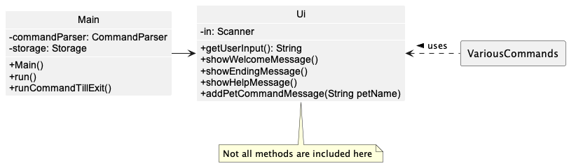
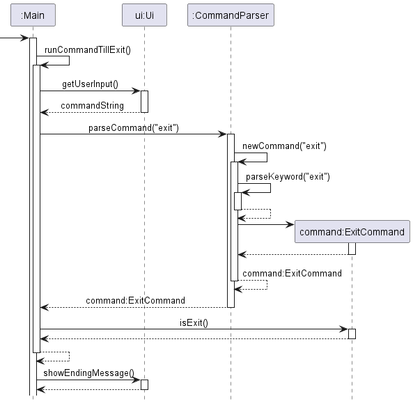
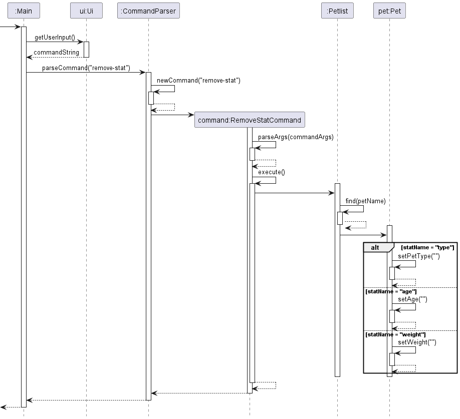

# Developer Guide

<!-- TOC -->
* [Developer Guide](#developer-guide)
  * [Acknowledgements](#acknowledgements)
  * [Design](#design)
    * [Architecture](#architecture)
  * [Implementations](#implementations)
    * [Ui Class](#ui-class)
    * [Exit Command](#exit-command)
    * [List Pet Command](#list-pet-command)
    * [[Added] Add Pet Stat Feature](#added-add-pet-stat-feature)
      * [Implementation](#implementation)
    * [Remove Pet Stat Command](#remove-pet-stat-command)
    * [Command Parser](#command-parser)
* [Appendix: Requirements](#appendix-requirements)
  * [Product scope](#product-scope)
    * [Target user profile](#target-user-profile)
    * [Value proposition](#value-proposition)
  * [User Stories](#user-stories)
  * [Non-Functional Requirements](#non-functional-requirements)
  * [Glossary](#glossary)
  * [Instructions for manual testing](#instructions-for-manual-testing)
    * [Launch and Shutdown](#launch-and-shutdown)
    * [Testing Storage](#testing-storage)
  * [Extras](#extras)
<!-- TOC -->

## Acknowledgements

The format of our developer guide is adapted from 
[SE-EDU AddressBook Level 3](https://github.com/se-edu/addressbook-level3/blob/master/docs/DeveloperGuide.md). 
Code used in this project is reused and adapted from our team's individual project during this module.

## Design

All `.puml` files used to create the UML diagrams can be found in our diagrams folder.

### Architecture

    
     
    <i>Figure 1: Architecture Diagram for Pet Tracker</i>

The **Architecture Diagram** given above explains the high-level design of the App. Given below is a quick overview of each component.

**Main components of the architecture**

[**`Main`**](https://github.com/AY2223S2-CS2113-T11-3/tp/blob/master/src/main/java/seedu/pettracker/Main.java) is responsible for,
* At app launch: Initializes the components in the correct sequence, and connects them up with each other.
* At shut down: Shuts down the components and invokes cleanup methods where necessary.

The rest of the App consists of four components.

* [**`Ui`**](): The UI of the App.
* [**`Parser`**](): Parses the user input.
* [**`Command`**](): The command executor.
* [**`Data`**](): Holds the data of the App in memory.
* [**`Storage`**](): Reads data from, and writes data to, the hard disk.

## Implementations

### Ui Class

The Ui class is represented by the image below. The Ui class handles user input and
displaying of the relevant information including error messages for the program. In the diagram below,
`VariousCommands` represents different commands that may call the Ui Class.

The `Main` class will call `getUserInput()` to read in user input. Commands may then
call the methods to print relevant outputs.

    
     
    <i>Figure 2: Class Diagram for Ui</i>

### Exit Command

The `ExitCommand` inherits its properties from the abstract `Command` class.

The command to exit the program is `exit`.
If 'exit' is called, the program prints the exit message and terminates the program.

This is how the ExitCommand works:

1. The `main()` method in Main calls `run()` in Main. 

2. `run()` will call `runCommandTillExit()`.

3. The `ui` reads the user's input to retrieve
the command via `ui.getUserInput()` and parses it through `commandParser.parseCommand()`.

4. Within the `commandParser.parseCommand()`, some functions are also internally called.
    1. `newCommand()` is called to identify the String received
    2. `parseKeyword()` is called to split the command from the parameters.
 
5. A new `ExitCommand()` is called.

6. `ExitCommand` is returned to parseCommand().

7. `ExitCommand` is returned to main().

8. The Exit Command is now executed via `command.execute()`.

9. `runCommandTillExit()` will now call `command.isExit()` which returns `true`.

10. The loop is now broken and ui will call `ui.showEndingMessage()`.

11. The program will now exit.

    
     
    <i>Figure 3: Sequence Diagram for Bye Command</i>

### List Pet Command

The `ListPetCommand` inherits its properties from the abstract `Command` class.

The command to list all pets currently available is `list`. When called, the program prints all the names and statistics of the existing pets (if any), followed by the number of pets currently in the list.

This is how the ListPetCommand works:

1. The `main()` method calls `ui.getUserInput()` from `ui`. The user's command is parsed through `commandParser.parseCommand()`.

2. Within `commandParser.parseCommand()`, `newCommand()` will identify the command received (`list`).

3. `ListPetCommand()` calls the `list()` method from the `PetList` class.

4. `PetList.list()` then iterates through all pets in `petList`, calling `pet.getPetName()`, `pet.getPetType()`, `pet.getAge()` and `pet.getWeight()` each iteration, then prints the number of pets.

5. The loop is now broken to return `ListPetCommand` to `parseCommand()`.

6. `ListPetCommand` is returned to `main()`.

7. The program is now ready to receive another command.

    
     
    <i>Figure 4: Sequence Diagram for List Pet Command</i>

### [Added] Add Pet Stat Feature

#### Implementation

The add pet stat mechanism is facilitated by the `Pet` class. It is stored internally as a `petList` created under the `PetList` class. Additionally, it  implements the following operations:

- `Pet#addStat()` - Checks which type of stat the user wants to add (i.e. weight, age, pet type)
- `Pet#setAge()` - Sets the age of the pet
- `Pet#setPetType()` - Sets the type of the pet (e.g. Dog, Cat, Parrot)
- `Pet#setWeight()` - Sets the weight of the pet

These operations are exposed in the `PetList` class as `PetList#addStat()` and `AddStatCommand` class as `AddStatCommand#execute()`.

    
     
    <i>Figure 5: Class Diagram for Add Pet Stat Feature</i>

Given below is an example usage scenario and how the add pet stat mechanism behaves.

Step 1. After the user launches the application and added a pet named "Bob", a `Pet` object will be initialised and saved in the `petList`.

    
     
    <i>Figure 6: Object Diagram for Add Pet Stat Feature After Step 1</i>

Step 2. The user executes `add-stat Bob weight 5` command to add a weight stat of 5kg in the `Pet` object. The `add-stat` command calls `AddStatCommand#execute()` then `PetList#addStat()`, causing the `Pet` object's `weight` variable to be modified and saved.

    
     
    <i>Figure 7: Object Diagram for Add Pet Stat Feature After Step 2</i>

### Remove Pet Stat Command

The `RemoveStatCommand` class inherits its properties from the abstract `Command` class.

This class is executed whenever the `remove-stat <pet name> <stat name>` command is called by the user. The intended functionality of this command is to remove the `<stat name>` from the pet with name `<pet name>`. 

It works like this:

1. The `main()` method calls `ui.getUserInput()` from `ui`. The user's command is parsed through `commandParser.parseCommand()`.

2. Within `commandParser.parseCommand()`, `newCommand()` will identify the command received (`remove-stat`).

3. `RemoveStatCommand.parseArgs()` separates the arguments into the pet name and stat name.

4. `RemoveStatCommand.execute()` calls `PetList.removeStat()` with the pet name and stat name, and calls `ui.removeStatCommandMessage()` to send output to the user.

5. `PetList.removeStat()` uses its internal `find()` method to find the corresponding Pet object, and calls `Pet.removeStat()` on that object.

6. `Pet.removeStat()` uses a switch statement on the stat name to identify the proper method to call: either `setPetType("")`, `setAge("")`, or `setWeight("")`. If the stat name does not match any of those, it prints out an error message.

7. `Pet.removeStat()`, `PetList.removeStat()`, and `RemoveStatCommand` all return, allowing the program to receive another command.

This feature was implemented like this in order to maximize use of the OOP paradigm. 

    
     
    <i>Figure 8: Sequence Diagram for Remove Pet Stat Command</i>

### Command Parser

The `CommandParser` class is responsible for parsing the user's input into a `Command` object. It does this by splitting
the input into its keyword and arguments using Java's Regex Matcher, and then using a switch statement to identify the
keyword and invoke the respective argument parser.

How the Command Parser works:

1. The user's input is passed into the `parseCommand()` method.
2. The input is split into its keyword and arguments using Java's Regex Matcher.
3. The keyword is used to identify the command, and the arguments are passed into the respective argument parser.
4. The argument parser checks the validity of the arguments, and returns a `Command` object if the arguments are valid.

    
     
    <i>Figure 9: Sequence Diagram for Add-Stat Command</i>

# Appendix: Requirements
## Product scope
### Target user profile

Pet Tracker is developed for people who take care of multiple pets (Pet Hotels/Pet Sitters) who prefer
to use CLI applications to quickly track and update details relating to their pet.

### Value proposition

Pet Tracker will allow for fast-typing users to save more time when keeping track of pets.
Users will be able to quickly update any of their existing pet details or add in new ones, while being able to
review all current information of all the pets they have at a glance. In addition, Pet Tracker allows users to
add tasks for errands that even has a reminder feature so that users will not forget.

## User Stories

| Version | As a ...         | I want to ...                                           | So that I can ...                                           |
|---------|------------------|---------------------------------------------------------|-------------------------------------------------------------|
| v1.0    | basic user       | add new pets                                            | track more pets                                             |
| v1.0    | basic user       | record my pet's weight                                  | track if the weight is healthy                              |
| v1.0    | basic user       | record my pet's age                                     | track how old my pet is                                     |
| v1.0    | basic user       | remove a pet from my list                               | de-clutter the pet-list from pets I no longer take care of  |
| v1.0    | large-scale user | see basic info on all my pets in one place              | get an overview of all my pets                              |
| v2.0    | basic user       | save my pet list                                        | save my pet list data when i close the program              |
| v2.0    | basic user       | load my saved pet list                                  | resume where i left off previously                          |
| v2.0    | basic user       | add task                                                | remind myself to carry out a task                           |
| v2.0    | basic user       | mark uncompleted tasks as done                          | check off tasks that i complete                             |
| v2.0    | basic user       | unmark completed tasks                                  | uncheck off tasks that i did not complete                   |
| v2.0    | basic user       | see all my tasks in one place                           | get an overview of all my tasks                             |
| v2.0    | basic user       | edit my pet information                                 | modify my pet information when i need to update it          |
| v2.0    | basic user       | edit my task information                                | modify my task information when i need to update it         |
| v2.0    | basic user       | get a schedule of what time tasks must be done          | better meet my pets need by carrying out the task           |
| v2.0    | forgetful user   | receive reminders about what task should have been done | complete due tasks that i forgot to do                      |

## Non-Functional Requirements

1. Pet Tracker should work on mainstream OS as long as Java 11 is installed.
2. User with higher typing speed compared to an average person should be able to accomplish most tasks faster than
using the mouse.
3. Does not require internet to run
4. Should be able to hold up to 1000 pets/tasks without any noticeable sluggishness in performance

## Glossary

* *Mainstream OS* - Windows / MacOS / Linux
* *Pet* - Domestic/Tamed animal
* *Task* - A task to be carried out (e.g. Feeding a pet)
* *Stat* - Statistic of a pet such as Pet Type(Dog / Cat), Age or Weight
* *Value* - Result of the statistic (e.g. 5,10,15)
* *VariousCommands* - Commands in general, non-specific

## Instructions for manual testing

### Launch and Shutdown
- Initial Launch
1. Ensure that you have Java 11 or above installed.
2. Download the latest version of `Pet Tracker`
   from [here](https://github.com/AY2223S2-CS2113-T11-3/tp/releases/download/PetTrackerV2.0/pettracker.jar).
3. Launch a terminal in the folder that the jar file is located in
4. Run the command `java -jar pettracker.jar`

Expected Outcome: The program should run in the terminal.

- Shutdown
1. Type `exit` to quit the application

Expected Outcome: Pet Tracker will terminate and display `Goodbye! See you soon.
`

### Testing Storage
- Saving and Loading Data
1. Launch the application and add pets/tasks
2. All changes will be automatically saved to the output file.
3. Upon terminating and re-launching the application, Pet Tracker will load the files from
the `output` folder named as `petoutput.txt` and `taskoutput.txt`

Expected Outcome: Pet Tracker will successfully load both data files and restore the
state of the application as if it was never closed.

- Missing Data File
1. Delete the `petoutput.txt` or `taskoutput.txt` file in the `output` folder
2. In the event that the data file is missing, Pet Tracker will not see the former state of the application.
3. Pet Tracker will run as if it is the first time launching this program.

Expected Outcome: Pet Tracker runs with an empty data file.

- Corrupted Data File
1. Change pet age to be a non integer, or delete some pipes in the `petoutput.txt` or `taskoutput.txt` file.
2. If the data files are corrupted, PetTracker will print out errors and
may not be able to successfully import in previous states.

Expected Outcome: Pet Tracker may start with a partially loaded state. 

## Extras

1. Users should not try to corrupt the data output file by changing the data directly.