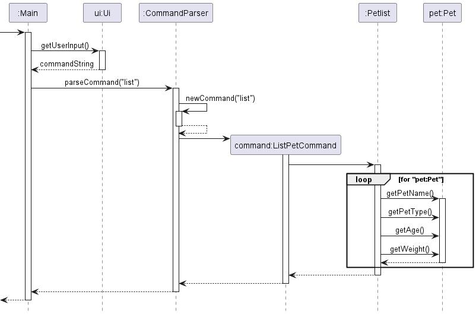

# Developer Guide

* Table of Contents
{:toc}

## Acknowledgements

{list here sources of all reused/adapted ideas, code, documentation, and third-party libraries -- include links to the original source as well}

## Design

{Describe the design and implementation of the product. Use UML diagrams and short code snippets where applicable.}

### Architecture

    
     
    <i>Figure 1: Sequence Diagram for Bye Command</i>

The **Architecture Diagram** given above explains the high-level design of the App. Given below is a quick overview of each component.

**Main components of the architecture**

[**`Main`**](https://github.com/AY2223S2-CS2113-T11-3/tp/blob/master/src/main/java/seedu/pettracker/Main.java) is responsible for,
* At app launch: Initializes the components in the correct sequence, and connects them up with each other.
* At shut down: Shuts down the components and invokes cleanup methods where necessary.

The rest of the App consists of four components.

* [**`Ui`**](): The UI of the App.
* [**`Parser`**](): Parses the user input.
* [**`Command`**](): The command executor.
* [**`Data`**](): Holds the data of the App in memory.
* [**`Storage`**](): Reads data from, and writes data to, the hard disk.

## Product scope
### Target user profile

{Describe the target user profile}

### Value proposition

{Describe the value proposition: what problem does it solve?}

## Implementations
### Exit Command

The `ExitCommand` inherits its properties from the abstract `Command` class.

The command to exit the program is `exit`.
If 'exit' is called, the program prints the exit message and terminates the program.

This is how the ExitCommand works:

1. The `main()` method in Main calls `run()` in Main. 

2. `run()` will call `runCommandTillExit()`.

3. The `ui` reads the user's input to retrieve
the command via `ui.getUserInput()` and parses it through `commandParser.parseCommand()`.

4. Within the `commandParser.parseCommand()`, some functions are also internally called.
    1. `newCommand()` is called to identify the String received
    2. `parseKeyword()` is called to split the command from the parameters.
 
5. A new `ExitCommand()` is called.

6. `ExitCommand` is returned to parseCommand().

7. `ExitCommand` is returned to main().

8. The Exit Command is now executed via `command.execute()`.

9. `runCommandTillExit()` will now call `command.isExit()` which returns `true`.

10. The loop is now broken and ui will call `ui.showEndingMessage()`.

11. The program will now exit.

    
     
    <i>Figure 1: Sequence Diagram for Bye Command</i>

### List Pet Command

The `ListPetCommand` inherits its properties from the abstract `Command` class.

The command to list all pets currently available is `list`. When called, the program prints all the names and statistics of the existing pets (if any), followed by the number of pets currently in the list.

This is how the ListPetCommand works:

1. The `main()` method calls `ui.getUserInput()` from `ui`. The user's command is parsed through `commandParser.parseCommand()`.

2. Within `commandParser.parseCommand()`, `newCommand()` will identify the command received (`list`).

3. `ListPetCommand()` calls the `list()` method from the `PetList` class.

4. `PetList.list()` then iterates through all pets in `petList`, calling `pet.getPetName()`, `pet.getPetType()`, `pet.getAge()` and `pet.getWeight()` each iteration, then prints the number of pets.

5. The loop is now broken to return `ListPetCommand` to `parseCommand()`.

6. `ListPetCommand` is returned to `main()`.

7. The program is now ready to receive another command.

    
     
    <i>Figure 2: Sequence Diagram for List Pet Command</i>

### [Added] Add Pet Stat Feature

#### Implementation

The add pet stat mechanism is facilitated by the `Pet` class. It is stored internally as a `petList` created under the `PetList` class. Additionally, it  implements the following operations:

- `Pet#addStat()` - Checks which type of stat the user wants to add (i.e. weight, age, pet type)
- `Pet#setAge()` - Sets the age of the pet
- `Pet#setPetType()` - Sets the type of the pet (e.g. Dog, Cat, Parrot)
- `Pet#setWeight()` - Sets the weight of the pet

These operations are exposed in the `PetList` class as `PetList#addStat()` and `AddStatCommand` class as `AddStatCommand#execute()`.

    
     
    <i>Figure 3: Class Diagram for Add Pet Stat Feature</i>

Given below is an example usage scenario and how the add pet stat mechanism behaves.

Step 1. After the user launches the application and added a pet named "Bob", a `Pet` object will be initialised and saved in the `petList`.

    
     
    <i>Figure 4: Object Diagram for Add Pet Stat Feature After Step 1</i>

Step 2. The user executes `add-stat Bob weight 5` command to add a weight stat of 5kg in the `Pet` object. The `add-stat` command calls `AddStatCommand#execute()` then `PetList#addStat()`, causing the `Pet` object's `weight` variable to be modified and saved.

    
     
    <i>Figure 5: Object Diagram for Add Pet Stat Feature After Step 2</i>

### Remove Pet Stat Command

The `RemoveStatCommand` class inherits its properties from the abstract `Command` class.

This class is executed whenever the `remove-stat <pet name> <stat name>` command is called by the user. The intended functionality of this command is to remove the `<stat name>` from the pet with name `<pet name>`. 

It works like this:

1. The `main()` method calls `ui.getUserInput()` from `ui`. The user's command is parsed through `commandParser.parseCommand()`.

2. Within `commandParser.parseCommand()`, `newCommand()` will identify the command received (`remove-stat`).

3. `RemoveStatCommand.parseArgs()` separates the arguments into the pet name and stat name.

4. `RemoveStatCommand.execute()` calls `PetList.removeStat()` with the pet name and stat name, and calls `ui.removeStatCommandMessage()` to send output to the user.

5. `PetList.removeStat()` uses its internal `find()` method to find the corresponding Pet object, and calls `Pet.removeStat()` on that object.

6. `Pet.removeStat()` uses a switch statement on the stat name to identify the proper method to call: either `setPetType("")`, `setAge("")`, or `setWeight("")`. If the stat name does not match any of those, it prints out an error message.

7. `Pet.removeStat()`, `PetList.removeStat()`, and `RemoveStatCommand` all return, allowing the program to receive another command.

This feature was implemented like this in order to maximize use of the OOP paradigm. 

    
     
    <i>Figure 6: Sequence Diagram for Remove Pet Stat Command</i>

## User Stories

|Version| As a ... | I want to ... | So that I can ...|
|--------|----------|---------------|------------------|
|v1.0|new user|see usage instructions|refer to them when I forget how to use the application|
|v2.0|user|find a to-do item by name|locate a to-do without having to go through the entire list|

## Non-Functional Requirements

{Give non-functional requirements}

## Glossary

* *glossary item* - Definition

## Instructions for manual testing

{Give instructions on how to do a manual product testing e.g., how to load sample data to be used for testing}
