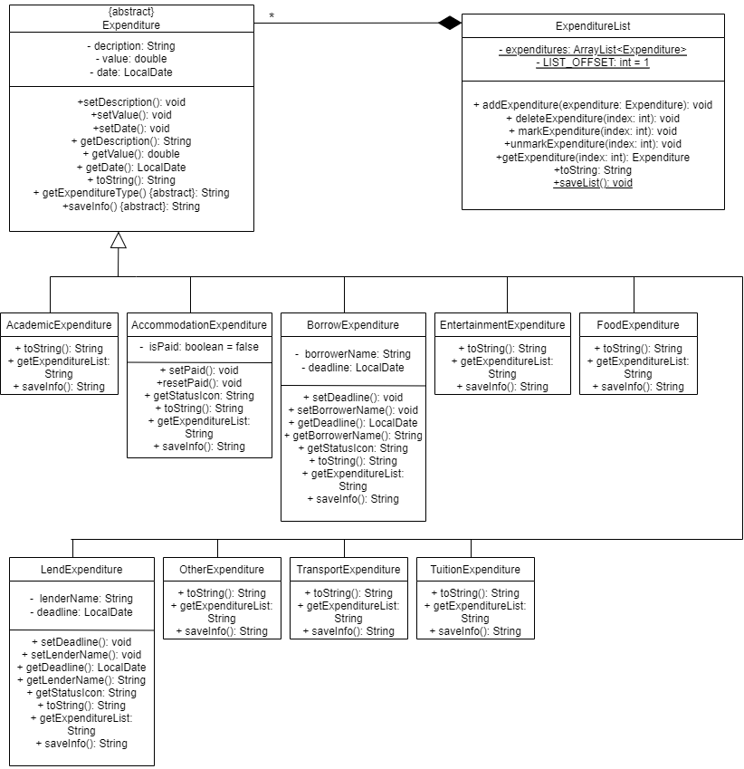
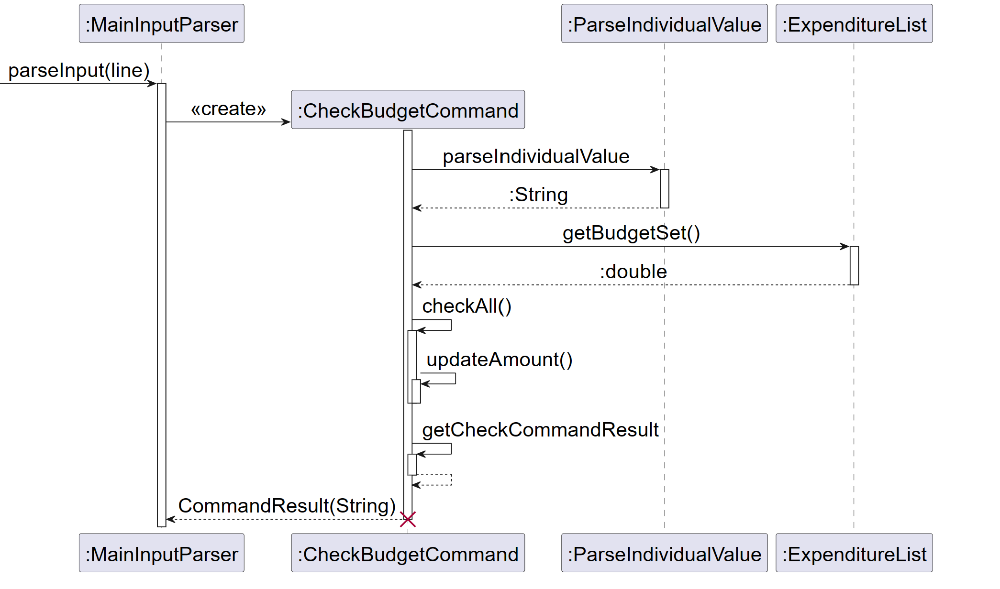

# MyLedger - Developer Guide

<p align="center">
    
</p>

<!-- TOC -->
* [MyLedger - Developer Guide](#myledger---developer-guide)
  * [1. Preface](#1-preface)
  * [2. Acknowledgements](#2-acknowledgements)
  * [3. Design & implementation](#3-design--implementation)
    * [3.1. Architecture](#31-architecture)
    * [Main Components of MyLedger](#main-components-of-myledger)
    * [3.2. Parser](#32-parser)
      * [Processing an input](#processing-an-input)
    * [3.3. Expenditure Categories](#33-expenditure-categories)
      * [3.3.1 Repeat dates for Accommodation and Tuition Expenditures](#331-repeat-dates-for-accommodation-and-tuition-expenditures)
    * [3.4. Command Component](#34-command-component)
    * [3.5. Storage](#35-storage)
      * [3.5.1 Saving expenditures after each input](#351-saving-expenditures-after-each-input)
      * [3.5.2 Loading the expenditure list from the save file on application launch](#352-loading-the-expenditure-list-from-the-save-file-on-application-launch)
      * [3.5.3 Corruption of saved expenditures](#353-corruption-of-saved-expenditures)
  * [4. Command List](#4-command-list)
    * [4.1. Add Expenditure Command](#41-add-expenditure-command)
      * [4.1.1 Add regular and lump sum expenditure valid inputs](#411-add-regular-and-lump-sum-expenditure-valid-inputs)
      * [4.1.2 Add lend borrow expenditure valid inputs](#412-add-lend-borrow-expenditure-valid-inputs)
    * [4.2. Edit Command](#42-edit-command)
    * [4.3. Delete Command](#43-delete-command)
    * [4.4. Find Command](#44-find-command)
    * [4.5. Duplicate Command](#45-duplicate-command)
    * [4.6. Sort Command](#46-sort-command)
    * [4.7. View Command](#47-view-command)
    * [4.8. Set Budget Command](#48-set-budget-command)
    * [4.9. Check Command](#49-check-command)
    * [4.10. Show Rates Command](#410-show-rates-command)
    * [4.11. Mark/Unmark Command](#411-markunmark-command)
  * [Product scope](#product-scope)
    * [Target user profile](#target-user-profile)
    * [Value proposition](#value-proposition)
  * [User Stories](#user-stories)
  * [Non-Functional Requirements](#non-functional-requirements)
  * [Instructions for manual testing](#instructions-for-manual-testing)
    * [Launch and shutdown](#launch-and-shutdown)
      * [Initial Launch](#initial-launch)
      * [Adding a record](#adding-a-record)
      * [Displaying the list of inputs and conversion rates](#displaying-the-list-of-inputs-and-conversion-rates)
      * [Deleting an expenditure](#deleting-an-expenditure)
      * [Editing an expenditure](#editing-an-expenditure)
      * [Duplicate an expenditure](#duplicate-an-expenditure)
      * [Sorting the list](#sorting-the-list)
      * [Set budget](#set-budget)
      * [Check budget](#check-budget)
      * [Mark/Unmark accommodation or tuition expenditures](#markunmark-accommodation-or-tuition-expenditures)
      * [Find keyword](#find-keyword)
<!-- TOC -->

<div style="page-break-after: always;"></div>

## 1. Preface

MyLedger is a desktop app for managing finances, designed for university students in the National University of Singapore (NUS), studying locally or on exchange. It is optimized for use via a Command Line Interface (CLI). For students that can type fast, MyLedger can help them record and classify their transactions into categories. Students can expect to get an overview of their transactions at a glance,
which helps them to monitor their budget and expenses more effciently.

All currency amounts used in MyLedger is based of the **Singapore Dollar (SGD)**.

This developer guide provides a detailed view of the overall structure of MyLedger V2.1 and explains how its components and functions are implemented. Additionally, it outlines the specific parameters that were established before feature development began. The aim is to help developers gain a comprehensive understanding of the application's operation and how to maintain it without difficulty.

## 2. Acknowledgements

The format of this developer guide was adapted from SE-EDU AddressBook Level 3 Developer Guide. The class and sequence diagrams are styled using draw.io

## 3. Design & implementation

### 3.1. Architecture

<p align="center">
    
    <i>Figure 1: Architecture Diagram for MyLedger</i>
</p>

The Architecture Diagram shown above is a high-level components within MyLedger. The ```MyLedger``` class contains the main method which
is responsible for:

1. When MyLedger is launched, it will initialize the ```Storage``` to load the saved expenditures from the textfile and  ```Ui``` to print
   the welcome message.
2. When corrupted entries are encountered when initializing ```Storage```, the respective entries will be deleted.
3. When MyLedger is executing, it receives input for the user and sends it to ```Storage``` then ```Command``` which carries out the various
   commands. 
4. After the command has been carried out ```Command``` sends the result back to ```MyLedger.main()``` which would print the message back to the user.

The other components of MyLedger include:

* ```Ui```: The user interface that prints the welcome and help message.
* ```Parser```: Parser which process the user's command and calls the specific command.
* ```Command```: Executes the command input by the user.
* ```Expenditure```: Constructs a corresponding expenditure category and is added to ```ExpenditureList```.
* ```ExpenditureList```: An ArrayList containing all records of expenditures.
* ```Storage```: Uses ```MyLedger_inputs.txt``` to initialize ```ExpenditureList```, updates ```MyLedger_inputs.txt``` whenever ```ExpenditureList```
  changed.

### Main Components of MyLedger
`Parser:` Processes the inputs made by the user and converts into a sensible form for further processing.

`Commands:` Matches the input command with the respective commands created and executes the command that produces a command result.

`Expenditures:` Expenditure information that allows the users to create expenditure records from their respective command classes, and access them from an expenditure list. 

`Storage:` Stores, reads and updates the user input into their local storage.

The following section describes the implementation of certain features.

### 3.2. Parser
#### Processing an input
The main parser component `MainInputParser` is called whenever the user inputs a command line that requires action from 
the application. The command word will be read and further processed into further components depending on the type of 
command, such as `ParseAdd`, `ParseDelete`, `ParseIndividualValue` etc. 

How the parsing works: 

  `MainInputParser`:
- The `MainInputParser` is called and is expected to return an object with the `Command` class.
- The respective classes (eg `ParseAdd`, `ParseSort`) will be called.
- For commands that requires an additional input after the command work (excludes commands like `list`, `help` etc), the
  `ParseIndividualValue` class will be called to parse all the input fields by the user.

The following shows the UML diagram used for the parser component implemented in MyLedger.
To reduce complexity of the sequence diagram, only commands `exit`, `lend` and `borrow` 
will be displayed

<p align="center">
    
    <br/>
    <i>Figure 2: UML diagram for the parser component</i>
</p>

It must be noted that not all the existing parser commands are included in this sequence diagram for parsing as other commands have a similar sequence diagram as the commands `exit` and 
`parseLendBorrow`. The only difference is the condition and the number of times the loop occurs for each separate command. 


### 3.3. Expenditure Categories
The list of **[methods](https://github.com/AY2223S2-CS2113-T14-3/tp/blob/master/src/main/java/seedu/expenditure/Expenditure.java)** of this component is specified in the super abstract class `Expenditure.java` and its sub-classes in the `expenditure` package. Its sub-classes represent the different expenditure categories. When users create a new expenditure record, one of these different expenditure categories are instantiated. After which, the expenditure is added to the expenditure list.

The list of **[methods](https://github.com/AY2223S2-CS2113-T14-3/tp/blob/master/src/main/java/seedu/expenditure/ExpenditureList.java)** of the expenditure list is specified in the `ExpenditureList.java` class.

The `Expenditure` class the following attributes:
- Fields: `date`, `amount`, `description`

The `ExpenditureList` class description is as follows:
- A representation of a list of expenditures. It is an `ArrayList<Expenditure>` container
- The list is instantiated at the start of the program and stores expenditures of type `Expenditure`.

The following table describes each and every expenditure category in detail and their utility towards the user.

| Expenditure Category     | Description                                                                                            |
|---------------|--------------------------------------------------------------------------------------------------------|
| Regular Expenditure Categories       | The regular expenditure categories consists of simple daily one-time expenditures. They are `AcademicExpenditure`, `EntertainmentExpenditure`, `FoodExpenditure`, `OtherExpenditure`, `TransportExpenditure`.      |
| Lump Sum Expenditure Categories   | The The `AccommodationExpenditure` and `TuitionExpenditure` are lump sum expenditure categories as they are paid over a period of time. These expenditures can be marked as complete for the year, and will be automatically unmarked by MyLedger annually on the same day to indicate that it is time for payment again. MyLedger will perform annual checks for the expenditures as shown [here].                  |
| Borrow Lend Expenditure Categories   | The `BorrowExpenditure` and `LendExpenditure` categories form the record of money being borrowed as loan, or lent out to be kept as a record.                    |

The following shows the UML diagram used for the Expenditure Categories component implemented in MyLedger.

<p align="center">
    
    <br/>
    <i>Figure 3: UML diagram for the Expenditure Categories component</i>
</p>

In the diagram, the aforementioned expenditure categories inherit from the `Expenditure` class. The `ExpenditureList` class is a composition of expenditures of `Expenditure` type. 

`Expenditure` has a multiplicity of `*` to `ExpenditureList` as an empty expenditure list is instantiated at the beginning of the program, and any number of expenditures can be added to the expenditure list. Thus, it is also observed that the `ExpenditureList` class is an *composition* of `Expenditure`.

#### 3.3.1 Repeat dates for Accommodation and Tuition Expenditures

It must be noted that the date input field for `AccommodationExpenditure` and `TuitionExpenditure` is the `date` of repeat. This is due to the fact that they are lump sum expenditure types as explained in the section [before](#33-expenditure-categories).

Below shows the sequence diagram of the `repeatDate` checking procedure.

<p align="center">
    
    <br/>
    <i>Figure 4: Sequence diagram for the repeat date logic</i>
</p>

Upon instantiating the `AccommodationExpenditure` or `TuitionExpenditure`, the user input date is entered similarly via the `d/DATE` field. Subsequently, the input date will be incremented to the subsequent year, where the expenditure is expected to require payment again, **unmarking** itself. This is known as the `repeatDate`.

MyLedger will constantly run `queryLumpSumDates()` in the main logic loop of the prorgam. As such, the instances of `AccommodationExpenditure` and `TuitionExpenditure` in the expenditure list are ran with `checkMark()`, which processes the main logic of the `repeatDate`.

The methods `checkNextRepeatDate()` and `handleNextRepeatDate()` will run continuously as aforementioned. Upon first instantiation, `checkNextRepeatDate()` runs in a loop as shown in figure 4. This loop increments the year of the `date` of repeat and updates it into the `repeatDate` attribute. The loop terminates when the year of repeat is subsequent to the current year. This ensures that the program will unmark the expenditures a full year from now.

Together with `checkNextRepeatDate()`. the `handleNextRepeatDate` method has an optional path that unmarks the expenditure as unpaid when `repeatDate` has been reached, or has been passed. After which, `repeatDate` is incremented to the next year and the optional path will not run again until a full year has passed. Unmarking of the expenditure is irregardless of whether the user has marked it previously.

For example, taking the current date as `2023-04-10`, the user can instantiate the `AccommodationExpenditure` with `accommodation d/2023-04-20 a/5000 p/Semester 2 payment`. In this instance, the user has identified the `date` of repeat to be on 20th April. Thus, this input date once entered will be incremented to `2024-04-20`; the `repeatDate` is now `2024-04-20`, where the next *Semester 2* payment is expected to be due again. Launching MyLedger on 20th April 2024, or after that date will cause the expenditure to be unmarked. It will also set the next `repeatDate` to `2025-04-20`.

It must be noted that to be able to store the `repeatDate` separetely to trigger the aforementioned events, it is saved in the txtfile as part of the `AccommodationExpenditure` or `TuitionExpenditure` information. The `repeatDate` is given a delimiter of `r/` for the txtfile. 


### 3.4. Command Component

The `Command` component is represented by the `command` package. The `command` package contains all the available user commands supported by the application. These commands are utilised by the user to interact with the expenditure types and the expenditure list. 

| Command Class                                                                                                                                                                                                                                                                                       |                                                                                                                  Responsibilities                                                                                                                   |
|-----------------------------------------------------------------------------------------------------------------------------------------------------------------------------------------------------------------------------------------------------------------------------------------------------|:---------------------------------------------------------------------------------------------------------------------------------------------------------------------------------------------------------------------------------------------------:|
| `AcademicExpenditureCommand` <br/> `AccommodationExpenditureCommand`<br/>`BorrowExpenditureCommand`<br/>`EntertainmentExpenditureCommand`<br/>`FoodExpenditureCommand`<br/>`LendExpenditureCommand`<br/>`OtherExpenditureCommand`<br/>`TransportExpenditureCommand`<br/>`TuitionExpenditureCommand` |                                                                            Contain the operations pertaining to adding a new expenditure into the list of expenditures.                                                                             |
| `CheckBudgetCommand`                                                                                                                                                                                                                                                                                | Contains the operations pertaining to comparing the total expenditure amount with a budget set by the user. The budget is set with the `SetBudgetCommand`. User can also compare budget with respective optional filters such as date and category. |
| `DeleteCommand`                                                                                                                                                                                                                                                                                     |                                                                        Contains the operations pertaining to deleting a specific expenditure from the list of expenditures.                                                                         |
| `DuplicateCommand`                                                                                                                                                                                                                                                                                  |                                                                       Contains the operations pertaining to duplicating a specific expenditure from the list of expenditures.                                                                       |
| `EditCommand`                                                                                                                                                                                                                                                                                       |                                                                          Class contains the operations pertaining to editing a expenditure from the list of expenditures.                                                                           |
| `ExitCommand`                                                                                                                                                                                                                                                                                       |                                                                                          Class contains the operation that safely closes the application.                                                                                           |
| `FindCommand`                                                                                                                                                                                                                                                                                       |                                                     Class contains the operations pertaining to searching the list of expenditures for expenditures that match the keyword entered by the user.                                                     |
| `HelpCommand`                                                                                                                                                                                                                                                                                       |                                                          Class contains the operation pertaining to providing the user a user interface to the instructions on the use of the application.                                                          |
| `InvalidCommand`                                                                                                                                                                                                                                                                                    |                                                                                     Class is instantiated when an unrecognised command is entered by the user.                                                                                      |
| `ListExpenditureCommand`                                                                                                                                                                                                                                                                            |                                                                                      Contain the operations regarding list display in user preferred currency.                                                                                      |
| `SetBudgetCommand`                                                                                                                                                                                                                                                                                  |                                                                               Class contains the operations in setting an amount of money users would like to budget.                                                                               |
| `ShowRatesCommand`                                                                                                                                                                                                                                                                                  |                                                                                Contains the fixed conversion rates used when toggling between different currencies.                                                                                 |
| `SortCommand`                                                                                                                                                                                                                                                                                       |                                                                         Class contains the operations pertaining to sorting the list of expenditures by amount or by date.                                                                          |
| `ViewDateExpenditureCommand` <br/> `ViewTypeExpenditureCommand`                                                                                                                                                                                                                                     |                                                                            Class contains the operation pertaining to viewing the date and type of the expenditure list.                                                                            |

Below represents the UML class diagram representing all the command classes that instantiates an expenditure record:

<p align="center">
    
    <br/>
    <i>Figure 5: UML diagram for the expenditure command classes</i>
</p>

Next follows the command classes that interact with pre-existing expenditure records stored in the expenditure list. The table below describes the commands.

A more detailed coverage is explored in [Command List](#4-command-list).

### 3.5. Storage

#### 3.5.1 Saving expenditures after each input

The class `TxtFileStatus` and `ExpenditureList` are involved in storing the expenditure list.
After every user input is completed, the `saveExpenditureList` method is called, and the text file will be
updated with all the current expenditures in the expenditure array list.

<p align="center">
    
    <br/>
    <i>Figure 6: Sequence diagram for the process of saveExpenditureLists</i>
</p>

The following sequence diagram shows the details of the process for saveExpenditureList.

#### 3.5.2 Loading the expenditure list from the save file on application launch

Likewise when MyLedger launches, it instantiates an expenditure list from `ExpenditureList`, and stores a reference to it.

MyLedger then checks if the text save file exists, else it gets created. All the recorded expenditure stored 
as a string in the text file is then added to the array list in ExpenditureList. This is done by iterating through all the saved and valid strings in the text file, taking the saved expenditures and instantiating them as expenditures into the expenditure list. 

Subsequently, all `AccommodationExpenditure` and `TuitionExpenditure` are queried to check if the next repeat date has passed. Should the day current date of application launch be on the repeat date, or if it has passed, MyLedger will ensure that the expenditures are unmarked to serve as a reminder for next payment.

However, should a saved expenditure in the text file be corrupted, it will be isolated and deleted upon launch. Conditions for file corruption are explained in the [here](#353-corruption-of-saved-expenditures).

Below shows the sequence diagram for the reading of the save file upon launch.

<p align="center">
    
    <br/>
    <i>Figure 7: Sequence diagram for the reading feature of TxtFileStatus</i>
</p>

#### 3.5.3 Corruption of saved expenditures

Expenditures in the saved file are deemed as corrupted when one of the following conditions are met:

| Condition                                                                                                        | Justification                                                                                                                                                                                         |
|------------------------------------------------------------------------------------------------------------------|-------------------------------------------------------------------------------------------------------------------------------------------------------------------------------------------------------|
| i. Missing delimiters or inputs that are not able to be parsed                                                   | This implies that the saved expenditure can no longer be parsed and is removed to prevent affecting inaccurate information to be displayed.                                                           |
| ii. Invalid amounts                                                                                              | As described in the next section [4.1.1](#411-add-regular-and-lump-sum-expenditure-valid-inputs), invalid amount inputs are deemed corrupted as MyLedger does not support them.                       |
| iii. Invalid dates for Lend and Borrow Expenditures                                                              | As described in the next section [4.1](#41-add-expenditure-command), deadlines cannot occur before the date of expenditure and current date, and hence is abided when reading the save file.          |
| iv. `AccommodationExpenditure` and `TuitionExpenditure` repeat dates differing from first user-initialised dates | The aforementioned expenditure types are designed to repeat on the user specified dates annually. Any difference implies corruption and is removed to prevent inaccurate information to be displayed. |

**Note of iv:**
- `repeatDate`, as all other dates, is stored in `yyyy-MM-DD` format.
- Corruption for the year segment is **not** deemed as a corruption, as MyLedger's repeating date feature   will automatically set it forward to the correct year it is supposed to repeat on. 
- Corruption for the day and month implies the difference between the first user-initialised date and repeat dates. Thus, **is** deemed as a corruption.

## 4. Command List

### 4.1. Add Expenditure Command 

The `AcademicExpenditureCommand`, `AccommodationExpenditureCommand`, `EntertainmentExpenditureCommand`, `FoodExpenditureCommand`, `OtherExpenditureCommand`, `TransportExpenditureCommand`, `TuitionExpenditureCommand` commands contain the operations to add an expenditure of a fixed category into the list of expenditures. As these expenditure types take in the same fields, the `BorrowExpenditureCommand` and `LendExpenditureCommand` have been isolated from these commands. 

This is due to the fact that the 7 formerly stated commands all take in the same fields, and hence can be parsed in a similar fashion to instantiate the **Expenditure Command**, and later the **Expenditure** itself. In other words, the 7 stated commands are instantiated in the same way and will be explained altogether in this section.

To instantiate the command classes, the full commands are the shown in the table below:

| Field     | Valid inputs                                                                                            |
|---------------|--------------------------------------------------------------------------------------------------------|
| Regular Expenditure Categories     | `AcademicExpenditureCommand`: `academic d/<date> a/<amount> p/<description>`<br/>  `EntertainmentExpenditureCommand`: `entertainment d/<date> a/<amount> p/<description>`<br/>  `FoodExpenditureCommand`: `food d/<date> a/<amount> p/<description>`<br/> `OtherExpenditureCommand`: `other d/<date> a/<amount> p/<description>`<br/> `TransportExpenditureCommand`: `transport d/<date> a/<amount> p/<description><br/>`.      |
| Lump Sum Expenditure Categories  | `AccommodationExpenditureCommand`: `accommodation d/<date> a/<amount> p/<description>`<br/> `TuitionExpenditureCommand`: `tuition d/<date> a/<amount> p/<description>`.             |
| Lend Borrow Expenditure Categories  | `BorrowExpenditureCommand`: `borrow d/<date> n/<name of party borrowed from> a/<amount> b/<return date> p/<description>`<br/>  `LendExpenditureCommand`: `lend d/<date> n/<name of party lent to> a/<amount> b/<return date> p/<description>`.                    |

Running the `command` classes for the aforementioned expenditure categories are parsed through the `parser` package. As such, all inputs received are checked in the latter package, and once deemed valid instantiates the respective expenditures in the `expenditure` package. The following section describes the valid inputs for each of the fields.

For both **regular expenditure categories** and **lump sum expenditure categories**, the explanation is as follows: 

When the user inputs one of the 7 expenditure commands into the application, the `MainInputParser.java` takes in the input and determines the command's operations via switch statements. Next, the `ParseIndividualValue.java` class contains the operation to split the valid input given by the user. This splits the inputs into fields to instantiate the `command` classes belonging to their respective expenditure categories. After splitting, `MainInputParser.java` calls operations from `ParseAdd.java`. `ParseAdd.java` prepares the split inputs for the Expenditure categories in the `command` package as fields, and instantiates one of its seven command classes based on the user's specified expenditure category. 

Upon `execute()`, The command classes then instantiates the respective `expenditure` and adds it to the expenditure list. For example the execution of the `AcademicExpenditureCommand` instantiates the `AcademicExpenditure` and adds it to the expenditure list belonging to the `ExpenditureList` class.


#### 4.1.1 Add regular and lump sum expenditure valid inputs

The fields for the regular and lump sum expenditure categories are as follows:

- `date`: Input as a `String`, parsed in `yyyy-MM-DD` format.
- `amount`: Input as a `String`, parsed to `double`.
- `description`: Input as a `String`, no restriction on input.

Below depicts the table explaining the fields and their valid inputs:

| Field     | Valid inputs                                                                                            |
|---------------|--------------------------------------------------------------------------------------------------------|
| `date`     | Parsed in `yyyy-MM-DD` format. Violating the format raises the `DateTimeParseException` and is not allowed.    |
| `amount`  | Since this is parsed to a `double`, it raises the following exceptions when:<br/> `InvalidCharacterInAmount`: When special characters such as `.d`, `.e` and `.f` are input<br/> `NumberFormatException` : When numbers are not input<br/>  `SmallAmountException`: When amount input is less than the supported $0.01 SGD<br/>  `NotPositiveValueException`: When a negative value is input as the amount<br/>  `LargeValueException`: When a value larger than $10000000 SGD is input<br/> `WrongPrecisionException`: When more than 2 decimal places is input   |
| `description`  | There is no restriction on the description. Users are free to enter any description they like.                    |

**Note for lump sum expenditures:**

As per section [3.3.1](#331-repeat-dates-for-accommodation-and-tuition-expenditures), the date field for `AccommodationExpenditure` and `TuitionExpenditure` are indicators of the `date` of repeat. Thus, the aforementioned expenditures will be unmarked a full year from the `date` entered.

Below shows the sequence diagram for the `AcademicExpenditure` for the aforementioned logic:

<p align="center">
    
    <br />
    <i>Figure 8: Sequence Diagram for edit Command</i>
</p>

This diagram is applicable to all **regular and lump sum** expenditure categories.

#### 4.1.2 Add lend borrow expenditure valid inputs

Following the valid inputs for the `date`, `amount` and `description`, the `BorrowExpenditureCommand` and `LendExpenditureCommand` has two additional fields:

- `borrowerName` or `lenderName`: Input as a `String`, parsed as a `String`.
- `deadline`: Input as a `String`, parsed in `yyyy-MM-DD` format.

Below depicts the table explaining the valid inputs for the two aforementioned fields:

| Field     | Valid inputs                                                                                            |
|---------------|--------------------------------------------------------------------------------------------------------|
| `borrowerName` or `lenderName`     | Parsed as a `String`. Since delimiters follow this field in the command interface, `/` are not encouraged to be entered together with the names.     |
| `deadline`  | The following exceptions will be raised when:<br/> `DateTimeParseException`: When date provided is not in the correct format<br/> `InvalidDeadlineException`: When date provided is before the `date` added, and before the **current date**. |

Justification for the `InvalidDeadlineException` after current date:

The `InvalidDeadlineException` is thrown when the `deadline` entered is before the current date. This is the Lend and Borrow expenditure categories help keep track of ongoing lent or borrowed amounts. Past records incur a net expenditure of 0 and thus is more meaningful to allow users to enter a `deadline` after the current date to help them keep track of ongoing lend and borrow expenditures.

To instantiate the commands, the full commands for `lend` and `borrow` are the following:

- To create a lend expenditure.
``` 
lend d/2023-04-07 n/Mr Bean a/400 b/2023-07-01 p/Flight ticket 
```
- To create a borrow expenditure.
```
borrow d/2023-04-07 n/Teddy a/400 b/2023-07-01 p/Flight ticket
```

The sequence diagram for lend and borrow has been previously shown as an example for the `Parser` class.

### 4.2. Edit Command

The ```EditCommand``` edits an existing expenditure in the record.

It cannot change the expenditure type of a record, only its fields

For editing an expenditure, the full command is  ```edit INDEX d/DATE a/AMOUNT p/DESCRIPTION```

For editing a borrow/lend record, the full command is  ```edit INDEX d/DATE n/(LEND/BORROW)_NAME 
a/AMOUNT b/DEADLINE p/DESCRIPTION```
       
The sequence diagram below shows the interactions of a successful execution of the EditCommand

<p align="center">
    
    <br />
    <i>Figure 9: Sequence Diagram for edit Command</i>
</p>

### 4.3. Delete Command

The `delete` command deletes an existing expenditure in the record.

The format for delete is ```delete INDEX```

Similar to the process for `edit`, `MainInputParser` has recognized the command, `ParseDelete` is called, which in turn calls `DeleteCommand` that calls `deleteExpenditure` in `ExpenditureList` and returns the string containing the string to print for delete. 

### 4.4. Find Command

The ```FindCommand``` provides the search functionality for finding a specific or few transactions from the list of transactions by their respective descriptions. 

The command is able to search for all characters matching the keyword in the expenditure descriptions and the keyword is case-sensitive.

Similar to the process for `edit`, `MainInputParser` has recognized the command, `ParseFind` is called, which in turn calls `FindCommand` which loops through the Expenditure
list and compares the keyword provided with the the descriptions. 

### 4.5. Duplicate Command

The `duplicate` command duplicates an existing expenditure in the record, and appends it to the list.

The format for duplicate is ```duplicate INDEX```

Similar to the `delete` command, after `MainInputParser` has recognized the command, `ParseDuplicate` is called, which in turn calls `DuplicateCommand` which calls `duplicateExpenditure` in `ExpenditureList` and returns the string containing the string to print for duplicate.

### 4.6. Sort Command

The `sort` command sorts the expenditure list by the `sortType` indicated by the user. 

Format:  `sort <sortType>`

The `sortType` is expressed in the table below:

| `sortType`     | Description                                                                                            |
|---------------|--------------------------------------------------------------------------------------------------------|
| `ascend`       | The sort type `ascend` sorts the list in ascending amount.       |
| `descend`       | The sort type `descend` sorts the list in descending amount.       |
| `earliest`       | The sort type `earliest` sorts the list from the earliest date.       |
| `latest`       | The sort type `latest` sorts the list from the earliest date.       |

The logic of the sort command is as follows:

When the user inputs the command `sort`, the `MainInputParser` identifies it and calls `sortExpenditures` from `ParseSort`. It then checks if the given `sortType` follows the valid inputs as expressed in the table above. Should the input given be none of the aforementioned valid inputs, the `sortExpenditures` method throws an `InvalidSortInputException` and displays the error message to the user.

On a valid `sortType` input, the `SortCommand` is instantiated from the `command` classes. This then sets the `sortType` attribute of this instance to be the valid input entered by the user. 

Upon calling of the `execute` command, the `SortCommand` takes the set attribute of `sortType` and runs it through a switch statement. Based on the valid inputs mentioned in the table above, the execution of this method sorts the expenditure list by the given input. This subequently produced the `CommandResult` that displays the new sorted list to the user, and is **permanent** to provide a better user experience for users after sorting the list.

After which, the instance of SortCommand is ready for Java's Garbage Collection.

### 4.7. View Command

The view command filters and lists the expenditures of a specified date or type.
At the end of the list, the total amount of the filtered expenditures are tabulated.
For viewing expenditures of specific date, the command is ```viewdate DATE```.
For viewing expenditures of specific type, the command is ```viewtype EXPENDITURE_TYPE```.

The sequence diagram below shows the details of the process for viewdate.

<p align="center">
    
    <br />
    <i>Figure 10: Sequence Diagram of the process for viewdate</i>
</p>

With the addition of a currency feature, the specificDateString method in ExpenditureList also gets a value converted to the 
specified currency using `getConvertValue()` found in Expenditure and appends it to the string, instead of the `getValue()`
also in Expenditure used previously.

The process for viewtype is similar as viewdate with an additional step within ViewTypeExpenditureCommand
that converts the input string into a string recognisable for comparison in the opt block. 

### 4.8. Set Budget Command
The set budget command allows the user to insert a temporary budget which they can use to compare their expenditures with.
This provides an insight on their financial health when compared to their current budget for the month, day or even for the type of expenditure.

### 4.9. Check Command
The check command allows the user to compare their expenditure with their budget.
The user can either check with the total expenditure using the `check` command, or provide an optional field to filter their comparison.

The sequence diagram for `check` without parameters can be observed as follows.
<p align="center">
    
    <br/>
    <i>Figure 11: UML diagram of check command </i>
</p>

The UML diagrams for `check` with dates as the filter (eg. `check y/2023` or `check d/03-04-2023`) are the same but with slightly different method name, thus the above can 
accurately represent the check commands.

### 4.10. Show Rates Command

`showrates` is a command that prints a list of currencies available in MyLedger with their value tied to SGD.


`showrates` is a simple command where `MainInputParser` calls `getRates` in the `CurrencyValue` class that returns a string to be printed for `showrates`.

It must be noted that all currency options provided is based of the NUS Partner Universities as found [here](https://www.nus.edu.sg/gro/global-programmes/student-exchange/partner-universities)

### 4.11. Mark/Unmark Command

The `mark` and `unmark` functions in the system are applicable only to the `AccommodationExpenditure` and `TuitionExpenditure`. These functions serve to indicate that the user has paid for the respective expense and it is considered as paid in the system. This enables accurate tracking of the expenditure amount when check function is called. If an expense is not marked as paid, it will not be considered as a paid expenditure.

For other types of expenses, they will be marked as paid right after they are added by the user, and cannot be modified thereafter.

<div style="page-break-after: always;"></div>

## Product scope
### Target user profile

- University students studying locally or on exchange 
- has a need to monitor their budget and expenses
- prefer desktop CLI over other available types of expense tracking applications 
- prefers typing to mouse interactions

### Value proposition

Manage finances more efficiently than a typical mouse/GUI driven app

## User Stories

| Version | As a ...         | I want to ...                                                  | So that I can ...                                                  |
|---------|------------------|----------------------------------------------------------------|--------------------------------------------------------------------|
| v1.0    | first time user  | have access to a help page                                     | be familarized with the features available                         |
| v1.0    | user             | add a expenditure recorded in a day                            |                                                                    |
| v1.0    | user             | delete an expenditure record                                   | get rid of expenditure that I no longer plan to use                |
| v1.0    | user             | edit an expenditure record                                     | correct previous expenditure records                               |
| v1.0    | user             | view all current expenses                                      | have a good overview of my spending to date                        |
| v1.0    | user             | add a record for borrowing money                               | keep track of how much money I borrowed to someone                 |
| v1.0    | user             | add a record for lending money                                 | keep track of how much money I lent to someone                     |
| v2.0    | user             | sort expenditures based on date                                | better manage my expenditures                                      |
| v2.0    | user             | sort expenditures based on amount                              | better manage my expenditures                                      |
| v2.0    | user             | add income earned                                              | keep track of my current budget                                    |
| v2.0    | user             | find expenditures using description                            | better manage my spending                                          |
| v2.0    | user             | duplicate a current expenditure                                | update repeated purchases easily                                   |
| v2.0    | user             | indicate a specific budget to follow                           | track my spending and make sure I stay within budget               |
| v2.0    | user             | be able to view expenses by day                                | see which day and why I am overspending                            |
| v2.0    | user             | view my total expenses by categories                           | see which categories I am overspending on                          |
| v2.0    | user             | compare my expenses with my budget                             | have a clearer insight on the health of my finances                |
| v2.1    | exchange student | view my expenses in my native currency                         | better understand how much I am spending in Singapore              |
| v2.1    | user             | compare my budget with expenses made in a specific time period | have a clearer insight on my spending during the time period       |
| v2.1    | user             | compare my budget with expenses made under a category          | have a clearer insight on my spending in that expenditure category |
| v2.1    | user             | have my repeated expenses auto-check on its own                | reduce the hassle of having to input repeated expenditures         |


<div style="page-break-after: always;"></div>

## Non-Functional Requirements

1. Program should run on any mainstream OS that runs Java 11.

## Instructions for manual testing

The following are instructions for testers to manual test:

### Launch and shutdown
#### Initial Launch
- Ensure that Java 11 is installed on your device.
- Download the JAR file and copy into an empty folder
- Open the command terminal on your device.
- Navigate to the folder in command terminal and run the command `java -jar [filename].jar`
- Alternatively, double-click on the JAR file to run the app.

#### Adding a record
1. Adding an expenditure

Test Case 1:
```
academic d/2023-02-02 a/25.10 p/NUS
```
Expected :
```
Added academic expenditure: [Academic] || Date: 2 Feb 2023 || Value: 25.1 || Description: NUS
```
An expenditure of type : `academic` will be added if all inputs are added in the correct format. 
<br /> Otherwise, error messages will be printed.

Test Case 2:
```
food d/2023-03-03 a/5.30 p/Fish Soup
```
Expected :
```
Added food expenditure: [Food] || Date: 3 Mar 2023 || Value: 5.3 || Description: Fish Soup
```
An expenditure of type `food` will be added

Test Case 3 (Wrong date-time input):
```
transport d/13-03-2023 a/2 p/Bus
```
Expected :
```
Date error! Please enter a single date in yyyy-mm-dd format!
```

Test Case 4 (Wrong input format):
```
transport d/2023-03-13 a/two dollars p/Bus
```
Expected :
```
The amount you provided is not in the right format! Please enter a single number value
```

2. Adding a lend/borrow spending
- Important information: Our application does not support names with slash (/), thus input names should not have them.
   
Test Case 1:
```
lend d/2023-02-02 n/Bob a/25.10 b/2023-06-02 p/CS2113
```
Expected :
```
Added lend expenditure: [Lend] || Lent to: Bob || Date: 2 Feb 2023 || Value: 25.1 || Description: CS2113 || by: 2 Jun 2023
```
Similar to add an expenditure, adding a lend/borrow will add the expenditure to the list. 
Details of all parameters will be shown to the user.

Test Case 2:
```
borrow d/2023-02-02 n/Mandy a/25.10 b/2023-09-02 p/payment for notes
```
Expected :
```
Added borrow expenditure: [Borrow] || Borrowed from: Mandy || Date: 2 Feb 2023 || Value: 25.1 || Description: payment for notes || By: 2 Sep 2023
```
Similar to previous, but with a different expenditure type : `borrow`.

Test Case 3 (Return date is earlier than current date):
```
borrow d/2023-02-02 n/Marco a/10.10 b/2023-03-03 p/bowling
```
Expected :
```
Return date must be after today's date! Today's date is 2023-04-07```
```
Today's date in the expected output will correspond to the day that the user is using MyLedger.
In our example case, the day in which the user was attempting to add the `borrow` command was on 2023-04-07.

#### Displaying the list of inputs and conversion rates
1. Displaying list of conversion rates

Test Case:
```
showrates
```
Expected :
```
Currency rates per SGD:
AUS: 1.11
CAD: 1.01
CNY: 5.07
DKK: 5.15
EUR: 0.69
GBP: 0.61
ILS: 2.7
JPY: 99.96
KRW: 989.05
NOK: 7.78
NZD: 1.2
SEK: 7.8
TWD: 22.98
USD: 0.75
```
Currency rates used are aimed to provide an estimate on their spending in SGD, and does not provide real-time conversion rates.

2. Displaying the list based on currency preferred.
- Prerequisite: The currency must be 1 of the 14 currencies supported. User can view the available currencies using 
`showrates`. Additionally, there must be at least one expenditure in the list to view in different currencies.
Test Cases below will assume that the following expenditure has been added prior to calling `list`

```
food d/2023-02-12 a/8.00 p/Fast Food
```

Test Case 1 (Display in SGD):
```
list SGD
```
Expected :
```
Here is your list of expenditures in SGD:
1. [Food] || Date: 12 Feb 2023 || Value: 8.00 || Description: Fast Food
```

Test Case 2 (Display in USD):
```
list USD
```
Expected :
```
Here is your list of expenditures in USD: 
1. [Food] || Date: 12 Feb 2023 || Value: 6.00 || Description: Fast Food
```

Test Case 3 (No currency):
```
list
```
Expected :
```
Input command does not have required parameters! Please try again
```
The command `list` is missing currency, thus no list will be displayed.

#### Deleting an expenditure
1. Deleting an expenditure from the list of inputs.
- Prerequisite: There should be at least one expenditure in the list for `delete` to work. The list can be checked in 
SGD using the `list SGD` command

Test Case 1:
```
delete 1
```
Expected :
```
Entry has been deleted
Here is your updated list: 
```

Test Case 2:
```
delete -1
```
Expected :
```
Index is out of bounds or negative
```

Test Case 3:
```
delete 1.1
```
Expected :
```
Index must be an integer and within bounds! Please try again
```
#### Editing an expenditure
1. Editing a current expenditure within the list of inputs.
- Prerequisite : Similar to delete, an existing expenditure is required. 
- Important information: Our application does not support names with slash (/), thus when editing lend/borrow 
expenditures, input names should not have slashes.


- Assumption : Test cases provided are for expenditures with the corresponding parameters. Parameters for normal 
expenditures cannot to edit lend/borrow expenditures

Test Case 1 (Editing `food` expenditure):
```
edit 1 d/2023-02-12 a/8.00 p/Western
```
Expected :

Assuming this test case is for a normal expenditure, all the previous parameters will be replaced with
the new input parameters. An edit message will be shown as well.

```
Edited! Here is the updated list:
1. [Food] || [ ] || Date: 12 Feb 2023 || Value: 8.0 || Description: Western
```

Test Case 2 (Editing `lend` expenditure):
```
edit 2 d/2020-02-02 n/Carl a/22.2 b/2020-03-03 p/fishing
```
Expected :

Assuming this test case is for a lend/borrow expenditure, all the previous parameters will be
replaced with the new input parameters. An edit message will be shown as well.

```
Edited! Here is the updated list:
1. [Food] || Date: 12 Feb 2023 || Value: 8.0 || Description: Western
2. [Lend] || Lent to: Carl || Date: 2 Feb 2020 || Value: 22.2 || Description: fishing || by: 3 Mar 2020
```

Test Case 3 (Editing expenditure with `lend` parameters):
```
edit 1 d/2020-02-02 n/Carlos a/22.2 b/2020-03-03 p/fishing
```
Expected :

As the input parameters are different, an invalid message will be returned. Expenditure
will not be edited.
```
Failed to edit! Please check the format and try again!
```

Test Case 4:
```
edit 1
```
Expected :
```
Index must be an integer and within bounds! Please try again
```

Other invalid `edit` commands: 

eg. 
```
edit -1 d/2020-02-02 n/Carl a/22.2 b/2020-03-03 p/fishing
```
Expected : Invalid message similar to previous invalid cases will be provided.

#### Duplicate an expenditure
1. Duplicating an expenditure from the list of inputs.
- Prerequisite: There should be at least one expenditure in the list for `duplicate` to work. The list can be checked
in SGD using the `list SGD` command

Test Case 1:
```
duplicate 1
```
Expected : The duplicate expenditure will be shown to the user, and will be added to the last index in the list.


Test case 2:
```
duplicate 1.2
```
Expected :
```
Index must be an integer and within bounds! Please try again
```

Other invalid `duplicate` commands: eg. `duplicate`

Expected : Similar to previous, an invalid message with the error will be displayed for the user.

#### Sorting the list
- Prerequisite : A list with more than 2 expenditures are saved, which can be checked with the `list` command

Test case 1 (Sort amount in ascending order):
```
sort ascend
```
Expected : The new list will be shown, where the items are sorted by ascending amount with the smallest 
amount at index 1

Test case 2 (Sort amount in descending order):
```
sort descend
```
Expected : In contrast to previous test case, item will be sorted in descending order with largest amount
at index 1

Test case 3 (Sort amount from the earliest date added):
```
sort earliest
```
Expected : New list with the earliest date at index 1 

Test case 4 (Sort amount from the latest date added):
```
sort latest
```
Expected :  In contrast to previous test case, new list with the latest date at index 1

#### Set budget
1. Setting a temporary budget that the user might be on

Test case 1:
```
set 1.0
```
Expected :
```
New budget of 1.0 has been set!
```

Test case 2:
```
set -12.2
```
Expected :
```
Amount entered must be positive! Please try again
```

Other invalid `set` commands: 
eg. 
```
set 3-3
```
Expected : Similar to previous, an invalid message with the error will be displayed for the user.

#### Check budget
1. Checking the total amount of spending and the intended budget.
- Prerequisite :  A budget must be set prior to calling `check` and the budget set cannot be of value 0.

For all `check` commands, it compares with expenditures that are unmarked. Marked expenditures will not be added
to total expenditure amount.

Test case 1 (Budget set is more than total expenditures in list):
```
check
```
Expected : The amount of money away from the set budget will be displayed with other information such as
the total spending, budget and borrowed money.

Test case 2 (Budget set is less than total expenditures in list):
```
check
```
Expected : Similar to previous test case, amount of money exceeded by and other information will be
displayed in the message.

2. Checking the expenditure on a certain day/month/year with the intended budget
- `check` compares the budget with the spending of a certain time period that the user wants to check with

Test case 1 (Check with year):
```
check y/2023
```
Expected : Returns the comparison result with the expenditures made in 2023.

Test case 2 (Check with month):
```
check m/2023-01
```
Expected : Returns the comparison result with the expenditures made in Jan 2023. 

Test case 3 (Check with day):
```
check d/2023-01-12
```
Expected : Returns the comparison result with the expenditures made on 12 Jan 2023.

Test case 4:
```
check m/2023-01-12
```
Expected : 
```
Failed to check! Please check the format and try again!
```
Error occurs due to wrong format for parameter.

3. Checking the expenditure classified under a certain expenditure type and comparing with set budget
- `check [expenditure type]` compares all the unmarked expenditures classified under that expenditure type with the set
budget so that the user can compare spending with budget. This command does not include borrow and lend expenditures.

Test case 1:
```
check t/transport
```
Expected : Returns the comparison result with all unmarked transport expenditures.

Test case 2:
```
check t/academic
```
Expected : Returns the comparison result with all unmarked academic expenditures.

Test case 3:
```
check academic
```
Expected : 
```
Failed to check! Please check the format and try again!
```
#### Mark/Unmark accommodation or tuition expenditures
- Prerequisite: An accommodation or tuition expenditure must already exist in the list for the user to mark. 
The list can be checked in SGD using the `list SGD` command. A user may add an accommodation or tuition expenditure by
following the `Adding a record` documentation.

1. Marking an expenditure
- Mark indicates that the expenditure has been paid, otherwise the expenditure will be interpreted as unpaid.
- Prerequisite: Accommodation expenditure of such is stored at the first index of the list:
```
1. [Accommodation] || [ ] || Date: 3 Feb 2023 || Value: 200.00 || Description: NUS
```

Test case 1:
```
mark 1
```
Expected : 
```
Marked your expenditure!
```

Test case 2 (Attempt to mark other expenditures that are not accommodation or tuition):
```
mark 2
```
Expected :
```
No paid field for this expenditure!
```

Test case 3:
```
mark 1
```
Expected :
```
Sorry! This expenditure is already marked!
```

2. Unmarking an expenditure
- Unmark indicates that the previously paid expenditure is now unpaid due to certain circumstances.

Test Case 1:
```
unmark 1
```
Expected :
```
Unmarked your expenditure!
```
Test case 2 (Attempt to unmark other expenditures that are not accommodation or tuition):
```
unmark 2
```
Expected :
```
No paid field for this expenditure!
```
2. 
#### Find keyword
1. Finding keywords under the descriptions column in their list of expenditures

Test case 1:
```
find bus
```
Prerequisite : There are existing expenditures with the description : `bus`

Expected : List of items corresponding to the keyword will be displayed.

Test case 2:
```
find taxi
```
Prerequisite : There are no existing expenditures with the description : `taxi`

Expected : Message showing that no matching records are found in the list.

2. View specific date expenditures under the date column

Test case 1:
```
viewdate 2023-02-20
```
Prerequisite : There are current expenditures dated 20 Feb 2023.

Expected : List of all expenditures with the corresponding date value, as well as the total amount spent
on that specific date

Test case 2:
```
viewdate 2023-02-20
```
Prerequisite : There are no current expenditures dated 20 Feb 2023.

Expected : Similar to previous, but there will not be any items shown in the list. The total amount will
be shown as 0.

Test case 3:
```
viewdate 12 Jan 2021
```
Expected : Invalid message will be shown with the respective error message, in this case being a
date time error.

Other invalid `viewdate` commands: 
eg. 
```
viewdate
```
Expected : Similar to previous, an invalid message with the error will be displayed for the user.

3. View specific type of expenditure under the expenditure column

Test case 1:
```
viewtype transport
```
Prerequisite : There are current expenditures with the `transport` type.

Expected : List of all expenditures under transport expenditure, as well as the total amount spent
  for that type of expenditure

Test case 2:
```
viewtype transport
```
Prerequisite : There are no current expenditures with the `transport` type.

Expected : Similar to previous, but there will not be any items shown in the list. The total amount will
  be shown as 0.

Test case 3:
```
viewtype swimming
```
Expected : Invalid message will be shown with the respective error message, in this case an
invalid expenditure.