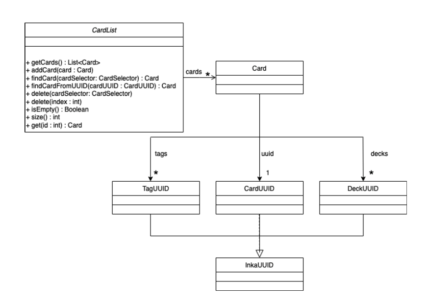
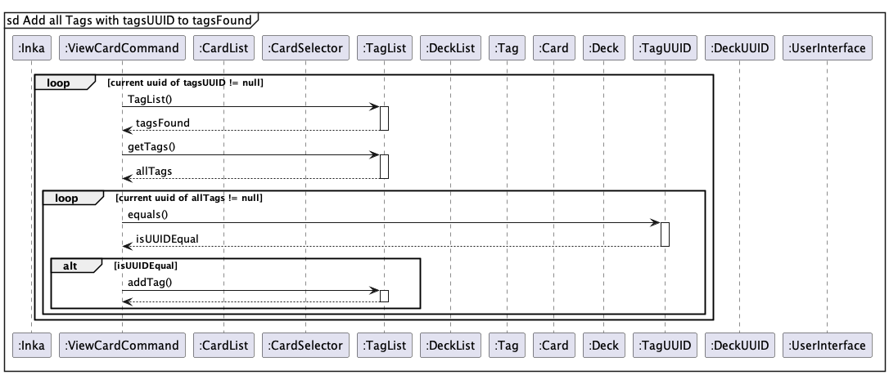
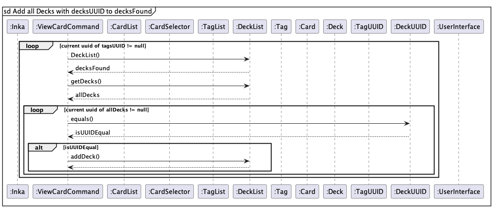
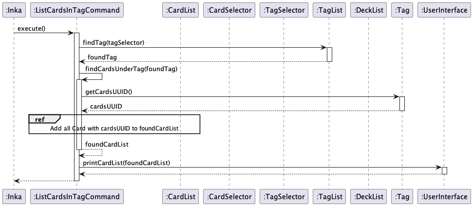

# Developer Guide

- [Acknowledgements](#acknowledgements)
- [Setting up, getting started](#setting-up-getting-started)
- [Design](#design)
    - [Architecture](#architecture)
    - [UI Component](#ui-component)
    - [Parser Component](#parser-component)
    - [Storage Component](#storage-component)
    - [CardList Component](#cardlist-component)
    - [TagList Component](#taglist-component)
    - [DeckList Component](#decklist-component)
- [Implementation](#implementation)

    - [card feature](#card-feature)
    - [tag feature](#tag-feature)
    - [deck feature](#deck-feature)

- [Appendix](#appendix)
    - [Target User Profile](#target-user-profile)
    - [Value Proposition](#value-proposition)
    - [User Stories](#user-stories)
    - [Non-Functional Requirements](#non-functional-requirements)
    - [Glossary](#glossary)
    - [Instructions for Manual Testing](#instructions-for-manual-testing)

---

## Acknowledgements

Third-party libraries:

- [Apache Commons CLI](https://commons.apache.org/proper/commons-cli/)
- [gson](https://github.com/google/gson)

---

## Setting up, Getting started

This repository was developed using [IntelliJ IDEA](https://www.jetbrains.com/idea/), and can be set up as per any
regular IntelliJ project.

For compliance with code style, developers may find it useful to import the `CS2113-codestyle.xml` formatter
configuration.

---

## Design

- [Architecture](#architecture)
- [UI Component](#ui-component)
- [Parser Component](#parser-component)
- [Storage Component](#storage-component)
- [CardList Component](#cardlist-component)
- [TagList Component](#taglist-component)
- [DeckList_Component](#decklist-component)

### Architecture

The following diagram describes the architecture of Inka:


- Red arrows show the path taken to parse user input
- Blue arrows show possible side-effects of executing the command

### UI Component

API: `UserInterface.java`

### Parser Component

API: `Parser.java`

Inka's parser has a hierarchical design built on top of Apache Commons CLI which allows for parsing of flags in any
order. Modularity also allows for new commands to be easily added.


The user's command is interpreted with the following structure:

```
<keyword> <action> [flag(s)]
```

For example, a command such as `card add -q QN -a ANS` would be broken down as:

- Keyword: `card`
- Action: `add`
- Flags
    - `-q`: Question text
    - `-a`: Answer text

When the user's input is passed to `Parser`:

1. User input is split into a series of _tokens_
2. `Parser` looks at the keyword token and dispatches the appropriate `KeywordParser`
3. `KeywordParser` looks at the action token and calls `OptionBuilder` to create an `Options` object for the flags it
   expects
4. Apache Commons CLI Parser is called with `Options`
5. The Apache Parser returns the arguments of the flags
6. The respective `Command` is constructed and returned through the parser chain
7. The `Command` is executed to modify state (`CardList`, `TagList` and `DeckList`), and may interact with
   the `UserInterface` and `Storage` objects to print output or save the program state respectively.

The following is the sequence diagram for parsing `card add -q QN -a ANS`:


### Selector Component

API: `CardSelector.java`, `TagSelector.java`

Complimentary to the parser design is the use of _selectors_ to allow the user more flexibility in how they choose to
specify a `Card` or a `Tag`.

- Aim: Allow the user to refer to a `Card` either by its `CardUUID` or its index in `card list`, and to refer to a `Tag`
  either by its name or its index in `tag list`
- Difficulties:
    - By design, the parsers should not require access to `CardList` or `TagList` to decouple the user input parsing and
      the actual application logic
    - The parsed `Command` should only fetch the corresponding `Card`/`Tag` once `Command::execute()` is run, hence
      requiring an intermediate representation

By encapsulating the identifier in a selector class, retrieving the actual instance of `Card`/`Tag`
from `CardList`/`TagList` can be deferred until `Command::execute()` is run.

The class diagram for the selector-style classes are as follows:


### Storage Component

API: `Storage.java`

Inka's storage functions operate in the `JsonStorage` class that extends the `Storage` class, that implements
the `IDataStorage` interface.
The methods `load()` and `save()` read and write to the filesystem respectively.
This also serves to implement the [export feature](#export-feature) .
It uses a `Memory` object as an intermediary to contain app data during serialization and deserialization.
It uses methods contained within the classes `JsonToMemory` and `MemoryToJson` to deserialize and serialize app save
data respectively.

The class diagram is as seen below:


### CardList Component

API: `CardList.java`

Inka's Cards are stored inside `CardList` Component. Each Card has a reference to its own randomly generated `uuid` as
well as a reference to `tags` and `decks`, which are essentially the UUIDs of the tags and decks that each card is
associated with.
`uuid` and `tags` and `decks` are stored in the form of `CardUUID`, `TagUUID` and `DeckUUID` class and all of them
inherit from the `InkaUUID` class.

The following describes the class diagram for CardList Component :



### TagList Component

API: `TagList.java`

Inka's TagList Component stores a list of `Tag` as tags. Each `Tag` contains its own uuid, which is auto generated in
the constructor of `Tag`, as well as the cards and decks that it
is associated with in the form of `CardUUID` and `DeckUUID`. All `CardUUID`, `TagUUID`, and `DeckUUID` inherit
from `InkaUUID` as they all
share the same methods and implementations.

The following describes the class diagram for TagList Component :


### DeckList Component

API: `DeckList.java`

Inka's DeckList Component stores a list fo `Deck` as decks. Each `Deck` contains its own `UUID`, which is auto generated
in the constructor of `Deck` as well as the tags and cards that is associated with, which are stored in the form of
`CardUUID`, `TagUUID`. As mentioned previously, `CardUUID`, `TagUUID` and `DeckUUID` inherit from `InkaUUID`.

The following describes the class diagram for the DeckList Component :


## Implementation

- [card feature](#card-feature)
- [tag feature](#tag-feature)
- [export feature](#export-feature)
- [deck feature](#deck-feature)

### Card Feature

The current functionalities:

- add a new Card (questions and answers) to the cardlist
- delete card from the cardlist
- show all cards the cardlist contains
- view the card by its uuid

#### Card Add

User input format for adding a card

```
card add -q QN -a ANS
```

For adding a card, a sample user input like `card add -q QN -a ANS` would be broken down as:

- Keyword: `card`
- Action: `add`
- Flags
    - `-q`: Question text
    - `-a`: Answer text

The implementation of `card add -q QN -a ANS` will be shown below :

1. When the user enters `card add -q QN -a ANS`, the input is passed to `Parser` class which
   calls `Parser::parseCommand()`. The parser detects the keyword "card", then calls the `Parser::CardKeywordParser()`
   on the user inputs excluding the "card" keyword.


2. The `Parser::CardKeywordParser()` further extracts the action keyword "add" from the user input, and calls
   the `CardKeywordParser::handleAdd()` method.


3. The method uses the Apache Commons CLI library to parse the remaining user input to create a `Card` object with the
   arguements of the flags "-q" and "-a" in the input as its question and answer, and returns an `AddCardCommand` with
   the created `Card` object. The sequence diagram for the first 3 steps has been shown in
   the [parser sequence diagram](#parser-component).


4. This `AddCardCommand` will call the `CardList::addCard()` function and add the created `Card` object to
   the `CardList`.


5. Lastly, `UserInterface` will print a success message and the current number of `Card` objects in the `CardList` with
   the corresponding functions.

The sequence diagram below shows how this feature of card works:


#### Card Delete

User input format for deleting a card

```
card delete [-i CARDINDEX | -c CARDUUID]
```

A sample user input, like `card delete -i 3` would be broken down as:

- Keyword: `card`
- Action: `delete`
- Flag
    - `-i`: Index of card to be deleted

The implementation of `card delete -i 3` will be shown below :

1. When the user enters `card delete [-i CARDINDEX | -c CARDUUID]`, the input is passed to `Parser` class which
   calls `Parser::parseCommand()`. The parser detects the keyword "card", then calls the `Parser::CardKeywordParser()`
   on the user inputs excluding the "card" keyword.

2. The `Parser::CardKeywordParser()` further extracts the action keyword "delete" from the user input and
   call `CardKeywordParser::handleDelete()` method.

3. The method uses the Apache Commons CLI library to parse the remaining user input, and returns a `DeleteCardCommand`
   with a `CardSelector` argument. The `CardSelector` object has two optional fields, an int field or an uuid field,
   used in identifying the `Card` object, in this case to be deleted. The sequence diagram for the first 3 steps has
   been shown in the [parser sequence diagram](#parser-component).

4. The `DeleteCardCommand` will first find the `Card` object to delete, then find all the `Tag` and `Deck` objects it is
   associated to by their uuids stored in the `Card` object, and delete the `Card` object's uuid from them.

5. Then the `Card` object is deleted from the `CardList`.

6. Lastly, `UserInterface` will print a success message and the current number of `Card` objects in the `CardList` with
   the corresponding functions.

The sequence diagram below shows how this feature of card works:


#### Card List

User input format for listing all card

```
card list
```

A sample user input, like `card list` would be broken down as :

- Keyword: `card`
- Action: `list`

The implementation of `card list` will be shown below :

1. When the user enters `card list`, the input is passed to `Parser` class which calls `Parser::parseCommand()`. The
   parser detects the keyword "card", then calls the `Parser::CardKeywordParser()` on the user inputs excluding the "
   card" keyword.
2. The `Parser::CardKeywordParser()` further extracts the action keyword "list" from the user input and
   call `CardKeywordParser::handleList()` method.
3. If there are no more user input after `card list`, a `ListCardCommand()` is returned. The sequence diagram for the
   first 3 steps has been shown in the [parser sequence diagram](#parser-component).
4. The command will call `UserInterface::printCardList()` method to print all `Card` objects in the `CardList`.

The sequence diagram below shows how this feature of card works:


#### Card View

The implementation of `card view {-c CARD_UUID | -i CARD_INDEX}` will be shown below :

- When the user enters `card view {-c CARD_UUID | -i CARD_INDEX}`, the input is processed by `Parser` which eventually
  returns a `ViewCardCommand`. The sequence diagram for this section has been shown [above](#parser-component).


- This `ViewCardCommand::execute()` will first find the card that is to be viewed by calling
  the `CardList::findCard()` which will in turn call the `CardSelector::getIndex()`
  and `CardSelector::getUUID()` depending on the flags and parameter specified by the user. `CardSelector` will then
  return the `cardToView` to `CardList` and then
  to `ViewCardCommand`.


- If the `cardToView` is not null, it will be passed to `UserInterface::printCard()` to be printed. `ViewCardCommand`
  will proceed to call `Card::getTagsUUID()` which will
  return `tagsUUID` and `Card::getDecksUUID()` which will return `decksUUID`.


- Once the `tagsUUID` is ready, `ViewCardCommand` will then call  `ViewCardCommand::findTagFromTagUUID` which will loop
  through each element `Tag` of `TagList`, call `Tag::getUUID()` and match it with every element of the `tagsUUID`
  previously. If the `Tag` element's uuid matches the uuid in `tagsUUID`, then the `Tag` will be added to a `tagsFound`
  and returned to `ViewCardCommand`(this part is shown in a separate reference frame).


- Similarly, once the `decksUUID` is ready, `ViewCardCommand` will then call  `ViewCardCommand::findDeckFromDeckUUID`
  which will loop through each element `Deck` of `DeckList`, call `Deck::getUUID()` and match it with every element of
  the `decksUUID` previously. If the `Deck` element's uuid matches the uuid in `decksUUID`, then the `Deck` will be
  added to a `decksFound` and returned to `ViewCardCommand`.
  (this part is also shown in a separate reference frame).

The sequence diagram below shows how this feature works:


Reference Frames :





### Tag Feature

Tag Feature currently supports the following functionalities :

- add a tag to a card
- delete a tag from the tagList and all the associated cards
- list all the existing tags in the tagList
- list all the cards under a tag
- edit the tag name

This guide will show two of the more complex implementation of the tag features, other tag-related features will be
similar :

#### Untag a Card

The implementation of the `card untag` feature is as follows:

- When the user enters `card untag {-c CARD_UUID} | -i CARD_INDEX} {-t TAG_NAME | -x TAG_INDEX}`, the input is processed
  by `Parser` which eventually returns a `RemoveTagFromCardCommand`. The sequence diagram for this section has been
  shown [above](#parser-component).


- This `RemoveTagFromCardCommand::execute()` will first find the card to remove the tag from by calling
  the `CardList::findCard()` which will in turn call the `CardSelector::getIndex()`
  and `CardSelector::getUUID()` depending on the flags and parameter specified by the user. `CardSelector` will then
  return the `cardAffected` to `CardList` and then back
  to `RemoveTagFromCardCommand`.


- `RemoveTagFromCardCommand` will then find the tag to delete from the card by calling `TagList::findCard(cardSelector)`
  which will in turn call the`TagSelector::getIndex()` and `TagSelector::getTagName()`  depending on the flags and
  parameter specified by the user. `TagSelector` will return the `tagToRemove` to `TagList` and then back
  to `RemoveTagFromCardCommand`.


- After `cardAffected` and `tagToRemove` is ready, `RemoveCardFromTagCommand` will
  call `RemoveTagFromCardCommand::removeTagFromCard(cardAffected, tagToRemove)` which will check if the `Tag` is
  currently inside a deck, if it is, we will loop through all the decks that the `Tag` is currently inside and remove
  the `cardAffected` from each of the deck (this part is shown in a separate reference frame)


- Afterwards, `RemoveTagFromCardCommand::removeTagFromCard(cardAffected, tagToRemove)`  will remove the reference
  to the tag from the card and remove the reference to the card from the tag by
  calling `Card::getUUID()`, `Tag::removeCard()`, `Tag::getUUID()`,`Card::RemoveTag()` (this part is also shown in a
  separate reference frame.


- Finally, `RemoveTagFromCardCommand` will then call `UserInterface::printRemoveTagFromCard()` to print successful
  removal of `tagToRemove` from `cardAffected`.

The sequence diagram below shows how this feature works:


Reference Frames :


#### List Cards under a Tag

The implementation of the `tag list {-t TAG_NAME | -x TAG_INDEX}`

- When the user enters `tag list {-t TAG_NAME | -x TAG_INDEX}`, the input is processed by `Parser` which eventually
  returns a `ListCardsUnderTagCommand`. The sequence diagram for this section has been shown [above](#parser-component).


- This `ListCardsUnderTagCommand::execute()` will find the tag under which to display the cards from by calling
  the `TagList::findTag()` which will in turn call the `TagSelector::getIndex()`
  and `TagSelector::getTagName()` depending on the flags and parameter specified by the user. `TagSelector` will then
  return the `foundTag` to `TagList` and then back to `ListCardsUnderTagCommand`.


- After `foundTag`  is ready, `ListCardsUnderTagCommand` will
  call `ListCardsUnderTagCommand::findCardsUnderTag(foundTag)` which will call the `Tag::getCardsUUID` and return the
  UUIDs of the cards under the `Tag` in the form of `cardsUUID`.


- `ListCardsUnderTagCommand` will then loop through the entire cardList and the `cardsUUID`, if their uuid matches,
  that `Card` will be added to `foundCardList` and returned to `ListCardsUnderTagCommand` (this part is shown in a
  separate reference frame).


- Once `foundCardList` is returned, `ListCardsUnderTagCommand` will call `UserInterface::printCardList(foundCardList)`
  to print the list of cards under the specified tag.

The sequence diagram below shows how this feature works:


### Export Feature

The implementation of the Export feature is split into [saving](#save) and [loading](#load)

### Save

Saving is implemented with `save()`

If the user the command `export` or exiting the app with `bye`, the app will save their data to both a
file, `savedata.json` and a backup file, `backup.json`. It does so by calling save() on both the file and the backup
file.

1. All data is compiled into a `Memory` object.
2. Memory is serialized into a Json Format using the method `convert()` in `MemoryToJson` that returns a `JsonObject`.
3. The Json is written into the filesystem.

The sequence diagram below illustrates this feature:


### Load

Loading is implemented with `load()`

`load()` is called by inka on app startup to read a file `savedata.json` in the directory of the jar file. If the file
is corrupted, `load()` is called to read a file `backup.json` instead.

1. The file is read and parsed as a Json using `Gsonbuilder`, being converted into a `JsonObject`.
2. The `JsonObject` is deserialized into a `Memory` object using the `convert()` method in `JsonToMemory`.
3. The memory object is returned to be read from by Inka.

The sequence diagram below illustrates this feature:


Reference Frames :


### Deck Feature

The Deck Feature currently supports the following functionalities :

- add a `Card` to a `Deck`
- add a `Tag` to a `Deck`
- delete a `Deck` from the `DeckList`
- delete a `Card` from a `Deck`
- delete a `Tag` from a `Deck`
- list all the `Deck` in the `DeckList`
- list all the `Card` under a `Deck`
- list all the `Tag` under a `Deck`
- let the user cycle through all the `Card` in the `Deck`
- rename the `Deck`

This guide will show two of the more complex implementation of the tag features, other tag-related features will be
similar :

#### Add Card to the Deck

This is the implementation of adding a card to the deck in the following format
`card deck {-i CARD_INDEX | -c CARD_UUID } -d {DECK_NAME}`. This command adds the card to a certain deck, if the
deck already exists, if it doesn't. then a new deck is created and the card is added to it. The points below roughly
elucidate what happens internally when this command is run:

- When a user enters the command above, the input is passed on to the `Parser` class, which calls its method
  `Parser::parseCommand()`.


- Upon detecting the `card` keyword, the input is passed to the
  `CardKeywordParser::parseTokens()` method.


- Based on this, the method returns a call to the method
  `CardKeywordParser::handleAction()` which eventually leads to the `CardKeywordParser::handleDeck()` method due to the
  presence of the keyword `deck` in the input.


- This method returns the constructor
  `AddCardToDeckCommand::AddCardToDeckCommand(deckName, cardSelector)`.


- This leads to the triggering of the `AddCardToDeckCommand::execute()` method, which then internally calls the
  `AddCardToDeckCommand::addCardToDeck()`, only after the card which needs to be added to the deck is identified by the
  `CardList::findCard(cardSelector)` method.


- Next, the deck to which the card must be added is identified by using the `DeckList::findDeckFromName(deckName)`. The
  `cardUUID` of the card which needs to be added to the deck is obtained via `Card::getUuid()`.


- Subsequently, we then check to see if the deck to which the card must be added to is null or not. If it null it means
  that the deck was never initialized to begin with. In order to initialize it, we first print a message tp the user
  using `UserInterface::printDeckCreationSuccess()`, followed by new `Deck` object creation using its constructor
  `Deck::deck(deckName, cardToAddUUID)`. Next, the card is added to the `HashSet` of the `Deck` object using
  `Deck::addCardToSet(cardToAddUUID)` and the `Deck` object is added to the `deckList` by `DeckList::addDeck()`.


- If the deck to which the card must be added is not null, then we simply add the card to the `Deck` object's
  `HashSet` and `ArrayList`. **The `HashSet` is an aggregation of all the cards in the `Deck` object, whereas the
  `ArrayList` only contains `CardUUID` which were added separately to the `Deck`**.


- Lastly, the `DeckUUID` is added to the `Card` object as well, this is to enable better deletion and adding
  algorithms.

The sequence diagram is as such:


Here is the reference frame that has been abstracted out:


#### List Cards and Tags under a Deck

This is the implementation of `deck list -d {DECK_NAME}`. The command lists the individual cards and tags under
the `Deck` object.

- When a user enters the command above, the input is passed on to the `Parser` class, which calls its method
  `Parser::parseCommand()`.


- Upon detecting the `deck` keyword, the input is passed to the
  `DeckKeywordParser::parseTokens()` method.


- Based on this, the method returns a call to the method
  `DeckKeywordParser::handleAction()` which eventually leads to the `DeckKeywordParser::handleList` method due to the
  presence of the keyword `list` in the input.


- This method returns the constructor
  `ListItemsDeckCommand::ListItemsDeckCommand()` due to the presence of the `-d` flag.


- Now, the `ListItemsDeckCommand::execute()` triggers the execution of the `ListItemsDeckCommand::
  findCardsUnderDeck(cardList, deckList)`.


- The sole purpose of this method is to gather a `CardList` of all cards that
  are under the `Deck` **directly**, this does not include the cards which are under the deck via tags.


- In order to
  accomplish this, the method uses `DeckList::findDeckFromName(deckName)` to obtain the revelant deck and
  `Deck::getCardsUUID` to obtain an `ArrayList` of the `CardUUIDs` under the deck. Next, a perusal of the `CardList` is
  done in order to match the `CardUUId` with the relevant `Card`, if matches are found, they are added to the
  `foundCardList`.


- Next, the list of cards is printed using the `UserInterface::printCardList(foundCardList)`.

A similar process is done to obtain the `TagList` containing the list of tags under the deck and is printed, it can be
observed in the sequence diagram below:


The reference frames provided are very similar to the ones provided above in the
[UnTag Cards section](#list-cards-under-a-tag)

---

## Appendix

### Target User Profile

- Person who wants a convenient, versatile and portable way to revise concepts while doing coding assignments
- Person who wants to effectively learn a new language while doing coding assignments
- Person who wants to be challenged to come up with answers quickly against time pressure.

### Value Proposition

User will be able to revise while coding or using the terminal so they don&#39;t have to switch between apps. This will
maximize their productivity and refresh their memory instantly whenever they want to recall some topics suddenly appear
on their mind.

### User Stories

| Version | As a ... | I want to ...                                   | So that I could ...                                              |
|---------|----------|-------------------------------------------------|------------------------------------------------------------------|
| v1.0    | new user | add a card containing the questions and answers | store the question in the system for later revision              |
| v1.0    | new user | see a list of all cards                         | I can see what are all the cards I have regardless of their tags |
| v1.0    | new user | delete some cards                               | I can remove unwanted cards                                      |
| v1.0    | new user | save cards to a local file                      | I can reuse the cards the next time I use the software           |
| v1.0    | new user | load questions and answers from a file          | I can use the database of flashcards                             |
| v1.0    | new user | save cards to a local file                      | I can reuse the cards the next time I use the software           |
| v1.0    | new user | load questions and answers from a file          | I can use the database of flashcards                             |
| v2.0    | new user | update the content of the card                  | I can ensure that the content of the card is up-to-date          |
| v2.0    | new user | group my cards according to my will into "Deck" | I can easily access all of my cards in a certain category        |
| v2.0    | new user | tag each card into one or more topics           | I can organize my cards according to the topics associated       |
| v2.0    | new user | remove the tag from a card                      | I can ensure that my cards have the correct tag                  |
| v2.0    | new user | see a list of existing tags                     | I can know what are the tags I have                              |
| v2.0    | new user | see the list of cards under a certain tag       | I can know what are the cards I have under a certain tag         |
| v2.0    | new user | rename an existing tag                          | I can update the tag with a more accurate naming                 |

### Non-Functional Requirements

- The program should be able to run on any OS
- The program should be able to handle invalid/corrupted save files
- The program should have intuitive commands
- The program should scale properly even as the amount of data increases

### Glossary

- _Inka_ - The name of this application
- _IntelliJ IDEA_ - The Integrated Development Environment (IDE) used for this project
- _CLI_ - Command Line Interface; usable from a terminal as opposed to a graphical interface

### Instructions for Manual Testing

Running the program:

- Download the latest version of the `.jar` file from
  the [release page](https://github.com/AY2223S2-CS2113-F10-1/tp/releases).
- Move the executable to a folder of your choice. The folder should have write permissions as it will generate save
  files in this directory.
- Run the executable either by double-clicking on it, or using `java -jar FILENAME.jar`
- An introduction to the supported commands are provided in the User Guide
