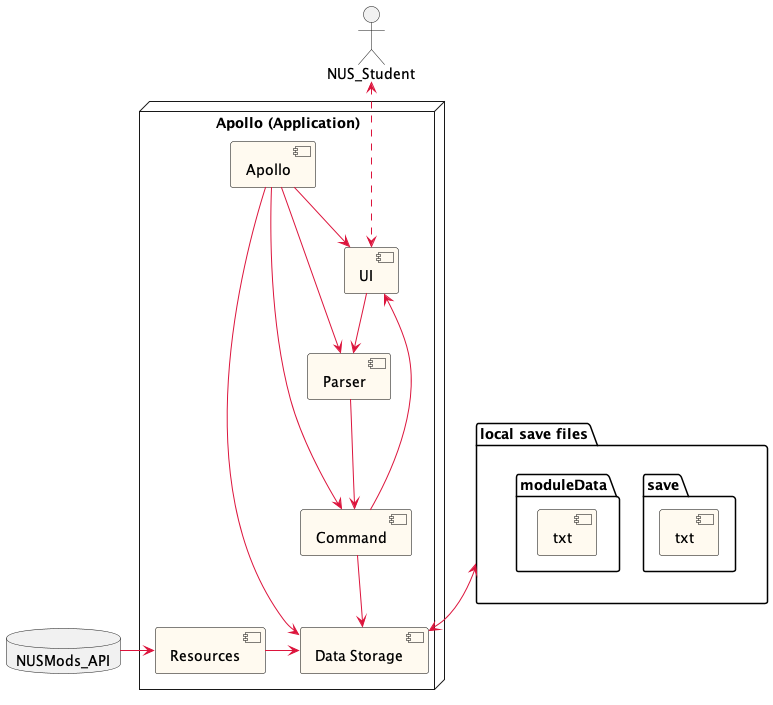
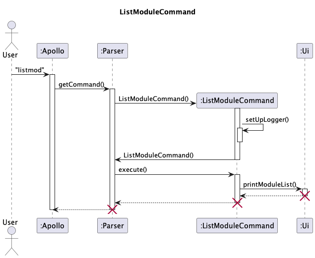
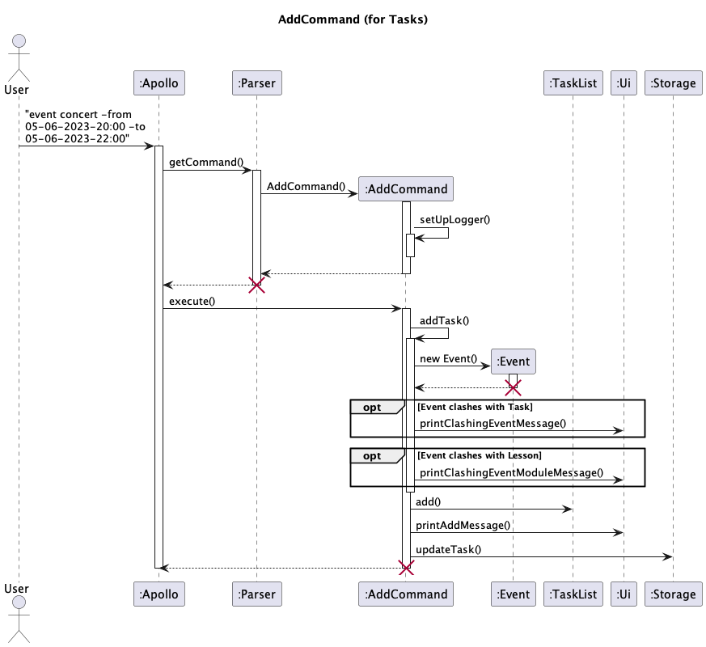
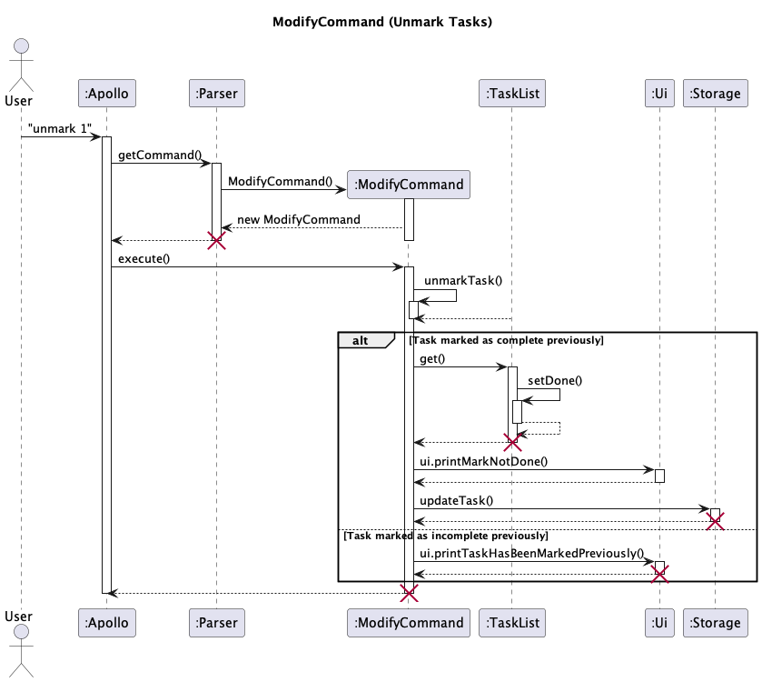
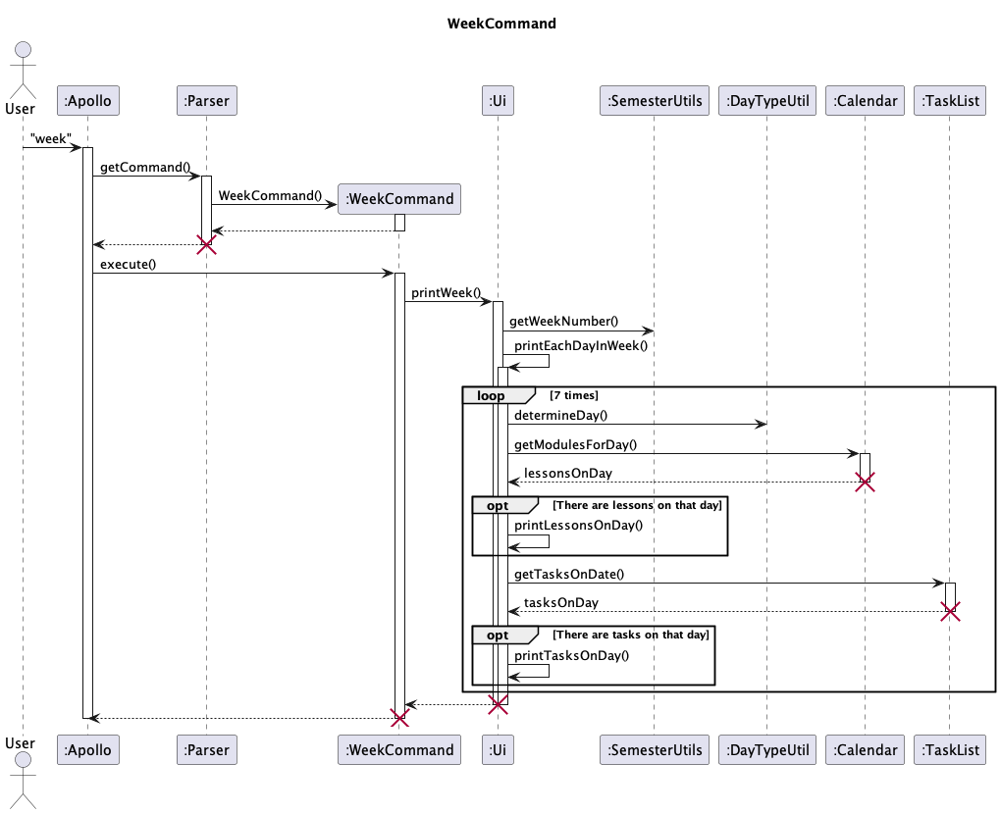

# Apollo Developer Guide

## Table of Contents

1. [Acknowledgments](#acknowledgements)
2. [Design](#design)
    + [Architecture](#architecture)
    + [UI Component](#ui-component)
    + [Parser Component](#parser-component)
    + [Command Component](#command-component)
    + [Storage Component](#storage-component)
3. [Implementation](#implementation)
    + [Add Module](#add-module)
    + [Delete Module](#delete-module)
    + [List Modules](#list-modules)
    + [Show Module](#show-module)
    + [Add Task](#add-task)
    + [Delete Task](#delete-task)
    + [Mark Task As Done](#mark-task-as-done)
    + [Unmark Task](#unmark-task)
    + [Find Task](#find-task)
    + [List Task](#list-task)
    + [Find Task on Date](#find-task-on-date)
    + [View Week](#view-week)
    + [Storage](#storage)
    + [Logging](#logging)
4. [Appendix](#appendix)
   + [Appendix A: Product Scope](#appendix-a--product-scope)
   + [Appendix B: User Stories](#appendix-b--user-stories)
   + [Appendix C: Non-Functional Requirements](#appendix-c--non-functional-requirements) 
   + [Appendix D: Glossary](#appendix-d--glossary)
   + [Appendix E: Instructions for manual testing](#appendix-e--instructions-for-manual-testing)

## Acknowledgements

We would like to acknowledge Hong Lin Shang, whose Duke we built upon for our project.

## Design

### Architecture
Below is the overall architecture diagram for Apollo.

Given below is a quick overview of the main components of Apollo and how they interact with one another.

`Apollo` is the main class and it is responsible for:
* At app launch: Initializes the components in the correct sequence, and connects them up with each other.
* Load the plaintext files (save and moduleData) and files in the Resources folder to populate its internal memory of
  ModuleList and TaskList.
* At shut down: Shuts down the components and invokes cleanup methods where necessary. Updates the plaintext files
  (save and moduleData) and files in the Resources folder to reflect the current state of Apollo.

The rest of the App consists of the following components:
* `UI`: The UI of the App.
* `Parser`: Parses the user input.
* `Command`: Executes the command.
* `Data Storage`: Reads data from, and writes data to, the hard disk.
* `Resources`: Contains relevant module data scraped from NUSMods_API, which is a database.

The user's (NUS_Student) interaction with the UI will be parsed into a command which would update the DataStorage 
and eventually update the UI which is displayed back to the user. This would continue until the user exits the program, 
which would result in the latest data stored in DataStorage being saved into the plaintext files.

### UI Component
### Parser Component
### Command Component
### Storage Component

## Implementation

### Add Module

The AddModule functionality allows users to add a module to their Module List. Beyond just adding their modules to the
module list, users are also able to add their specific lessons (e.g Lectures and Tutorials) to their module list.
This is facilitated by the AddMod command which is an extension of the Command class. Below is an example usage of how
the AddMod command can be used to add both modules and their specific lessons.

#### For when a user adds only a module (e.g CS2113) to the module list with no specific lessons:

Step 1: Define the Constructor :
When user executes the command `addmod cs2113` the Parser class calls the `AddModCommand()` method of the AddModCommand.
The constructor of the AddModCommand class takes in a moduleCode `cs2113` as a parameter and `allModules`. This
moduleCode is used to find `cs2113` from the ModuleData list.

Step 2: Define the `setUpLogger()` method :
The `setUpLogger()` method sets up the logger for the DeleteModuleCommand class. It creates a ConsoleHandler and a
FileHandler to handle logging.

Step 3: Override the `execute()` method :
The `execute()` method is overridden to execute the delete module functionality. It takes in the necessary parameters,
including the `ModuleList`, `Ui`, `Storage`, `TaskList` and `allModules`.

Step 4: Check if the module exists in the list :
The first step in the `execute()` method is to split the parameters into the module code and the lesson type. It then
calls the `isAdded()` method of the `ModuleList` class to check if the module already exists in the list. If the module
exists, a `DuplicateModuleException` is thrown.

Step 5: Add the module to the ModuleList :
If the module does not exist, it is added to the `ModuleList` by calling the `add()` method of the `ModuleList` class.
The module is sorted alphabetically by the `sort()` method of the `ModuleList` class.

Step 6: Print the confirmation message :
A confirmation message is printed to the user indicating that the module has been successfully added. The message
includes the module code and title of the module added as well as the available lesson types for the module.

#### For when a user adds a module's specific lesson (e.g CS2113 -lec 1) to the module list:

Step 1: Define the Constructor :

When user executes the command `addmod cs2113 -lec 1` the Parser class calls the `AddModCommand()` method of the 
AddModCommand class. The constructor of the AddModCommand class takes in the string `cs2113 -lec 1` as a parameter and
`allModules`. The string is split into a moduleCode `cs2113`, lessonType `-lec` and `1` as class number.

Step 2: Define the `setUpLogger()` method :

The setUpLogger() method sets up the logger for the DeleteModuleCommand class. It creates a ConsoleHandler and a
FileHandler to handle logging.

Step 3: Override `execute()` method :

The `execute()` method is overridden to execute the delete module functionality. It takes in the necessary parameters,
including the ModuleList, Ui, Storage, and TaskList.

Step 4: Calls the `handleMultiCommand()` method:

The `handleMultiCommand()` method is called to handle the command. It takes in `moduleList`, `lessonType` and `args` as
parameters. It then checks if the module already exists in the `ModuleList` by calling the `isAdded()` method.

Step 5: Add the module lessons to the ModuleList :

If the module already exists, the timetable of the classes are added to the module by calling the `addTimetable()` 
method which takes in `searchModule` and `lessonType` as parameters. If the module does not exist, it is added to the
Module list and the lessons are added to the module using the `addTimetable()` method of the `ModuleList` class.

Step 6: 

Print the confirmation message :
A confirmation message is printed to the user indicating that the module lesson has been successfully added.

[*Return to TOC*](#table-of-contents)

### Delete Module

The DeleteModule functionality allows users to remove either a module from the ModuleList or a lesson associated with 
the module. It is facilitated by DeleteModuleCommand class which is an extension of the Command class.
Given below is an example usage scenario and how the delete mechanism behaves at each step.

#### For when a user deletes only a module (e.g CS2113) from the module list:

Step 1: Define the Constructor :
When user executes the command `delmod cs2113` the Parser class calls the `DeleteModuleCommand()` method of the
DeleteModuleCommand class. The constructor of the DeleteModuleCommand class takes in a moduleCode `cs2113` as a 
parameter. This moduleCode is
used to find `cs2113`  from the ModuleList.

Step 2: Define the `setUpLogger()` method :
The `setUpLogger()` method sets up the logger for the DeleteModuleCommand class. It creates a ConsoleHandler and a
FileHandler to handle logging.

Step 3: Override the `execute()` method :
The `execute()` method is overridden to execute the delete module functionality. It takes in the necessary parameters,
including the ModuleList, Ui, Storage, and TaskList.

Step 4: Find the module to delete :
The first step in the `execute()` method is to find the module using the module code parameter  `cs2113` by calling
the `findModule()` method of the moduleList class.
If the module `cs2113` is not found, a ModuleNotFoundException is thrown.

Step 5: Remove the module from the ModuleList :
If `cs2113` is found, it is removed from the ModuleList by calling `remove()` method of moduleList class.

Step 6: Print the confirmation message :
A confirmation message is printed to the user indicating that the `cs2113` has been successfully deleted.

Step 7: Update the storage :
The storage is updated with the new ModuleList without `cs2113`

#### For when a user deletes a specific lesson (e.g CS2113 -lec 1) from the module list:

Step 1: Define the Constructor :
When user executes the command `delmod cs2113 -lec 1` the Parser class calls the `DeleteModuleCommand()` method of the 
DeleteModuleCommand class. The constructor of the DeleteModuleCommand class takes in the string `cs2113 -lec 1` as a 
parameter. The string is split into a moduleCode `cs2113`, lessonType `-lec` and `1` as class number and stored in the
`args` array field of the `DeleteModule` class. 

Step 2: Define the `setUpLogger()` method :
The setUpLogger() method sets up the logger for the DeleteModuleCommand class. It creates a ConsoleHandler and a 
FileHandler to handle logging.

Step 3: Override `execute()` method :
The `execute()` method is overridden to execute the delete module functionality. It takes in the necessary parameters,
including the ModuleList, Ui, Storage, TaskList, AllModules and Calendar objects. The lesson type is determined by
calling the `getLessonType()` method of the `LessonType` class and parsing in `arg[1]` while the lesson number is 
set by `arg[2]`. If the lesson type is not valid, an`InvalidCommandException` is thrown.

Step 4: Calls the `handleMultiCommand()` method:
The `handleMultiCommand()` method is called to handle the command. It takes in `moduleList`, `lessonType` and `args` as
parameters. It then searches for the module using the `findModule()` method of the `ModuleList` class. If the module
is not found, a `ModuleNotFoundException` is thrown.

Step 5: Remove the module lessons from the ModuleList :
If the module is found, the timetable of the classes are removed from the module by calling the `removeTimetable()` 
method which takes in `searchModule` and `lessonType` as parameters. The `removeTimetable()` method of the `ModuleList`
will create a copy of the module timetable array list and search for the lesson to be removed. If the lesson type and 
class number matches, the lesson is removed from the original timetable array list using the `remove()` method. The
lesson is then marked as found by setting the `isFound` boolean to true. If the lesson is not found, a 
`ClassNotFoundException` is thrown.

Step 6: Print the confirmation message :
A confirmation message is printed to the user indicating that the module lesson has been successfully deleted. It is
is printed by calling the `printModuleLessonDeleteMessage()` method of the `Ui` class. If the module is not found, 
the message is printed by calling the `printModuleNotFoundMessage()` method of the `Ui` class. If the 
argument is invalid, the message is printed by calling the `printInvalidCommand()` method of the `Ui` class.

[*Return to TOC*](#table-of-contents)

### List Modules

The ListModule functionality allows users to list the modules that are in the ModuleList. It is facilitated by 
ListModuleCommand class which is an extension of the Command class. 

Given below is an example usage scenario of how to list the modules in the ModuleList and how the mechanism behaves 
at each step.

Step 1. Define the `setUpLogger()` method: The `setUpLogger()` method sets up the logger for the ModifyCommand
class.
It creates a ConsoleHandler and a FileHandler to handle logging.

Step 2. Override the `execute()` method: The `execute()` method is overridden to execute the list module
functionality. It takes the necessary parameters, including the `Tasklist`, `Ui`, `Storage`, `ModuleList`,
`allModule`, `calendar`.

Step 3. Iterate through the list of modules: The `execute` method will iterate through `ModuleList` and call 
`printModuleList()` method in the Ui class that takes in the list of modules, `ModuleList` that the user has updated,
as a parameter. During the iteration, the `printModuleList()` method will get the number of modular credits for each 
module the user is taking and calculate the total modular credits in that semester. If the list is empty, a message 
is printed to the user indicating that there are no modules in the list. 

Step 4. Print the confirmation message: A confirmation message is printed to the user indicating the list of modules 
in `ModuleList` that the user updated. The message includes the module code and name, modular credits for each module 
and  total modular credits the user is taking this semester.

UML Diagram for ListModuleCommand

[*Return to TOC*](#table-of-contents)

### Show Module

The ShowModule functionality allows users to see all the information of a specific module. The information includes 
LessonTypes, ClassNumbers and the Day and Time of the lessons, sorted lexicographically. The use of flags, for eg. `-lec`, `-st` etc., allows 
users to view specific LessonType information instead of all the information for the whole module.

ShowModule is facilitated by ShowModuleCommand class which is an extension of the Command class.

Given below is an example usage scenario of how to view the information of a specific module using the moduleCode and 
how the mechanism behaves at each step.

#### For when a user request to show the module (e.g. CS2113):

Step 1. Define the Constructor: When user executes the command `showmod cs2113`, the Parser class calls the
`ShowModuleCommand()` method of the ShowModuleCommand class. The constructor of the ShowModuleCommand class takes
in a parameter of type `String`, which will be split into `moduleCode` and `-FLAG`. In this case, only `cs2113` is 
parsed in as the parameter. This is then used to find `cs2113` from the module information. If the moduleCode, 
`cs2113`, is not found, an `InvalidModule()` is thrown.

Step 2. Define the `setUpLogger()` method: The `setUpLogger()` method sets up the logger for the ShowModuleCommand 
class. It creates a ConsoleHandler and a FileHandler to handle logging.

Step 3. Override the `execute()` method: The `execute()` method is overridden to execute the Show Module functionality.
It takes in the necessary parameters, including the ModuleList, Ui, Storage, TaskList and Calendar.

Step 4. Find the module to display information: The first step in the `execute()` method is to find the module from 
`Module` class using the module code parameter `cs2113` by using the `findModule()` function of the `Module` class.

Step 5. Print the confirmation message: A confirmation message is printed to the user indicating the information
of the module requested by the user. The message includes the `ModuleCode`, `LessonTypes` of the module, `Classnumber` 
of each `lessonTypes` and `Day` and `Time` of the existing `Classnumber`.

#### For when a user request to show a specific lessonType of the module (e.g. CS2113 -st):

Step 1. Define the Constructor: When user executes the command `showmod cs2113`, the Parser class calls the
`ShowModuleCommand()` method of the ShowModuleCommand class. The constructor of the ShowModuleCommand class takes
in a parameter of type `String`, which will be split into `moduleCode`, `cs2113`, and `-FLAG`, `-st`. In this case, only `cs2113` is
parsed in as the parameter. This is stored in the `args` array field of the `ShowModuleCommand` class.

Step 2. Define the `setUpLogger()` method: The `setUpLogger()` method sets up the logger for the ShowModuleCommand
class. It creates a ConsoleHandler and a FileHandler to handle logging.

Step 3. Override the `execute()` method: The `execute()` method is overridden to execute the Show Module functionality.
It takes in the necessary parameters, including the ModuleList, Ui, Storage, TaskList and Calendar objects. The lesson 
type is determined by calling the `getLessonType()` method of the `lessonType` class and parsing in `args[1]` while 
the moduleCode is set by `args[0]`. If the lessonType is not valid, an `InvalidCommandException` is thrown.

Step 4. Calls the `handleMultiCommand()` method: The `handleMultiCommand()` method is called to handle the command. 
It takes ini `moduleList`, `lessonType` and `args` as parameters.

Step 5. Find the module to display information: The first step in the `execute()` method is to find the module from
`Module` class using the module code parameter `cs2113` by using the `findModule()` function of the `Module` class.
To find the lessonType of the module, `getLessonType()` is called to return the lessonType for the Show Module
functionality.

Step 6. Print the confirmation message: A confirmation message is printed to the user indicating the information
of the module requested by the user. The message includes the `ModuleCode`, the specific `LessonType` of the module, 
`Classnumber`of requested `lessonTypes` and `Day` and `Time` of the existing `Classnumber`.

[*Return to TOC*](#table-of-contents)

### Add Task

The add task mechanism is facilitated by `AddCommand`. It extends `Command` with the ability to add three different 
types of `Task`s to the TaskList, namely: `ToDo`, `Deadline`, and `Event`. 

Given below is an example usage scenario and how the add task mechanism behaves at each step as the user adds an event.

Step 1. The user enters the command `event concert /from 2023-06-06T20:00 /to 2023-06-06T22:00`.  
This is to add a `Task` with the description "concert" on Jun 6 2023 from 8-10pm to their TaskList. 
The String containing the command is parsed in `Parser` and determined to be an `AddCommand`. 

Step 2. Within `Parser`, an `AddCommand` is initialised with the String `command` "event". 
The remaining params of the command are further parsed into Strings: `desc` "concert" (description), `from` 
"2023-06-06T20:00" (start date), and `to` "2023-06-06T22:00" (end date) based on the delimiters "/from" and "/to". 
- For `command` "deadline", remaining params are parsed into `desc` and `by` (due date) based on the delimiter "/by". 
- For `command` "todo", all remaining params are parsed into `desc`.

Step 3. The initialised `AddCommand` is returned to Apollo. 
In the event of the following, an error message is printed and no more steps are executed.
- Delimiters are not entered correctly
- Remaining params of the command are empty (i.e. CLI input of user is "todo"/"deadline"/"event" only)

Step 4. `Command#execute()` is called. This in turn calls `AddCommand#addTask()`. 
`addTask()` will try to initialise a new `Event` by parsing the Strings `from` and `to` into LocalDateTimes.
In the event of the following, an error message is printed and no more steps are executed.
- String for date cannot be parsed into LocalDateTime (wrong format of input)
- Task occurs entirely before the current date
- (for `Event`) Start date occurs after end date

Step 5. `addTask()` checks if the initialised `Event` clashes with any existing tasks. If so, 
`Ui#printClashingEventMessage()` is called to print a warning message. 

Step 6. Similarly, `addTask()` also checks if the initialised `Event` clashes with any existing lessons. If so,
`Ui#printClashingEventModuleMessage()` is called to print a warning message.

Step 7. The initialised `Event` is added to the `TaskList`. Return to `AddCommand#execute`.

Step 8. If the Task has been added successfully, `Ui#printAddMessage()` prints a success message.

Step 9. `Storage#updateTask()` is called to update the local save file to reflect the changes.

[*Return to TOC*](#table-of-contents)

### Delete Task

The DeleteTask functionality allows users to remove a task (todo, event and deadline) from the TaskList.
It is facilitated by the ModifyCommand class which is an extension of the Command class.
Below is an example usage of how the DeleteTask command can be used to delete a task and how it behaves
at each step.

Step 1: Define the Constructor: When the user executes the command `delete 1`, the Parser class calls the
`ModifyCommand()` method of the ModifyCommand. The constructor of the ModifyCommand class takes in the taskIndex `1`
as a parameter. This index is used to find the task to be deleted from the TaskList.

Step 2: Define the `setUpLogger()` method: The `setUpLogger()` method sets up the logger for the ModifyCommand
class.
It creates a ConsoleHandler and a FileHandler to handle logging.

Step 3: Override the `execute()` method: The `execute()` method is overridden to execute the delete task functionality.
It takes in the necessary parameters, including the `TaskList`, `Ui`, `Storage`, `ModuleList`, `allModules`.

Step 4: Find out how to modify the TaskList: The first step in the `execute()` method is to find out how to modify the
TaskList. In this case, the task at a user-provided index is to be deleted.

Step 5: Find the task to delete: Using the parameter `taskIndex`, the `execute()` method will iterate to that
index in the `TaskList` and call the `remove()` method of the `TaskList` class. If the index is outside the bounds of
the size of the `TaskList`, a `NumberFormatException` is thrown, calling the `printErrorForIdx()` method in the Ui class
that takes in the size of the `TaskList` as a parameter.

Step 6: Print the confirmation message: A confirmation message is printed to the user indicating what task has been
successfully removed from the user-provided index of the `TaskList`. The message includes the task type, description
(and date of the task deleted if the task is either an event or a deadline).
It also includes the updated size of the `TaskList`, obtained with the `size()` method of the `TaskList` class.

Step 7: Update the storage: The storage is updated with the new TaskList without the deleted task.

[*Return to TOC*](#table-of-contents)

### Mark Task As Done

The MarkTask functionality allows users to mark a task (todo, event and deadline) as done in their TaskList.
It is facilitated by the ModifyCommand class which is an extension of the Command class.
Below is an example usage of how the MarkTask command can be used to mark a task as done.

Step 1: Define the Constructor: When the user executes the command `mark 1`, the Parser class calls the
`ModifyCommand()` method of the ModifyCommand. The constructor of the ModifyCommand class takes in the taskIndex `1`
as a parameter. This index is used to find the task to be marked as done from the TaskList.

Step 2: Define the `setUpLogger()` method: The `setUpLogger()` method sets up the logger for the ModifyCommand
class.
It creates a ConsoleHandler and a FileHandler to handle logging.

Step 3: Override the `execute()` method: The `execute()` method is overridden to execute the mark task functionality.
It takes in the necessary parameters, including the `TaskList`, `Ui`, `Storage`, `ModuleList`, `allModules`.

Step 4: Find out how to modify the TaskList: The first step in the `execute()` method is to find out how to modify the
TaskList. In this case, the task at a user-provided index is to be marked as done.

Step 5: Find the task to mark as done: Using the parameter `taskIndex`, the `execute()` method will iterate to that
index in the `TaskList` and call the `setAsDone()` method of the `Task` class, setting the boolean `isDone` to `true`.
If the index is outside the bounds of the size of the `TaskList`, a `NumberFormatException` is thrown,
calling the `printErrorForIdx()` method in the Ui class that takes in the size of the `TaskList` as a parameter.

Step 6: Print the confirmation message: A confirmation message is printed to the user indicating what task has been
successfully marked as done from the user-provided index of the `TaskList`. The message includes the task type,
description (and date of the task deleted if the task is either an event or a deadline).

Step 7: Update the storage: The storage is updated with the new TaskList with the task marked with a cross next to it.

[*Return to TOC*](#table-of-contents)

### Unmark Task 

The UnmarkTask functionality allows users to toggle a task (todo, event and deadline) to *not* done in their TaskList.
It is facilitated by the ModifyCommand class which is an extension of the Command class.
Below is an example usage of how the UnmarkTask command can be used to unmark a task as not done.

Step 1: Define the Constructor: When the user executes the command `unmark 1`, the Parser class calls the
`ModifyCommand()` method of the ModifyCommand. The constructor of the ModifyCommand class takes in the taskIndex `1`
as a parameter. This index is used to find the task to be unmarked from the TaskList.

Step 2: Define the `setUpLogger()` method: The `setUpLogger()` method sets up the logger for the ModifyCommand
class.
It creates a ConsoleHandler and a FileHandler to handle logging.

Step 3: Override the `execute()` method: The `execute()` method is overridden to execute the mark task functionality.
It takes in the necessary parameters, including the `TaskList`, `Ui`, `Storage`, `ModuleList`, `allModules`.

Step 4: Find out how to modify the TaskList: The first step in the `execute()` method is to find out how to modify the
TaskList. In this case, the task at a user-provided index is to be unmarked.

Step 5: Find the task to unmark as not done: Using the parameter `taskIndex`, the `execute()` method will iterate to
that index in the `TaskList` and call the `setAsDone()` method of the `Task` class, setting the boolean `isDone`
to `false`.
If the index is outside the bounds of the size of the `TaskList`, a `NumberFormatException` is thrown,
calling the `printErrorForIdx()` method in the Ui class that takes in the size of the `TaskList` as a parameter.

Step 6: Print the confirmation message: A confirmation message is printed to the user indicating what task has been
successfully unmarked from the user-provided index of the `TaskList`. The message includes the task type,
description (and date of the task deleted if the task is either an event or a deadline).

Step 7: Update the storage: The storage is updated with the new TaskList with the task marked without a cross next to
it.

[*Return to TOC*](#table-of-contents)

### Find Task

The FindTask functionality allows user to search for a task (todo, event and deadline) from the TaskList using a 
specific keyword. The FindTask mechanism is facilitated by FindCommand which extends Command class. 

Below is an example usage of how the FindTask command can be used to search for a task in the TaskList using a keyword 
and how it behaves at each step.

Step 1. Define the Constructor: When the user executes the command `find read`, the Parser class calls the 
`FindCommand()` method of the FindCommand class. The constructor of the FindCommand class takes in the keyword 
string `read` as a parameter. This string is used to find tasks in the TaskList that contains this keyword.

Step 2: Define the `setUpLogger()` method: The `setUpLogger()` method sets up the logger for the ModifyCommand
class.
It creates a ConsoleHandler and a FileHandler to handle logging.

Step 3. Override the `execute()` method: The `execute()` method is overridden to execute the find task 
functionality. It takes the necessary parameters, including the `Tasklist`, `Ui`, `Storage`, `ModuleList`, 
`allModule`, `calendar`.

Step 4. Find the list of tasks containing the `KEYWORD`: Using the parameter string `KEYWORD`, the `execute()` method 
will iterate through `TaskList` and call `printFoundList()` method in the Ui class that takes in a list of task,
`ArrayList<Tasks>`, containing the `KEYWORD` as a parameter. If the `KEYWORD` does not exist in any tasks 
in `TaskList`, a message is printed to the user indicating that there are no matching tasks that contains the 
`KEYWORD`.

Step 5. Print the confirmation message: A confirmation message is printed to the user indicating the list of 
tasks in `TaskList` that matches the `KEYWORD` input by the user. The message includes the task type, description and
date of the task containing `KEYWORD` if the matching task is either an event or a deadline task.

[*Return to TOC*](#table-of-contents)

### List Task

The ListTask functionality allows users to list the tasks (todo, event and deadline) that are in the TaskList. It is 
facilitated by ListCommand class which is an extension of the Command class.

Given below is an example usage scenario of how to list the tasks in the TaskList and how the mechanism behaves
at each step.

Step 1. Define the `setUpLogger()` method: The `setUpLogger()` method sets up the logger for the ModifyCommand
class.
It creates a ConsoleHandler and a FileHandler to handle logging.

Step 2. Override the `execute()` method: The `execute()` method is overridden to execute the list task
functionality. It takes the necessary parameters, including the `Tasklist`, `Ui`, `Storage`, `ModuleList`,
`allModule`, `calendar`.

Step 3. Iterate through the list of tasks and perform sorting: The `execute()` method will iterate through `TaskList` 
and first calls the
`sortTaskByDay()` method in the TaskList class that takes in the list of tasks, `TaskList` that the user has updated 
as a parameter. During the iteration, this method will first sort the task in the list by type with the method 
`clusterByType()`, then by date with `deterministicSortForDeadline()` method for deadline type tasks sublist or 
`deterministicSortForEvent()` for event type tasks sublist. The `clusterByType()` and deterministic sort 
methods belong to the TaskList class. The `clusterByType()` method takes in the list of tasks, `TaskList` that the
user has updated, as a parameter and returns a list of tasks sorted by type. The `deterministicSortForDeadline()` takes
in two LocalDateTime objects which correspond to the dates of two deadlines being compared, whereas 
the `deterministicSortForEvent()`takes in four LocalDateTime objects which correspond to the start and end dates of two 
events being compared.

Step 4. Iterate through the list of sorted tasks and print it:The `execute()` method then calls the `printList()` method 
in the Ui class that takes in the list of tasks,`TaskList` that the user has updated, as a parameter. 
During the iteration, the `printList()` method will check the `taskStatus` of each task and calculate
the total number of unmarked tasks. If the list is empty, a message is printed to the user indicating that there are 
no tasks in the list.

Step 4. Print the confirmation message: A confirmation message is printed to the user indicating the list of tasks
in `TaskList` that the user updated and the total number of unmarked tasks. The message includes the task type, 
description and date of all tasks if the tasks are either an event or a deadline task.

[*Return to TOC*](#table-of-contents)

### Find Task on Date

The Find Task on Date functionality allows user to search for a list of tasks (event and deadline) that are happening
or due on a specific `date` in their TaskList. It is facilitated by the DateCommand class which is an extension of 
the Command class.

Below is an example usage of how the Find Task on Date command can be used to search for tasks happening or due on 
a specific date in the TaskList and how it behaves at each step.

Step 1. Define the Constructor: When the user executes the command `date 2023-03-22`, the Parser class calls the    
`DateCommand()` method of the DateCommand class. The constructor of the DateCommand class takes in the dateString 
`2023-03-22`  as a parameter. This date is used to find the corresponding tasks happening or due on this date from 
the TaskList.

Step 2. This date is then passed into the `LocalDate`. If the date parsed is in the wrong format (date format is not
`yyyy-MM-dd`), a `DateTimeParseException` is thrown, calling the `printInvalidDate()` method in the Ui class.

Step 3. Define the `setUpLogger()` method: The `setUpLogger()` method sets up the logger for the ModifyCommand
class.
It creates a ConsoleHandler and a FileHandler to handle logging.

Step 4. Override the `execute()` method: The `execute()` method is overridden to execute the find task
functionality. It takes the necessary parameters, including the `Tasklist`, `Ui`, `Storage`, `ModuleList`,
`allModule`, `calendar`.

Step 5. Find the list of tasks happening or due on the `date`: Using the parameter string `date` in the format 
`yyyy-MM-dd`, the `execute()` method will iterate through the `TaskList` to look for tasks that occurs on the given
`date`. It will then call `printDateList()` method in the Ui class that takes in the list of tasks happening on the 
given `date` and the LocalDate `date`. If there are no tasks on the specific `date`, a message is printed to the user 
indicating that there are no tasks on that day.

Step 6. Print the confirmation message: A confirmation message is printed to the user indicating the list of tasks in 
`TaskList` that are occurring on the `date` input by the user. The message includes the task type, description, date
and time of the task if the task is either an event or a deadline task.

[*Return to TOC*](#table-of-contents)

### View Week
The `week` command allows the user to view their weekly schedule at a glance, including lessons, deadlines, and events.
It is facilitated by `WeekCommand` which is an extension of the `Command` class.

Given below is an example usage scenario and how the add task mechanism behaves at each step.

Step 1. The user executes the command `week`. It is parsed by the `Parser` class which then creates a new `WeekCommand`.

Step 2. The `execute()` method of `WeekCommand` is called. 

Step 3. The dates of Monday and Sunday of the current week (`startWeek`, `endWeek`) are determined using `LocalDate`.

Step 4. The parameters `startWeek`, `endWeek`, `taskList` (all tasks), and `calendar` (all lessons) are passed into `Ui`

Step 5. Starting from Monday, the lessons and tasks occurring on each day of the week are printed out. 
- Step 5a. The day of week is printed using the `determineDay()` method in `DayTypeUtil`. 
- Step 5b. All lessons on that day are stored in an `ArrayList<CalendarModule> lessonsOnDay` using `calender.get()`. 
  If no lessons occur on that day, Step 5c is skipped.
- Step 5c. `lessonsOnDay` is passed into the method `printLessonsOnDay()` in `Ui`. 
  The schedule of each lesson is stored in a new `Timetable`, then printed out in the desired format. 
- Step 5d. Similarly, All tasks on that day are stored in an `TaskList tasksOnDay` using `taskList.getTasksOnDay()`.
  If no lessons occur on that day, Step 5e is skipped.
- Step 5e. `tasksOnDay` is passed into the method `printTasksOnDay()` in `Ui`. Each task is printed out.
- Step 5f. The current day is increased to the following day.
- Step 5g. Go back to Step 5a, stop after all lessons and tasks on Sunday have been printed. 

[*Return to TOC*](#table-of-contents)

### Storage
(TO BE ADDED SOON)

### Logging
(TO BE ADDED SOON)

# Appendix

## Appendix A: Product Scope

## Appendix B: User Stories
#### Target user profile

The target user profile is an average NUS student who:

* has a need to manage a significant number of tasks (todo, event, deadline) and modules,
* prefer desktop applications over other types of applications,
* can type fast,
* prefers typing to mouse interactions,
* is reasonably comfortable using CLI apps.

#### Value proposition

Existing schedulers do not have access to NUS’s database, making it so that a student here would have to manually
input all their lessons. We can expedite this process by creating a scheduler that sets itself up via module codes.
It can also alert the user to possible event clashes.

Priority Legend:  
`***` - Highest priority (Must-haves) 
`**` - Medium priority  (Should-haves)
`*` - Lowest priority (Could-haves)

| Priority | Version |  As a/an ...  | I want to ...                                             | So that I can ...                                           |
|:--------:|:-------:|:-------------:|:----------------------------------------------------------|-------------------------------------------------------------|
|   ***    |  v1.0   |  expert user  | be able to quickly interface with the program using a CLI | issue commands to the bot                                   |
|   ***    |  v1.0   |   new user    | see usage instructions                                    | refer to them when I forget how to use the application      |
|   ***    |  v1.0   |     user      | find a to-do item by name                                 | locate a to-do without having to go through the entire list |
|   ***    |  v1.0   |     user      | delete a to-do item                                       | remove items that I no longer need to keep track of         |
|   ***    |  v1.0   |     user      | add a to-do item                                          | keep track of things that I need to do                      |
|   ***    |  v1.0   |     user      | add an event item                                         | keep track of events that I need to attend                  |
|   ***    |  v1.0   | busy student  | add a deadline item                                       | keep track of deadlines that I need to meet                 |
|   ***    |  v1.0   |     user      | list all items                                            | view all items that I have added                            |
|   ***    |  v1.0   |     user      | mark a to-do item as done                                 | keep track of which to-do items I have completed            |
|   ***    |  v1.0   |     user      | unmark a to-do item as not done                           | keep track of which to-do items I have not completed yet    |
|   ***    |  v1.0   |     user      | view task count                                           | see how much I have to do                                   |
|   ***    |  v1.0   | undergraduate | add modules                                               | keep track of the modules I am taking for the semester      |
|   ***    |  v1.0   | undergraduate | list all modules                                          | see all the modules I am taking for the semester            |
|    **    |  v1.0   | undergraduate | view module count                                         | keep how many modules I have for the semester               |
|   ***    |  v1.0   | undergraduate | delete modules                                            | remove modules that I am no longer taking                   |
|    **    |  v2.0   | undergraduate | keep track of the total modular credits                   | plan my academic year                                       |
|   ***    |  v2.0   |    student    | add lessons for each module                               | go to the correct classes                                   |

(More coming soon)

## Appendix C: Non-Functional Requirements

* Apollo should work on any mainstream OS as long as it has Java 11 or above installed.
* Apollo should be able to hold up to 1000 tasks without a noticeable sluggishness in performance for typical usage.
* A user with above average typing speed for regular English text (i.e. not code, not system admin commands) should be
  able to accomplish most of the tasks faster using commands than using the mouse.

## Appendix D: Glossary

* *Mainstream OS* - Windows, Linux, Unix, OS-X
* *CLI* - Command Line Interface
*

## Appendix E: Instructions for manual testing

Given below are instructions to test the app manually.
> Note: These instructions only provide a starting point for testers to work on;
> testers are expected to do more *exploratory* testing.

[*Return to TOC*](#table-of-contents)
