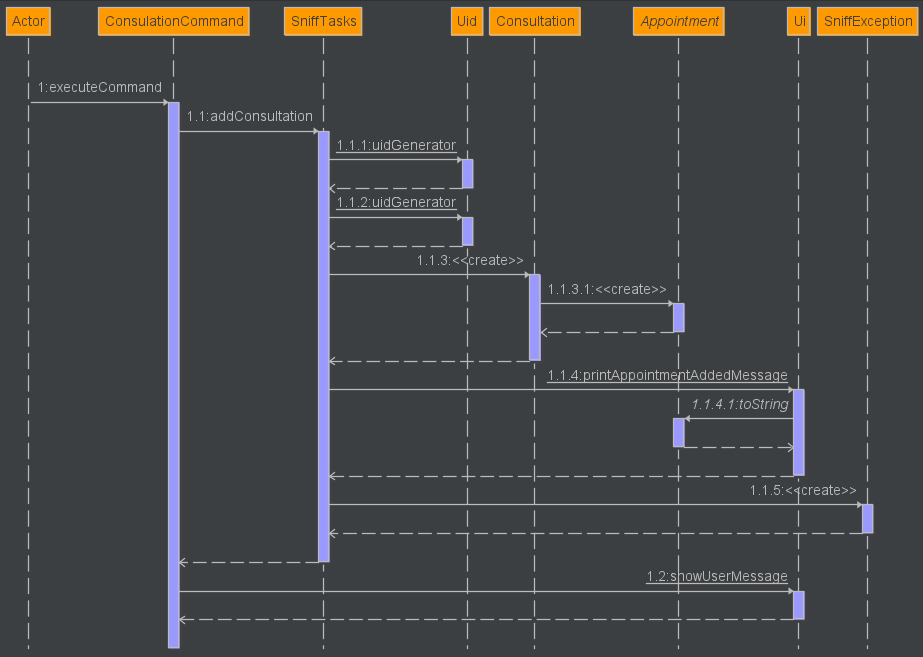
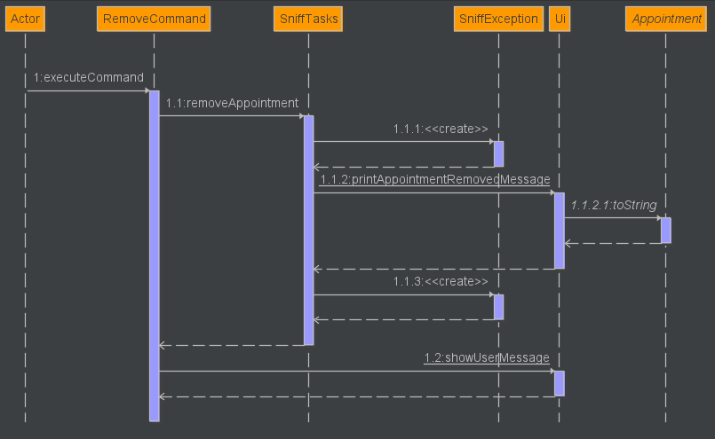
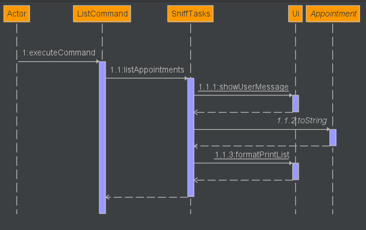

# Developer Guide

## Acknowledgements

{list here sources of all reused/adapted ideas, code, documentation, and third-party libraries -- include links to the original source as well}

## Design & implementation

### User Interface (UI) - Class Implementation
 <br>
**Figure 1: UML Diagram of User Interface (UI) Class**
1. The **`UI class`** named `Ui` belongs to the package functionalities.ui. The class contains several static and non-static methods that display messages to the user such as **`showUserMessage()`**, **`showErrorMessage()`**, and **`showWelcomeMessage()`**. The class is also used to read user input, format and print appointment lists, and add or remove appointments from the **`sniff appointment manager`**. The **`Ui`** class has a **`showLine()`** method that displays a divider line to the user.
2. The **`UI class`** has a private static final String DOT_THEN_SPACE field that is used as a constant string value to format user messages. It has a **`readUserCommand()`** method that returns a string value that is entered by the user through the Command Line Interface (CLI).
3. The class imports the **`SniffException`** class from the exception package and utilizes it in the **`showErrorMessage()`** method to display an error message to the user.

### Command - Class Implementation
 <br>
**Figure 2: UML Diagram of Command Class** <br>
1. The **`Command class`** named `Command` belongs to the package functionalities.commands. The class is an abstract class that provides a basic template for implementing commands in the command-line interface. This class is designed to be extended by subclasses that implement specific commands, such as **`ListCommand`** and **`ConsultationCommand`**.
2. The **`Command class`** has a boolean isExit field that can be set to true to exit the entire programme, or remain as false to continue running the programme. It has a **`isExit()`** method that sets that field to false initially. It also has a **`executeCommand()`** method that takes an instance of SniffTasks as a parameter and throws a SniffException if an error occurs during execution. Subclasses override this method in order to run other commands.

 <br>
**Figure 3: Sequence Diagram showing the logical implementation of executeCommand() for the Consultation Command**

 <br>
**Figure 4: Sequence Diagram showing the logical implementation of executeCommand() for the Vaccination Command**

 <br>
**Figure 5: Sequence Diagram showing the logical implementation of executeCommand() for the Surgery Command**

The Sequence Diagram below shows how the components interact with each other for the scenario where the user removes an appointment.

 <br>
**Figure 6: Sequence Diagram showing the logical implementation of executeCommand() for the Remove Command** <br>

The remove command is facilitated by `SniffTasks` which stores all the current appointments as `APPOINTMENTS`. It then implements the following operation:
* `Snifftasks.removeAppointment()` -- Removes the appointment with the specified UID.

Given below is an example usage scenario and how the remove mechanism behaves.
1. The user had already launched and added a few appointments to `Snifftasks`.
2. The user executes `remove C123` command to remove the appointment with that specific UID. The remove command is then executed and calls `SniffTask#removeAppointment()`, causing the appointment with that UID to be removed. It then calls the `Ui#printAppointmentRemovedMessage()` that then calls `Appointment#toString`  that prints to the output the details of the appointment that had been removed. Lastly, it calls `Ui#showUserMessage()` to tell the user that the remove appointment mechanism is successful.

 <br>
**Figure 7: Sequence Diagram showing the logical implementation of executeCommand() for the List Command**

**Mark Command**
1. The Mark command will mark the appointment input by the user as done. It will set isDone as true and will be used in the Storage class.

**UnMark Command**
1. The UnMark command will unmark the appointment input by the user as not done or pending. It will se the isDone as false and will be updated accordingly in the Storage class.

### Parser - Class Implementation
 <br>
**Figure 8: UML Diagram of Parser Class**
1. The Parser class takes in a user command and generates a corresponding Command object for veterinary management system tasks such as **add consultation, vaccination or surgery, find, remove, list, and exit**. This implementation makes use of the Command design pattern to encapsulate the behavior of different types of commands, and the parser serves as a factory for creating these commands based on the user input.
2. The Parser class contains several static methods that parse different types of commands, such as **`ConsultationCommand`**, **`VaccinationCommand`**, **`SurgeryCommand`**, **`FindCommand`**, **`RemoveCommand`**, **`ListCommand`**, and **`ExitCommand`**.
3. The **`parse()`** method takes a user command as a String named **`task`** and determines the type of command based on the first word of the command. If it matches any of the known command types, it delegates parsing to the corresponding parse method.
4. If the first word of the command does not match any known type, it throws a **`SniffException`**. Each parse method takes the command String as input and uses substring operations to extract the various parameters of the command. It then creates a new Command object with these parameters and assigns it to the "command" static variable.
5. Finally, the parse method returns the command object. If an exception occurs during parsing, it throws a **`SniffException`**.

### Storage - Class Implementation 
 <br>
**Figure 9: UML Diagram of Storage class**
1. The Storage class takes in the path of the Sniff storage file.
2. **`load()`** method loads the contents of the saved file. It calls **`printFileContents(File)`** which will print out all the stored appointments.
3. **`load()`** method also calls **`addFileContents`** method.
4. **`addFileContents`** method parses the saved file and identify stored appointments. Depending on the type of appointments, it will then call either **`readConsultationintoAppointmentList()`** / **`readVaccinationintoAppointmentList()`** / **`readSurgeryintoAppointmentList()`** to add these appointment objects into **`ArrayList<Appointment> APPOINTMENTS`**.
5. If the file is stored in an incorrect format / has missing details, a **`SniffException`** is thrown.

### Find - Find Implementation
 <br>
**Figure 10: Sequence Diagram showing the logical implementation of executeCommand() for the Find Command**

- Find command can be used by the user to find up to 3 categories, **`Appointment ID`**, **`Appointments Type`**, **`Animal Type`**.
- If user input is not supported by these three find commands, a **`SniffException`** is thrown.

#### findAppointment()
1. **`findAppointment`** loops through arraylist appointments and checks if matching appointment ID is present.
2. If matching appointment ID is found, it calls **`toString`** and **`formatPrintList`** to print out appointments to user.
3. If empty appointment ID is provided by user or appointment ID is in an invalid format, **`SniffException`**, is thrown for both cases.
4. If no matching appointments are stored, an ui method, **`showUserMessage`** is called.

#### findAnimal()
1. **`findAnimal`** loops through arraylist appointments and checks if appointments for specified animal type is present.
2. If matching appointments are found, it calls **`toString`** and **`formatPrintList`** to print out appointments to user.
3. If no matching appointments are stored, ui method, **`showUserMessage`** is called.

#### findType()
1. **`findType`** loops through arraylist appointments and checks if specified appointment type (surgery, consultation, vaccination) is present.
2. If appointments are found, it calls **`toString`** and **`formatPrintList`** to print out appointments to user.
3. If no matching appointments are stored, ui method, **`showUserMessage`** is called.

### Appointment - Class Implementation (non UID)
<br>
**Figure 9: UML Diagram of Appointment Class**
1. The appointment class takes in the user input of adding an appointment to the list of appointments.
2. The **`Appointment class`** named `Appointment` takes in input such as uid, name, type of appointment, animal type, and date of appointment. This appointment will then  be added to the list.
3. If the user inputs omits any entry or adds any extra entry then an error message will be displayed. An error message will also be displayed if the input type is of the wrong the format.

##### UID Generation
<br>
**Figure 10: UML Diagram of Uid Class**

The UID is generated to produce a 10 character string representing the Appointment ID tagged to each appointment.
The UID string generated consists of 3 substrings that are concatenated together:
- The first substring is a one-character string that represents the appointment type the UID is generated to.  
  For example, an appointment type of `Surgery` will be denoted as `"S"`.
- The second substring is an eight character long string with each character representing a digit from 0-9.  
  Each digit is chosen at random by using Java's inbuilt `Random` class. An example of this substring 
  will be `"01234567"`.
- The third substring is a one-character string representing a random letter chosen from A-Z.  
  This letter is also chosen using Java's inbuilt `Random` class.
- The UID string is concatenated together using Java's inbuilt `StringBuilder` class. The `StringBuilder` class provides
  a faster way to concatenate strings as compared to using the `+` operator.   
  An example of a randomly generated UID string for each appointment type is shown below:
  - Consultation: `C82739812B`
  - Vaccination: `V71829748S`
  - Surgery: `S23847989T`


###### Alternatives
Other alternatives that was considered are:
- Using the Java inbuilt UUID class.
   - Pros: Do not need to implement the class itself. Easy to use.
   - Cons: Overkill as it generates a 128 bit String. Cannot customise to fit our custom uid format.
- Asking the user to manually key in a UID string themselves.
   - Pros: Do not need to implement the feature itself.
   - Cons: We felt that this is counter-intuitive as it increases workload and human error. Automating
     this process will reduce potential errors.

## Product scope
### Target user profile

Veterinarians in Vet Clinics around Singapore who
* prefer typing over using a mouse.
* need to keep track a large number of appointments.
* prefer Command Line Interface(CLI) over other interfaces.

### Value proposition

Veterinary Clinics have a large number of appointments for the veterinarians and their admin staff to handle.

Sniff is a
appointment manager that helps clinics keep track of their appointments. This eases the workload of the clinic staff
and helps improve efficiency in running a Vet clinic, while reducing human errors occurring in the workplace.

## User Stories


| Version | As a ... | I want to ...                               | So that I can ...                                        |
|---------|----------|---------------------------------------------|----------------------------------------------------------|
| v1.0    |new user| add new appointments                        |                                                          |
| v1.0    |user| remove appointments                         | update the list with latest appointments                 |
| v1.0    |user| find appointments                           | view a specific existing appointment                     |
| v1.0    |user| list appointments                           | view all existing appointments                           |
| v1.0    |user| categorize appointments by appointment type | manage efficiently                                       |
| v2.0    |user| mark appointments                           | differentiate between completed and pending appointments |
| v2.0    |user| unmark appointments                         | retrieve appointments marked accidently                  |
| v2.0    |user| track appointment dates                     | prioritize the upcoming appointments                     |
| v2.0    |user| track locations                             | inform the doctor                                        |
| v2.0    |user| track contact information of owner          | contact the owner of the pet                             |

## Non-Functional Requirements

1. Should work on any mainstream OS as long as it has Java 11 or above installed.
2. Should be able to hold up to 1000 appointments without a noticeable change in performance for typical usage.
3. A user with above average typing speed for regular English text (i.e. not code, not system admin commands) should
   be able to accomplish most of the tasks faster using commands than using the mouse.

## Glossary

* **Mainstream OS**: Windows, Linux, Unix, OS-X
* **Main Command**: The first WORD that a user types in. `e.g. consultation, list` etc
* **Argument**: A word that is a parameter is prefixed by `/`. `e.g. at/, cd/`

## Instructions for manual testing
Given below are the instructions to test Sniff manually

### Launch
1. Ensure you have Java 11 or above installed.
2. Download the latest copy of `Sniff.jar` [here](https://github.com/AY2223S2-CS2113-W12-1/tp/releases)
3. Move the jar file to a folder where you want to run Sniff
4. Open the command terminal and change the directory to the address of the folder containing Sniff.jar
5. Use the following command in the command terminal to run Sniff:
   `java -jar sniff.jar`
6. If Sniff runs successfully, you will see the following welcome message:

```
______________________________________________________________________
 Hello! I'm Sniff, your personal appointment manager.
 What can I do for you?
______________________________________________________________________
```

### Sample test cases

#### Adding appointments

1. Definitions:
   1. 3 types of appointments: `consultation`, `vaccination`, `surgery`.
   2. Animal type: `at/`.
   3. Animal name: `an/`.
   4. Owner name: `on/`.
   5. Contact number: `cn/`.
   6. Dates: `cd`, `vd`, `sd`, `ed`, in the format of **YYYY-MM-DD**.
   7. Times: `ct`, `vt`, `st`, `et`, in the format of **HH:MM**.
   8. Vaccine: `v/`.
   9. Priority: `p/`, in the format of **H**, **M**, or **L**.
   
2. Test case: `consultation at/Cat an/Lulu on/Jon cn/91919191 cd/2023-12-12 ct/19:00`<br>
   Expected output: A consultation appointment has been added successfully, details shown in the status message.
   Example:
```
______________________________________________________________________
 This appointment has been added to your appointment manager: 
 UID: C84120821A
 Date: 2023-12-12 | Time: 19:00
 Animal Name: Lulu | Animal Type: Cat
 Owner Name: Jon | Contact Number: 91919191
 Consultation added successfully!
______________________________________________________________________
```

3. Test case: `consultation at/an/Lulu on/Jon cn/91919191 cd/2023-12-12 ct/19:00`<br>
   Expected output: A consultation appointment is not added due to invalid description.
   Example:
```
______________________________________________________________________
 Sorry, an error was encountered! Here is the error description:
 The consultation description is invalid!
______________________________________________________________________
```

4. Test case: `vaccination at/Dog an/Russ on/Abel cn/92929292 v/Covid vd/2023-12-12 vt/19:00`
   Expected output: A vaccination appointment has been added successfully, details show in the status message.
   Example:
```
______________________________________________________________________
 This appointment has been added to your appointment manager: 
 UID: V12400172X | vaccine: Covid
 Date: 2023-12-12 | Time: 19:00
 Animal Name: Russ | Animal Type: Dog
 Owner Name: Abel | Contact Number: 92929292
 Vaccination added successfully!
______________________________________________________________________
```

5. Test case: `vaccination at/Dog an/Russ on/Abel cn/92929292 v/Covid vd/12-12-2023 vt/19:00`
   Expected output: A vaccination appointment is not added due to invalid date description.
   Example: 
```
______________________________________________________________________
 Sorry, an error was encountered! Here is the error description:
 The date/time description is invalid.
______________________________________________________________________
```

6. Test case: `surgery at/Hamster an/Polly on/Sam cn/93939393 sd/2023-12-12 st/19:00 ed/2023-12-12 et/20:00 p/H`
   Expected output: A surgery appointment has been added successfully, details shown in the status message.
   Example:
```
______________________________________________________________________
 This appointment has been added to your appointment manager: 
 UID: S14837641R | Priority: HIGH
 Animal Name: Polly | Animal Type: Hamster
 Owner Name: Sam | Contact Number: 93939393
 Start Date: 2023-12-12 | Start Time: 19:00
 End Date: 2023-12-12 | End Time: 20:00
 Surgery added successfully!
______________________________________________________________________
```

7. Test case: `surgery at/Hamster an/Polly on/Sam cn/93939393 sd/2023-12-12 st/19:00 ed/2023-12-12 et/19:00 p/H`
   Expected output: A surgery appointment is not added due to dates and times being the same .
   Example:
```
______________________________________________________________________
 Sorry, an error was encountered! Here is the error description:
 The start time cannot be the same as the end time!
______________________________________________________________________
```

#### Listing appointments

1. Prerequisites: Add an appointment using any of the add commands. At least one appointment in the list.
2. Test case: `list`<br>
   Expected output: A list of all previously added appointments.
   Example:
```
______________________________________________________________________
1.  UID: C84120821A
 Date: 2023-12-12 | Time: 19:00
 Animal Name: Lulu | Animal Type: Cat
 Owner Name: Jon | Contact Number: 91919191
2.  UID: V12400172X | vaccine: Covid
 Date: 2023-12-12 | Time: 19:00
 Animal Name: Russ | Animal Type: Dog
 Owner Name: Abel | Contact Number: 92929292
3.  UID: S14837641R | Priority: HIGH
 Animal Name: Polly | Animal Type: Hamster
 Owner Name: Sam | Contact Number: 93939393
 Start Date: 2023-12-12 | Start Time: 19:00
 End Date: 2023-12-12 | End Time: 20:00
______________________________________________________________________
```

#### Finding appointments

1. Prerequisites: Add an appointment using any of the add commands. At least one appointment in the list.
2. Test case: `find a/Dog`
   Expected output: A list of all previously added appointments with the animal type.
   Example:
```
______________________________________________________________________
1.  UID: V12400172X | vaccine: Covid
 Date: 2023-12-12 | Time: 19:00
 Animal Name: Russ | Animal Type: Dog
 Owner Name: Abel | Contact Number: 92929292
______________________________________________________________________
```

3. Test case: `find t/consultation`
   Expected output: A list of all previously added appointments with the appointment type.
   Example:
```
______________________________________________________________________
1.  UID: C84422868K
 Date: 2023-12-12 | Time: 19:00
 Animal Name: Lulu | Animal Type: 
 Owner Name: Jon | Contact Number: 91919191
______________________________________________________________________
```

#### Removing appointments

1. Prerequisites: The UID of the appointment you want to remove. Use `list` or `find` to help you get the specific UID.
2. Test case: `remove C84120821A`<br>
   Expected output: The appointment with the specified UID is removed, details shown in the status message.
   Example:
```
______________________________________________________________________
 This appointment has been removed your appointment manager: 
 UID: C84120821A
 Date: 2023-12-12 | Time: 19:00
 Animal Name: Lulu | Animal Type: Cat
 Owner Name: Jon | Contact Number: 91919191
 Task removed successfully!
______________________________________________________________________
```

#### Mark/UnMark appointments

1. Prerequisites: The UID of the appointment you want to remove. Use `list` or `find` to help you get the specific UID.
2. Test case: `mark V12400172X`<br>
   Expected output: If the appointment UID entered is valid and not already marked the corresponding appointment is marked on the list. 
   A corresponding successful mark message is displayed. 
   Example:
```
______________________________________________________________________
mark uID/C26135173W
______________________________________________________________________
The appointment has been marked successfully
 Task marked successfully!
______________________________________________________________________
```
3. Test case: `unmark V12400172X`<br>
   Expected output: If the appointment UID entered is valid and not already unmarked the corresponding appointment is Unmarked on the list.
   A corresponding successful Unmark message is displayed.
   Example:
```
______________________________________________________________________
unmark uID/C26135173W
______________________________________________________________________
The appointment has been unmarked successfully
 Task marked successfully!
______________________________________________________________________
```
