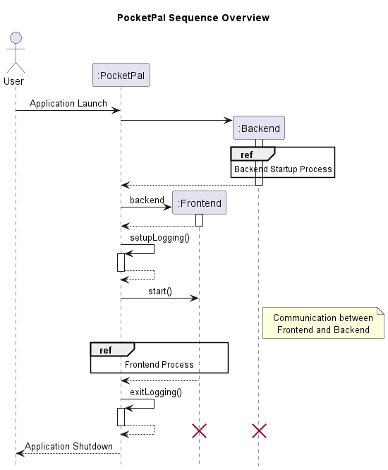
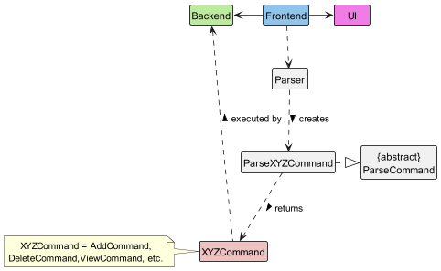
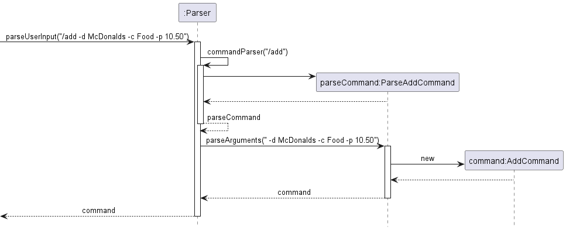
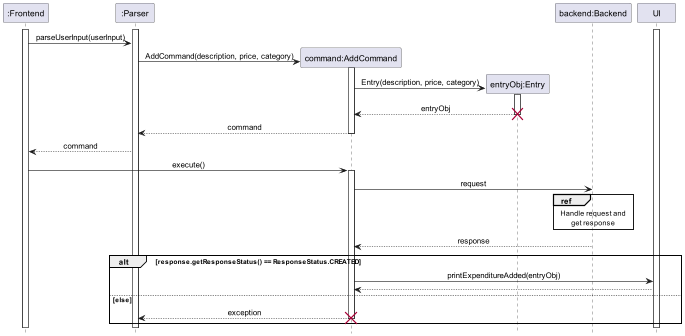
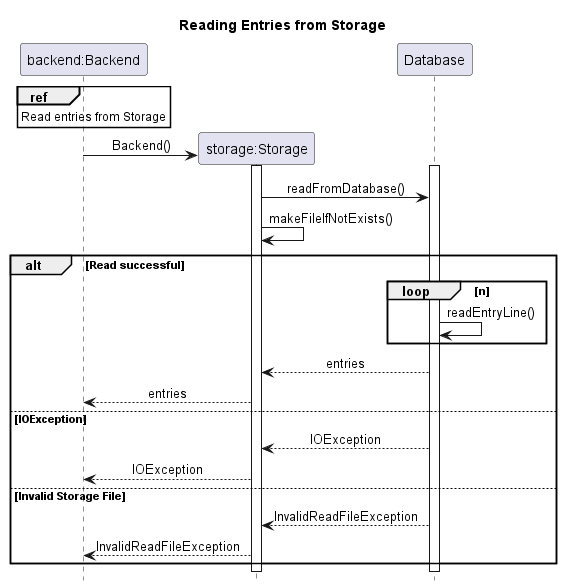

<!-- omit in toc -->

# Developer Guide

<!-- omit in toc -->

## Table of Contents

- [Developer Guide](#developer-guide)
  - [Table of Contents](#table-of-contents)
- [Design](#design)
  - [Architecture](#architecture)
  - [Frontend](#frontend)
    - [Parser](#parser)
    - [Commands](#commands)
      - [Add Command](#add-command)
      - [Delete Command](#delete-command)
      - [Edit Command](#edit-command)
        - [Overall class diagram for editing an Entry](#overall-class-diagram-for-editing-an-entry)
        - [Implementation](#implementation)
        - [Overall sequence diagram for editing an Entry](#overall-sequence-diagram-for-editing-an-entry)
      - [View Command](#view-command)
        - [Class diagram of view command](#class-diagram-of-view-command)
        - [Implementation](#implementation-1)
      - [Help Command](#help-command)
        - [Implementation](#implementation-2)
      - [Exit/Bye Command](#exitbye-command)
        - [Implementation](#implementation-3)
  - [Backend](#backend)
    - [Storage](#storage)
      - [Reading from Database](#reading-from-database)
      - [Writing to Database](#writing-to-database)
      - [Resetting Database](#resetting-database)
    - [API](#api)
      - [Endpoints](#endpoints)
        - [Creating a request](#creating-a-request)
        - [Making a request](#making-a-request)
      - [Access all entries available](#access-all-entries-available)
        - [Get recent or all entries](#get-recent-or-all-entries)
      - [Add, modify, view or delete an entry](#add-modify-view-or-delete-an-entry)
        - [Add an entry](#add-an-entry)
        - [View a specific entry](#view-a-specific-entry)
        - [Delete an entry](#delete-an-entry)
        - [Modify an entry](#modify-an-entry)
  - [Data Structure](#data-structure)
  - [Communication](#communication)
- [Implementation](#implementation-4)
- [Testing](#testing)
  - [Unit Tests](#unit-tests)
  - [Instructions for manual testing](#instructions-for-manual-testing)
    - [Feature Testing](#feature-testing)
    - [Add entry: /add](#add-entry-add)
    - [View entry: /view](#view-entry-view)
    - [Delete entry: /delete](#delete-entry-delete)
    - [Edit entry: /edit](#edit-entry-edit)
    - [Show help menu: /help](#show-help-menu-help)
    - [Terminate program: /bye](#terminate-program-bye)
  - [Testing with sample data (from file)](#testing-with-sample-data-from-file)
    - [Exceptions](#exceptions)
- [Appendix: Requirements](#appendix-requirements)
  - [Product scope](#product-scope)
    - [Target user profile](#target-user-profile)
    - [Value proposition](#value-proposition)
  - [User Stories](#user-stories)
  - [Non-Functional Requirements](#non-functional-requirements)
  - [Glossary](#glossary)
  - [Acknowledgements](#acknowledgements)
    - [Documentation](#documentation)
    - [Storage](#storage-1)
    - [Unit Tests](#unit-tests-1)

# Design

## Architecture


The diagram above illustrates the high-level overview of `PocketPal`.

__Main Components of PocketPal__

- The entry point to our application is `pocketpal.PocketPal`, which creates the `Frontnend` and `Backend` instances at
  launch.
- `PocketPal` also sets up logging for the application, which outputs the logs to `logs/logging.txt`.

__Frontend__
`Frontend` is made up of the following components

- `UI`: Handles display of user interface
- `Parser`: Converts text entered by users into `Command` if valid
- `Command`: Contains the instructions to be executed as input by the user

__Backend__
`Backend` is made up of the following components

- `Endpoint`: The parent component used by various endpoints (`EntryEndpoint` and `EntriesEndpoint`), where the frontend
  can send a `Request`
- `EntryLog`: The main data structure used for temporarily storing multiple `Entry` objects
- `Storage`: Reads data from, and writes data to the disk, which can be found at `data/storage.txt`

__Communication between `Frontend` and `Backend`__

- PocketPal uses the `Gson` library to serialise and deserialise objects where applicable, such as `Entry`
  and `EntryLog`.
- This allows us to standardise the communication framework between `Frontend` and `Backend`, by using a simplified HTTP
  model.
- Each endpoint takes in a `Request`, and returns a `Response` based on the requested data.

__How the architecture components interact with one another__

The following sequence diagram shows how the main components, `Frontend` and `Backend`, interact with one another.



Further design details are documented in the [Frontend](#frontend) and [Backend](#backend) sections below.

## Frontend

The API of this component is specified
in [`Frontend.java`](https://github.com/AY2223S2-CS2113-W15-2/tp/blob/master/src/main/java/pocketpal/frontend/Frontend.java)


- User input and output is handled by `Frontend`
- The application parses the input given by the user in [`Parser`](#parser)
- If parsed successfully, the corresponding `Command` object is executed, which sends a `Request` to the
  appropriate [`Endpoint`](#endpoints) in [`Backend`](#backend) (Refer to `Backend Request Process` sequence diagram)
- If the request is successful, the user is updated through `UI`. Otherwise the error message
  corresponding the user's action is printed instead.

<!-- @@author adenteo -->

### Parser

The `Parser` class is a fundamental component instantiated as soon as PocketPal is initialised. Its __purpose__ is to
convert the user's input into structured data which then produces clear instructions for the rest of the program.

Some of its core features include:

- Breaking down user input and extracting the relevant data for further processing.
- Performing input validation and error handling to ensure that input data is in the correct format and ready to be
  processed.
- Converting the input data into the correct format and returning it as a `Command` class to be further processed by the
  application.

Here's a class diagram that shows only the core structure of the `Parser` class.



How `Parser` works:

1. When a user enters a command, the `Frontend` uses `Parser` to resolve the user input.
2. Parser creates `ParseXYZCommand` (`XYZ` is a placeholder for the various command names[^1]
   e.g.`ParseAddCommand()`, `ParseDeleteCommand()`, etc.), which inherits the abstract class `ParseCommand`, to parse
   the input for the corresponding command.
2. Within `ParseXYZCommand`, other methods are called to extract and check the validity of the required parameters for
   that particular command. Any exceptions will be thrown and their corresponding error messages will be shown to the
   user via the `UI` class.
2. If the user input is valid, an `XYZCommand` object containing the relevant data is created and returned.
   E.g. `ParseAddCommand` would return a `AddCommand` object containing the description, price and category.
3. From there, the `XYZCommand` is ready to be executed by the `Backend`. (All `XYZCommand` classes inherit
   from `Command` and
   have corresponding `execute()` that carry out their specific instructions.)

[^1]: A list of currently supported commands in PocketPal can be found [here](../../UserGuide.html/features/)

The Sequence Diagram below illustrates the interactions within the `Parser` component when a user inputs the following
command: `/add -d McDonalds -c Food -p 10.50`



<div style="text-align: right;">
   <a href="#table-of-contents"> Back to Table of Contents </a>
</div>
<!-- @@author kaceycsn -->

### Commands

#### Add Command

The add entry mechanism is facilitated by `EntryLog`. Every instance of `AddCommand` is created with an `Entry`
instance.

The following sequence diagram shows how the add command work:



Given below is an example usage scenario and how the add mechanism behaves at each step.

Step 1. The user launches the application for the first time. The `EntryLog` will be initialized and contains no entry.

Step 2. The user executes `/add Lunch at McDonalds -category Food -price 19.9` command to add an `Entry` to
the `EntryLog`.

_***Note.*** The command will fail its execution if its format is incorrect, and no `Entry` will be added to
the `Entrylog`. An error message will be displayed informing the user._

Step 3. The command will be resolved by `Parser`, which would create an `AddCommmand` object.

Step 4. The `AddCommand` constructor creates and returns an `Entry` object containing the description, price and
category to be added.

Step 5. When `execute()` method is called, a `Request` object is created.

Step 6. From there, the `Request` is ready to be handled. `addEntry()` method is called and the new `Entry` is added to
the `EntryLog`.

Step 7. A success message is after the new `Entry` is added to the `EntryLog`.

The following activity diagram summarizes what happens when a user executes an add command:


#### Delete Command

The 'delete' entry mechanism is facilitated by `EntryLog`.

Every instance of `DeleteCommand` is created with an Integer, which is the ID of the `Entry` to be deleted.

The following sequence diagram shows how the delete command work:


Given below is an example usage scenario and how the delete mechanism behaves at each step.

Step 1. The user decides to remove an `Entry` from the `EntryLog` and executes `/delete 1` command.

_**Note:** The command will fail its execution if the index provided is invalid, and no `Entry` will be removed from
the `EntryLog`. An error message will be displayed informing the user._

Step 2. The command will be resolved by `Parser`, which would create an `DeleteCommmand` object containing the index of
the `Entry` to be deleted.

Step 3. When `execute()` method is called, a `Request` object is created.

Step 4. From there, the `Request` is ready to be handled. `deleteEntry()` method is called and the `Entry` is removed
from `EntryLog`.

Step 5. A success message is printed after the `Entry` is removed from `EntryLog`.

The following activity diagram summarizes what happens when a user executes a delete command:


<!-- @@author leonghuenweng -->

#### Edit Command

##### Overall class diagram for editing an Entry


##### Implementation

**Step 1.** User runs Edit command, specifying the ID of the entry to edit, as well as the new attributes of the
respective
fields.

**Step 2.** Parser extracts the relevant argument and returns a EditCommand object.

**Step 3.** The execute method of the EditCommand is called and a Request object is created. This request object
specifies
the modifications of the various fields.

**Step 4.** The Request object is then parsed as an argument to the Backend Class, which feeds this request as an
argument
to a method in the EntryEndpoint class.

**Step 5.** The EntryEndpoint class then finds and modifies the entry as specified by the user.

**Step 6.** Upon successful completion of the modification, the EntryEndpoint class returns a Response object to the
Backend class. The Response object contains the updated fields of the entry. 

However, if the edit operation fails, the response object will contain the relevant exception message which would be printed to the user.

**Step 7.** The Backend class calls the save() method to update the Storage class with the edited entry.It then returns
the Response object to the execute function in the EditCommand object.

**Step 8.** The printExpenditureEdited method under the UI class is then called in the execute function and an
acknowledgement message is printed to the user.

##### Overall sequence diagram for editing an Entry


#### View Command

##### Class diagram of view command


Class diagram above shows the methods called in the execute method of the
View Command object.

##### Implementation


**Step 1.** String of user arguments is fed into the parseViewCommand method in Parser object.

**Step 2.** The various filters such as price and dateTime are extracted from the argument String and fed into the
constructor of viewCommand.

**Step 3.** A request object is instantiated, with all the query parameters (eg price) as its attributes.

**Step 4.** The request is fed into the backend method requestEndpointEntries, which then sends this request to the
EntriesEndpoint class.

**Step 5.** A response object is then returned from EntriesEndpoint. This response contains the serialised form of all
relevant entries.

**Step 6.** The entries are then deserialised and fed into the ui printEntriesToBeViewed method, which prints the
details of each entry to the user.

#### Help Command

##### Implementation

**Step 1.** The Parser extracts the help command from the user input and calls the parseHelpCommand method.

**Step 2.** The execute method of the returned HelpCommand object is then called.

**Step 3.** In the execute method, the printHelp method of the UI Class is called and a string displaying all
available commands, as well as examples of how to use them, is called. 

#### Exit/Bye Command

##### Implementation

**Step 1.** The Parser extracts the bye command from the user input and calls the parseHelpCommand method.

**Step 2.** An ExitCommand is returned and since this command is the only command object with the isExit attribute set
as "true", the while loop of the program will terminate since !isExit is the loop condition.

<div style="text-align: right;">
   <a href="#table-of-contents"> Back to Table of Contents </a>
</div>
<!-- @@author -->

<!-- ### UI

<div style="text-align: right;">
   <a href="#table-of-contents"> Back to Table of Contents </a>
</div> -->

<!-- @@author jinxuan-owyong -->

## Backend

The API of this component is specified
in [`Backend.java`](https://github.com/AY2223S2-CS2113-W15-2/tp/blob/master/src/main/java/pocketpal/backend/Backend.java)

The backend uses a simplified RESTful API approach. This allows us to decouple code using the proven industry practices.
The following diagram illustrates the relationship between various classes involved in `Backend` as described in
the [application architecture](#architecture).


On startup, `Backend` creates various `Endpoint` instances, which can be illustrated by the following diagram:


Making a request

When `Backend` receives a `Request` from `Frontend`, the receiving `Endpoint` will process it based on the request
method and parameters, which can be accessed using `Request::getParam()`. The request will be processed based on its
method. There are currently 4 methods supported: `GET`, `POST`, `PATCH`, `DELETE`.


To find out more, visit the following sections:

- [Storage](#storage)
- [API](#api)
    - [Add, modify, view or delete an entry - `GET`](#add-modify-view-or-delete-an-entry)
    - [Access all entries available - `DELETE`, `GET`, `PATCH`, `POST`](#access-all-entries-available)

<div style="text-align: right;">
   <a href="#table-of-contents"> Back to Table of Contents </a>
</div>

<!-- @@author nghochi123 -->

### Storage

The `Storage` class is responsible for the serialization of `Entry` data into a csv-like syntax, as well as the
deserialization of that data back into `Entry` objects.

The main callable functions to be used are:

- `readFromDatabase()` - Deserializes data stored in text form back into `Entry` objects. Executed when PocketPal is
  instantiated
- `writeToDatabase()` - Serializes `Entry` objects in `EntryLog` into text form.
- `reset()` - Clears whatever is in the stored text file, without affecting what is in the current `EntryLog`.

<!-- The structure of the Storage class is as follows:

 -->

#### Reading from Database

The `readFromDatabase()` method is called from a `Backend` instance upon its instantiation, and reads from the database
which comes in the form of a text file.



1. When a `Backend` instance is created, the constructor will call the `readFromDatabase()` method which first
   calls `makeFileIfNotExists()` to create a new database file if it does not exist.
2. The `readEntryLine()` method reads the data from the database file line by line, until there are no more lines to
   read. It then returns a list of `Entry` objects which is passed back to the `Backend` instance to be processed.
3. Two possible exceptions to be thrown are the `IOException` and the `InvalidReadFile` exceptions.

#### Writing to Database

The `writeFromDatabase()` method is called from a `Backend` instance through the `save()` method.


1. The `save()` method calls the `writeFromDatabase()` method which first calls `makeFileIfNotExists()` to create a new
   database file if it does not exist.
2. The `writeEntryLine()` method writes the data into the database file line by line, until there are no more lines to
   write. If successful, nothing is returned.
3. An `IOException` might be thrown in this method.

#### Resetting Database

The `reset()` method is called from a `Backend` instance through the `clearData()` method.


1. The `clearData()` method calls the `reset()` method which first deletes the database file, then calls
   the `makeFileIfNotExists()` method to create a new database file. If successful, nothing is returned.
2. An `IOException` might be thrown in this method.

<div style="text-align: right;">
   <a href="#table-of-contents"> Back to Table of Contents </a>
</div>
<!-- @@author -->

<!-- @@author jinxuan-owyong -->

### API

#### Endpoints


The sequence diagram for specific request handling at each endpoint can be viewed at their respective sections.

Each endpoint is a child class `Endpoint`. Currently, there are 2 endpoints available:

| Endpoint   | Method to call             |
|------------|----------------------------|
| `/entry`   | `requestEntryEndpoint()`   |
| `/entries` | `requestEntriesEndpoint()` |

##### Creating a request

- To create a request, simply instantiate `pocketpal.communication.pocketpal.Request`
  with the desired request method.
- If there are any parameters associated with the request, you may add them using `addParam()`

```java
Request req=new Request(RequestMethod.PATCH);
        req.addParam(RequestParams.EDIT_DESCRIPTION,"mango juice");
```

##### Making a request

- To call each endpoint, pass the `Request` into its corresponding method in the frontend.
- A `Response` will be returned to the frontend.

> All request body and parameter data should be serialised with `String.valueOf()` if not specified.

```java
Backend backend=new Backend();
        Response res=backend.callEntryEndpoint(req);

        if(res.getResponseStatus()!=ResponseStatus.OK){
        // handle status        
        }

        Entry entry=EntryParser.deserialise(res.getData());
// process entry
```

<div style="text-align: right;">
   <a href="#table-of-contents"> Back to Table of Contents </a>
</div>

#### Access all entries available

##### Get recent or all entries

`GET /entries`

<details markdown=1>
   <summary markdown="span">Sequence diagram</summary>

   

</details>

__Body__

Number of recent entries to view if present, otherwise all entries will be returned.

__Parameters__

__`GET_SIZE`__ boolean

- If present, response will contain the number of entries.
- Otherwise, the following filters will be applied to the entries:

__`FILTER_BY_AMOUNT_START`__ double

- If this is the only parameter, it will be used as a minimum amount filter.
- If both filter amount parameters are present, it will be used as a amount range filter.

__`FILTER_BY_AMOUNT_END`__ double

- If this is the only parameter, it will be used as a maximum amount filter.
- If both filter amount parameters are present, it will be used as a amount range filter.

__`FILTER_BY_CATEGORY`__ Category

- Filter entries by category

__`FILTER_BY_QUERY`__ String

- Filter entries by user query

__`FILTER_BY_TIME_START`__ AND __`FILTER_BY_TIME_END`__ DateTime (dd/MM/yy HH:mm)

- Filter entries by date and time
- Both parameters are required if used

__Responses__

| Status Code | Description           | Remarks                                                                                        |
|-------------|-----------------------|------------------------------------------------------------------------------------------------|
| `200`       | OK                    | Gson-serialised `List<Entry>`, deserialise with `EntryLogParser::deserialise`                  |
| `422`       | Unprocessable Content | Response message will provide more information on the error (Invalid category, date, ID, etc.) |

<div style="text-align: right;">
   <a href="#table-of-contents"> Back to Table of Contents </a>
</div>

#### Add, modify, view or delete an entry

##### Add an entry

`POST /entry`

<details markdown=1>
   <summary markdown="span">Sequence diagram</summary>

   

</details>

__Body__

- Gson-serialised `Entry`, obtained using `Entry::serialise`

__Parameters__

N/A

__Responses__

| Status Code | Description           | Remarks                                                                                         |
|-------------|-----------------------|-------------------------------------------------------------------------------------------------|
| `201`       | Created               | -                                                                                               |
| `422`       | Unprocessable Content | Response message will provide more information on the error (Invalid description, amount, etc.) |

##### View a specific entry

`GET /entry`

<details markdown=1>
   <summary markdown="span">Sequence diagram</summary>

   

</details>

__Body__

- 1-based index of entry to view _Required_

__Parameters__

N/A

__Responses__

| Status Code | Description | Remarks                                                              |
|-------------|-------------|----------------------------------------------------------------------|
| `200`       | OK          | Gson-serialised `Entry`, deserialise with `EntryParser::deserialise` |
| `404`       | Not Found   | -                                                                    |

##### Delete an entry

`DELETE /entry`

<details markdown=1>
   <summary markdown="span">Sequence diagram</summary>

   

</details>

__Body__

- 1-based index of entry to be deleted _Required_

__Parameters__

N/A

__Responses__

| Status Code | Description | Remarks                                                              |
|-------------|-------------|----------------------------------------------------------------------|
| `200`       | OK          | Gson-serialised `Entry`, deserialise with `EntryParser::deserialise` |
| `404`       | Not Found   | -                                                                    |

##### Modify an entry

`PATCH /entry`

<details markdown=1>
   <summary markdown="span">Sequence diagram</summary>

   

</details>

__Body__

- 1-based index of entry to be deleted _Required_

__Parameters__

__`EDIT_AMOUNT`__ int

- The updated entry amount

__`EDIT_CATEGORY`__ Category

- The updated entry category

__`EDIT_DESCRIPTION`__ string

- The updated entry description

__Responses__

| Status Code | Description           | Remarks                                                              |
|-------------|-----------------------|----------------------------------------------------------------------|
| `200`       | OK                    | Gson-serialised `Entry`, deserialise with `EntryParser::deserialise` |
| `404`       | Not Found             | -                                                                    |
| `422`       | Unprocessable Content | -                                                                    |

<div style="text-align: right;">
   <a href="#table-of-contents"> Back to Table of Contents </a>
</div>

## Data Structure

We use the `EntryLog` data structure to keep track of the entries entered by the user.


<div style="text-align: right;">
   <a href="#table-of-contents"> Back to Table of Contents </a>
</div>

## Communication

This project uses a simplified HTTP model, where the frontend sends a `Request` to the backend to perform data-related
operations. The backend returns a `Response`, which is then processed by the frontend


<div style="text-align: right;">
   <a href="#table-of-contents"> Back to Table of Contents </a>
</div>
<!-- @@author -->

# Implementation

<!-- ## [Proposed] Undo/Redo feature -->

# Testing

## Unit Tests

We adopt the Arrange, Act, Assert pattern for unit tests in this project.
This allows us to achieve a structured unit tests while balancing code readability and maintainability, and allowing a
clear separation of the setup, operations and results.
For backend testing, we use utility classes such as `EntryTestUtil` and `BackendTestUtil` to reduce code repetition and
to simplify the testing process.

<details markdown=1>
<summary markdown="span">Example</summary>

  ```java

@DisplayName("Test /entries [GET]")
class TestEntriesGet extends EntryTestUtil {
    private static final EntryLog expectedEntryLog = new EntryLog();

    @BeforeEach
    void init() {
        TEST_BACKEND.clearData();
        expectedEntryLog.clearAllEntries();
    }

    @Test
    void entriesEndpointGET_recentEntries_correctEntries() {
        // Arrange
        addEntry(ENTRY_1);
        addEntry(ENTRY_2);
        addEntry(ENTRY_3);
        addEntry(ENTRY_4);
        expectedEntryLog.addEntry(ENTRY_3);
        expectedEntryLog.addEntry(ENTRY_4);

        // Act
        Request request = new Request(RequestMethod.GET); // recent 2 entries
        request.addParam(RequestParams.NUM_ENTRIES, "2");
        Response response = TEST_BACKEND.requestEndpointEntries(request);
        EntryLog returnedEntryLog = EntryLogParser.deserialise(response.getData());

        // Assert
        assertEquals(response.getResponseStatus(), ResponseStatus.OK);
        assertTrue(isSameEntryLog(expectedEntryLog, returnedEntryLog));
    }
}
  ```

  </details>

<div style="text-align: right;">
   <a href="#table-of-contents"> Back to Table of Contents </a>
</div>

<!-- ## Integration Testing

Integration testing in our application is performed by testing `Frontend` and `Backend`, where we ensure that the relevant features 
for each major component is working, before they are combined and tested through system testing

<div style="text-align: right;">
   <a href="#table-of-contents"> Back to Table of Contents </a>
</div> -->

<!-- ## System Testing

<div style="text-align: right;">
   <a href="#table-of-contents"> Back to Table of Contents </a>
</div> -->

<!-- @@author adenteo -->

## Instructions for manual testing

Refer to the [user guide](./UserGuide.md#getting-started) on launching PocketPal.

### Feature Testing

The following section provides instructions and code snippets for the manual testing of all currently supported features
in PocketPal.

---

**Do note that the expected output depicted in the test cases below may vary depending on the entries you have added.**

---

### Add entry: /add

**Usage:** `/add -d <description> -c <category> -p <price>`

__Test Case 1 (All required flags are provided):__

- **Prerequisites:** None
- __Input:__ `/add -d McDonalds -c Food -p 10.50`

<details markdown=1>
<summary markdown="span">Expected output:</summary>

```
________________________________________________
The following entry has been added:
Description: McDonalds
Price: $10.50
Category: Food
28 Mar 2023, 01:04:42
________________________________________________
Enter a command or /help to see the list of commands available.
```

</details>


__Test Case 2 (Missing price flag):__

- **Prerequisites:** None
- __Input:__ `/add -d McDonalds -c Food`

<details markdown=1>
<summary markdown="span">Expected output:</summary>

```
________________________________________________
Missing required options: 
-p|-price
________________________________________________
Enter a command or /help to see the list of commands available.
```

</details>

### View entry: /view

**Usage:** `/view [count] [filter_options]`

__Test case 1 (No entries exist):__

- **Prerequisites:** Ensure that there are currently no entries added.
- __Input:__ `/view`

<details markdown=1>
<summary markdown="span">Expected output:</summary>

```
________________________________________________
There are no entries available.
________________________________________________
Enter a command or /help to see the list of commands available.
```

</details>


__Test case 2 (Multiple entries exist):__

- **Prerequisites:** At least **3** existing entries.
- __Input:__ ```/view 3```

<details markdown=1>
<summary markdown="span">Expected output:</summary>

```
________________________________________________
These are the latest 3 entries.
Total expenditure: $360.50
Total income: $0.00
<1>: McDonalds (Food) - $10.50 <<7 Apr 2023; 15:53>>
<2>: Air Jordan 1 (Clothing) - $200.00 <<7 Apr 2023; 15:53>>
<3>: Birthday Dinner (Food) - $150.00 <<7 Apr 2023; 15:53>>
________________________________________________
Enter a command or /help to see the list of commands available.
```

</details>

__Test case 3 (View entries in price range)__

- **Prerequisites:** At least **2** existing entries with price range between $120.50 and $210.00 inclusive.
- __Input:__ ```/view -sp 120.50 -ep 210.00```

<details markdown=1>
<summary markdown="span">Expected output:</summary>

```
________________________________________________
These are the latest 2 entries.
Total expenditure: $350.00
Total income: $0.00
<1>: Air Jordan 1 (Clothing) - $200.00 <<7 Apr 2023; 15:53>>
<2>: Birthday Dinner (Food) - $150.00 <<7 Apr 2023; 15:53>>
________________________________________________
Enter a command or /help to see the list of commands available.
```

</details>

### Delete entry: /delete

**Usage:** `/delete <index> [additional_index...]`

You may view the list of existing entries along with their corresponding indexes with `/view`.

__Test case 1:__

- **Prerequisites:** At least **3** entries pre-added into the program.
- __Input:__ `/delete 3`

<details markdown=1>
<summary markdown="span">Expected output:</summary>

```
________________________________________________
The following entry has been deleted:
Description: Birthday Dinner
Price: $150.00
Category: Food
28 Mar 2023, 01:03:39
________________________________________________
Enter a command or /help to see the list of commands available.
```

</details>

__Test case 2__

- **Prerequisites:** Fewer than **20** entries pre-added into the program
- __Input:__ `/delete 20`

<details markdown=1>
<summary markdown="span">Expected output:</summary>

```
________________________________________________
Item ID does not exist: 20
Please specify a valid integer from 1 to 2147483647!
________________________________________________
Enter a command or /help to see the list of commands available.
```

</details>


__Test case 3__

- **Prerequisites:** At least **2** entries pre-added into the program
- __Input:__ `/delete 1 2`

<details markdown=1>
<summary markdown="span">Expected output:</summary>

```
________________________________________________
The following entry has been deleted:
Description: Light bulb
Price: $10.20
Category: Utilities
28 Mar 2023, 01:04:42
________________________________________________
The following entry has been deleted:
Description: Pizza
Price: $8.30
Category: Food
28 Mar 2023, 01:04:30
________________________________________________
Enter a command or /help to see the list of commands available.
```

</details>

### Edit entry: /edit

**Usage:** `/edit <index> [options]`

__Test case 1 (Editing all flags)__

- **Prerequisites:** At least **2** entries pre-added into the program.
- __Input:__ `/edit 2 -p 300.50 -c others -d MacBook Air`

<details markdown=1>
<summary markdown="span">Expected output:</summary>

```
________________________________________________
The following entry has been updated:
Description: MacBook Air
Price: $300.50
Category: Others
7 Apr 2023; 16:22
________________________________________________
Enter a command or /help to see the list of commands available.
```

</details>

__Test case 2 (Editing price only)__

- **Prerequisites:** At least **2** entries pre-added into the program, with the 2nd entry matching the one shown in
  the example above.
- __Input:__ `/edit 2 -p 300.50`

<details markdown=1>
<summary markdown="span">Expected output:</summary>

```
________________________________________________
The following entry has been updated:
Description: MacBook Air
Price: $300.50
Category: Others
7 Apr 2023; 16:22
________________________________________________
Enter a command or /help to see the list of commands available.
```

</details>

### Show help menu: /help

**Usage:** `/help`

__Test case__

- **Prerequisites:** None.
- __Input:__ `/help`

<details markdown=1>
<summary markdown="span">Expected output:</summary>

```
________________________________________________
PocketPal is an expense tracking app, optimised for use via a Command Line Interface. 
Users can take advantage of the input flags for entering entries quickly.
Listed below are the various commands that are currently supported.

Add - Adds an entry to your current account.
Usage: /add -d <description> -c <category> -p <price>
Options:
-d <description>
-c <category>
-p <price>
See below for examples
/add -d Apple Macbook Air -p 1300 -c Personal
/add -p 1300 -c Personal -d Apple Macbook Air

Delete - Deletes specified entry(s) from your account.
Usage: /delete <index> [additional_index...]
See below for examples
/delete 10 11 13 
/delete 1

Edit - Edits a specified entry in your account.
Usage: /edit <index> [options]
Options:
-d <description>
-c <category>
-p <price>
See below for examples
/edit 5 -d Grab to school -c Transportation -p 20.00

View - Displays a list of your current entries.
Usage: /view [count] [filter_options]
Filter options:
-c <category>
-sp <startprice>
-ep <endprice>
-sd <startdate>, -ed <enddate>
See below for examples
/view 100 -c Transportation -sp 2.00 -ep 5.00
/view -sd 21/11/1997 -ed 22/11/1997 -c Transportation -sp 2.00
/view 10 -sd 21/11/1997 -ed 22/12/1997 -c Transportation -sp 2.00 -ep 6.00

Help - Displays the help menu.
Usage: /help

Exit - Terminates PocketPal.
Usage: /bye
________________________________________________
Enter a command or /help to see the list of commands available.
```

</details>

### Terminate program: /bye

**Usage:** `/bye`

__Test case__

- **Prerequisites:** None.
- __Input:__ `/bye`

<details markdown=1>
<summary markdown="span">Expected output:</summary>

```
________________________________________________
Bye. See you again :)
________________________________________________
```

</details>

---
More test cases will be added as more features are introduced.

<div style="text-align: right;">
   <a href="#table-of-contents"> Back to Table of Contents </a>
</div>

## Testing with sample data (from file)

PocketPal stores data in a *storage.txt* file under the "*data/*" directory. Each row in the "*storage.txt*" file
represents a single Entry. Each column in each row should have 3 columns, representing the *description* of the
Entry, *amount* associated with the Entry and *category* of the Entry in that order, and are separated with the ","
delimiter. All of them are in the String format.

An example *storage.txt* file that will be readable by PocketPal is as such:

```
Apple Juice,5.50,Food
Bus Card,50,Transportation
Paracetamol,10.39,Medical
```

which will give us 3 Entries.

As of the time of writing, the available categories are:

- Clothing
- Entertainment
- Food
- Medical
- Others
- Personal
- Transportation
- Utilities
- Income

An empty input for category is not allowed. If necessary, use the "Others" category.

### Exceptions

Exceptions are thrown for a couple of cases where files are being read. If you wish to test the exceptions, they can be
replicated as follows:

1. Delimiter is invalid: If the delimiter is not the comma (","), it is not recognised as a delimiter and will not be
   processed correctly.
   > Example row: Apple Juice|5.50|Food - In this case, the pipe ("|") is used as a delimiter, which is not allowed.
2. Amount is invalid: If the amount is not a numeric, it is not recognised as a valid amount and will not be processed
   correctly.
   > Example row: Apple Juice,5A6B,Food - In this case, the amount is "5A6B", which is not a numeric and therefore not
   > allowed.
3. Category is invalid: If the category is not a string from the list of allowed categories (see above), it is not
   recognised as a valid category and will not be processed correctly.
   > Example row: Apple Juice,5.50,Drink - In this case, the category is "Drink", which is not a valid category and
   > therefore not allowed.
4. Not enough columns: If a row has insufficient columns compared to what is needed, the Entry cannot be created.
   > Example row: Apple Juice,5.50 - In this case, there are only two categories which is not allowed.

<div style="text-align: right;">
   <a href="#table-of-contents"> Back to Table of Contents </a>
</div>

# Appendix: Requirements

## Product scope

<div style="text-align: right;">
   <a href="#table-of-contents"> Back to Table of Contents </a>
</div>

### Target user profile

PocketPal's main target users are individuals who are 
- Looking for a simplified process of keeping track of their personal expenses.
- Able to type fast
- Comfortable with the use of CLI applications, and might even prefer CLI applications over GUIs
- From all walks of life

### Value proposition

For individuals striving to save money for a vacation, a new car, or any other significant purchase, understanding their cash flow is crucial, yet often challenging and time-consuming.

PocketPal revolutionizes the process by offering a seamless, user-friendly experience for tracking both income and expenses. PocketPal empowers users with valuable insights into their spending patterns, enabling them to make well-informed financial decisions and effectively reach their financial milestones.

By delivering a comprehensive and automated overview of users' income and expenses, PocketPal puts financial control at their fingertips, making the journey towards financial success more attainable and enjoyable.

## User Stories

| Version | As a ...                         | I want to ...                                                  | So that I can ...                                                      |
| ------- | -------------------------------- | ---------------------------------------------------            | ---------------------------------------------------------------------- |
| v1.0    | user                             | easily input my expenses                                       | add expenses quickly                                                   |
| v1.0    | user                             | view my total expenditure at a glance                          | plan my finances well                                                  |
| v1.0    | user                             | edit expenditures                                              | correct my mistakes and track my expenditures properly                 |
| v1.0    | user                             | delete expenditures                                            | remove wrongly tracked expenditures                                    |
| v1.0    | business owner                   | have different categories                                      | have better flexibility in planning my budget for different categories |
| v1.0    | user                             | be able to add my income as well                               | track my net cash flow                                                 |
| v1.0    | less tech savvy user             | have a help function                                           | get assistance whenever I'm not sure of how to do something in the app |
| v1.0    | user with many expenses to track | limit the number of expenses displayed                         | see only a limited number of expenses at a time                        |
| v2.0    | user with many expenses to track | filter an expense item by description                          | locate an expense without having to go through the entire list         |
| v2.0    | user with many expenses to track | filter an expense item by category                             | locate an expense without having to go through the entire list         |
| v2.0    | user with many expenses to track | filter an expense item by start and end date                   | locate an expense without having to go through the entire list         |
| v2.0    | user with many expenses to track | filter an expense item by minimum and maximum price            | locate an expense without having to go through the entire list         |
| v2.0    | user with many expenses to track | delete multiple expenses at once                               | save time by not needing to delete expenses one by one                 |
| v2.0    | careless user                    | get accurate feedback and errors when I enter wrong commands   | intuitively know how to correct my command                             |


<div style="text-align: right;">
   <a href="#table-of-contents"> Back to Table of Contents </a>
</div>

## Non-Functional Requirements

{Give non-functional requirements}

<div style="text-align: right;">
   <a href="#table-of-contents"> Back to Table of Contents </a>
</div>

## Glossary

- __Request Method__ - The action to be performed by the `Endpoint` requested
  ([MDN Documentation](https://developer.mozilla.org/en-US/docs/Web/HTTP/Methods))
- __Request Parameter__ - The details of the action to be performed (Edit category, filter by date, etc.)
- __Response Code__ - The status of the response after a request is made
  ([MDN Documentation](https://developer.mozilla.org/en-US/docs/Web/HTTP/Status))

<div style="text-align: right;">
   <a href="#table-of-contents"> Back to Table of Contents </a>
</div>

## Acknowledgements

### Documentation

- [Github REST API documentation](https://docs.github.com/en/rest/quickstart?apiVersion=2022-11-28)
- [Diagrams.net](https://app.diagrams.net/)
- PlantUML

### Storage

- [Function `makeFileIfNotExists` - StackOverflow](https://stackoverflow.com/questions/9620683/java-fileoutputstream-create-file-if-not-exists)
- [Deleting files - w3Schools](https://www.w3schools.com/java/java_files_delete.asp)
- [BufferedReader - Baeldung](https://www.baeldung.com/java-buffered-reader)

### Unit Tests

- [Assert Exceptions Thrown - Baeldung](https://www.baeldung.com/junit-assert-exception)
- [Arrange, Act, Assert](https://java-design-patterns.com/patterns/arrange-act-assert)

<div style="text-align: right;">
   <a href="#table-of-contents"> Back to Table of Contents </a>
</div>