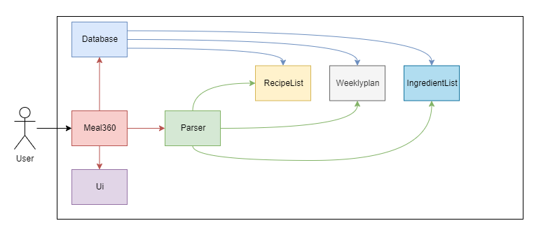
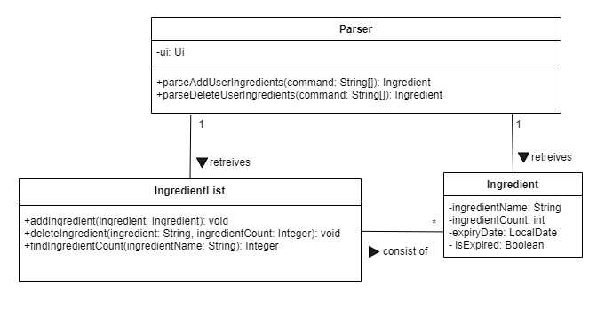
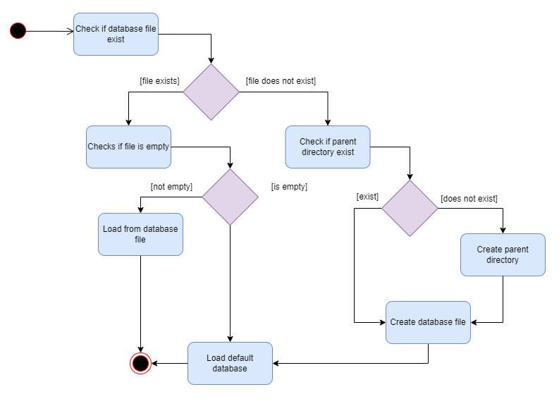
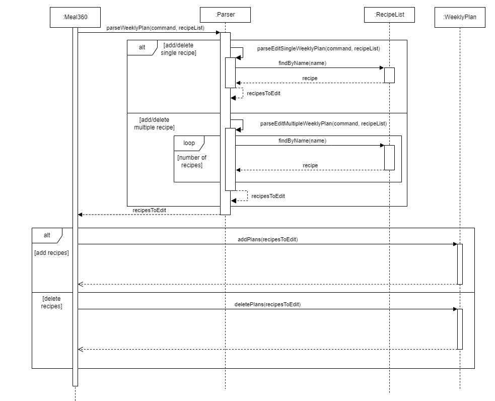

# Developer Guide

- [Acknowledgements](#acknowledgements)
- [Setting up, getting started](#setting-up-getting-started)
- [Design](#design)
  - [Architecture](#architecture)
  - [UI Component](#ui-component)
  - [Parser Component](#parser-component)
  - [Recipe Component](#recipe-component)
  - [RecipeList Component](#recipelist-component)
  - [WeeklyPlan Component](#weeklyplan-component)
  - [Database Component](#database-component)
  - [Ingredient Component](#ingredient-component)
- [Implementation](#implementation)
  - [Add Recipes Feature](#add-recipes-feature)
  - [Edit Recipes Feature](#edit-recipes-feature)
  - [Categorise/Tag Recipes Feature](#categorisetag-recipes-feature)
  - [List Recipes Feature](#list-recipes-feature)
  - [Delete Recipes Feature](#delete-recipes-feature)
  - [Add Ingredients Feature](#add-ingredients-feature)
  - [Delete Ingredients Feature](#delete-ingredients-feature)
  - [List Ingredients Feature](#list-ingredients-feature)
  - [Edit Weekly Meal Plan Feature](#edit-weekly-meal-plan-feature)
  - [List Weekly Plan Feature](#list-weekly-plan-feature)
  - [Mark Recipe as Done Feature](#mark-recipe-as-done-feature)

- [Appendix: Requirements](#appendix-requirements)
  - [Product scope](#product-scope)
  - [Target user profile](#target-user-profile)
  - [Value proposition](#value-proposition)
  - [User Stories](#user-stories)
  - [Non-Functional Requirements](#non-functional-requirements)
  - [Glossary](#glossary)
  - [Instructions for manual testing](#instructions-for-manual-testing)

---

## Acknowledgements

- [GSON](https://github.com/google/gson) library used for saving and loading databases easily in
  JSON format.

---

## Setting up, getting started

---

## Design

- [Architecture](#architecture)
- [UI Component](#ui-component)
- [Parser Component](#parser-component)
- [Recipe Component](#recipe-component)
- [RecipeList Component](#recipelist-component)
- [WeeklyPlan Component](#weeklyplan-component)
- [Database Component](#database-component)

### Architecture

The Architecture Diagram below shows a high-level design of the Meal360 application:


**How the architecture components interact with each other:**

Based on the user input, only certain components will be called to execute the command. For example,
if the user inputs `view 1`, the `Parser` component will call the `RecipeList` component to retrieve
the recipe at index 0, following which the `Ui` component will then display it to the user. The
sequence diagram below shows how the
interaction described above:


Depending on whether the user input is to make changes to the recipes, ingredients, or weekly plan,
the `Parser` component will call the `RecipeList`, `Ingredient`, and/or `WeeklyPlan` component
respectively. The class diagrams below shows the subsystems for recipes, ingredients and weekly
plan. For the class diagrams, `Meal360` and the `Ui` component are not shown for simplicity.
Additionally, methods irrelevant to the subsystem shown are also omitted for simplicity.

1. Recipe related

   

2. Ingredient related
   

3. WeeklyPlan related
   

### Meal360 Component

API: `Meal360.java`

The `Meal360` component:

- initializes the databases for the recipes, ingredients, and weekly plan upon program startup.
- receives the user input once initialization is complete.
- passes the user input to the `Parser` component.
- receives the output from the `Parser` component and passes it to the `Ui` component to be
  displayed
  to the user.
- saves the databases for the recipes, ingredients, and weekly plan upon receiving the `bye`
  command.
- terminates the program once the databases have been saved.

### UI Component

API: `Ui.java`

The `Ui` component:


- displays the welcome message upon startup of the program.
- formats all the output to be displayed to the user.
- provides the user with information on whether command was executed successfully or not.
- displays the error message if the command was not executed successfully.
- displays the goodbye message upon receiving the `bye` command.

The sequence diagram below shows how the `Ui` component works together with `Parser`
when the user inputs `list`.


### Parser Component

API: `Parser.java`

The `Parser` component:

- receives the user input from the `Meal360` component
- checks and filters input string
- catches `exceptions` and throws error messages via `UI` to
  1.  prompts user to enter valid input
  2.  prevent `Meal360` from crashing upon invalid input
- interacts with the `RecipeList`, `WeeklyPlan`, and/or `Ingredient` components to execute the commands.

The sequence diagram below shows how `Parser` filters user input dates and parses them
as valid `LocalDate` objects.


### Recipe Component

API: `Recipe.java`

The `Recipe` component:

- contains `name` and `ingredients` attribute
- store the ingredients details the user has added in `ingredients`

### RecipeList Component

API: `RecipeList.java`

The `RecipeList` component:

- extends from `ArrayList<Recipe>`
- stores the recipes the user has added as `Recipe` objects
- allows users to add their own recipes
- allows users to delete the existing recipes
- allows users to edit the existing recipes
- allows users to view the entire list of recipes
- allows users to view the ingredients required for a recipe
- allows users to add and remove recipes from a tag
- allows users to random a recipe from all the recipes that users have

### WeeklyPlan Component

API: `WeeklyPlan.java`

The `WeeklyPlan` component:

- extends from `HashMap<String, Integer>`
- stores the names of recipes that the user plans to prepare for the week as `String`
- stores the number of times the user plans to prepare each recipe as `Integer`
- allows users to add single or multiple recipes from the weekly plan
- allows users to delete single, multiple, or all recipes from the weekly plan
- allows users to see all ingredients for the week

How the `WeeklyPlan` component works:

1. When the user enters an input with the first word being `weekly`, the input is passed to
   the `Parser` component.
2. Based on the second argument, the `Parser` component will call the appropriate method in the
   `Parser` component.
3. `Parser` component then returns a `WeeklyPlan` object to indicate the recipe(s) to be added or
   deleted from the weekly plan.
4. `WeeklyPlan` component then uses either `addPlans` or `deletePlans` method to add or delete
   the recipe(s) from the weekly plan, `clearPlan` to clear the entire plan for the week, and `checkValidity` to 
   check the validness of the weekly plan (i.e. make sure all recipes are valid).

The sequence diagram below shows how the `WeeklyPlan` component works when the user
inputs `weekly /add burger 1`:


### Database Component

API: `Database.java`

The `Database` component:

- stores the recipes, ingredients, and weeklyplan in a local database in json format
- loads up automatically upon startup of program
- saves automatically upon exit of program
- comes with a default database of 10 recipes for new users

How the `Database` component works at start up for the recipes:

1. Upon starting up the program, the `Database` component will check for the existence of a
   database file in the local directory.
2. If the database file exists, the `Database` component will load the recipes from the database
   file into a `RecipeList` and return this `RecipeList`.
3. If the database file does not exist, the `Database` component will check if the parent directory,
   and create any missing directories and files as necessary.
4. If the database file does not exist or if the file was empty, the `Database` component will
   create a new `RecipeList`
   with 10 default recipes and return this `RecipeList`.

- The loading of the ingredients and weekly plan works in a similar manner, except that the default
  ingredient list and weekly plan are empty.

The activity diagram below shows how the `Database` component works at start up:


### Ingredient Component

---

## Implementation

- [Categorise/Tag Recipes Feature](#categorisetag-recipes-feature)
- [List Recipes Feature](#list-recipes-feature)
- [Delete Recipes Feature](#delete-recipes-feature)
- [Add Recipes Feature](#add-recipes-feature)
- [Edit Recipes Feature](#edit-recipes-feature)
- [Random a Recipe Feature](#random-a-recipe-feature)
- [Add Ingredients Feature](#add-ingredients-feature)
- [Delete Ingredients Feature](#delete-ingredients-feature)
- [List Ingredients Feature](#list-ingredients-feature)
- [Edit Weekly Meal Plan Feature](#edit-weekly-meal-plan-feature)
- [Mark Recipe as Done Feature](#mark-recipe-as-done-feature)

### Categorise/Tag Recipes Feature

- add single or multiples recipes into a tag
- remove single or multiples recipes from a tag

It is implemented through the following step:

1. When the user enters an input with the first word being `tag`, the input is passed to
   the `Parser` component.
2. In `Parser`, `parseTagRecipe()` is executed to identify whether user want to add recipes
   to a tag (`<<`), or remove recipes from a tag(`>>`). Then,
   - If `isAddTag`, user want to add recipes to a tag, `parseAddRecipeTag()` will be executed to
     extract
     the all the recipes to be added, separated by `&&`, and pass those recipes and tag label
     to `RecipeList`
     component.
   - If `isRemoveTag`, user want to remove recipes from a tag, `parseRemoveRecipeTag()` will be
     executed to
     extract the all the recipes to be removed, separated by `&&`, and pass those recipes and tag
     label to
     `RecipeList` component.
   - If user enter invalid command, an error message will be thrown.
3. In `RecipeList`,
   - If user want to add recipes to a tag, `addRecipeToTag()` is executed to add recipes in
     to the tag.
   - If user want to remove recipes to a tag, `removeRecipeFromTag()` is executed to remove recipes
     from the tag.

The sequence diagram below shows how this feature works:


### List Recipes Feature

- list all recipes
- list recipe with filters (name, ingredients, tags)

It is implemented through the following step:

1. When the user enters an input with the first word being `list`, the input is passed to
   the `Parser` component.
2. In `Parser`, `parseListRecipe()` is executed to first identify whether user want to filter
   by tag (`/t`).

   - If user filters the recipes by tag (`/t`), `isTag` is set to `true`.
   - Otherwise, `isTag` is set to `false`.

   Then, it will extract all the filters separated by `&&`, if any. All the filters are
   extracted out and passed to `RecipeList`component.

3. In `RecipeList`, `listRecipes()` is executed to first identify whether user want to
   filter by tag.
   - If `isTag` is true, `listTagRecipes()` is called to filter all recipes that meet
     all the filters by tag, and return the `recipeList` containing all relevant recipes
     to `listRecipes()`
     and `ParserRecipe()`, respectively.
   - If user `isTag` is false, it filters all recipes that meet all the filters by name
     and ingredients, and return `recipeList` containing all relevant recipes to
     `ParselistRecipe()`.

The sequence diagram below shows how this feature works:


### Delete Recipes Feature

The current implementation:

- deletes a single recipe by name or recipe's index in recipe list
- deletes a range of recipes
- deletes all recipes

It is implemented through the following step:

1. When the user enters an input with the first word being `delete`, the input is passed to
   the `Parser` component.
2. In `Parser`, `parseDeleteRecipe()` is executed to identify whether the user wants to delete all
   recipes, a single
   recipe, or range of recipes.
3. In `RecipeList`, `deleteRecipe()` is executed to delete the recipe at whatever index is passed as
   a parameter,
   and return the `Recipe` object at that index/the one just deleted.


### Add Recipes Feature

The current implementation:

- Add a single recipe in 1 line and followed by all the ingredients in next another line after being
  prompted.

It is implemented through the following steps:

1. When the user enters an input with the first word being `add`, the input is passed to
   the `Parser` component.
2. In `Parser`, the `parseAddRecipe` is executed to identify whether the recipe is an already
   existing recipe or
   it's a new recipe that is being added.
3. After the user enters the ingredients in 1 line, the input is passed to `parseIngredientName`
   which returns a
   hashmap<string,integer> with the ingredient name as 'key' and quantity as 'value'.
4. After the recipe name and ingredients are accepted and processed, the input is sent
   to `recipeList.addRecipe()`
   to store the new recipe data.

### Edit Recipes Feature

The current implementation:

- There are 3 ways to edit:
  - Edit all ingredients.
  - Edit 1 particular ingredient.
  - Add new ingredient.

It is implemented through the following steps:

1. When the user enters an input with the first word being `edit`, the input is passed to
   the `Parser` component.
2. In `Parser`, the `parseEditRecipe` is executed to identify whether the recipe is an already
   existing recipe to make edits.
3. The user will then be prompted with 3 options as mentioned above to make edits to the recipe
   ingredients.
4. After the new ingredients are accepted and processed, the input is sent
   to `recipeList.editRecipe()`
   to update the new recipe data.

### Random a Recipe Feature

- randomly pick a recipe and display to the user

It is implemented through the following step:

1. When the user enters an input with the first word being `random`, the `Parser`
   component will be executed.
2. In `Parser`, `parseRandomRecipe()` is executed and call `randomRecipe()` in
   `RecipeList` component.
3. In `RecipeList`, `randomRecipe()` is executed to random a recipe and return a
   `recipe` to `parseRandomRecipe()`.

The sequence diagram below shows how this feature works:


### Add Ingredients Feature

The current implementation:

- allows for adding only 1 ingredient at a time.
- ingredient needs to have its name, quantity and expiry date specified.

It is implemented through the following steps:

- When the user enters an input with the first word being `add_i`, the input is passed to
  the `Parser` component.
- In `Parser`, the `parseAddUserIngredient` is executed to identify whether all the required
  parameters are provided.
- If any of the parameters are missing/invalid, the user will be alerted with a relevant error
  message.
- If all the parameters are valid, the input is sent to `IngredientList` component.
- In `IngredientList`, `addIngredient()` is executed to first check if the ingredient already
  exists in the list.
- If the ingredient already exists, the quantity of the ingredient will be updated.
- If the ingredient does not exist, the ingredient will be added to the list.

The simplified sequence diagram below shows how this feature works assuming all inputs are correct:


### Delete Ingredients Feature

The current implementation:

- allows for deleting only 1 ingredient at a time.
- ingredient needs to have its name and quantity specified.

It is implemented through the following steps:

- When the user enters an input with the first word being `del_i`, the input is passed to
  the `Parser` component.
- In `Parser`, the `parseDeleteUserIngredient` is executed to identify whether all the required
  parameters are provided.
- If any of the parameters are missing/invalid, the user will be alerted with a relevant error
  message.
- If all the parameters are valid, the input is sent to `IngredientList` component.
- In `IngredientList`, `deleteIngredient()` is executed to first check if the ingredient exists in
  the list.
- If the ingredient does not exist, the user will be alerted with a relevant error message.
- If the ingredient exists and the new quantity is more than 0, the quantity of the ingredient will
  be updated. Otherwise, the ingredient would be deleted entirely from the list.

The sequence diagram of deleting an ingredient is similar to adding an ingredient.

### List Ingredients Feature

The current implementation:

- allows for listing all ingredients in the list.

It is implemented through the following steps:

- When the user enters an input with the first word being `view_ingredients`, the list of user
  ingredients that is represented by `userIngredients` is passed to the `Ui` component.
- In `Ui`, `printUserIngredients()` first checks if the list is empty.
- If the list is empty, the user will be alerted with a relevant message and the function exits.
- If the list is not empty, the list of ingredients will be printed out, with information regarding
  the names, quanntity, and expiry date of each ingredient displayed.

The sequence diagram below shows how this feature works:


### Edit Weekly Meal Plan Feature

The current implementation:

- allows for adding single recipe to the weekly meal plan.
- allows for deleting single recipe from the weekly meal plan.
- allow for adding multiple recipes to the weekly meal plan.
- allow for deleting multiple recipes from the weekly meal plan.

It is implemented through the following steps:

- When the user enters an input with the first word being `weekly`, the input is passed to
  the `Parser` component.
- In `Parser`, the `parseWeeklyMealPlan` is executed to identify whether the user wants to
  add/delete only one or multiple recipes.
- If the user wants to add/delete only one recipe, parseEditSingleWeeklyPlan() is executed.
- If the user wants to add/delete multiple recipes, parseEditMultiWeeklyPlan() is executed.
- `parseEditSingleWeeklyPlan()` and `parseEditMultiWeeklyPlan()` checks if the command parameters
  are valid first, then it returns the
  name and quantity of the recipes specified by the user. If the command parameters are invalid or
  the recipe is not a valid recipe, a relevant error message will be displayed.
- In `Meal360`, the second argument of the user input is then use to determine whether the user
  wants to add or delete the recipes.
- If the user wants to add the recipes, the list of recipe(s) would be passed to the `WeeklyPlan`
  component to execute `addPlans()`.
- If the user wants to delete the recipes, the list of recipe(s) would be passed to the `WeeklyPlan`
  component to execute `deletePlans()`.

The sequence diagram below shows how this feature works:



### List Weekly Plan Feature

The current implementation:

- allows for listing all recipes that are in the weekly plan.

It is implemented through the following steps:

- When the user enters an input with the first word being `weeklyplan`, the list of user
  ingredients that is represented by `userIngredients` is passed to the `Ui` component.
- In `Ui`, `printUserIngredients()` first checks if the list is empty.
- If the list is empty, the user will be alerted with a relevant message and the function exits.
- If the list is not empty, the list of ingredients will be printed out, with information regarding
  the names, quanntity, and expiry date of each ingredient displayed.

The sequence diagram below shows how this feature works:


### Mark Recipe as Done Feature

The current implementation:

- allows for marking a recipe in the weekly plan as done.
- marking a recipe as done automatically removes the recipe and one set of its ingredients from the
  weekly plan.

It is implemented through the following steps:

- When the user enters an input with the first two word being `weekly` and `/done` respectively, the
  input is passed to the `Parser` component.
- In `Parser`, the `parseMarkDone` is executed, which then send the input to `Recipe` component to
  obtain the list of ingredients of the recipe using `getIngredients()`.
- The list of ingredients is then passed to `IngredientList` component to check if the user has all
  the necessary ingredients using `findIngredientCount()`.
- If the user does not have all the necessary ingredients, the user will be alerted with a relevant
  error message.
- If the user has all the necessary ingredients, the `IngredientList` component will then remove the
  ingredients from the list using `deleteIngredient()`.
- The `WeeklyPlan` component will then remove the recipe from the weekly plan using `remove()` if no
  counts of the recipe is left, otherwise it will reduce the count of the recipe by 1 using `put()`.

The simplified sequence diagram below shows how this feature works assuming no counts of the recipe
is left after the deletion:


---

## Appendix: Requirements

### Product scope

### Target user profile

- has a need to manage a significant number of recipes
- has a need to manage a significant number of ingredients
- has a need to manage their meal plan on a weekly basis
- can type fast
- prefers typing to mouse input
- is reasonably comfortable using CLI apps

### Value proposition

Allows management of recipes, ingredients and weekly meal plan faster than a typical mouse/GUI
driven app.

### User Stories

| Version | As a ... | I want to ...                                     | So that I can ...                                                 |
| ------- | -------- | ------------------------------------------------- | ----------------------------------------------------------------- |
| v1.0    | user     | add my own recipes to the list                    | refer to them when next time                                      |
| v1.0    | user     | edit the existing recipe                          |                                                                   |
| v1.0    | user     | delete a recipe from the list                     | clear the unused recipes                                          |
| v1.0    | user     | view ingredients of the recipe                    | know what is needed to be prepared                                |
| v1.0    | user     | list all recipes I have                           | know what I have some idea of what to cook                        |
| v1.0    | user     | find the recipe that contain specific ingredients | find specific recipe without having to go through the entire list |
| v1.0    | user     | exit from the program                             |                                                                   |
| v2.0    | new user | list all the command that can be used             | know what command I can use                                       |
| v2.0    | user     | add meals I plan to make for the week             | refer to the weekly meals plan next time                          |
| v2.0    | user     | delete meals I plan to make for the week          | remove some meals from the weekly plan if I change my mind        |
| v2.0    | user     | categorise recipes using tags                     | group recipes with similar theme together                         |
| v2.0    | user     | list the recipes by tag                           | list recipes that are under the specific category                 |
| v2.0    | user     | random a recipe                                   | have a suggestion when do not know what to cook                   |
| v2.0    | user     | know what ingredients I have                      | know what ingredients I need to buy                               |
| v2.0    | user     | add the ingredients I have                        | easily track the ingredients I have                               |
| v2.0    | user     | delete the ingredients I have                     | easily track the ingredients I have                               |
| v2.0    | user     | be able to cross recipes off my weekly plan       | have a neater weekly plan                                         |

### Non-Functional Requirements

1. Should work on any _mainstream OS_ as long as it has Java 11 or above installed.
2. The number of recipes and user ingredients is limited to only 1000 items each.
3. A user with above average typing speed for regular English text (i.e. not code, not system
   admin commands) should be able to accomplish most of the tasks faster using commands than
   using the mouse, especially for the more advanced commands that allow for editing multiple items
   at once.

### Glossary

- **Mainstream OS**: Windows, Linux, Unix, OS-X

### Instructions for manual testing

Given below are instructions to test the app manually.

#### Launch and Shutdown

1. Initial launch

   1. Download the jar file and copy into an empty folder
   2. Run the jar file using the command `java -jar meal360.jar`. The GUI similar to the below
      should appear in a few seconds. The app comes with a smaall sample data of 10 recipes to
      allow for easy testing.

   Expected output:

   ```
   ----------------------------------------------------------------------------------------------------
    Welcome to Meal360, your ultimate Recipe Manager!
    __  __          _ ____  __  __
    |  \/  |___ __ _| |__ / / / /  \
    | |\/| / -_) _` | ||_ \/ _ \ () |
    |_|  |_\___\__,_|_|___/\___/\__/

    ----------------------------------------------------------------------------------------------------
    | Loading recipes...                                                                               |
    | Recipes loaded successfully.                                                                     |
    | Loading weekly plan...                                                                           |
    | Weekly plan loaded successfully.                                                                 |
    | Loading ingredients...                                                                           |
    | Ingredients loaded successfully.                                                                 |
    ----------------------------------------------------------------------------------------------------
   ```

2. Shutdown

   1. A user input of `bye` allows the user to exit the app. The app will then save the data for
      recipes, ingredients and weekly meal plan automatically before exiting.

   Expected output:

   ```
   ----------------------------------------------------------------------------------------------------
   | Saving recipes...                                                                                |
   | Recipes saved successfully.                                                                      |
   | Saving weekly plan...                                                                            |
   | Weekly plan saved successfully.                                                                  |
   | Saving ingredients...                                                                            |
   | Ingredients saved successfully.                                                                  |
   | Bye. Hope to see you again soon!                                                                 |
   ----------------------------------------------------------------------------------------------------
   ```

#### Ingredients

1. Test case: `add_i /n fish /c 10 /d 10/10/2024`
   Expected: The ingredient `fish` with quantity `10` and expiry date `10/10/2024` should be added
   into the user ingredients list. A success message should be displayed.

   Expected output:

   ```
    ----------------------------------------------------------------------------------------------------
    | Ingredient successfully added!                                                                   |
    ----------------------------------------------------------------------------------------------------
   ```

2. Test case: `del_i /n fish /c 5`
   Expected: The ingredient `fish` with quantity `5` should be deleted from the user ingredients.

   Expected output:

   ```
    ----------------------------------------------------------------------------------------------------
    | Ingredient successfully deleted!                                                                 |
    ----------------------------------------------------------------------------------------------------
   ```

3. Test case: `view_ingredients`
   Expected: The list of ingredients should be displayed.

   Expected output:

   ```
   ----------------------------------------------------------------------------------------------------
   | Here is your ingredient list:                                                                    |
   | fish (5) [by:10/10/2024]                                                                         |
   ----------------------------------------------------------------------------------------------------
   ```

#### Weekly Plan

1. Test case: `weekly /add avocado toast 2`
   Expected: The recipe `avocado toast` should be added into the weekly plan with count `2`.
   A success message should be displayed.

   Expected output:

   ```
   ----------------------------------------------------------------------------------------------------
   |  I've added the recipes to your weekly plan!                                                     |
   ----------------------------------------------------------------------------------------------------
   ```

2. Test case: `weekly /delete avocado toast 1`
   Expected: The recipe `avocado toast` should be deleted from the weekly plan with count `1`.
   A success message should be displayed.

   Expected output:

   ```
   ----------------------------------------------------------------------------------------------------
   | I've deleted the recipes from your weekly plan!                                                  |
   ----------------------------------------------------------------------------------------------------
   ```

3. Test case: `weeklyplan`
   Expected: The list of recipes in the weekly plan should be displayed.

   Expected output:

   ```
   ----------------------------------------------------------------------------------------------------
   | Here is your weekly plan:                                                                        |
   | avocado toast x1                                                                                 |
   ----------------------------------------------------------------------------------------------------
   ```

4. Test case: `weekly /multiadd /r chicken rice /q 3 /r seafood paella /q 1`
   Expected: The recipes `chicken rice` and `seafood paella` should be added into the weekly plan
   with count `3` and `1` respectively. A success message should be displayed.

   Expected output:

   ```
   ----------------------------------------------------------------------------------------------------
   |  I've added the recipes to your weekly plan!                                                     |
   ----------------------------------------------------------------------------------------------------
   ```

5. Test case: `weekly /multidelete /r chicken rice /q 2 /r seafood paella /q 1`
   Expected: The recipes `chicken rice` and `seafood paella` should be deleted from the weekly plan
   with count `2` and `1` respectively. A success message should be displayed.

   Expected output:
   ```
   ----------------------------------------------------------------------------------------------------
   | I've deleted the recipes from your weekly plan!                                                  |
   ----------------------------------------------------------------------------------------------------
   >>> weeklyplan
   ----------------------------------------------------------------------------------------------------
   | Here is your weekly plan:                                                                        |
   | chicken rice x1                                                                                  |
   | avocado toast x1                                                                                 |
   ----------------------------------------------------------------------------------------------------
   ```

#### Tag/Categorize Recipes
1. Remove recipe from an unknown tag.
   * Prerequisite: Make sure that `unknowntag` has never been created.
   * Test case 1: `tag unknowntag >> recipe1`
   * Expected: An error message is shown.
   * Expected output 1:
   ```
    ----------------------------------------------------------------------------------------------------
    | There is no "unknowntag" tag found. Please make sure you have entered the correct tag.           |
    ----------------------------------------------------------------------------------------------------
    ```
2. Add tag command with an unknown recipe
   * Prerequisite: Make sure that there is no recipe named `unknown` in the list, and 
         a recipe named `recipe1` using the `add` command.
   * Test case 2: `tag testtag << recipe1 && unknown`
   * Expected: An error message is showed. `recipe1` is added to `testtag` but `unknown` is not added.
   * Expected output 2:

   ```
   ----------------------------------------------------------------------------------------------------
   | Unable to find the recipe: "unknown" in the tag.                                                 |
   | All the recipe before "unknown" (if any) are successfully added from the tag.                    |
   ----------------------------------------------------------------------------------------------------
   ```

3. Remove tag command with an unknown recipe
    * Prerequisite: Complete test case 2
    * Test case 3: `tag testtag >> recipe1 && unknown`
    * Expected: An error message is showed. `recipe1` is removed `testtag` but `unknown` is not removed.
    * Expected output 3:
   ```
    ----------------------------------------------------------------------------------------------------
    | Unable to find the recipe: "unknown" in the tag.                                                 |
    | All the recipe before "unknown" (if any) are successfully removed from the tag.                  |
    ----------------------------------------------------------------------------------------------------
    ```
4. Successfully add a recipes into a tag
    * Prerequisite: Add recipe named `recipe2` using the `add` command
    * Test case 4: `tag testtag << recipe2`
    * Expected: `recipe2` is added to `testtag`.
    * Expected output 4:
   ```
    ----------------------------------------------------------------------------------------------------
    | You have successfully added the recipe(s) to "testtag" tag.                                      |
    ----------------------------------------------------------------------------------------------------
    ```

5. Successfully remove a recipe from a tag
    * Prerequisite: Complete test case 4
    * Test case 5: `tag testTag >> recipe2`
    * Expected: `recipe2` is removed `testtag`.
    * Expected output 5:
   ```
    ----------------------------------------------------------------------------------------------------
    | You have successfully removed the recipe(s) from "testtag" tag.                                  |
    ----------------------------------------------------------------------------------------------------
    ```

#### List Recipes
1. Listing recipes when there is no recipe in the list.
   * Prerequisite: Empty the list of recipes.
   * Test case 1: `list`
   * Expected output 1:
    ```
    ----------------------------------------------------------------------------------------------------
    | There is nothing to list.                                                                        |
    ----------------------------------------------------------------------------------------------------
   ```
2. List all recipes
   * Prerequisite: Add one or more recipes using the `add` command.
   * Test case 2: `list`
   * Expected output 2: An ordered list of recipes is displayed.
   The recipes' name that are added are listed out along with the number of ingredients needed.


3. List specific recipes
   * Test case 3: `list a`
   * Expected output 3: 
     * An ordered list of recipes that contain `a` in their name or ingredients is displayed.
       The recipes' name that are added are listed out along with the number of ingredients needed. 
     * If there is no recipe or ingredient that contain `a` the expected output is identical 
       to expected output 1.


4. List recipes from a tag
    * Prerequisite: Create a recipe named `recipefortag` using `add` command, and add the recipe to
      `testtag1` using `tag` command.
    * Test case 4: `list /t testtag1`
    * Expected output 4: An ordered list of recipes that are in `testtag1` are listed out, including `recipefortag`.
      The recipes' name that are added are listed out along with the number of ingredients needed.
