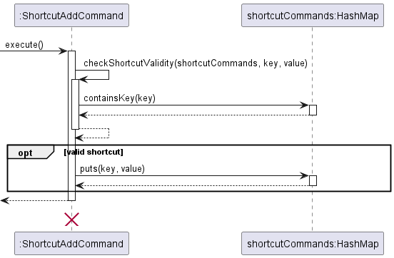

# Developer Guide

## Acknowledgements

{list here sources of all reused/adapted ideas, code, documentation, and third-party libraries -- include links to the
original source as well}

- [AB3](https://github.com/se-edu/addressbook-level3)
- [OpenCSV](https://opencsv.sourceforge.net/)
- [gson](https://github.com/google/gson)

## Introduction 

Welcome to rainyDay's developer guide! rainyDay is a desktop application for managing your finances that runs on a Command Line Interface (CLI). rainyDay
provides a simple solution to track your finances and achieve your financial goals. 

#### Main functions:
* Adding, deleting and editing transaction entries
* Viewing your transactions and filtering by certain fields
* Saving your data into a csv file
* Setting budgeting goals

#### Purpose and target reader

This guide is designed for potential engineers  and professors who may want to who may want to understand how rainyDay is implemented. 
We assume that you already have a certain level of technical knowledge as we will be going into detail of the technical aspects
of rainyDay.   If you are a user looking for instructions on how to use rainyDay, please refer to our [UserGuide](https://ay2223s2-cs2113t-t09-1.github.io/tp/UserGuide.html)

#### How to use this guide

{todo, talk about the diagrams, formatting (markdown etc)}

## Design

> 💡**Tip:** The .puml files used to create diagrams in this document can be found [here](https://github.com/AY2223S2-CS2113T-T09-1/tp/tree/master/docs/diagrams). 
> Refer to the PlantUML Tutorial at se-edu/guides to learn how to create and edit diagrams.

### Architecture

#### Main components of the architecture
- `Main`: Initializes the components in the correct sequence, and connects them up with each other
- `Parser`: breaks down inputs passed from user
- `Command`: executes the appropriate commands
- `Userdata`: Data input by the user
- `UI`: the user interface
- `Storage`: reads data from and writes data to the hard disk file

The diagram given below explains the high-level design of rainyDay, and how the components are related to one another.

The Sequence Diagram below shows the timeline of how the different components will interact with one another, we will
illustrate a 'delete' command, e.g. `delete 1`.

### Modules component

### Data component

{insert diagrams}

- stores the financial report data, such as financial statement objects

- Monthly expenditures are stored in the form of a Hash Table, mapping the Year and Month to the expenditures

#### Design considerations

- To prevent slow processing of the program when there are many entries, a Hash Table is used to keep track of the
  expenditures for the month.
  - We believe that the "Set Budget" feature will be commonly used as it is one of the key aspects of a Financial Tracker. 
    Hence, it would be feasible to implement an additional storage 
    such that common addition operations and retrieval of information can be done in Amortised O(1).
  - The Key used is the number of months from the Year 0000, or more precisely calculated by (Year * 12 + Month). 
    This is to allow for fast processing and collision-free information collection.

### Command component

1. When a command is parsed, a command object specific to the command given will be created, with the necessary
   parameters stored as attributes in the command specific class
2. RainyDay will then call method execute() in the command class to return a CommandResult object, which contains
   the output to be shown to user

### Exceptions component

## Implementation

### Maintaining of Financial Report

- `financialReport` is achieved with the use of an ArrayList collection of the object `FinancialStatement` to model a
  financial report containing a list of financial statements.
- A 'FinancialStatement` object contains the following attributes:
    - `description`: represents the description of a transaction, stored as a string
    - `flowDirection`: represents the direction of a transaction, stored as an enum of `FlowDirection`: `INFLOW` or
      `OUTFLOW`
    - `value`: represents the amount tagged with the transaction, stored as a double
    - `category`: represents the type of transaction, stored as a string
    - `date`: represents the date to be tagged of transaction, stored as LocalDate object

### Adding an entry `add`

- When a command is given to add a statement, the command is first parsed to check whether it follows the format of an
  add command: `add -DIRECTION DESCRIPTION $VALUE -c CATEGORY -date DD/MM/YYYY` with the use of regex pattern
    - Details on implementation for parsing and command fields are documented below
- Commands in the correct format will then be parsed to extract the relevant information, and an `AddCommand` object
  will be created with the relevant attributes
- `RainyDay` will then call `execute` method in `Command`, where the transaction will be added into the financial report

The sequence diagram for the implementation of add is as shown below:

#### Design considerations

Format of add command

- Alternative 1 (current choice): usage of flags
    - Pros: able to identify the arguments easily, as the combination of the characters are highly unlikely to be used
      as a description or category name
    - Cons: not that intuitive from the user's point of view
- Alternative 2: usage of keywords
    - Pros: easier to use from the user's point of view
    - Cons: unable to correctly identify the keyword as the sequence of characters may be a description or category that
      the user wants to use

### Deleting an entry `delete`

- When a command is given to delete a statement, the command is first parsed to check whether it follows the format of a
  delete command: `delete INDEX` with the use of regex pattern
    - `INDEX`: the index number of the statement in the financial report, stored as an int
- Commands in the correct format will then be parsed to extract index, and a `DeleteCommand` object will
  be created with the relevant attribute information
- `RainyDay` will then call `execute` method in `Command`, where the indicated transaction will be deleted from the
  financial report

The sequence diagram for the implementation of delete is as shown below:

#### Design considerations

Format of delete command

- Alternative 1 (current choice): usage of index to identify the statement to be deleted
    - Pros: able to identify the correct statement to be deleted following the index assigned to the statement
    - Cons: may not be intuitive for the user, as they have to look up the index of the statement before deletion
- Alternative 2: usage of full statement information to identify the statement to be deleted
    - Pros: more intuitive for the user
    - Cons: user needs to know the full details of the statement and needs to type the full statement information for
      identifying the statement to be deleted

### Implementation of regex and parser

The parser class is used to extract the necessary information from the user's input. Our aim is to make the parser as
user-friendly and flexible as possible, and at the same time also reducing the margin for error and bugs. Thus, we
decided to implement using regex and use the features provided by the libraries java.util.regex.Matcher and
java.util.regex.Pattern.

The first word of the user's input is checked and will be matched to one of the functions in the following list:

- addStatement(String userInput): Parses an 'add' instruction from a user
- parseDeleteStatement(String userInput): Parses a 'delete' instruction from a user

#### addStatement(String userInput)

This makes up the bulk of the class, as there are many fields for the add instruction, thus resulting in many
variations of inputs. The following shows the format of input we expect from a user:

Adds a new transaction to the financial report.

Format: `add -DIRECTION DESCRIPTION $AMOUNT -c CATEGORY -date DD/MM/YYYY`

* The `DIRECTION` to be `in` signifying an inflow type of transaction, or `out` signifying an outflow type of
  transaction. This is a required field
* `DESCRIPTION` is a required field.
* The `$AMOUNT` takes in a number, is also a required field.
* `-c CATEGORY` is an optional field that takes in a user-defined category of the product
* `-date DD/MM/YYYY` is an optional field that takes in the date of a transaction

As this is quite a long command to parse, we will use regular expressions in the following steps to match and break
down the instructions.

1. function addStatement will call function returnRemainingInformation which will check whether the input contains the
   optional -c and -d commands. This is done through the following:

    - `-(in|out)\s+(.+)\$([\d.]+)` checks for the corresponding structure: `[-in/out] [whitepsace]
      [description] [$amount] `. This will match when the optional flags are not included. An empty string will then be
      returned.
    - `-(in|out)\s+(.+)\$([\d.]+)\s+(.*)` checks for the corresponding structure `[-in/out] [whitepsace]
      [description] [$amount] [remaining input]`. This will match when at least one of the optional flags are included,
      and a string corresponding to `[remaining input]` will be returned.

2. If an empty string is returned, an addCommand object will be returned from function addStatement. Otherwise,
   a variable `String remainingInformation` will correspond to `[remaining input]` above. `remainingInformation` will
   then
   be checked for if it contains `-c` or `-date` flags.

3. if `remainingInformation` contains a `-c` flag, it means that the user has provided a category for the item.
   Thus, it will be passed into the function setCategory. setCategory will then use the following regex to match
   `remainingInformation`:
    - `-c\\s+(\\S+)` checks for the corresponding structure `[-c] [whitespace] [1-word category]`.
    - `-c\\s+(\\S+)\\s+(.*)` checks for the same thing except category can be multiple words

4. The last field to check is the `-date` field. If present, the setDate function will be called
   on `remainingInformation`.
   The setDate function will then use the following regex to match.
    - `-date\\s+(\\d{2}/\\d{2}/\\d{4})` matches the corresponding
      structure`[-date] [whitespace] [date in DD/MM/YYYY format]`

These steps will ultimately parse the user's input and extract the necessary information. If any pattern does not match,
our parser will throw a `RainyDayException` indicating the wrong input format.

#### Alternatives considered

We have tried using the .split() function of strings to extract information. However, as we introduced more features and
the commands grew more complex, the .split() function became very messy and inconvenient. Using this will also result in
us needing to do more exceptions and error handling, which just made the entire process very complicated. Thus, we opted
to use regular expressions, which is a more tidy and logical way to parse the inputs.

### Viewing your data `view`

- The command `view` is used to view all statements, and a ViewCommand object will be created.
    - The format for the command is `view TIMESPAN -sort`
    - Any other characters after any valid view command are automatically ignored
- Information is presented in a table format to help improve clarity for users.
    - The table includes information in the summary such as whether it is sorted and the amount of history shown. 
    - This was deliberate as presenting this information at the bottom makes it easier for users to spot, 
      as placing them at the top may cause users to miss it if they have a large table

### Design considerations
- The limit for the timespans are deliberately set to cover common timespans
    - One can view up to 31 days / 4 weeks, as they each make up a month
    - Similarly, one can view up to 12 months, as they make up a year
    - In line with the average user of the target audience, the limit for 10 years was set as a soft limit
- The setting of hiding the value of transactions that are ignored is deliberate, as it is the most prominent and
  direct way for users to see this.
    - In line with the purpose of the Ignore Command, -all flag will also not show this. Instead, users can view the
      value via the export command, as elaborated below

### Setting your monthly Budget Goal `setbudget`

- The command `setbudget` is used to set the user's monthly budget goal
    - Format: `setbudget VALUE` 
    - Users can also turn off the feature at any time by setting `VALUE` to 0
- Once a goal is present, user's will be reminded of how close they are to sticking to their budget, or how
  much they have exceeded it by.
- This can be seen at start-up and when the user makes any changes to their expenses for the month.

### Editing an entry `edit`

- When a command is given to edit a statement, the command is first parsed by the parser.
- The parser checks whether the command follows the format of an edit command: `edit INDEX FLAG NEWFIELD` 
  or `edit INDEX FLAG` with the use of regex. The regex pattern also checks whether the flags are in the correct order.
- Commands in the correct format will then be used to create an `EditCommand` object.
- `RainyDay` will then call the `Command.execute()`, where the fields in the indicated financial statement
will be edited.

The sequence diagram for the implementation of edit is as shown below:

### Design considerations

- The flags accepted are currently fixed by this order -in/-out -> -d DESCRIPTION -> -v $VALUE -> -c CATEGORY -> 
-date DATE. While accepting any order of flags would increase convenience for the user, since add command currently also
fixes the flag orders, it would be easier and more intuitive for users to remember and use the same flag order for edit.

### Filtering your data `filter`

- When a command is given to filter the financial report by certain conditions, the command is first parsed to check 
whether it follows the format of a filter command with the use of regex. The regex pattern also checks whether the 
- flags are in the correct order.
- Commands in the correct format will then be parsed to create a `FilterCommand` object.
- RainyDay will then call `Command.execute()`, where every entry in the financial report with the matching
  conditions will be printed.
- Information will be presented in a table format to help improve clarity for users.

The sequence diagram for the implementation of filter is as shown below:

### Design considerations

- Flags being accepted in a fixed order has the same considerations as the edit command above.

### Adding a shortcut `shortcut`

- When a command is given to add a shortcut, the command is first parsed to check if it follows the format of an add
  shortcut command: `shortcut [SHORTCUTNAME] -maps [ACTUALCOMMAND]`.
    - Furthermore, the `[SHORTCUTNAME]` should be given without spaces.
- Commands in the correct format will then be parsed to create a `ShortcutAddCommand` object with a constructor.
    - A call will be made to the `userData` object which returns a reference to the `shortcutCommands` hashmap.
    - The given `[SHORTCUTNAME]` and `[ACTUALCOMMAND]` will be the key value pair of the hashmap.
- `RainyDay` will then call the `execute` method in `ShortcutAddCommand`.
    - A self-call will be made to the `checkShortcutValidity` method to ensure that the shortcut to be added is valid.
    - If the shortcut is valid, the new shortcut mapping will be added into the hashmap.

The sequence diagram for the implementation of adding a shortcut is as shown below:

### Deleting a shortcut `shortcut_delete`

- When a command is given to delete a shortcut, the command is first parsed to check if it follows the format of a
  delete shortcut command: `shortcut_delete [SHORTCUTNAME]`.
- Commands in the correct format will then be parsed to create a `ShortcutDeleteCommand` object with a constructor.
    - A call will be made to the `userData` object which returns a reference to the `shortcutCommands` hashmap.
    - The given `[SHORTCUTNAME]` will be the key of the hashmap.
- `RainyDay` will then call the `execute` method in `ShortcutDeleteCommand`.
    - If the shortcut key exists in the `shortcutCommands` hashmap, it will be deleted from the hashmap.

The sequence diagram for the implementation of deleting a shortcut is as shown below:

### Viewing a shortcut `shortcut_view`

- The command `shortcut_view` is used to view all currently configured shortcuts.
- The command will create a `ShortcutViewCommand` object with a constructor.
    - A call will be made to the `userData` object which returns a reference to the `shortcutCommands` hashmap.
- `RainyDay` will then call the `execute` method in `ShortcutViewCommand`.
    - For each shortcut in the hashmap, the corresponding actual command will be obtained from the
      `shortcutCommands` hashmap with the `get` method.
    - The mapping between the shortcut and actual command will then be printed to the user by calling
      the `printShortcutMapping` method.
- Information will be presented in a table format to help improve clarity for users.

The sequence diagram for the implementation of viewing a shortcut is as shown below:

{TODO: Mention file path after implementing issue #137}

### Saving Data

- The `userData` object will contain all the data of the user, such as the `FinancialReport` and the
  configured `ShortcutCommands` and `budgetGoal`
- Whenever a change is made in the `userData` the updated `userData` will automatically be saved to
  reflect the changes.
- Saving is done by serializing the `userData` into json format and writing it into a file.

#### Design considerations

#### How we should implement the feature of saving data

- Alternative 1 (current choice): Save the `userData` automatically whenever there is a change to its
  data.
    - Pros:
        - User will never forget to save data.
        - Process is done automatically and invisible to the user.
        - Save should already be performed even when application crashes or exits abnormally. At worst, only the latest
          entry will be lost.
    - Cons:
        - May have performance issue in terms of speed. Since a save is done with every change rather than after all
          changes are already done.
        - Less flexibility if a user wants to perform changes without saving.
- Alternative 2: Perform save automatically on normal exit, such as after `bye` command.
    - Pros:
        - Save will only be performed once user is done with all changes and ready to exit. Better performance than
          alternative 1.
        - Process is done automatically and invisible to the user.
    - Cons:
        - `userData` may not be saved if application crashes or abnormal exit is performed.
- Alternative 3: Perform save only when user states explicitly, such as with a command to save.
    - Pros:
        - More flexibility to the user to decide when to save or to discard changes.
        - Save only performed when explicitly needed. Performance benefit.
    - Cons:
        - User may forget to save.
        - `userData` may not be saved if application crashes or abnormal exit is performed.

#### Type of file to save data into

- Alternative 1 (current choice): Make use of serialization in the gson library to serialize `userData` object before
  writing to file.
    - Pros:
        - Easier to implement. Minimal changes to the code required as new attributes are added to `userData` as
          we develop the app incrementally.
        - Less prone to bugs as data does not need to be manually parsed to save/load.
        - More flexibility for advanced users who may choose to directly edit the json file. 
    - Cons:
        - Difficult to prevent users from incorrectly manipulating the json file. May cause errors if corrupted.
            - Must implement proper error handling such that any improper format or invalid data in the data file can be
              detected.
- Alternative 2: Make use of plaintext to save the relevant data in the `userData` object.
    - Pros:
        - Data will be more readable and user can get information about the FinancialReport by viewing the .txt file.
    - Cons:
        - Difficult to implement and parse, changes in implementation will be necessary when new attributes are added
          to `userData` as we develop the app incrementally.
        - Prone to bugs as data must be parsed manually to save/load.

### Loading Data

- Json serialized data will be read from file automatically upon startup of the application.
- Data from file will be deserialized and a `userData` object will be created based on the save file.
  - If the Json file is corrupted or contain invalid values such as a negative budget, the application will be started 
    without loading the previous save. The invalid save file will also be overwritten.

#### Design Considerations

#### Type of file to load data into

[Same design considerations as saving.](#type-of-file-to-save-data-into)

### Exporting to .csv

- When the `export` command is given, the `FinancialStatement` data will be written to a .csv file.

#### Design considerations

#### How we should implement the feature of exporting to .csv

- Alternative 1 (current choice): Perform export only when user states explicitly, with `export` command.
    - Pros:
        - More flexibility to the user to decide when to export to .csv.
        - Avoids unnecessarily creating .csv file. Performance benefit.
    - Cons:
        - User might find it inconvenient to export .csv file manually if it's a commonly used feature.
- Alternative 2: Perform export to .csv file upon exit.
    - Pros:
        - Automatically generates .csv file for users without requiring an explicit command.
    - Cons:
        - Exporting to .csv might be costly operation when dealing with a large financial statement. An unnecessary
          operation may be performed if user is uninterested in the export to .csv feature.

## Product scope

### Target user profile

- Tech-savy
- Working adults who are inexperienced in managing their finances
- Prefers typing
- Can type fast
- Prefers typing to mouse interactions
- Is reasonably comfortable using command line interface applications
- Prefers desktop applications over other types

### Value proposition

Help people who are just starting out working and troubled by financial issues such as managing of budget

## User Stories

| Version | As a ...                                    | I want to ...                                                | So that I can ...                                      |
|---------|---------------------------------------------|--------------------------------------------------------------|--------------------------------------------------------|
| v1.0    | working adult                               | track my outflows by adding new entries                      | where my money is going                                |
| v1.0    | working adult                               | track my inflows by adding new entries                       | know how much I am earning                             |
| v1.0    | diligent user                               | view my inflow and outflow                                   | know where my money is going                           |
| v1.0    | careless user                               | delete my entries                                            | recover after making wrong entries                     |
| v1.0    | returning user                              | continue from my previous data                               | re-enter all the entries                               |
| v2.0    | new user                                    | see usage instructions                                       | refer to them when I forget how to use the application |
| v2.0    | user who uses multiple applications         | access the data I saved in RainyDay in my other applications | avoid having to re-enter the same data                 |
| v2.0    | lazy user                                   | use shortcuts                                                | avoid having to type in lengthy commands               |
| v2.0    | diligent user                               | filter my data                                               | view my past expense with ease                         |
| v2.0    | careless user                               | edit my entries                                              | amend my wrong entries                                 |
| v2.0    | careful user                                | ignore certain entries                                       | I can have a more accurate track of my finances        |
| v2.0    | user who is serious in managing my finances | set up a budget                                              | know whether my outflows exceeds my inflows            |
| v2.0    | advanced user                               | export my data                                               | view my expenses in charts and diagrams in excel       |

## Non-Functional Requirements

{Give non-functional requirements}

## Glossary

* *glossary item* - Definition

## Instructions for manual testing

{Give instructions on how to do a manual product testing e.g., how to load sample data to be used for testing}
