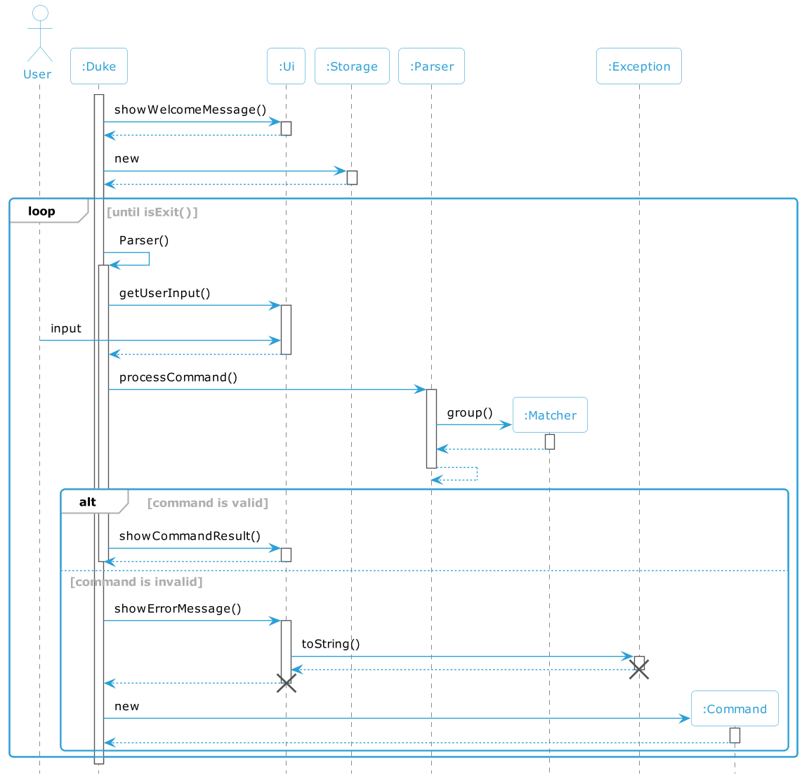
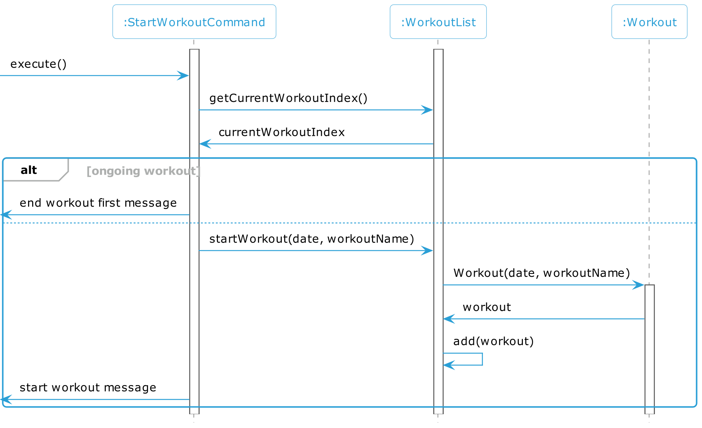
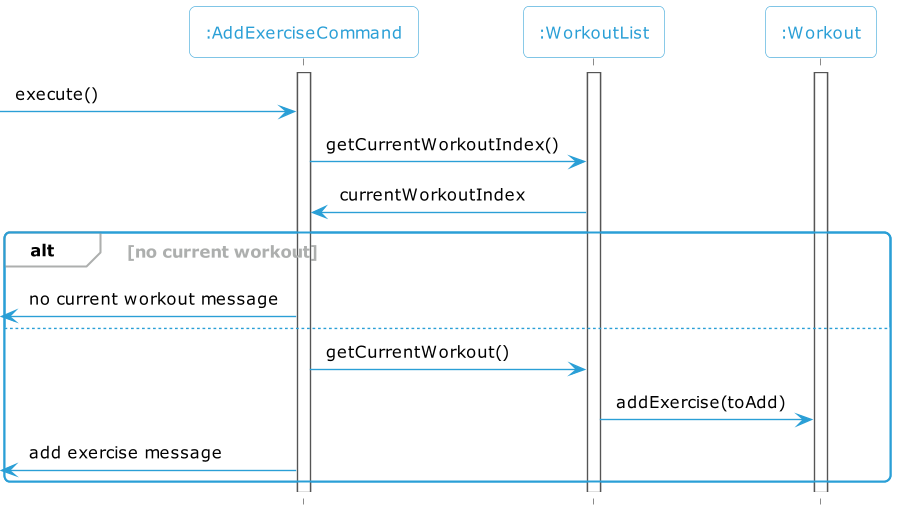
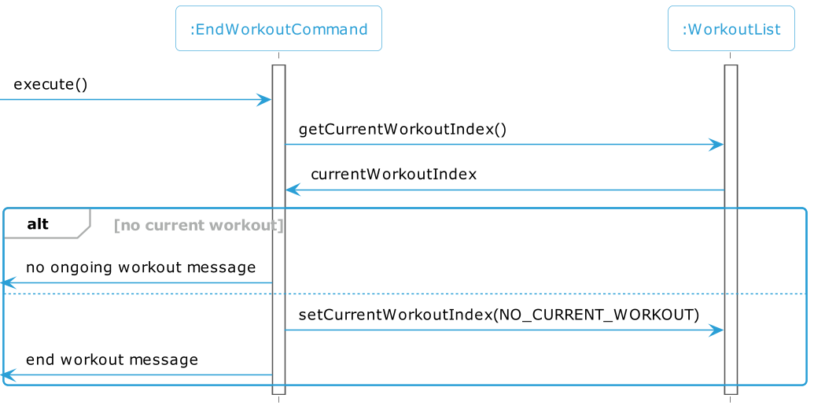
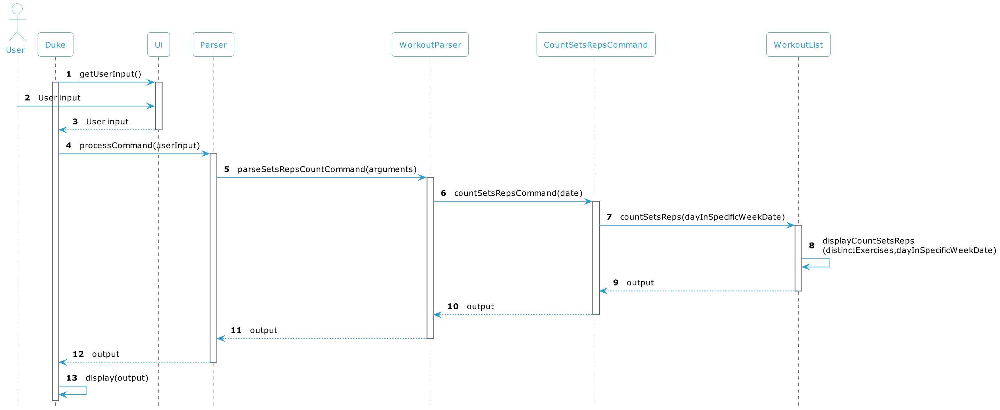
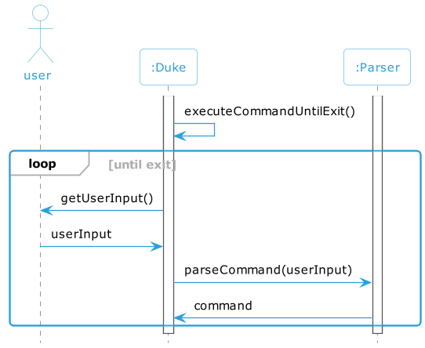

# Fitz - Developer Guide

## Table of Contents

<!-- TOC -->
* [Fitz - Developer Guide](#fitz---developer-guide)
  * [Table of Contents](#table-of-contents)
  * [Acknowledgements](#acknowledgements)
  * [Product Scope](#product-scope)
    * [Target User Profile](#target-user-profile)
    * [Value Proposition](#value-proposition)
          * [Back to table of contents](#back-to-table-of-contents)
  * [Design](#design)
    * [Architecture](#architecture)
    * [Duke](#duke)
    * [UI Component](#ui-component)
    * [Command Component](#command-component)
    * [Storage Component](#storage-component)
    * [Calories Component](#calories-component)
    * [Workout Component](#workout-component)
  * [Implementation](#implementation)
    * [Implementation of Workout](#implementation-of-workout)
      * [Start Workout](#start-workout)
      * [Add Exercise](#add-exercise)
      * [List workout](#list-workout)
      * [View workout](#view-workout)
      * [Delete Command](#delete-command)
      * [Count Command](#count-command)
    * [Implementation of Calories](#implementation-of-calories)
      * [Adding Calories](#adding-calories)
      * [Listing Calorie Dates](#listing-calorie-dates)
      * [Viewing Calories in a Day](#viewing-calories-in-a-day)
      * [Deleting Calories Date](#deleting-calories-date)
    * [Exit command](#exit-command)
  * [User Stories](#user-stories)
    * [V1.0](#v10)
    * [V2.0](#v20)
  * [Non-Functional Requirements](#non-functional-requirements)
  * [Glossary](#glossary)
  * [Instructions for manual testing](#instructions-for-manual-testing)
<!-- TOC -->

## Acknowledgements
The format of this developer guide was adapted from
[SE-EDU AddressBook Level 3 Developer Guide](https://se-education.org/addressbook-level3/DeveloperGuide.html).

## Product Scope
The purpose of this app is to help users record their workouts on the current day and track their previous workouts. 
Additionally, the app will allow users to record their daily food intake to achieve their fitness goals.

### Target User Profile
* Fitness enthusiasts who regularly go to the gym and perform various exercises to maintain their fitness
* Individuals who want to lose weight 
* People who want to build muscle strength and are looking for an easy 
and convenient way to record and track their progress towards their fitness goals.
* Fitness enthusiasts and athletes who are looking for an easy and convenient way to 
track their daily workouts and calories intake
* People who want to monitor their progress and achieve their fitness goals.

### Value Proposition
Our app is a comprehensive workout and calories tracking solution that helps fitness enthusiasts 
and individuals achieve their fitness goals.
With features like tracking of workouts and daily calories' intake, 
our app makes it easy for users to stay motivated and track their progress towards their fitness goals.

###### [Back to table of contents](#table-of-contents)

## Design

### Architecture

The Architecture Diagram shown above shows the design of FITZ with its components.
The following are highlighting parts
* There are 3 Storages class that related to workout and calories.
  They are `CalorieTrackerStorage`, `FoodDictionaryStorage` and `WorkoutListStorage` 
* All the exception messages will be shown in `Ui`

### Duke
`Duke` is the class that contains main method 
which are responsible for `Ui`, `Storage`, `Parser`, `Exception` and `Command`. 
Once the program start, `storage` and `Ui` will be initialized.
The following statements describe what will happen after the program start:

  * `storage` and `Ui` will be initialized.
  * `Ui`: show the welcome message 
  * `Storage`: load the exiting data to the system. 

Afterwards, it takes in user commands and continues to do so until the user inputs the exit command. 
Whenever a user enters a command, the Ui reads it and passes it to `Duke`, which in turn sends it to the `Parser` class for parsing. 
If the command is determined to be valid, it is then sent to the `Command` class for processing and returned to `Duke` for execution. 
`Duke` displays valid responses to the user via the `Ui`, and stores the data in Storage. If the command is invalid, `Duke` displays an appropriate error message instead.
The following diagram illustrate how the `Duke` class work.

### UI Component

Below is the class diagram for the `Ui` component, which is responsible for managing the retrieval of user input 
and displaying relevant information and error messages within the application.
`getUserInput()` methods is used to get the user input
and all the methods that related to `showMessage` are used for printing out the error message or the relevant information
which will correspond to the user behaviour.

### Command Component

The picture below shows the lower level design of Command component of the software.
Generally, the commands class in `workoutcommnds` ,`caloriescommands`, and `errorcommands` package
inherit from `Command` class. Besides, `ExitCommand` also inherit from `Command` class。

With this understanding,  it can be seen that there is an inheritance relationship between 
the `Commands` class and its subclasses. The following class diagram provides more details within each class, 
and it is evident that all subclasses inherit the `execute()` method from the Command class.

These are the  further explanation for each class:
* Under caloriescommands package:
  * `AddCaloriesCommand`: It is responsible for taking the food name, date and calories.
  * `DeleteCaloriesCommand`: It is responsible for deleting the record for calories in one specific day
  * `ListCaloriesCommand`: It is responsible to show the list of dates that had been entered by the user before.
  * `ViewCaloriesCommand`: Compare to List feature, view function aims to show more detailed information in one specific day.
  * `HelpCaloriesCommand`: It is responsible to show the guidance for users if they are not familiar with the calories commands.
* Under workoutcommands package:
  * `StartWorkoutCommand`: This class is responsible for user to add their workout in current day. And it will take in workout name.
  * `AddExerciseCommand`: This class contains the operation to add the exercise to the workouts.
  * `ListWorkoutCommand`: This class contains the operation to show list of dates.
  * `ViewWorkoutCommand`: This class contains the operation to view the workouts information for a specific day.
  * `DeleteWorkoutCommand`: This class contains the operation to delete the workouts for one day
  * `HelpWorkoutCommand`: Same as HelpCaloriesCommand, but this one show the workout commands.
  * `CountSetsRepsCommand`: This class contains the operation to get the all number of sets and rps within one week.

### Storage Component

Fitz contains three separate storages. `CaloriesTrackerStorage`
and `FoodDictionaryStorage`  are used for saving and loading calories record 
while `WorkoutListStorage` is used to save and load the workouts record. The class diagram shows more details.
Once the user exit program, the date will be store to `fooddic.txt`, `calorietracker.txt`, `workoutlist.txt` respectively
and these files are under data folder.

One thing to take note is that The difference between `FoodDictionaryStorage` and `CaloriesStorage` is that
`CaloriesTrackerStorage `will store the food based on the date they entered. 
However, `FoodDictionaryStorage` will store all the food and calories that had been entered by the user before.

### Calories Component

The class diagram below illustrate how the `Calories` component interact with each others. 
Basically, `Calories` Component consist of four main classes which are `Food`, `FoodList`, `FoodDictionary` 
and `CaloriesTracker`. 
The following are the explanation for each of them:
  * `Food`: It is a class which contains the food name and its related calories.
  * `FoodList`: It consists of list of `Food`.
  * `FoodDictionary`: It represents a dictionary that maps food to its calories 
  and it also read the data from `FoodDictionaryStorage`.
  This class mainly use for retrieving food and it relevant calories that have been entered.
  * FoodTracker: It has the dependency on `FoodDictionary` 
  because it is required to check if a food item and its calories exist in dictionary
  Besides, it also read the data from `CaloriesTrackerStorage` so that users can track their calories consumption for other days.
  From the diagram, it shows that FoodList consist of a list of Food and FoodDictionary has a dependency of FoodList.

### Workout Component
The class diagram below illustrates how the Workout component interact with each others.
From the diagram, it is clear to see that the Workout consists of a list of exercises
and the WorkoutList consists of list of Workout.

## Implementation

### Implementation of Workout

#### Start Workout

The start mechanism is facilitated by `StartWorkoutCommand`.
It extends `Command` and modifies the execute function to start a new Workout and add it to the workout list.

Given below is an example usage scenario and how the start mechanism behaves at each step.

Step 1. When `StartWorkoutCommand#execute()` is called, `StartWorkoutCommand` calls `WorkList#getCurrentWorkout()`
to get `currentWorkoutIndex`.

Step 2. If `currentWorkoutIndex` indicates that there is an ongoing workout, `StartWorkoutCommand` returns a message
to prompt the user to end the workout first.

Step 3. If `currentWorkoutIndex` indicates that there is no ongoing workout. It calls
`WorkList#startWorkout(date, Workoutname)` to start a new workout.

Step 4. This initialises a new `Workout`, workout, and adds it to the workout list with `WorkList.add(workout)`.
It then lets the user know that a new workout has started.

#### Add Exercise

The add mechanism is facilitated by `AddExerciseCommand`.
It extends `Command` and modifies the execute function to add an exercise to the current workout.

Given below is an example usage scenario and how the add mechanism behaves at each step.

Step 1. When `AddExerciseCommand#execute()` is called, `AddExerciseCommand` calls `WorkList#getCurrentWorkout()`
to get `currentWorkoutIndex`.

Step 2. If `currentWorkoutIndex` indicates that there is no ongoing workout, `AddExerciseCommand` returns a message
to prompt the user to start a workout first.

Step 3. If `currentWorkoutIndex` indicates that there is an ongoing workout. It calls
`WorkList#getCurrentWorkout()` and `Workout#addExercise` to add the `Exercise`, toAdd, to the current workout.
It then lets the user know that the exercise has been added.

#### End Workout

The end mechanism is facilitated by `EndWorkoutCommand`.
It extends `Command` and modifies the execute function to end the current workout.

Given below is an example usage scenario and how the start mechanism behaves at each step.

Step 1. When `EndWorkoutCommand#execute()` is called, `EndWorkoutCommand` calls `WorkList#getCurrentWorkout()`
to get `currentWorkoutIndex`.

Step 2. If `currentWorkoutIndex` indicates that there is no ongoing workout, `EndWorkoutCommand` returns a message
that there is no ongoing workout to end.

Step 3. If `currentWorkoutIndex` indicates that there is an ongoing workout. It resets the `currentWorkoutIndex` with
`WorkoutList#setCurrentWorkoutIndex(NO_CURRENT_WORKOUT)` indicating that there is no longer any ongoing workouts, and
returns a message that the workout has ended.

#### List workout

The list mechanism is facilitated by 'Parser', 'ListCommand', 'WorkoutList' and 'UI', where a Workout object will be
deleted according to the command inputted by the user and removed from the workout list.

Below is an example usage scenario and how the List mechanism behaves at each step:

Step 1: Assume that the user has already added a workout on 21/03/23 into the WorkoutList using the following command, /start 21/03/23
Assume the user add another workout on 22/03/23 by entering /start 22/03/23

Step 2: The user input of /list will be taken in for the parser and an object of class ListCommand will be returned.

Step 3: The execute method in the ListWorkoutCommand class that is overrides will be called and print out all the dates that while iterating the workoutList.

#### View workout

The View component is facilitated by `Parser`,`Ui`,`WorkoutList`,`Command` and `ViewCommand`, where the user will
enter a specific workout date and the number of exercises on that date will be displayed

Below are the specific steps on how to use the view function and how the mechanism will flow:

* Step 1: We will assume that the user has started a workout on two specific dates, `11/02/22` which was added with the following command `/start 11/02/22`
  and `12/02/22`, which was added with the following command `/start 12/02/22`.
* Step 2: The user will then use the following command `/view 11/02/22` will be taken into the parser
  and will return a list of exercises done on that specified date.

#### Delete Command
The deletion mechanism is facilitated by 'Parser', 'WorkoutParser', 'DeleteWorkoutCommand', 'WorkoutList' and 'UI', where a Workout object will be deleted according to the command inputted by the user and removed from the workout list.

Below is an example usage scenario and how the deletion mechanism behaves at each step:

Step 1: Assume that the user has already added a workout into the WorkoutList using the following command, /wstart upper body training

Step 2: The user input of /wdelete 1 will be taken in for the parser and an object of class DeleteCommand will be returned.

Step 3: The execute method in the DeleteCommand class that is overrides will be called with parameter index and will remove the matching workout from workoutList. It will then return a successful message that will be displayed to the user.

#### Count Command
The count mechanism is facilitated by 'Parser', 'WorkoutParser', 'DeleteWorkoutCommand', 'WorkoutList' and 'UI', where a recap of the total sets and reps done for each exercise will be displayed according to the command inputted by the user.

Below is an example usage scenario and how the count mechanism behaves at each step:

Step 1: Assume that the user has already added at least one workout into the WorkoutList using the following command, /wstart upper body training on the 10/04/23.

Step 2: The user input of /wcount 10/04/23 will be taken in for the parser and an object of class CountSetsRepsCommand will be returned.

Step 3: The execute method in the CountSetsRepsCommand class that is overrides will be called with parameter dayInSpecificWeekDate and will agglomerate all the workouts done during the specific week. It will then create a list of exercises with all the distinct exercises and grouped by name. Finally, the reps and sets will be summed and the recap will be displayed to the user.

### Implementation of Calories

#### Adding Calories
The AddCaloriesCommand component is facilitated by `Parser`,`CalorieParser`,`Ui`,`CalorieTracker`,`Food`,`FoodDictionary`,`Foodlist`,
`Command` and `AddCaloriesCommand`, where the user will
enter a FOOD_NAME and CALORIE_COUNT, and it will be recorded into the `CalorieTracker`

Below are the specific steps on how to use the AddCaloriesCommand function and how the mechanism will flow:

* Step 1: We will assume that the user has started the App, the user will then type it in this format
`/cadd FOOD_NAME CALORIE COUNT` for example `/cadd chicken 100`. The input will be taken into the parser
  and will return a string mentioning that it has been added.

#### Listing Calorie Dates
The ListCalories component is facilitated by `Parser`,`CalorieParser`,`Ui`,`CalorieTracker`,`Food`,`FoodDictionary`,`Foodlist`,
`Command` and `ListCaloriesCommand`, where the user will
enter a command `/clist` and it will return all the dates in the list

Below are the specific steps on how to use the ListCaloriesCommand function and how the mechanism will flow:

* Step 1: We will assume that the user has started the App and added calories via `/cadd chicken 100`. 
* Step 2: The user will then type it in this format `/clist`. The input will be taken into the parser
and will return a string listing out the dates.

#### Viewing Calories in a Day

The ViewCaloriesCommand component is facilitated by `Parser`,`CalorieParser`,`Ui`,`CalorieTracker`,`Food`,`FoodDictionary`,`Foodlist`,
`Command` and `ViewCaloriesCommand`, where the user will
enter a command `/cview INDEX` and it will return all the dates in the list

Below are the specific steps on how to use the ListCaloriesCommand function and how the mechanism will flow:

* Step 1: We will assume that the user has started the App and added calories via `/cadd chicken 100`.
* Step 2: The user will then type it in this format `/cview INDEX` e.g `/cview 1`. The input will be taken into the parser
  and will return a string listing out the foods that were eaten on that day.

#### Deleting Calories Date

The DeleteCaloriesCommand component is facilitated by `Parser`,`CalorieParser`,`Ui`,`CalorieTracker`,`Food`,`FoodDictionary`,`Foodlist`,
`Command` and `DeleteCaloriesCommand`, where the user will
enter a command `/cdelete INDEX` and it will return all the dates in the list

Below are the specific steps on how to use the ListCaloriesCommand function and how the mechanism will flow:

* Step 1: We will assume that the user has started the App and added calories via `/cadd chicken 100`.
* Step 2: The user will then type it in this format `/cdelete INDEX` e.g `/cdelete 1`. The input will be taken into the parser
  and will return a string confirming the deletion of the date.

### Exit command

The exit mechanism is facilitated by `Duke`, `Parser`, and `ExitCommand`.

Below is an example usage scenario and how the deletion mechanism behaves at each step:

Step 1: As the program runs `Duke#executeCommandUntilExit()`, it will get user input with `Ui#getUserInput()`
which returns the userInput.

Step 2: The userInput will then be parsed with `Parser#parrseCommand(userInput)` and it will return the command
based on the command the user entered.

Step 3: If command is an instance of `ExitCommand`, the user has entered the exit command. This will break the
loop and the program will exit.

## User Stories

### V1.0

| As a     | I want to ...                                                             | So that I can ...                 |
|----------|---------------------------------------------------------------------------|-----------------------------------|
| user     | record down my exercise for each workout                                  | check the workout whenever l want |
| new user | know how to use the app                                                   |                                   |
| user     | know which days l have done exercise                                      | have clear insight of myself      |
| user     | know how many workouts l have done for a day                              | make exercise plan based on this  |
| user     | remove some workouts that have been incorrectly recorded                  |                                   |

### V2.0

| As a | I want to ...                                             | So that I can ...                          |
|------|-----------------------------------------------------------|--------------------------------------------|
| user | know the amount of calories I consume each day            | control the calories intake                |
| user | know the workout l have done in last month                | make a exercise plan for next month        |
| user | know the frequency l do exercise for one month            | inspire myself                             |
| user | know the amount of calories I have consumed for one month | have better insights of my calories intake |

## Non-Functional Requirements

{Give non-functional requirements}

## Glossary

* *glossary item* - Definition

## Instructions for manual testing

{Give instructions on how to do a manual product testing e.g., how to load sample data to be used for testing}
