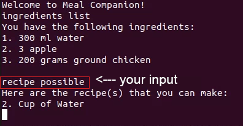

# Meal Companion  

Meal Companion is your one-stop solution to Cookbooks, ingredient tracking and meal preparation! Meal Companion is a Command Line Interface-based tool that will track your available ingredients and provides a reverse search function to provide you with recipes that you can make with your available ingredients. 

## Features

- Track the ingredients in your fridge
- Find recipes you can make or almost make with what you have
- Favourite recipes
- Hide recipes with your allergens

## Screenshots

## Useful links
* [User Guide](UserGuide.md)
* [Developer Guide](DeveloperGuide.md)
* [About Us](AboutUs.md)
