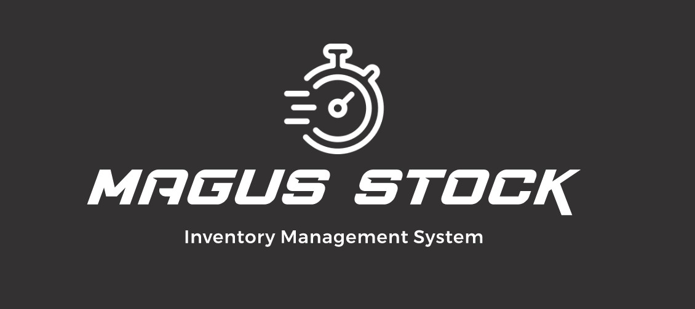

Magnus Stock is a Java command-line interface (CLI) application designed for inventory management. With Magnus Stock, you can perform CRUD operations on inventory items, generate history reports, and read/write inventory data in CSV format.

## Features

- Inventory management with CSV read/write
- CRUD operations
- History reports

## Documentation

For more information on how to use Magnus Stock, please refer to the following documents:

* [User Guide](UserGuide.md)
* [Developer Guide](DeveloperGuide.md)

## About Us

We are a team of CS2113 developers dedicated to creating high-quality software. For more information on our team and our projects, please refer to the [About Us](AboutUs.md) document.

<link rel="stylesheet" type="text/css" href="style.css">
---