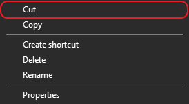
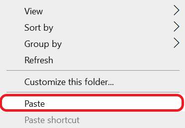
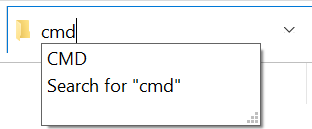
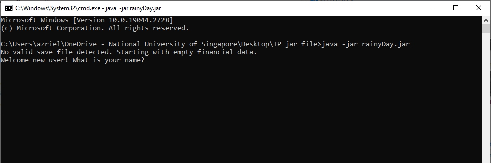
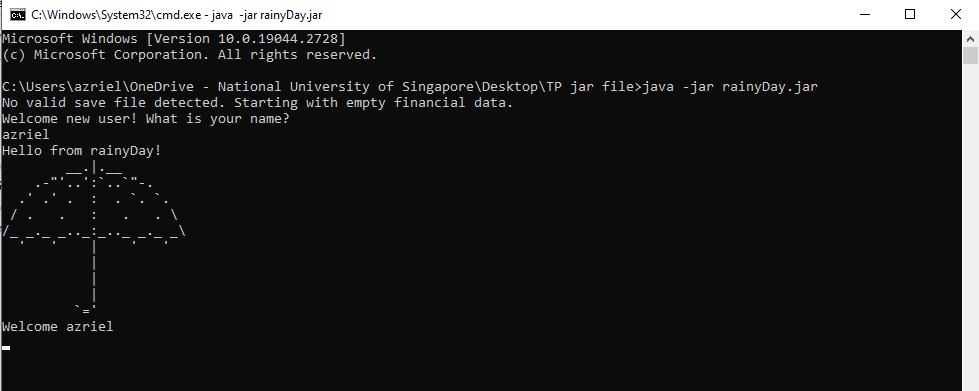
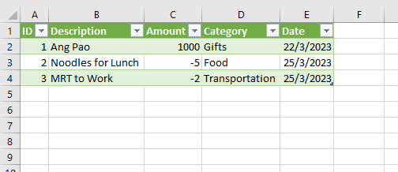

# rainyDay User Guide

Welcome to rainyDay's user guide! Thank you so much for choosing rainyDay. We sincerely hope that rainyDay can 
successfully take you one step closer to reaching your financial goals!
Should you have any feedback or enquiries, please do not hesitate to drop us an
[email](mailto:rainydayfinancialtracker@gmail.com).

## Introduction

### Motivation of creating rainyDay
In addition to rising costs of living, young adults just entering the workforce will also be exposed to a barrage of 
new sources of expense and income. Thus, rainyDay was created to aid young working adults in keeping track and managing
their finances well and reaching their financial goals, by providing an easy-to-use and convenient platform to track 
their [inflows and outflows](#glossary).

Despite the availability of several other financial tracking applications, only a handful of them have integrated a 
[Command Line Interface (CLI)](#glossary) into their systems. However, the utilization of a CLI can significantly 
improve the speed and accuracy of user-provided information, even though it may have a steep learning curve. 
To learn more about CLI, please refer to this [resource](https://www.freecodecamp.org/news/command-line-for-beginners/).
Considering the convenience and ease of use, we have decided to leverage the advantages of a CLI by developing rainyDay 
with a CLI interface.

This user guide provides an in-depth documentation on how to install and use rainyDay. This guide caters to all users of
rainyDay, from users who are just starting out to advanced users who are looking for extra features they were unaware 
of.

### What rainyDay can do for you
rainyDay supports a variety of features for users to input and view their [transactions](#glossary). Please refer to the
basic overview below, for more in-depth information, refer to the [Features Overview](#features-overview) section.

**Transaction related** - adding, deleting and editing transaction entries <br>
**Viewing related** - View, filter or sort transactions based on criteria  <br>
**Budget related** - Setting a budget to adhere to

You will be able to leverage on these features to efficiently track your finances and achieve your financial goals.

## Content Page

<!-- TOC -->

* [rainyDay User Guide](#rainyday-user-guide)
* [Introduction](#introduction)
* [Content Page](#content-page)
* [How to use the user guide](#how-to-use-the-user-guide)
* [Quick Start](#quick-start)
* [Features Overview](#features-overview)
* [FAQ](#faq)
* [Command Summary](#command-summary)
* [Glossary](#glossary)

<!-- TOC -->

## How to use the user guide

The first step to using rainyDay effectively is to learn how to use the user guide. This section assumes that you are a 
new user of rainyDay and are interested in learning more about the basic features provided by rainyDay.

Please note the following about the format of commands given under each [feature](#features).

* CAPS are the parameters to be supplied by the user eg. DESCRIPTION

* `markdown` format are related to commands provided by the user eg. `help`

* *italics* format are related to buttons that can be found on the screen *From Text/CSV*

* Items surrounded by [square brackets] are mandatory fields, while the items in {curly brackets} are optional eg. 
  [DESCRIPTION] {TIME} 

* Words in "double quotation marks" are the names of items eg. "beef noodles"

* 💡 indicates helpful suggestions that will enhance your experience

* ⚠️ highlights actions you should avoid

## Quick Start


After you have learnt how to use this user guide, you are ready to begin! Next, we will run you through how to install
rainyDay on your device and how to start using it. Please refer to the steps below:

1. Ensure that you have Java 11 or above installed on your computer
    1. Click [here](https://www.java.com/en/download/help/version_manual.html) for steps on how to check your Java
       version
    2. Click
       [here](https://docs.oracle.com/en/java/javase/11/install/overview-jdk-installation.html#GUID-8677A77F-231A-40F7-98B9-1FD0B48C346A)
       for the guide on installing Java 11
2. Download the latest version of "rainyDay"
   from [here](https://github.com/AY2223S2-CS2113T-T09-1/tp/releases/download/v2.0/rainyDay.jar).
3. Move the "rainyDay.jar" file to the folder of your choice by doing the following steps:
    1. Locate the "rainyDay.jar" file in your "Downloads" folder
    2. Right-click the "rainyDay.jar" file and select cut from the table that appears <br>
       
    3. Go to the folder of your choice
    4. Right-click in the file window and select paste as seen below <br>
       
4. To run "rainyDay.jar" on the command line, we have to do the following:
    1. Open the folder containing "rainyDay.jar" and click on the address bar <br>
       
    2. You will need to open rainyDay in your CLI. This can be done by typing the word ["cmd"](#glossary) in the folder 
path in the address bar as shown <br>
       
    3. Press Enter. Your Command Line should now be open in the folder containing "rainyDay.jar" as shown below. The 
location you saved rainyDay should be shown, in this example we saved it in the path "\Users\azriel\OneDrive - National 
University of Singapore\Desktop\TP jar file"

5. Type `java -jar rainyDay.jar` in the terminal and press Enter on your keyboard to start the application. You should 
see the following if the start up is successful.

6. Type your name and press Enter. The following will be shown:


## Features Overview

* [Viewing help](#viewing-help)
* [Transactions](#transactions)
  * [Adding a transaction](#adding-a-transaction)
  * [Viewing the transactions](#viewing-the-transactions)
  * [Deleting a transaction](#deleting-a-transaction)
  * [Editing a transaction](#editing-a-transaction)
  * [Filter transactions](#filter-statements)
  * [Ignoring a transaction](#ignoring-a-transaction)
* [Setting a Monthly Budget](#setting-a-monthly-budget)
* [Shortcuts](#shortcuts)
    * [Adding a shortcut](#adding-a-shortcut)
    * [Using a shortcut](#using-a-shortcut)
    * [Viewing a shortcut](#viewing-a-shortcut)
    * [Deleting a shortcut](#deleting-a-shortcut)
* [Data Management](#data-management)
  * [Saving the data](#saving-the-data)
  * [Where is my saved file located?](#where-is-my-saved-file-located)
      * [Loading saved data](#loading-saved-data)
  * [Exporting to CSV](#exporting-to-csv)
      * [Where to locate exported CSV file?](#where-to-locate-exported-csv-file)
      * [How to view the CSV file using Microsoft Excel?](#how-to-view-the-csv-file-using-microsoft-excel)
* [Exiting the application](#exiting-the-application)

## Features

### Viewing help

Welcome to the help section of our rainyDay! Now that you have started rainyDay in [Quick Start](#quick-start), you will 
need to know the format of inputs to send to rainyDay. Whenever you find yourself stuck to perform a certain task, don't
worry! The help command is here to help you every step of the way!

To get an overview of possible commands and their respective formats, you can use the `help` function as seen 
below:

Format: **`help`**

The table below will be shown with the `help` command: <br>

```
> help
+====================================================================================================+
| Welcome to rainyDay! Here is the overview of commands available                                    |
+====================================================================================================+
| Feature            | Command   | Additional Syntax                                                 |
+--------------------+-----------+-------------------------------------------------------------------+
| Add entry          | add       | [-in/-out] [DESCRIPTION] $[VALUE] {-c CATEGORY} {-date DATE}      |
| Delete entry       | delete    | [INDEX]                                                           |
| View entries       | view      | {TIME} {-sort}                                                    |
| Filter entries     | filter    | {-in} {-out} {-d DESCRIPTION} {-c CATEGORY} {-date DATE}          |
| Edit an entry      | edit      | [INDEX] [-in/-out/-d DESCRIPTION/-v $VALUE/-c CATEGORY/-date DATE]|
| Set monthly budget | setbudget | [VALUE]                                                           |
| Create shortcuts   | shortcut  | [SHORTCUT COMMAND -maps VALID COMMAND]                            |
| Ignore entry       | ignore    | [INDEX]                                                           |
| Unignore entry     | unignore  | [INDEX]                                                           |
| Export to .csv     | export    |                                                                   |
| Display a guide    | help      | {COMMAND}                                                         |
+====================================================================================================+
|[] :  Denotes compulsory fields. Relevant details / flags must be included.                         |
|{} :  Denotes optional fields. Can be ignored                                                       |
|For more information on any command: type   < help {command} >   as shown above (e.g. help add)     |
+====================================================================================================+
```

After reading the overview, suppose you require more details on any of the functions, you can use the following command.

Format: `help {COMMAND}`

This command will give you more information on the particular command, such as input constraints and examples.

For instance, suppose you want to find out more information on rainyDay's `add` command, you can type the following 
command: <br>

`> help add`

the output will be shown as below:
```
> help add
+====================================================================================================+
| Add command                 | Used to add a new entry to RainyDay                                  |
+====================================================================================================+
| Details       | Requirement | Description                                                          |
+---------------+-------------+----------------------------------------------------------------------+
| -in / -out    | Mandatory   | Used to denote if the entry is an inflow or an outflow               |
| <DESCRIPTION> | Optional    | Used to describe the entry. Description will be left blank if omitted|
| $<VALUE>      | Mandatory   | Used to set the value of the entry.                                  |
| -c <CATEGORY> | Optional    | Used to denote the category of the entry. Set to Misc if omitted     |
| -date <DATE>  | Optional    | Used to denote the date of the entry. Set to present date if omitted |
+====================================================================================================+
| Example Usage               | Description                                                          |
+-----------------------------+----------------------------------------------------------------------+
| add -in Salary $2113.09     | Adds entry with description: Salary and value: $2113.09 as inflow    |
|                             |                                                                      |
| add -out Noodles $5         | Adds entry with description: Noodles and value: $5 as outflow        |
|                             |                                                                      |
| add -out Bus $0.98 -c       | Adds entry with description: Bus and value: $0.98 as outflow,        |
| Transport                   | with its category set to Transport                                   |
|                             |                                                                      |
| add -out Bubble Tea $5.20   | Adds entry with description: Bubble Tea and value: $5.20 as outflow, |
| -c Food -date 22/03/2018    | with its category set to Food and date set to 22nd March, 2018       |
|                             |                                                                      |
| add -out $198 -c Bills      | Adds entry with no description and value: $198 as outflow, with its  |
|                             | category set to Bills                                                |
+====================================================================================================+
```

### Transactions

Here's the transaction management section of our guide! In this section, we'll cover all the key tasks you'll 
need to perform to manage your transactions effectively. Whether you need to add, view, edit, or delete transactions, 
we've got you covered. We'll also show you how to filter your transactions and ignore any that are irrelevant to your 
needs. So, if you're ready to take control of your transactions and keep your records up-to-date, let's get started!

* [Adding a transaction](#adding-a-transaction)
* [Viewing the transactions](#viewing-the-transactions)
* [Deleting a transaction](#deleting-a-transaction)
* [Editing a transaction](#editing-a-transaction)
* [Filter transactions](#filter-statements)
* [Ignoring a transaction](#ignoring-a-transaction)

### Adding a transaction

An integral feature of any budgeting application is to add transactions. The "add" function of rainyDay allows you
to keep track of your inflows and outflows. The following explains how you can add different types of transactions
to rainyDay.

Format: `add [DIRECTION] [DESCRIPTION] [AMOUNT] {CATEGORY} {DATE}`

* `DIRECTION` should be either:
    * `-in` signifying an inflow type of transaction, or
    * `-out` signifying an outflow type of transaction
* `DESCRIPTION` signifies the description of the transaction, consisting of any characters and space
* `AMOUNT` signifies the value of the transaction, needs to be a number more than or equal to 0, with `$` appended
  before the number
* `CATEGORY` is a field representing the category to be tagged with the transaction, where category can contain any
  characters and space, with `-c` appended to the category
* `DATE` is a field representing the date to be tagged with the transaction, where date needs to be in the format
  of `DD/MM/YYYY`, with <br>`-date` appended before the date

> 💡**Tip:**
>    * `DD` is a two-digit number representing the day
>    * `MM` is a two-digit number representing the month
>    * `YYYY` is a four-digit number representing the year

> ⚠️ Amount has a maximum of $21,474,836.47 and will be rounded down to 2 decimal places!

Example of usage:

You had dinner at Haidilao for $500. To add it to rainyDay, the following command can be provided to rainyDay:

```
> add -out Haidilao $500
Done! Added: out for Haidilao, -$500.00
```

You received an allowance of $20 on 01/03/2023. To add it to rainyDay, the following command can be provided
to rainyDay:

```
> add -in Allowance $20 -c Allowance -date 01/03/2023
Done! Added: in for Allowance, +$20.00
```

> 💡**Tip:** The flags `-c` and `-date` can also be used exclusively. The following are also valid formats:
>
> * `add -DIRECTION DESCRIPTION $AMOUNT -c CATEGORY`
> * `add -DIRECTION DESCRIPTION $AMOUNT -date DD/MM/YYYY`

Example of usage:

You had beef noodles for $12. To add it to rainyDay, the following command can be provided to
rainyDay:

```
> add -out beef noodles $12 -c Food and Drinks
Done! Added: out for beef noodles, -$12.00
```

You received your pay of $50000 on 26/03/2023. To add it to rainyDay, the following command can be provided to rainyDay:

```
> add -in pay $50000 -date 26/03/2023
Done! Added: in for pay, +$50000.00
```

[Jump back to features overview](#features-overview)

### Viewing the transactions

An important aspect to track your finances is to view all the transactions that you have already done before. The "view"
command of rainyDay can list all the transaction added, and the resultant amount of all your inflows and outflows.

Format: `view {TIMESPAN} {-sort}`

* `TIMESPAN` is used to specifically denote how much history to show from the current day.
    * `1d - 31d` is used to view 1 to 31 days of history
    * `1w - 4w`  is used to view 1 to 4 weeks of history
    * `1m - 12m` is used to view 1 to 12 months of history
    * `1y - 10y` is used to view 1 to 10 years of history
* `-sort` can be included to sort entries in ascending order of their absolute value, 
  with inflows displayed before outflows.

> 💡**Tip:** To view all entries you can use -all in place of a specific time in TIMESPAN

```
view
+====================================================================================================+
|Here is your financial report!                                                                      |
+------+---------------------------------------------+--------------+---------------------+----------+
|Index |Description                                  |Amount        |Category             |Date      |
|000001|Haidilao                                     | -$500.00     |miscellaneous        |30/03/2023|
|000002|Allowance                                    | +$20.00      |Allowance            |01/03/2023|
|000003|beef noodles                                 | -$12.00      |Food and Drinks      |30/03/2023|
|000004|pay                                          | +$50000.00   |miscellaneous        |26/03/2023|
+------+---------------------------------------------+--------------+---------------------+----------+
|Viewing all entries from 2023-03-01 till 2023-03-31                                                 |
|Total Inflow: $50020.00                                                                             |
|Total Outflow: $512.00                                                                              |
|Remaining value: $49508.00                                                                          |
+====================================================================================================+
```
Example of usage:

You would like to view all of your transactions for the current month, to check if you are staying within your budget.

```
> view
```

You vaguely remember you went out to eat at an expensive restaurant sometime in the past 3 months. You're unsure
exactly when or what description you used, but you remember it was significantly more than your usual expenditures.

```
> view 3m -sort
```

[Jump back to features overview](#features-overview)

### Deleting a transaction

The transactions added into rainyDay are not fixed. For whatever reason that you require deleting any transaction data,
rainyDay's "delete" function supports removing any previous transaction from your overview.

Format: `delete [INDEX]`

* `INDEX` is the transaction number given by rainyDay to a transaction
    * The transaction number can be obtained from [viewing the transactions](#viewing-the-transactions)

Example of usage:
Your current financial report is at the state in the example given in the
[viewing the transactions](#viewing-the-transactions) section.
To delete the transaction with the description "beef noodles", you can use the command:

`delete 3`

The transaction with the description "beef noodles" will be deleted, and the transactions shown to you
subsequently after requesting to view the transactions will be as such: <br>

```
> delete 3
Done, deleted "beef noodles" from the financial report
> view
+====================================================================================================+
|Here is your financial report!                                                                      |
+------+---------------------------------------------+--------------+---------------------+----------+
|Index |Description                                  |Amount        |Category             |Date      |
|000001|Haidilao                                     | -$500.00     |miscellaneous        |30/03/2023|
|000002|Allowance                                    | +$20.00      |Allowance            |01/03/2023|
|000003|pay                                          | +$50000.00   |miscellaneous        |26/03/2023|
+------+---------------------------------------------+--------------+---------------------+----------+
|Viewing all entries from 2023-02-28 till today                                                      |
|Total Inflow: $50020.00                                                                             |
|Total Outflow: $500.00                                                                              |
|Remaining value: $49520.00                                                                          |
+====================================================================================================+
```

[Jump back to features overview](#features-overview)

### Filter statements

To ease your time searching through all the entries in the financial report, the "filter" function of rainyDay
will help you extract certain transactions based on a specific criteria

Format : `filter [FLAG] {FIELD}`

* The `FLAG` must be at least one of the following:
    * `-in` to filter by inflows
    * `-out` to filter by outflows
    * `-d` to filter by description
    * `-c` to filter by category
    * `-date` to filter by date
* date `FIELD` must be in the form DD/MM/YYYY

Example of usage:

After requesting to view the transactions from rainyDay, the following is shown to you:

```
> view
+====================================================================================================+
|Here is your financial report!                                                                      |
+------+---------------------------------------------+--------------+---------------------+----------+
|Index |Description                                  |Amount        |Category             |Date      |
|000001|chicken rice                                 | -$5.00       |Food                 |25/03/2023|
|000002|beef noodles                                 | -$12.00      |Food and Drinks      |26/03/2023|
|000003|Haidilao                                     | -$500.00     |miscellaneous        |22/03/2023|
|000004|Pay                                          | +$50000.00   |miscellaneous        |26/03/2023|
|000005|Allowance                                    | +$20.00      |Allowance            |01/03/2023|
|000006|Angpao                                       | +$2000.00    |Chinese New Year     |26/03/2023|
|000007|Fried chicken                                | -$22.00      |Food and Drinks      |26/03/2023|
+------+---------------------------------------------+--------------+---------------------+----------+
|Viewing all entries from 2023-02-28 till today                                                      |
|Total Inflow: $52020.00                                                                             |
|Total Outflow: $539.00                                                                              |
|Remaining value: $51481.00                                                                          |
+====================================================================================================+
```

Suppose you want to find out transactions related to chicken, you can use this command:

`filter -d chicken`

```
> filter -d chicken
+------+---------------------------------------------+--------------+---------------------+----------+
|Here is your filtered financial report!                                                             |
+------+---------------------------------------------+--------------+---------------------+----------+
|Index |Description                                  |Amount        |Category             |Date      |
|000001|chicken rice                                 | -$5.00       |Food                 |25/03/2023|
|000007|Fried chicken                                | -$22.00      |Food and Drinks      |26/03/2023|
+------+---------------------------------------------+--------------+---------------------+----------+
```

Suppose you want to check your outflows only, you can use this command:

`filter -out`

```
> filter -out
+------+---------------------------------------------+--------------+---------------------+----------+
|Here is your filtered financial report!                                                             |
+------+---------------------------------------------+--------------+---------------------+----------+
|Index |Description                                  |Amount        |Category             |Date      |
|000001|chicken rice                                 | -$5.00       |Food                 |25/03/2023|
|000002|beef noodles                                 | -$12.00      |Food and Drinks      |26/03/2023|
|000003|Haidilao                                     | -$500.00     |miscellaneous        |22/03/2023|
|000007|Fried chicken                                | -$22.00      |Food and Drinks      |26/03/2023|
+------+---------------------------------------------+--------------+---------------------+----------+
```

> 💡**Tip:** Multiple flags may be used at once but must be in this order:
>
> `-in` or `out` -> `-d` -> `-c` -> `-date`

Suppose you want to find out what food you ate on a particular day, you can use this command:

`filter -c Food and Drinks -date 26/03/2023`

 ```
 > filter -c Food and Drinks -date 26/03/2023
+------+---------------------------------------------+--------------+---------------------+----------+
|Here is your filtered financial report!                                                             |
+------+---------------------------------------------+--------------+---------------------+----------+
|Index |Description                                  |Amount        |Category             |Date      |
|000002|beef noodles                                 | -$12.00      |Food and Drinks      |26/03/2023|
|000007|Fried chicken                                | -$22.00      |Food and Drinks      |26/03/2023|
+------+---------------------------------------------+--------------+---------------------+----------+
```

[Jump back to features overview](#features-overview)

### Editing a transaction

Should you need to update details in a previous transaction, rainyDay's "edit" function supports changing the details of
a past transaction

Format : `edit [INDEX] [FLAG] {NEWFIELD}`

* The `FLAG` must be one of the following:
    * `-d` to edit the description
    * `-c` to edit the category
    * `-v` to edit the value
    * `-date` to edit the date in `DD/MM/YYYY` format
    * `-in` to change direction to inflow
    * `-out` to change direction to outflow

* No `NEWFIELD` required for changing direction

Example of usage:

After requesting to view the transactions from rainyDay, the following is shown to you:

```
> view
+====================================================================================================+
|Here is your financial report!                                                                      |
+------+---------------------------------------------+--------------+---------------------+----------+
|Index |Description                                  |Amount        |Category             |Date      |
|000001|chicken rice                                 | -$5.00       |Food                 |25/03/2023|
|000002|beef noodles                                 | -$12.00      |Food and Drinks      |26/03/2023|
|000003|Haidilao                                     | -$500.00     |miscellaneous        |22/03/2023|
|000004|Pay                                          | +$50000.00   |miscellaneous        |26/03/2023|
|000005|Allowance                                    | +$20.00      |Allowance            |01/03/2023|
|000006|Angpao                                       | +$2000.00    |Chinese New Year     |26/03/2023|
|000007|Fried chicken                                | -$22.00      |Food and Drinks      |26/03/2023|
+------+---------------------------------------------+--------------+---------------------+----------+
|Viewing all entries from 2023-02-28 till today                                                      |
|Total Inflow: $52020.00                                                                             |
|Total Outflow: $539.00                                                                              |
|Remaining value: $51481.00                                                                          |
+====================================================================================================+
```

Suppose you realised you made a mistake in the category of entry 1 and want to replace the category of entry 1 with
'Food and Drinks' instead of 'Food', you can use this command:

`edit 1 -c Food and Drinks`

```
> edit 1 -c Food and Drinks
Done, edited entry 1 from the financial report
> view
+====================================================================================================+
|Here is your financial report!                                                                      |
+------+---------------------------------------------+--------------+---------------------+----------+
|Index |Description                                  |Amount        |Category             |Date      |
|000001|chicken rice                                 | -$5.00       |Food and Drinks      |25/03/2023|
|000002|beef noodles                                 | -$12.00      |Food and Drinks      |26/03/2023|
|000003|Haidilao                                     | -$500.00     |miscellaneous        |22/03/2023|
|000004|Pay                                          | +$50000.00   |miscellaneous        |26/03/2023|
|000005|Allowance                                    | +$20.00      |Allowance            |01/03/2023|
|000006|Angpao                                       | +$2000.00    |Chinese New Year     |26/03/2023|
|000007|Fried chicken                                | -$22.00      |Food and Drinks      |26/03/2023|
+------+---------------------------------------------+--------------+---------------------+----------+
|Viewing all entries from 2023-02-28 till today                                                      |
|Total Inflow: $52020.00                                                                             |
|Total Outflow: $539.00                                                                              |
|Remaining value: $51481.00                                                                          |
+====================================================================================================+
```

> 💡**Tip:** Multiple flags may be used at once but must be in this order:
>
> `-in` or `out` -> `-d` -> `-v` -> `-c` -> `-date`

Suppose you want to edit multiple fields of an entry, and instead of deleting and adding a new entry, you can use
this command:
`edit 2 -out Beef noodles $15 -c Food -date 22/03/2023`

```
> edit 2 -out Beef noodles $15 -c Food -date 22/03/2023
Done, edited entry 2 from the financial report
> view
+====================================================================================================+
|Here is your financial report!                                                                      |
+------+---------------------------------------------+--------------+---------------------+----------+
|Index |Description                                  |Amount        |Category             |Date      |
|000001|chicken rice                                 | -$5.00       |Food and Drinks      |25/03/2023|
|000002|beef noodles                                 | -$12.00      |Food                 |22/03/2023|
|000003|Haidilao                                     | -$500.00     |miscellaneous        |22/03/2023|
|000004|Pay                                          | +$50000.00   |miscellaneous        |26/03/2023|
|000005|Allowance                                    | +$20.00      |Allowance            |01/03/2023|
|000006|Angpao                                       | +$2000.00    |Chinese New Year     |26/03/2023|
|000007|Fried chicken                                | -$22.00      |Food and Drinks      |26/03/2023|
+------+---------------------------------------------+--------------+---------------------+----------+
|Viewing all entries from 2023-02-28 till today                                                      |
|Total Inflow: $52020.00                                                                             |
|Total Outflow: $539.00                                                                              |
|Remaining value: $51481.00                                                                          |
+====================================================================================================+
```

[Jump back to features overview](#features-overview)

### Setting a Monthly Budget

After you know how to manage your transactions, you can now set a monthly budget! In the process of keeping track of 
your expenses, you might feel inclined to stick to a budget. rainyDay can help to give you reminders, and encourage you 
to stick to your budget! With a set monthly budget, rainyDay will remind you how much you have spent for the month with
every new expense in the same month.

Format : `setbudget GOAL`

For example, if you would like to set a monthly budget goal of $1000, use the command below:<br>
`setbudget 1000`

```
> setbudget 1000
Monthly Budget Goal set to $1,000.00!
```

An additional message will accompany new expenses on how much you have spent for the month!

```
> add -out noodles $5
Done! Added: out for noodles, -$5.00
You have spent $544.00/$1000.00, Keep it up!
```

If at any point of time you would like to remove this feature, simply set the goal to $0<br>
`setbudget 0`

```
> setbudget 0
Monthly Budget Goal removed!
```

[Jump back to features overview](#features-overview)

### Shortcuts

Welcome to the shortcuts section of our guide! Shortcuts can be a great way to save time! In this section, we'll show 
you how to create and use shortcuts effectively. Whether you need to add a new shortcut, view an existing one, 
or delete an old one, we'll cover them all. So, if you're ready to start working smarter, not harder, let's dive into 
the world of shortcuts!

 * [Adding a shortcut](#adding-a-shortcut)
 * [Using a shortcut](#using-a-shortcut)
 * [Viewing a shortcut](#viewing-a-shortcut)
 * [Deleting a shortcut](#deleting-a-shortcut)
  
#### Adding a shortcut

If you happen to have certain commands that you find yourself frequently using, rainyDay's shortcuts can make it much
easier to execute those commands!

Format: `shortcut [SHORTCUTNAME] -maps [ACTUALCOMMAND]`

* `SHORTCUTNAME` can be any single word of your choice to save a reference to the actual command
* `ACTUALCOMMAND` is the actual command which you want your shortcut to perform

Example of usage:

You often eat the same noodle dish from your favourite coffee shop. To save yourself the trouble of typing the same
command in full, you could configure the shortcut with the command below.

`shortcut FavLunch -maps add -out noodles $4 -c food`

```
> shortcut FavLunch -maps add -out noodles $4 -c food
Shortcut successfully added
```

> ⚠️ Your configured shortcut should map to a valid full command for it to work correctly.

#### Using a shortcut

After configuring your shortcuts, you may want to use the shortcut to save yourself the trouble of typing the
full command. This can be done by simply inputting the name of your configured shortcut command.

Format: `[SHORTCUTNAME]`

Example of Usage:

You have configured the shortcut according to the example in the [adding a shortcut](#adding-a-shortcut) section. Now
all you have to do is input the name of your configured shortcut command.

`FavLunch`

```
> FavLunch
Done! Added: out for noodles, -$4.00
```

#### Viewing a shortcut

After configuring all your shortcuts, the `shortcut_view` command can be used to keep track of all your shortcuts
that you have configured.

Example of Usage:

`shortcut_view`

The output will look something like this:

```
shortcut_view
+-----------------------------------+-------------------------------------------------------------+
|Here are your shortcuts!                                                                         |
+-----------------------------------+-------------------------------------------------------------+
|Shortcut                           |Mapped Command                                               |
|a                                  |add -in daily salary $5                                      |
|v                                  |view                                                         |
|FavLunch                           |add -out noodles $4 -c food                                  |
+-----------------------------------+-------------------------------------------------------------+
```

#### Deleting a shortcut

At some point, you may discover that the shortcut you configured is no longer useful, or you may have misconfigured a
previously added shortcut. In these situations, the `shortcut_delete` command provided by rainyDay can prove to be quite
handy.

Format: `shortcut_delete [SHORTCUTCOMMAND]`

* `SHORTCUTCOMMAND` The shortcut command that you want deleted

Example of Usage:

You have configured the shortcut according to the example in the [adding a shortcut section](#adding-a-shortcut).
Unfortunately, your favourite coffee shop has closed down, and you are no longer able to enjoy your favourite noodle
dish. Now the shortcut you previously configured is no longer useful. All you have to do is delete the shortcut with the
command below:

`shortcut_delete FavLunch`

[Jump back to features overview](#features-overview)

### Ignoring a transaction

Due to potential certain one-time payments or receivables that you encounter, rainyDay's ignore function can help you
keep a more accurate track of your finances by allowing you to ignore certain transactions from the overall calculation
of your inflow and outflow.
Conversely, the unignore function is to include a transaction that was previously ignored.

Format: `ignore [index]` or `unignore [index]`

* `index` The index of the entry you want to ignore, obtained by using the `view` command

Example of Usage:

You have received a one-time payment from government GST refunds. You would like to keep track of it however do not want
to include it in your budget calculations. After executing the add command, input view to find its index.

```
view
+====================================================================================================+
|Here is your financial report!                                                                      |
+------+---------------------------------------------+--------------+---------------------+----------+
|Index |Description                                  |Amount        |Category             |Date      |
|000001|chicken rice                                 | -$5.00       |Food and Drinks      |25/03/2023|
|000002|beef noodles                                 | -$12.00      |Food                 |22/03/2023|
|000003|Haidilao                                     | -$500.00     |miscellaneous        |22/03/2023|
|000004|GST refund                                   | +$500.00     |grants               |30/03/2023|
+------+---------------------------------------------+--------------+---------------------+----------+
|Viewing all entries from 2023-02-28 till today                                                      |
|Total Inflow: $500.00                                                                               |
|Total Outflow: $517.00                                                                              |
|Remaining value: $-17.00                                                                            |
+====================================================================================================+
```

You can then execute the following command to ignore the entry:

`ignore 4`

```
> ignore 4
Done, Entry 4 ignored from overview calculations
> view
+====================================================================================================+
|Here is your financial report!                                                                      |
+------+---------------------------------------------+--------------+---------------------+----------+
|Index |Description                                  |Amount        |Category             |Date      |
|000001|chicken rice                                 | -$5.00       |Food and Drinks      |25/03/2023|
|000002|beef noodles                                 | -$12.00      |Food                 |22/03/2023|
|000003|Haidilao                                     | -$500.00     |miscellaneous        |22/03/2023|
|000004|GST refund                                   | Ignored      |grants               |30/03/2023|
+------+---------------------------------------------+--------------+---------------------+----------+
|Viewing all entries from 2023-02-28 till today                                                      |
|Total Inflow: $0.00                                                                                 |
|Total Outflow: $517.00                                                                              |
|Remaining value: $-517.00                                                                           |
+====================================================================================================+
```

[Jump back to features overview](#features-overview)

### Data Management

Welcome to the data management section of our guide! Saving and loading your data is something you don't have to worry 
as we have got it covered for you! In this section, we'll show you where to locate your saved files and 
how to export your data to a CSV file, which is a widely-used file format that can be opened in a variety of 
software applications. We'll show you how to export and view the exported CSV file using Microsoft Excel, 
which is a popular spreadsheet program used by many people around the world. Let's get started!

* [Saving the data](#saving-the-data)
* [Where is my saved file located?](#where-is-my-saved-file-located)
    * [Loading saved data](#loading-saved-data)
* [Exporting to CSV](#exporting-to-csv)
    * [Where to locate exported CSV file?](#where-to-locate-exported-csv-file)
    * [How to view the CSV file using Microsoft Excel?](#how-to-view-the-csv-file-using-microsoft-excel)

### Saving the data

Your data will automatically be saved whenever any changes are made to your data. This includes your financial data and
your configured shortcuts.

#### Where is my saved file located?

It is located in the "data" folder within the same folder as your "rainyDay.jar" file. This should have
been configured in step 3 of the [Quick Start section](#quick-start). The data file will be named "rainyDay.json".

#### Loading saved data

Whenever you start up your rainyDay application, previously saved data will automatically be loaded if such data exists.

[Jump back to features overview](#features-overview)

### Exporting to CSV

Exports your financial statements into a [comma-separated values file](#glossary).

Format: `export`
> **Background:** A CSV file allows data to be saved in a format which can be viewed as a table.
>
>💡Saving your financial statements in a CSV file will allow you to view your statements in commonly used applications
> like *Microsoft Excel* and *Google Sheets*.

#### Where to locate exported CSV file?

The CSV file will be located in the "data" folder within the same folder as your "rainyDay.jar" file. This should have
been configured in step 3 of the [Quick Start section](#quick-start). The CSV file will be named "report".

#### How to view the CSV file using Microsoft Excel?

1. Open your Microsoft Excel application and open a blank workbook.
2. Click on the *Data* tab found at the top and click on *From
   Text/CSV*.
3. Navigate to the CSV file as directed in
   the [where to locate exported CSV file section](#where-to-locate-exported-csv-file).
4. Double-click on the CSV file and click the *load* button.
5. With steps 1-4, your financial statements should be viewable in a nicely formatted table as shown
   below.
   

[Jump back to features overview](#features-overview)

### Exiting the application

After you have completed updating your transactions and would like to close the application, input the following
command:

Format: `bye`

[Jump back to features overview](#features-overview)

## FAQ

**Q**: How do I transfer my data to another computer?

**A**: Copy the txt file named "rainyDay" that is in the same directory as rainyDay.jar to the new device and location
that "rainyDay.jar" is going to be stored in

**Q**: What if I am not able to start up rainyDay? {not able to load the data..?}

**A**: {to be added}

**Q**: I tried to input a value, but it is not showing up as what I typed!

**A**: The value of transactions has a maximum of $21,474,836.47 and will also be rounded down to 2 decimal places!

## Command Summary

| Action          | Format <br> Example input                                                                                                                                                                                                                                                                                                                                                   |
|-----------------|-----------------------------------------------------------------------------------------------------------------------------------------------------------------------------------------------------------------------------------------------------------------------------------------------------------------------------------------------------------------------------|
| Add             | For beginner users: <br> `add -DIRECTION DESCRIPTION $VALUE` <br><br> **Example:** <br> `add -in angpao $300` <br> `add -out ipad $120` <br><br> For advanced users: <br> `add -DIRECTION $VALUE -c CATEGORY -date DD/MM/YYYY` <br><br> **Example:** <br> `add -in income $2000 -c pay -date 05/03/2023` <br> `add -out hawker food $6 -c food and drinks -date 10/03/2023` |
| Delete          | `delete INDEX` <br><br> **Example:** <br> `delete 1` <br> `delete 2`                                                                                                                                                                                                                                                                                                        |
| View            | `view TIMESPAN -sort`                                                                                                                                                                                                                                                                                                                                                       |
| Help            | `help` or `help COMMAND`                                                                                                                                                                                                                                                                                                                                                    |
| Filter          | `filter FLAG FIELD` <br><br> **Example:** <br> `filter -d school` <br>`filter -date 22/03/2023`                                                                                                                                                                                                                                                                             |
| Edit            | `edit INDEX FLAG NEWFIELD` or `edit INDEX FLAG` <br><br> **Example:** <br> `edit 1 -in Beef noodles $15 -c Food` <br> `edit -d school` <br> `edit -in`                                                                                                                                                                                                                      |
| Set Budget      | `setbudget VALUE`                                                                                                                                                                                                                                                                                                                                                           |   
| Add Shortcut    | `shortcut SHORTCUTCOMMAND -maps ACTUALCOMMAND`<br><br> **Example:** <br> `shortcut myshortcut -maps add -out noodles $4`                                                                                                                                                                                                                                                    |   
| Use Shortcut    | `SHORTCUTCOMMAND`                                                                                                                                                                                                                                                                                                                                                           |
| View Shortcuts  | `shortcut_view`                                                                                                                                                                                                                                                                                                                                                             |
| Delete Shortcut | `shortcut_delete SHORTCUTCOMMAND`<br><br> **Example:** <br> `shortcut_delete myshortcut`                                                                                                                                                                                                                                                                                    |
| Export to CSV   | `export`                                                                                                                                                                                                                                                                                                                                                                    |              
| Exit            | `bye`                                                                                                                                                                                                                                                                                                                                                                       |

[Jump back to Table of Contents](#content-page)

## Glossary

| Term                   | Explanation                                                                                                                                                      |
|------------------------|------------------------------------------------------------------------------------------------------------------------------------------------------------------|
| Cmd                    | acronym for Command, which is the command-line interpreter of Windows Operating Systems                                                                          |
| Command Line Interface | An interface that uses text as the mode of interaction between the user and the program                                                                          |
| CSV                    | Stands for Comma Separated Value, a type of file format that can be imported to other statistical software such as Microsoft Excel, R Commander or Google Sheets |
| Filter                 | A function to narrow down the range of items to be shown                                                                                                         |
| Financial Statement    | Represents a transaction                                                                                                                                         |
| Financial Report       | Represents a compilation of financial statements                                                                                                                 |
| Flags                  | Has a "-" appended to the front of a symbol, example: "-d", "-date", "-c", etc                                                                                   |
| Inflow                 | Signify an increment of money on your side, such as deposits into your wallet                                                                                    |
| Outflow                | Signify a decrement of money on your side, such as payments from your wallet                                                                                     |
| Transaction            | An activity relating to transferring of money                                                                                                                    |

[Jump back to Table of Contents](#content-page)