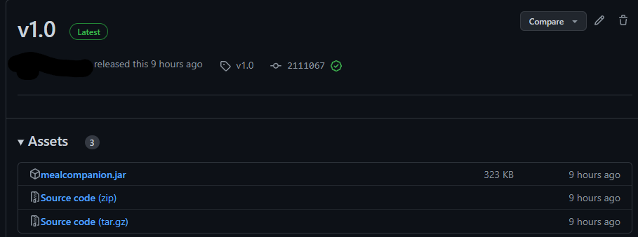
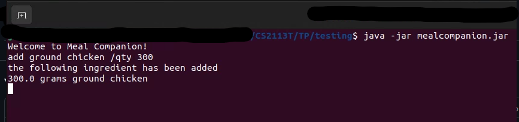
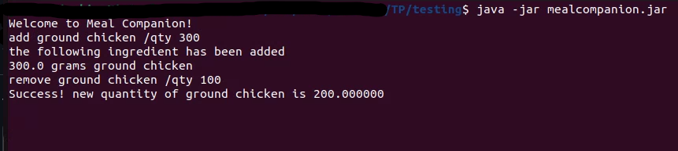
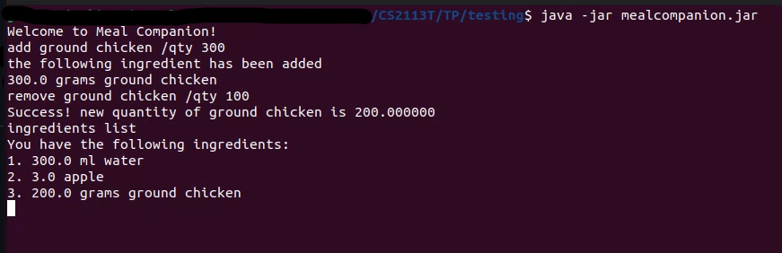
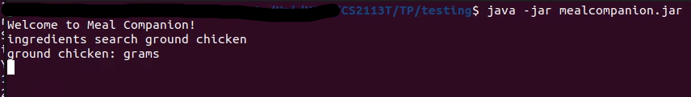
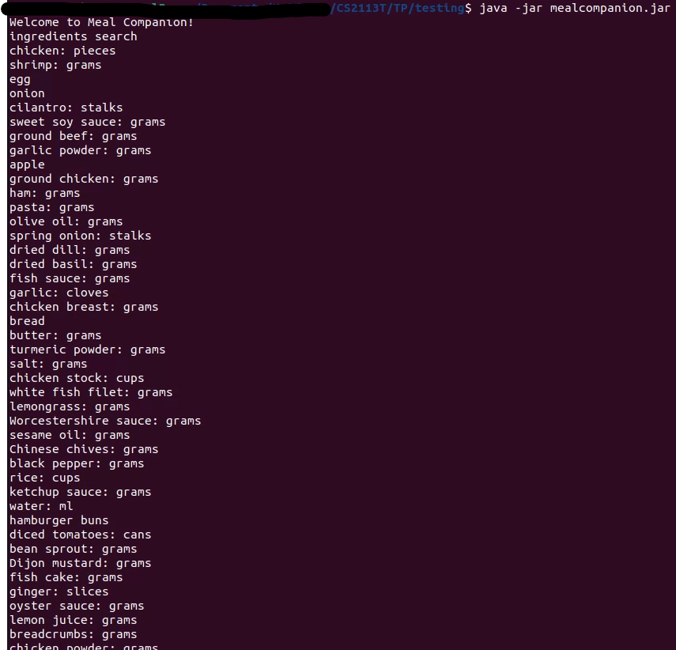
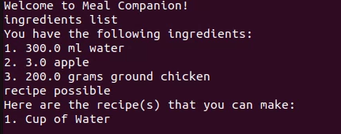

# User Guide

## Introduction
Hey there! Thanks for choosing Meal Companion, your one-stop solution to handling meal prep, ingredient tracking and cookbook! This guide will show you how to get started

# Table of Contents
1. [Getting Started](#getting-started)
2. [Features](#features)
    1. [Ingredients](#ingredients)
       1. [Add Ingredients](#add-ingredients)
       2. [Remove Ingredients](#remove-ingredients)
       3. [List Ingredients](#list-ingredients)
       4. [Search Ingredients](#search-ingredients)
    2. [Recipes](#recipes)
        1. [Default Recipes](#default-recipes)
        2. [All Recipes](#all-recipes)
        3. [Recipe Details](#recipe-details)
        4. [Possible Recipes](#possible-recipes)
    3. [Saving Data](#saving-data)
    4. [Help](#help)
    5. [Command List](#command-list)
3. [Conclusion](#conclusion)

# Getting Started

1. Java 11 is required for Mikey to function properly, please make sure your device has Java 11 installed. If not, you may download it [here](https://www.oracle.com/sg/java/technologies/downloads/#java11)

2. Once you have ascertained that your device has Java 11 installed, you may download the `.jar file` [here](https://github.com/AY2223S2-CS2113T-T09-3/tp/releases/tag/v1.0). 

Click on `mealcompanion.jar` to automatically download the file. Place the file in a folder of your choice.

3. Open the command terminal and navigate to the folder where you downloaded `mealcompanion.jar` using `cd <file path>` commands as necessary.
4. Ensure the terminal is within the correct folder.
5. Use the command `java -jar mealcompanion.jar` to launch Meal Companion.

6. When you are finished using Meal Companion, use the `bye` command to terminate the application. This will ensure your stored data is saved correctly for future access.

# Features
This section will focus on some of the key features of Meal Companion and explain their usage.

## Ingredients
Meal Companion will assist you in tracking the items in your refridgerator, and is capable of adding new ingredients, removing used ingredients, as well as listing the available ingredients in your refridgerator. This guide will detail these features below.

### Add Ingredients
To add an ingredient of a certain quantity to Meal Companion's storage, use the command `add <ingredient> /qty <quantity>`.
The `/qty` portion of the command is necessary for Meal Companion to distinguish between the sections of the command. 
For example, `add ground chicken /qty 300`.

### Remove Ingredients
To remove an ingredient of a certain quantity from Meal Companion's storage, use the command `remove <ingredient> /qty <quantity>`. The `/qty` portion of the command is necessary for Meal Companion to distinguish between the sections of the command.
For example, `remove ground chicken /qty 100`.

### List Ingredients
In order to show a list of all ingredients currently stored in Meal Companion, use the command `ingredients list`.

### Search Ingredients
If you would like to search for a specific ingredient that Meal Companion recognizes as valid, use the command `ingredients search <keyword>`.

 Omitting the keyword will return a list of all valid ingredients.
 
 
 ## Recipes
 This segment will go into detail about the recipe features that Meal Companion contains, and the usage of these features.
 
 ### Default Recipes
 Meal Companion comes included with a list of default recipes already initialized. The list of default recipes are found here:
 1. Beef Burger
 2. Cup of Water
 3. Chicken Burger
 4. Fish Burger
 5. Pasta (Tomato Sauce)
 6. Hainanese Chicken Rice
 7. Mee Goreng

### All Recipes
To display all stored recipes including default recipes, you may use the command `recipe all` to list them.

### Recipe Details
To go into details about a certain recipe, use the command `recipe <index number>`, using the `<index number` from the generated list. 

For example, to view the recipe for Hainanese Chicken Rice, use the command `recipe 6`.

### Possible Recipes
Meal Companion includes the functionality to suggest recipes based on ingredient availability. Simply use the command `recipe possible`, and Meal Companion will list out the recipes that can be made with the ingredients you currently have.

## FAQ

**Q**: How do I transfer my data to another computer? 

**A**: {your answer here}

## Command Summary

{Give a 'cheat sheet' of commands here}

* Add todo `todo n/TODO_NAME d/DEADLINE`
