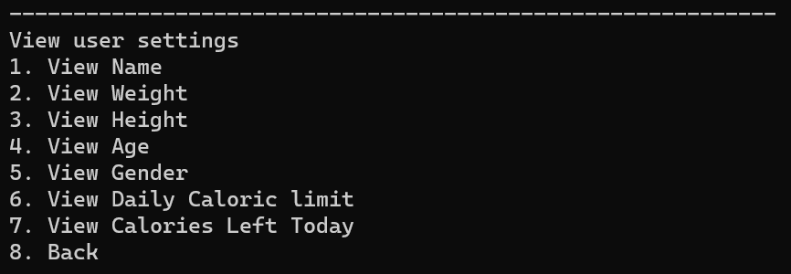
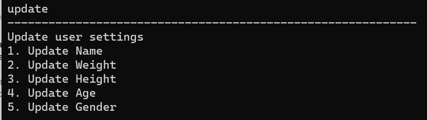

# ***Life Tracker user guide***

## Introduction

**_Life Tracker_** is an application that allows users who are health conscious automate the tracking of their calories and keep a record of 
their calorie intake history.

The app also allows users to keep track of their daily exercises to compute their calorie loss.

Their net calorie gain/loss can then be viewed.

## Quick Start

1. Ensure that you have Java 11 or above installed.
2. Down the latest version of `LifeTracker` from [here](https://github.com/AY2223S2-CS2113-W15-1/tp).
3. Copy the file to the folder you want ot use as the home folder for your LifeTracker.
4. Open a command terminal, cd into the folder you put the jar file in, and use the java -jar lifetracker.jar command to run the application.
5. Type the command in the command box and press Enter to execute it. 
6. Refer to the features below for details of each command.

## Features v2.0

* View and Update user profile
* Add meal
* Delete meal
* Add Exercise
* Calculate caloric needs
* Calculate amount of calories left in the day
* Find the nutrition of a certain kind of food
* Filter foods based on calories
* Track Calorie Intake

### Viewing User Profile: `view`

To view user's profile. 
User will come across a menu that shows them what information they can choose to view
,and they will input the number in order to view the information they want to see.

User can also choose to back out of the menu in the event that they have entered the view 
command by accident. They can do so by inputting the number 8.

Format: `view`

Menu Output:

User can input a value from **1 to 9** to view their current profile:

1. Name
2. Weight
3. Height
4. Age
5. Gender
6. Daily Caloric Limit
7. Calories Remaining for today
8. View Target Weight
9. Exit

Example:

User then can input **1** to continue viewing their profile or **2** to exit

### Updating User Profile: `update`

Allows the user to update any of their information.
User will come across a menu that shows them what information they can choose to update, they will need
to input the number in order to update the specific information they want to change.

Format: `update`

Menu Output:

User can input a value from **1 to 6** to customise their profile:
1. Name
2. Weight
3. Height
4. Age
5. Gender
6. Target Weight
7. Exit

Example:

User then can input **1** to continue updating their profile or **2** to exit

### Adding a meal: `add`

Adds a new meal to database

Format: `add /on [date] /type [MealType] /foods [foods]`

* The `date` should be in `d/M/yyyy` format
* The `MealType` can be one of the following
  * Breakfast
  * Lunch
  * Dinner
* The `foods` is a list of foods seperated by `, ` (Comma with a space after)

Example of usage:

`add /on 3/3/2023 /type Lunch /foods Spaghetti, Alfredo (Small)`

#### Alternatives

For Users who are not experienced with typing fast on keyboards, *LifeTracker* offers a menu option to add meal

Format: `add`

### Listing foods: `list`

For uses to view all foods currently supported in the *LifeTracker* database

Format: `list foods`

Example:

### Listing meals: `list`

For users to view previously added meals

Format: `list meals`

Example:

### Deleting meals: `delete`

For users to remove previously added meals

Format: `delete [index]`

* The `index` should be a positive integer and must be less than number of meals added
* It is recommended to run `list meals` beforehand to get the index of the meal you want to delete

Example:

### Filtering foods: `filter`

For users to filter the foods by their calorie content. The user inputs the lower and higher bound that they want to filter the food by,
in terms of the calorie content of the food.

The list of food within the range will then be displayed, from which the user can choose from.

Format: `filter [lower_bound] [upper_bound`

* The lower and upper bound should be a `float` value
* The lower bound should be lower than or equal to the upper bound

Example:

### View Nutrition Content of food: `nutrition`

For users to view the nutrition content of the food. The user first needs to search for the food, then the nutrition content of the food will be printed.

Format: `nutrition`

* The first food search should be in English
* To select the particular food filtered, an integer should be inputted
* To continue searching for more food, **1** should be inputted when prompted after, else input any number to exit

Example:

### Add Exercise: `exercise`

For user to input the exercise done previously

Format: `exercise /type [exercise name] /description [exercise description] /calories [calories burnt] /on [date]`

* The `exercise name` and `exercise description` accepts any input
* The `calories` should be in `float` format
* The `date` should be in `d/M/yyyy` format

Example:

### Track net calorie intake: `track`

For user to track their previous net calorie intake

Format: `track`

Output:

### Display examples for meals and exercises: `examples`

For the user to gain some inspiration on exercises to do, as well as some idea on the meals that they can eat.

Format: `examples [meal/exercise]`

### Exiting the program: `bye`
Allows user to exit the program.

Format: `bye`

Output:

## FAQ

**Q**: How do I transfer my data to another computer? 

**A**: Do copy the `data` folder and its contents to the new computer

**Q**: Where do you get the data for the food from?

**A**: The nutrition data is based on food from NUS TechnoEdge canteen, as this application would be mainly targeted at NUS Engineering students who eats there regularly. 

## Command Summary

| Action    | Format, Examples                                                                                         |
|-----------|----------------------------------------------------------------------------------------------------------|
| View      | view                                                                                                     |
| Update    | update                                                                                                   |
| Add       | add /on [date] /type [MealType] /foods [foods]                                                           |
| List      | list foods or list meals                                                                                 |
| Delete    | delete INDEX e.g delete 3                                                                                |
| Filter    | filter                                                                                                   |
| Nutrition | nutrition                                                                                                |
| Exercise  | exercise /type [exercise name] /description [exercise description] /calories [calories burnt] /on [date] |
| Track     | track                                                                                                    |
| Bye       | bye                                                                                                      |

