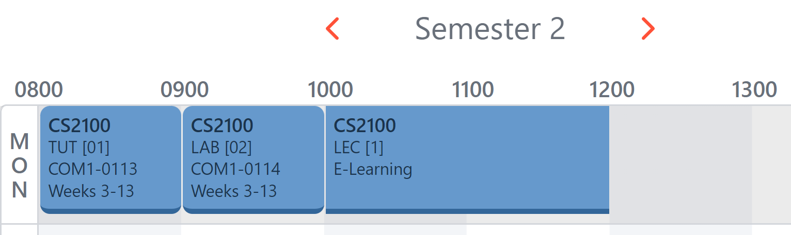

# User Guide
# Table of contents

- [User Guide](#user-guide)
    - [1.0 Introduction](#10-introduction)
    - [2.0 Quick Start](#20-quick-start)
    - [3.0 Features](#30-features)
    - [FAQ](#faq)
    - [Command Summary](#command-summary)
## 1.0 Introduction
🗓️ NUSPlanner is a desktop app that allows for an *easy* and *straightforward* way for NUS students to manage their schedule ranging from person, school or external related activities. This application makes use of a desktop Command Line Interface (CLI), enabling a quick and sleek method of getting your schedule in check.

⌨️ If you can type fast, NUSPlanner can get your contact management tasks done faster and more efficiently than traditional GUI apps.

✅ NUSPlanner is available for download for operating systems such as Windows, Linux and OS-X.

 

[Back to Contents Page](#table-of-contents)

## 2.0 Quick Start
Before we get started, here's what you need to do:

1. Ensure that you have Java 11 or above installed.
2. Download the latest version of `NUSPlanner.jar` from [here](https://github.com/AY2223S2-CS2113-F13-3/tp/releases).
3. Open your terminal or command prompt
4. Navigate to the file directory of where the jar file is saved
5. Execute `NUSPlanner.jar` using the following command: `java -jar NUSPlanner.jar`
6. Refer to section [3.0 Features] for more details of commands

[Back to Contents Page](#table-of-contents)

## 3.0 Features

Read this section to find out how NUSPlanner can make your life easier!

### Adding an event: `add`
Adds an event to the schedule. Assuming x is an switch. Use –x to specify the attributes to edit.

Format: `add –e EVENTNAME –st STARTTIME –sd STARTDATE –et ENDTIME –ed ENDDATE -v VENUE -r RECURRING TIME`
* sd and ed must be of the format YYYY/MM/DD
* e, sd and st are compulsory fields
* ed and et are optional, but they must be written together if you use them
* v is optional
* r is optional, the format is x D/ x W, which means the event will happen in every x day/x week.

#### Examples of usage
1. Add event that starts and ends on different days: `add -e Career Fair -st 14:00 -sd 2023/02/10 -et 16:00 -ed 2023/02/11`
2. Add event that happens every week: `add -e collect mails -st 08:00 -sd 2023/02/10 -et 08:10 -ed 2023/02/10 -r 1 W`

**Notice:** 

> date/time formats like 8:00 or 2023/4/1 are not accepted. The format should be strictly	`two digits`:`two digits`	(08:00 and 2023/04/01 in this case).

Expected outcome:

1. ~~~
	____________________________________________________________
	Event successfully added: 00 -sd 2023/02/10 -et 16:00 -ed 2023/02/11
	
    	> [E] Career Fair (2023/02/10 14:00 to 2023/02/11 16:00 not recurring)
	____________________________________________________________
	~~~

2. ~~~
   ____________________________________________________________
   Event successfully added: 8:00 -sd 2023/02/10 -et 08:10 -ed 2023/02/10 -r 1 W
   
       > [E] collect mails (2023/02/10 08:00 to 2023/02/10 08:10 | recurring, time interval: 1 Week(s))
   ____________________________________________________________
   ~~~
   

**Confliction Checking: ** 

- NUSPlanner will only check for conflicts between events and classes that have **starting date & time and ending date & time, within the time period of selected semester.**
- Users need to check themselves whether the events will clash with each other during vacation periods.

### Adding a module: `add`
Adds a module to the schedule. Assuming x is an switch. Use –x to specify the attributes to edit.

Format: `add –m MODULECODE -n CLASSNUMBER -l LESSONTYPE`
* All fields are compulsory

#### Examples of usage
* Add a lecture of module: `add -m AC5001 -n 1 -l lecture`
* Add a tutorial of module: `add -m CS2100 -n 11 -l tutorial`

#### How to find the correct `MODULECODE`, `CLASSNUMBER` and `LESSONTYPE`?
* Head over to [NUSMods](www.nusmods.com)
* Find the class and slot that you want
* For example, user wants to take these 3 slots:

> `MODULECODE`: Module code
> 
>`CLASSNUMBER`: Number that is allocated to class. It is in this format: [X]
> 
>`LESSONTYPE`: Either lecture, tutorial or laboratory and is stated before `CLASSNUMBER`
* Commands used for this case are
`add -m CS2100 -n 01 -l tutorial`, `add -m CS2100 -n 02 -l laboratory` and `add -m CS2100 -l lecture`
* Please type out your commands and ensure your spelling is accurate
* Copying and pasting commands from the user guide may cause some issues due to formatting

**Lesson Types Recognized by NUSPlanner**

| Lesson name                | Name on NUSMODS | Lesson type to input into Command line |
|----------------------------|-----------------|----------------------------------------|
| Lecture                    | LEC             | `LEC`                                  |
| Sectional Teaching         | SEC             | `SEC`                                  |
| Design Lecture             | DLEC            | `DLEC`                                 |
| Recitation                 | REC             | `REC`                                  |
| Packaged Lecture           | PLEC            | `PLEC`                                 |
| Seminar-Style Module Class | SEM             | `SEM`                                  |
| Tutorial                   | TUT             | `TUT`                                  |
| Tutorial Type 2            | TUT2            | `TUT2`                                 |
| Packaged Tutorial          | PTUT            | `PTUT`                                 |
| Laboratory                 | LAB             | `LAB`                                  |

**Workshops** and **Mini Projects** are excluded from the lesson types as they do not have specific timings. Do add them as individual/recurring
events should you need to have them.

**Notice**
> For the lesson number and lesson type, follow the format as displayed on NUSMods. 
> 
> ~~**BAD** example~~: `add -m CS2100 -n 2 -l tutorial`
> 
> **GOOD** example: `add -m CS2100 -n 02 -l tutorial` or `add -m HSI2016 -n L1 -l Sectional Teaching`
> 
> 
> For `LESSONTYPE` field, only `lecture / tutorial / laboratory` or any of the fields specified in the table above are accepted

Expected outcome:
~~~
____________________________________________________________
Event successfully added: 

    > Added 13 classes of Module: AC5001
____________________________________________________________
~~~
~~~
____________________________________________________________
Event successfully added: 

    > Added 11 classes of Module: CS2100
____________________________________________________________
~~~

### Deleting an event: `delete`
Delete a single event or all events from the schedule. Use –s to specify the events to delete, or –all to delete all events.

Format:
* `delete –s INDEX_OF_EVENT `
* `delete -all`

#### Examples of usage
1. Delete a single event: `delete –s 1`

2. Delete all events: `delete -all`

Expected outcome:
1. ~~~
	____________________________________________________________
	This event is deleted:
	
    	> [E] testing (2023/03/21 10:00 to 2023/03/21 10:00 not recurring)
	____________________________________________________________
	~~~
2. ~~~
	____________________________________________________________
	    > all events are deleted!
	____________________________________________________________
   ~~~
	
	
### List an event: `list`
Displays a list of all events that have been added to the schedule.

Format:
* List all events: `list`
* List timetable of specific week: `list -w WEEKNUM`

#### Examples of usage
* List all events: `list`
* List timetable of specific week: `list -w 7`

Expected outcome:
~~~
____________________________________________________________
   > 1.[E] AC5001 (2022/08/10 14:00 to 2022/08/10 17:00 not recurring)
   > 2.[E] AC5001 (2022/08/17 14:00 to 2022/08/17 17:00 not recurring)
   > 3.[E] AC5001 (2022/08/24 14:00 to 2022/08/24 17:00 not recurring)
   > 4.[E] AC5001 (2022/08/31 14:00 to 2022/08/31 17:00 not recurring)
   > 5.[E] AC5001 (2022/09/07 14:00 to 2022/09/07 17:00 not recurring)
   > 6.[E] AC5001 (2022/09/14 14:00 to 2022/09/14 17:00 not recurring)
   > 7.[E] AC5001 (2022/09/21 14:00 to 2022/09/21 17:00 not recurring)
   > 8.[E] AC5001 (2022/09/28 14:00 to 2022/09/28 17:00 not recurring)
   > 9.[E] AC5001 (2022/10/05 14:00 to 2022/10/05 17:00 not recurring)
   > 10.[E] AC5001 (2022/10/12 14:00 to 2022/10/12 17:00 not recurring)
   > 11.[E] AC5001 (2022/10/19 14:00 to 2022/10/19 17:00 not recurring)
   > 12.[E] AC5001 (2022/10/26 14:00 to 2022/10/26 17:00 not recurring)
   > 13.[E] AC5001 (2022/11/02 14:00 to 2022/11/02 17:00 not recurring)
   > 14.[E] CS2100 (2022/08/26 16:00 to 2022/08/26 17:00 not recurring)
   > 15.[E] CS2100 (2022/09/02 16:00 to 2022/09/02 17:00 not recurring)
   > 16.[E] CS2100 (2022/09/09 16:00 to 2022/09/09 17:00 not recurring)
   > 17.[E] CS2100 (2022/09/16 16:00 to 2022/09/16 17:00 not recurring)
   > 18.[E] CS2100 (2022/09/23 16:00 to 2022/09/23 17:00 not recurring)
   > 19.[E] CS2100 (2022/09/30 16:00 to 2022/09/30 17:00 not recurring)
   > 20.[E] CS2100 (2022/10/07 16:00 to 2022/10/07 17:00 not recurring)
   > 21.[E] CS2100 (2022/10/14 16:00 to 2022/10/14 17:00 not recurring)
   > 22.[E] CS2100 (2022/10/21 16:00 to 2022/10/21 17:00 not recurring)
   > 23.[E] CS2100 (2022/10/28 16:00 to 2022/10/28 17:00 not recurring)
   > 24.[E] CS2100 (2022/11/04 16:00 to 2022/11/04 17:00 not recurring)
____________________________________________________________
~~~
~~~
Showing schedule for semester 1 and week 7

TIME      |MONDAY         |TUESDAY        |WEDNESDAY      |THURSDAY       |FRIDAY         |SATURDAY       |SUNDAY         |
----------+---------------+---------------+---------------+---------------+---------------+---------------+---------------+
08:00     |               |               |               |               |               |               |               |
          +---------------+---------------+---------------+---------------+---------------+---------------+---------------+
08:30     |               |               |               |               |               |               |               |
          +---------------+---------------+---------------+---------------+---------------+---------------+---------------+
09:00     |               |               |               |               |               |               |               |
          +---------------+---------------+---------------+---------------+---------------+---------------+---------------+
09:30     |               |               |               |               |               |               |               |
          +---------------+---------------+---------------+---------------+---------------+---------------+---------------+
10:00     |               |               |               |               |               |               |               |
          +---------------+---------------+---------------+---------------+---------------+---------------+---------------+
10:30     |               |               |               |               |               |               |               |
          +---------------+---------------+---------------+---------------+---------------+---------------+---------------+
11:00     |               |               |               |               |               |               |               |
          +---------------+---------------+---------------+---------------+---------------+---------------+---------------+
11:30     |               |               |               |               |               |               |               |
          +---------------+---------------+---------------+---------------+---------------+---------------+---------------+
12:00     |               |               |               |               |               |               |               |
          +---------------+---------------+---------------+---------------+---------------+---------------+---------------+
12:30     |               |               |               |               |               |               |               |
          +---------------+---------------+---------------+---------------+---------------+---------------+---------------+
13:00     |               |               |               |               |               |               |               |
          +---------------+---------------+---------------+---------------+---------------+---------------+---------------+
13:30     |               |               |               |               |               |               |               |
          +---------------+---------------+---------------+---------------+---------------+---------------+---------------+
14:00     |               |               |               |               |               |               |               |
          +---------------+---------------+---------------+---------------+---------------+---------------+---------------+
14:30     |               |               |AC5001         |               |               |               |               |
          +---------------+---------------+---------------+---------------+---------------+---------------+---------------+
15:00     |               |               |AC5001         |               |               |               |               |
          +---------------+---------------+---------------+---------------+---------------+---------------+---------------+
15:30     |               |               |AC5001         |               |               |               |               |
          +---------------+---------------+---------------+---------------+---------------+---------------+---------------+
16:00     |               |               |AC5001         |               |               |               |               |
          +---------------+---------------+---------------+---------------+---------------+---------------+---------------+
16:30     |               |               |AC5001         |               |CS2100         |               |               |
          +---------------+---------------+---------------+---------------+---------------+---------------+---------------+
17:00     |               |               |               |               |               |               |               |
          +---------------+---------------+---------------+---------------+---------------+---------------+---------------+
17:30     |               |               |               |               |               |               |               |
          +---------------+---------------+---------------+---------------+---------------+---------------+---------------+

____________________________________________________________
~~~

### Editing an event: `edit`
Edit an event that has been added to the schedule. Use –x to specify the attributes to edit.

Format: `edit -i INDEX_OF_EVENT –st STARTTIME –sd STARTDATE –et ENDTIME –ed ENDDATE -v VENUE -r x D/W`

**notice: **

> when Editing the event, User need to rewrite the complete time information including the parts that they do not what to change
>
> the format is the same as it in add command

* sd and ed must be of the format YYYY/MM/DD
* e, sd and st are compulsory fields
* ed and et are optional, but they must be written together if you use them
* other fields are optional.

#### Examples of usage
1. Edit the start time of an event: `edit –i 1 –st 16:00` 

2. Edit the start date, start time and end time of an event: `edit -i 1 –sd 2023/02/11 –st 08:00 –et 10:00 `

**notice: ** 

> Similar to add command, the app will also check whether there is any confliction between the new revised time and other events/classes with **full details of time information** if and only if the revised time information also have **starting date & time and ending date & time**
>
> The app will also only check confliction within the current semester. 

Expected outcome:
1. ~~~
	____________________________________________________________
	Time of event: event is changed to:
    	> 2023/04/01 16:00 not recurring
	____________________________________________________________
	~~~

2. ~~~
	____________________________________________________________
	Time of event: event is changed to: ed 2023/02/11
       > 2023/02/11 08:00 to 2023/02/11 10:00 not recurring
	____________________________________________________________
	~~~

### Saving Data
NusPlanner data are saved to the hard drive automatically after the `bye` command to quit it. There is no need to save manually.

### Editing the data file
Data for NUSPlanner is saved as a `.json` file. The path for the save file is `[JAR file location]/save.json`. Advanced users are welcome to update data directly by editing the data file.

🚧 **Warning**: If your changes to the data file makes its format invalid, NUSPlanner will discard all data and load an empty data file at the next run.

### NUSMods Data
NusPlanner runs an offline version of the NUSMods API. The NUSMods data stored in NUSPlanner is correct as of **March 17, 2023**. 

## FAQ

**Q**: Why is a JAR file required?

**A**: Java ARchive, also known as JAR, is a container that groups multiple small files to enable efficient execution, which is similar to a ZIP file.

**Q**: Where can I report bugs I found while using NUSPlanner?

**A**: Our team of developers are always on the look-out to fix such bugs.
Please add a description of the bug found under our [Issue Tracker](https://github.com/AY2223S2-CS2113-F13-3/tp/issues).

## Command Summary
👉 Words in **CAPITAL LETTERS** are user input

👉 Each word is separated by only a **single whitespace**

**Command | Description**
* `add –e EVENTNAME –st STARTTIME –sd STARTDATE –et ENDTIME –ed ENDDATE -v VENUE -r x D/W` | Add event
* `add –m MODULECODE -n CLASSNUMBER -l LESSONTYPE`
* `delete –s 1` | Delete a single event
* `delete -all` | Delete all events
* `list` | List all events
* `edit -i INDEX_OF_EVENT –st STARTTIME –sd STARTDATE –et ENDTIME –ed ENDDATE -v VENUE -r x D/W` | Edit event
