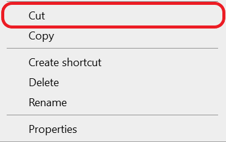
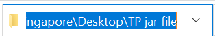
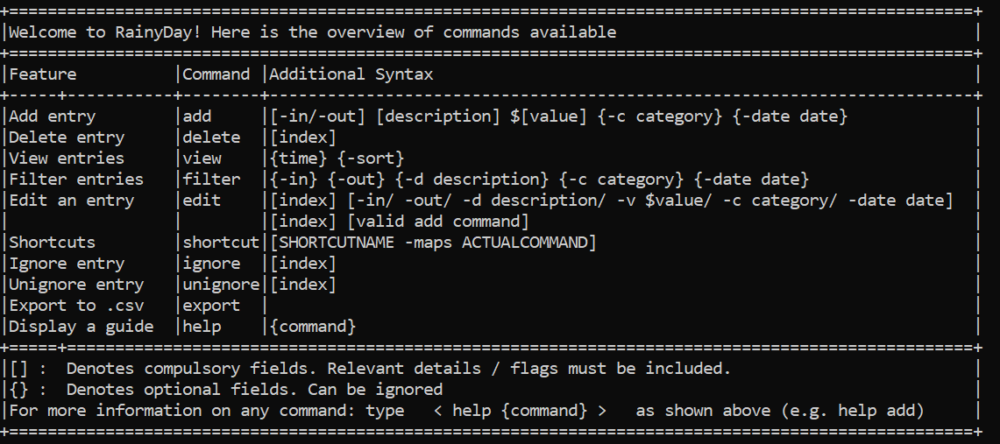
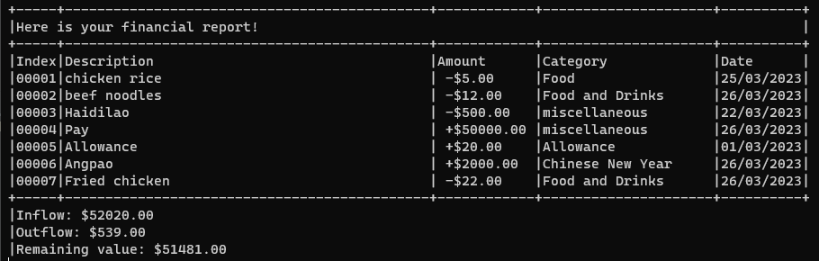
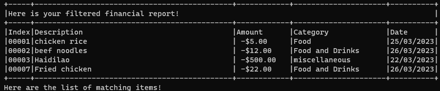

# rainyDay User Guide

## Introduction

rainyDay is a desktop application for managing your finances that runs on a Command Line Interface (CLI). rainyDay
provides a simple solution to track your finances and achieve your financial goals.

This user guide provides an in-depth documentation on how to install and use rainyDay. This guide caters to all users of
rainyDay, from people who are just starting out to advanced users looking for extra features they were unaware of.

## Content Page

<!-- TOC -->
* [rainyDay User Guide](#rainyday-user-guide)
  * [Introduction](#introduction)
  * [Content Page](#content-page)
  * [Introduction](#introduction-1)
  * [How to use the user guide](#how-to-use-the-user-guide)
  * [Quick Start](#quick-start)
  * [Features](#features)
    * [Adding a transaction](#adding-a-transaction)
      * [Simple Usage (For Beginner Users)](#simple-usage--for-beginner-users-)
      * [Advanced Usage (For Advanced Users)](#advanced-usage--for-advanced-users-)
    * [Viewing the transactions](#viewing-the-transactions)
    * [Deleting a transaction](#deleting-a-transaction)
    * [Viewing help](#viewing-help)
    * [Filter statements](#filter-statements)
    * [Edit statements](#edit-statements)
    * [Saving the data](#saving-the-data)
    * [Loading saved data](#loading-saved-data)
    * [Exporting to CSV](#exporting-to-csv)
      * [Where to locate exported CSV file?](#where-to-locate-exported-csv-file)
      * [How to view the CSV file using Microsoft Excel?](#how-to-view-the-csv-file-using-microsoft-excel)
    * [Exiting the application](#exiting-the-application)
  * [FAQ](#faq)
  * [Command Summary](#command-summary)
  * [An Example Usage of rainyDay](#an-example-usage-of-rainyday)
  * [Glossary](#glossary)
<!-- TOC -->

## Acknowledgement

Thank you for choosing rainyDay! We sincerely hope that rainyDay has made it easier for you to track your finances.
Should you have any feedback or enquiries, please do not hesitate to drop us an email!

## How to use the user guide

This section assumes that you are a new user of rainyDay and are interested in learning more about the basic features provided by rainyDay.
More advanced users are encouraged to refer to the section under [Advanced Usage (For Advanced Users)](#advanced-usage--for-advanced-users-) 
to enjoy the full capabilities of rainyDay.

Please note the following about the format of commands given under each [feature](#features).

* Words in CAPS are the parameters to be supplied by the user

* Items in `markdown` format are related to commands provided by the user

* Items surrounded by square brackets "[]" are mandatory fields, while the items in curly brackets "{}" are optional

* Items in double quotation marks "" are the names of items 

## Quick Start

1. Ensure that you have Java 11 or above installed on your computer
    1. Click [here](https://www.java.com/en/download/help/version_manual.html) for steps on how to check your Java
       version
    2. Click
       [here](https://docs.oracle.com/en/java/javase/11/install/overview-jdk-installation.html#GUID-8677A77F-231A-40F7-98B9-1FD0B48C346A)
       for the guide on installing Java 11
2. Download the latest version of "rainyDay"
   from [here](https://github.com/AY2223S2-CS2113T-T09-1/tp/releases/download/v1.0/rainyDay.jar).
3. Move the "rainyDay.jar" file to the folder of your choice by doing the following steps:
    1. Locate the "rainyDay.jar" file in your "Downloads" folder
    2. Right-click the "rainyDay.jar" file and select cut from the table that appears  

    3. Go to the folder of your choice
    4. Right-click in the file window and select paste as seen below  
       
4. In order to run "rainyDay.jar" on the command line, we have to do the following:
    1. Open the folder containing "rainyDay.jar" and click on the address bar  
       
    2. Type the words "cmd" in the folder path in the address bar  

    3. Hit the "enter" key. Your Command Prompt should now be open in the folder containing "rainyDay.jar".
5. Type `java -jar rainyDay.jar` and press Enter on your keyboard to start the application

## Features

{feature list with links?}

### Viewing help

In case you need a reminder of the capabilities of rainyDay, the help command will give you a comprehensive list of all
the possible commands and their respective structures!

Format: `add -DIRECTION DESCRIPTION $AMOUNT`

The table below will be shown:

### Adding a transaction

An integral feature of any budgeting application is to add transactions. The "add" function of rainyDay allows you 
to keep track of your inflows and outflows. The following explains how you can add different types of transactions 
to rainyDay.

#### Simple Usage (For Beginner Users)

The "Simple Usage" of adding transactions is highly recommended for new users who are just starting out. Since rainyDay can comprehend simplified 
instructions given by the user, it provides a user-friendly experience for those who are just starting to learn how to use the basic functions.

Format: `add [-DIRECTION] [DESCRIPTION] [$AMOUNT]`

* `DIRECTION` should be either:
    * `in` signifying an inflow type of transaction, or
    * `out` signifying an outflow type of transaction
* `DESCRIPTION` signifies the description of the transaction, consisting of words
* `AMOUNT` signifies the cost of transaction, needs to be a number more than or equal to 0

Example of usage:

You received a gift of $500 from your mother. To add it to rainyDay, the following command can be provided to rainyDay:

* `add -in gift from mom $500` - Signifies an inflow with the description "gift from mom" of value "$500"

You paid for your school fees of $1000.50. To add it to rainyDay, the following command can be provided to rainyDay:

* `add -out school fees $1000.50` - Signifies an outflow with the description "school fees" of value "$1000.50"

#### Advanced Usage (For Advanced Users)

The "Advanced Usage" of adding transactions is suitable for more advanced users who are already familiar with the basic functions of
rainyDay. We recommend exploring the advanced features and customization options that the app offers. These features allow 
for greater control and flexibility in using rainyDay to fit specific needs and preferences. 

Format: `add [-DIRECTION] [DESCRIPTION] [$AMOUNT] {-c CATEGORY} {-date DD/MM/YYYY}`

* `DIRECTION`, `DESCRIPTION`, `AMOUNT` is as mentioned under [Simple Usage](#simple-usage--for-beginner-users-) 
* `CATEGORY` can contain any characters and space
* `DD/MM/YYYY` represents a valid date, where
    * `DD` is a two-digit number representing the day
    * `MM` is a two-digit number representing the month
    * `YYYY` is a four-digit number representing the year

Example of usage:

You received your monthly income of $2000 on 05/03/2023. To add it to rainyDay, the following command can be provided to
rainyDay:

* `add -in income $2000 -c pay -date 05/03/2023` - Signifies an inflow with the description "income" of value "$2000", 
under the category of "pay" with the date "05/03/2023"

You had lunch at a hawker centre for $6.80 on 10/03/2023. To add it to rainyDay, the following command can be provided to
rainyDay:

* `add -out lunch at hawker centre $6.80 -c food and drinks -date 10/03/2023` - Signifies an outflow with the description 
"lunch at hawker center" of value "$6.80", under the category of "food and drinks" and with the date "10/03/2023".

> 💡**Tip:** The flags `-c` and `-date` can also be used exclusively. The following are also valid formats:
>
> * `add -DIRECTION DESCRIPTION $AMOUNT -c CATEGORY`
> * `add -DIRECTION DESCRIPTION $AMOUNT -date DD/MM/YYYY`

### Viewing the transactions

An important aspect to track your finances is to view all the transactions that you have already done before. The "view"
command of rainyDay will list all the transaction added, the resultant amount of all your inflows and outflows.

Format: `view`

The output will look something similar to below

### Deleting a transaction

The transactions added into rainyDay are not fixed. For whatever reason that you require deleting any transaction data,
rainyDay's "delete" function supports removing any previous transaction from your overview.

Format: `delete [INDEX]`

* `INDEX` is the transaction number given by rainyDay to a transaction
    * The transaction number can be obtained from [viewing the transactions](#viewing-the-transactions)

Example of usage:
After requesting to view the transactions from rainyDay, the following is shown to you:  

To delete the transaction with the description lunch at hawker centre, provide the command:

* `delete 2`

The transaction with the description "lunch at hawker centre" will be deleted, and the transactions shown to you
subsequently after requesting to view the transactions will be as such:  

### Filter statements

To ease your time searching through all the entries in the financial report, the "filter" function of rainyDay
will let view a filtered list of statements based by the criteria you want to filter by

Format : `filter FLAG FIELD`

* The `FLAG` must be one of the following:
    * `-d` to filter by description
    * `-c` to filter by category
    * `-date` to filter by date
    * `-in` to filter by inflows
    * `-out` to filter by outflows
* date `FIELD` must be in the form DD/MM/YYYY

Example of usage: After requesting to view the transactions from rainyDay, the following is shown to you:

Suppose you want to find out transactions related to chicken, you can use this command:
- `filter -d chicken`

Suppose you want to check your outflows only, you can use this command:
- `filter -out`

> 💡**Tip:** Multiple flags may be used at once but must be in this order: 
> 
> `-d` -> `-c` -> `-date` -> `-in` or `out`
> 
> Suppose you want to find out what food you ate on a particular day, you can use this command:
> 
> `filter -c Food and Drinks -date 26/03/2023`
> 
> 

### Edit statements

Transactions keyed in may contain input errors by mistake. rainyDay's "edit" function supports editing a single entry
from your overview

Format : `edit INDEX ADDCOMMAND` or `edit INDEX FLAG NEWFIELD` or `edit INDEX FLAG`

* The `FLAG` must be one of the following:
    * `-d` to edit the description
    * `-c` to edit the category
    * `-v` to edit the value
    * `date` to edit the date
    * `-in` to change direction to inflow
    * `-out` to change direction to outflow

* No `NEWFIELD` required for changing direction

Example of usage:

`edit 1 -add -in Beef noodles $15 -c Food`

`edit 2 -d school`

`edit 3 -in`

### Saving the data

{todo}

### Loading saved data

{todo}

### Exporting to CSV

Exports your financial statements into a comma-separated values file.

Format: `export`
> **Background:** A CSV file allows data to be saved in a format which can be viewed as a table.
>
>💡Saving your financial statements in a CSV file will allow you to view your statements in commonly use applications
> like *Microsoft Excel* and *Google Sheets*.

#### Where to locate exported CSV file?

The CSV file will be located in the `data` folder within the same folder as your `rainyDay.jar` file. This should have
been configured in step 3 of the [Quick Start section](#quick-start). The CSV file will be named `report`.

#### How to view the CSV file using Microsoft Excel?

1. Open your Microsoft Excel application and open a blank workbook.
2. Click on the *Data* tab found at the top and click on *From Text/CSV*.
3. Navigate to the CSV file as directed in
   the [where to locate exported CSV file section](#where-to-locate-exported-csv-file).
4. Double-click on the CSV file and click the *load* button.
5. With steps 1-4, your financial statements should be viewable in a nicely formatted table as shown
   below.

### Exiting the application

To exit rainyDay, the following format is used:

Format: `exit`

## FAQ

**Q**: How do I transfer my data to another computer?

**A**: Copy the txt file named "rainyDay" that is in the same directory as rainyDay.jar to the new device and location
that
"rainyDay.jar" is going to be stored in

## Command Summary

| Action | Format   Example input                                                                                                                                                                                                                                                                                                                                               |
|--------|-------------------------------------------------------------------------------------------------------------------------------------------------------------------------------------------------------------------------------------------------------------------------------------------------------------------------------------------------------------------------|
| Add    | For beginner users:   `add -DIRECTION DESCRIPTION $VALUE`    **Example:**   `add -in angpao $300`   `add -out ipad $120`   For advanced users:   `add -DIRECTION $VALUE -c CATEGORY -date DD/MM/YYYY`    **Example:**   `add -in income $2000 -c pay -date 05/03/2023`   `add -out hawker food $6 -c food and drinks -date 10/03/2023` |
| Delete | `delete INDEX`    **Example:**   `delete 1`   `delete 2`                                                                                                                                                                                                                                                                                                    |
| View   | `view`                                                                                                                                                                                                                                                                                                                                                                  |
| Help   | `help`                                                                                                                                                                                                                                                                                                                                                                  |
| Filter | `filter DESCRIPTION` or `filter FLAG FIELD`    **Example:**   `filter school`   `filter -d school`  `filter -date 22/03/2023`                                                                                                                                                                                                                            |
| Edit   | `edit INDEX ADDCOMMAND` or `edit INDEX FLAG NEWFIELD` or `edit INDEX FLAG`    **Example:**   `edit 1 -add -in Beef noodles $15 -c Food`   `edit -d school`   `edit -in`                                                                                                                                                                                  |
| Exit   | `bye`                                                                                                                                                                                                                                                                                                                                                                   |

## An Example Usage of rainyDay

{a walkthrough of possible usage of the product (so that users know how the product works without using the product), to
update when product is finalised}

## Glossary

Command Line Interface

- {definition}

Filter

- {to add definition of financial report in our scope of application}

Financial Statement

- {to add definition of financial report in our scope of application}

Financial Report

- {to add definition of financial report in our scope of application}

Flags

- {to add definition of financial report in our scope of application}

Inflow

- {to add definition of financial report in our scope of application}

Outflow

- {to add definition of financial report in our scope of application}

Transaction

- {to add definition of financial report in our scope of application}