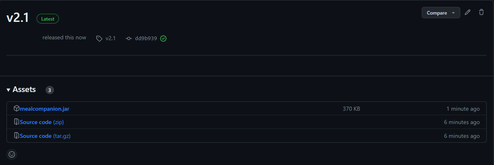

<link type="text/css" rel="stylesheet" href="main.css" />

# User Guide

## Introduction
Hey there! Thanks for choosing Meal Companion, your one-stop solution to handling meal prep, ingredient tracking and cookbook! This guide will show you how to get started, and take control of your own meal planning!

[Click here to skip ahead to the Table of Contents](#table-of-contents)

## Who is Meal Companion for?
Meal Companion is designed for NUS students staying in hostels on campus. It caters to the various needs of these busy students, including healthier meal options, easier meal planning and faster meal preparation. Read on to find out the features that will help you to achieve a more sustainable and healthy lifestyle!

## Why Meal Companion?

Cooking is a commitment. It's hard to buy exactly the right amount of ingredients especially when you're cooking for one, and even if you can stomach eating the same recipe every day for a week, the ingredients run out at different times! Most people, when faced with this problem, will simply throw out whatever goes bad and go back to their daily trips to canteens, hawkers, or resturaunts. And, that's where Meal Companion comes in! Here's how we improve upon the experience of commonly used recipe sources.

### Versus Traditional Recipe Books

Let's be real here, very few of us still use traditional recipe books. They're clunky to navigate, easy to dirty, and expensive to buy. Comparatively, Meal Companion is fast to navigate and easy to use. More importantly, someone with no idea what to cook beforehand would struggle to find a suitable recipe in a long recipe book, but with Meal Companion, you can instantly figure out what dishes you can cook with what you have.

### Versus Online Recipe Websites

Online recipe websites have a leg up on traditional recipe books because they are also easy to navigate and search through. However, similar to their analog counterparts, it can be daunting to scroll through hundreds of recipes only to find that you're a few eggs or half a carrot short of being able to cook any of them. Meal Companion alleviates this pain by allowing you to only display recipes that are possible for you to cook right now.

### Versus Recipe Videos

With the rise of shortform content such as TikToks, YouTube Shorts, and Instagram Reels, the trendiest recipes are always just a swipe away. However, those recipes can be hard to follow. Even if a text version is provided in the description of these videos, they still fall into the same issues as other online recipes. Plus, searching for them is a nightmare as the platforms they are on were not purpose-built for cooking. Not only does Meal Companion help you easily find recipes that you'd actually be interested in, it can also help you with using up the rest of your ingredients.

&nbsp;

# Table of Contents
1. [Using this Guide](#using-this-guide)
2. [Getting Started](#getting-started)
3. [Critical Warnings](#critical-warnings)  
    1. [Unnecessary Whitespaces](#unnecessary-whitespaces)  
    2. [Duplicated Flags](#duplicated-flags)
4. [Features](#features)
   1. [Ingredients](#1-ingredients)
      - [Add Ingredients](#add-ingredients)
      - [Remove Ingredients](#remove-ingredients)
      - [List Ingredients](#list-ingredients)
      - [Search Ingredients](#search-ingredients)
      - [Clear Ingredients](#clear-ingredients)
   2. [Allergens](#2-allergens)
       - [Add Allergens](#add-allergens)
       - [Remove Allergens](#remove-allergens)
       - [List Allergens](#list-allergens)
   3. [Recipes](#3-recipes)
       - [Default Recipes](#default-recipes)
       - [All Recipes](#all-recipes)
       - [Recipe Details](#recipe-details)
       - [Possible Recipes](#possible-recipes)
       - [Random Recipe](#random-recipe)
       - [Find Recipe](#find-recipe)
       - [Check Ingredients for Recipe](#check-ingredients-for-recipe)
       - [Almost Completed Recipe](#almost-completed-recipe)
       - [Make Recipe](#make-recipe)
       - [Favourite/Unfavourite Recipe](#favouriteunfavourite-recipe)
   4. [Saving Data](#4-saving-data)
       - [Transferring Saved Data to other devices](#transferring-saved-data-to-other-devices) 
   5. [Help](#5-help)
   6. [Command List](#6-command-list)
5. [Conclusion](#conclusion)
6. [Appendix](#appendix)

&nbsp;

# Using this Guide

The purpose of this guide is to introduce you to the basics of using Meal Companion and its current set of features. Here we will briefly explain the types of icons and text you can expect to see, and how to interpret them. 

`A code block` like this indicates a command you can input, or a file name. For example, `this is a command you can enter` or `this_is_a_file.exe`. 

Within the `code block` you may see segments of text wrapped in `<chevrons>`. These chevrons indicate that this text is meant to be replaced with your input. For example, a command `add <ingredient>` means you should enter the command `add apples`. 

If you still need assistance, you may refer to the [Appendix](#appendix) where you may find our Tutorial Video.

#### [Back to table of contents](#table-of-contents)

&nbsp;

# Getting Started

1. Java 11 is required for Meal Companion to function properly, please make sure your device has Java 11 installed. If not, you may download it [here](https://www.oracle.com/sg/java/technologies/downloads/#java11). If you need further asssistance installing Java 11, you may refer to the [Installation Guide](https://docs.oracle.com/en/java/javase/11/install/installation-jdk-microsoft-windows-platforms.html).

2. Once you have ascertained that your device has Java 11 installed, you may download the `.jar file` [here](https://github.com/AY2223S2-CS2113T-T09-3/tp/releases/tag/v2.0). 

    
    Fig 1: Version release page with download links for Meal Companion.

    Click on `mealcompanion.jar` to automatically download the file. Place the file in a folder of your choice.

3. Open the command terminal and navigate to the folder where you downloaded `mealcompanion.jar` using `cd <file_path>` commands as necessary.
4. Ensure the terminal is within the correct folder.
5. Use the command:  
     `java -jar mealcompanion.jar`   
     
   to launch Meal Companion. You may refer to Fig. 2 for an example.

      
    Fig 2: Command to start using Meal Companion.
    
    > **Tip** 
    > If you are new to using the Command Line Interface, you may refer to the [Command Line Interface Guide](#command-line-interface-guide) in the [Appendix](#appendix) for further assistance.

6. When you are finished using Meal Companion, use the `bye` command to terminate the application. This will ensure your stored data is saved correctly for future access.
7. To get started using Meal Companion, take a look at the [`add`](#add-ingredients) command to let the app know what ingredients you have available to you, then use the [`recipe possible`](#possible-recipes) command to figure out what recipes you can make!
8. Alternatively, if you don't have any ingredients on hand but are interested in learning a new recipe, you can use the [`recipe all`](#all-recipes) command to browse through our recipe book and find a recipe you're interested in making, then use the [`recipe details`](#recipe-details) command to view how to make it.

Meal Companion uses a Command Line Interface (CLI), as the current version is just a proof of concept. We have plans to further develop Meal Companion to include a Graphical User Interface (GUI), or even to a mobile application platform. However as we have not yet reached that stage in our development, the CLI will suffice as the input method to operate Meal Companion. We apologize for any inconvenience caused.

#### [Back to table of contents](#table-of-contents)  

&nbsp;

# Critical Warnings
Due to the nature of Meal Companion as a CLI-based application, please take care to avoid malformed commands so as to avoid undesirable performance of Meal Companion. Some examples are shown below.

## Unnecessary Whitespaces
> **Warning**:
> Meal Companion will not recognize ingredient names if there is an unexpected number (more than 1) of whitespaces between each word in the ingredient name. 
> 
> For example: 
>  
> Example of invalid command. This also applies to the `remove` command, the `ingredients search` command and the `allergens` comamnds. 
> 
> The above-mentioned warnings apply to all commands or ingredient names with whitespaces in between words. We cannot guarantee Meal Companion will function as expected if the warning is not adhered to. 

## Duplicated Flags
> **Warning**: 
> Meal Companion will ignore duplicated flags in the `add` and `remove` commands, taking only the last valid `/qty` flag as the validated input.  
> 
> For example: 
>  
> Example of duplicated flags being ignored, only the last flag is acknowledged by Meal Companion.

#### [Back to table of contents](#table-of-contents)

So now that you have everything you need to get started with us, let us now dive straight into the main features of MealCompanion!

&nbsp;

# Features   
This section will focus on some of the key features of Meal Companion and explain their usage. We will go over several features, including the Ingredients functions, Allergen functions, and Recipe functions. 

- [Ingredients](#1-ingredients)
- [Allergens](#2-allergens)
- [Recipes](#3-recipes)
- [Saving Data](#4-saving-data)
- [Help](#5-help)
- [Command List](#6-command-list)

&nbsp;

## 1. Ingredients
Meal Companion will assist you in tracking the items in your refrigerator, and is capable of adding new ingredients, removing used ingredients, as well as listing the available ingredients in your refrigerator. This guide will detail these features below.
  
* [Add Ingredients](#add-ingredients)  
* [Remove Ingredients](#remove-ingredients)  
* [List Ingredients](#list-ingredients)  
* [Search Ingredients](#search-ingredients)  
* [Clear Ingredients](#clear-ingredients)  

### Add Ingredients
To add an ingredient of a certain quantity to Meal Companion's storage, use the command `add <ingredient> /qty <quantity>`.
The `/qty` portion of the command is necessary for Meal Companion to distinguish between the sections of the command. You may refer to Fig. 3 for an example and the expected output.

For example:  
`add ground chicken /qty 300`  

  
Fig 3: Sample of Add Ingredients command with user input highlighted.

> **Note**: Ingredient you add must be in the list of known ingredient names. If you're not sure what an ingredient is called, you can utilize the [`ingredients search`](#search-ingredients) command to figure it out.

 

> **Warning**: Please avoid malformed commands so as to prevent undesirable behaviour of Meal Companion. 
> Examples of malformed commands can be found in the [Critical Warnings](#critical-warnings) section. Please refer to [Unnecessary Whitespaces](#unnecessary-whitespaces) and [Duplicated Flags](#duplicated-flags) for examples specific to the `add` command.
 

> **Note**: Look out for the new [`new ingredient`](#new-ingredient) feature coming out soon!

#### [Back to Ingredients](#1-ingredients)

 

### Remove Ingredients
To remove an ingredient of a certain quantity from Meal Companion's storage, use the command `remove <ingredient> /qty <quantity>`. The `/qty` portion of the command is necessary for Meal Companion to distinguish between the sections of the command. You may refer to Fig. 4 for an example and the expected output.

For example:  
`remove ground chicken /qty 100`

  
Fig 4: Sample of Remove Ingredients command with user input highlighted.

 

> **Warning**: Please avoid malformed commands so as to prevent undesirable behaviour of Meal Companion. 
> Examples of malformed commands can be found in the [Critical Warnings](#critical-warnings) section. Please refer to [Unnecessary Whitespaces](#unnecessary-whitespaces) and [Duplicated Flags](#duplicated-flags) for examples specific to the `remove` command.
 

#### [Back to Ingredients](#1-ingredients)

### List Ingredients
In order to show a list of all ingredients currently stored in Meal Companion, use the command `ingredients list` . You may refer to Fig. 5 for an example and the expected output.

For example:  
`ingredients list`

 
Fig 5: Sample of Ingredients List command with user input highlighted.

#### [Back to Ingredients](#1-ingredients)

&nbsp;

  

### Search Ingredients
If you would like to search for a specific ingredient that Meal Companion recognizes as valid, use the command `ingredients search <keyword>`. You may refer to Fig. 6 for an example and the expected output.

For example:  
`ingredients search ground chicken`

  
Fig 6: Sample of Ingredients Search command with user input highlighted.

 

> **Warning**: Please avoid malformed commands so as to prevent undesirable behaviour of Meal Companion. 
> Examples of malformed commands can be found in the [Critical Warnings](#critical-warnings) section. Please refer to [Unnecessary Whitespaces](#unnecessary-whitespaces) for examples specific to the `ingredients search` command.
 

Omitting the keyword will return a list of all valid ingredients. You may refer to Fig. 7 for an example of the expected output.

For example:  
`ingredients search`

  
Fig 7: Sample of Ingredients Search command with keyword omitted and user input highlighted.

#### [Back to Ingredients](#1-ingredients)

&nbsp;

### Clear Ingredients
To remove all ingredients from Meal Companion's storage, you may use the command `clear`.  You may refer to Fig. 8 for an example of the expected output.

For example:  
`clear`

 
Fig 8: Sample of Ingredients Clear command with user input highlighted.

> **Warning**: This move cannot be undone.

#### [Back to Ingredients](#1-ingredients)
 
#### [Back to table of contents](#table-of-contents)

So now that we have learnt how to add and remove ingredients, let us also learn how we could add and remove allergens to specific ingredients in the next section! 

&nbsp;

## 2. Allergens
Meal Companion recognizes that you may have certain dietary restrictions. As such, we have provided a feature that allows you to track your allergens and block Meal Companion from showing you recipes that contain said allergens. We will go into more detail on the Allergens function below.

Note that all allergens must be known ingredient names, similar to the `add` command.

Once your allergies are added to Meal Companion, you may refer to the section on [Possible Recipes](#possible-recipes) to see how this will affect the recipes available to you.

Due to certain design constraints, do note that your allergens are not saved within Meal Companion, so you will have to re-enter them each time you launch Meal Companion. We have plans to improve this feature in future iterations. We apologize for any inconvenience caused.

* [Add Allergens](#add-allergens)
* [Remove Allergens](#remove-allergens)
* [List Allergens](#list-allergens)

### Add Allergens
You may inform Meal Companion of any allergens you have by using the command `allergen add <ingredient>`. For example, if you have an allergy to eggs, you may use the command:   
`allergen add egg`

  
Fig 9: Sample of Allergen Add command with user input highlighted.

 

> **Warning**: Please avoid malformed commands so as to prevent undesirable behaviour of Meal Companion. 
> Examples of malformed commands can be found in the [Critical Warnings](#critical-warnings) section. Please refer to [Unnecessary Whitespaces](#unnecessary-whitespaces) for examples specific to the `allergen add` command.
 

#### [Back to Allergens](#2-allergens)

&nbsp;

### Remove Allergens
If you have erroneously entered an allergen, you may simply instruct Meal Companion to remove it from its list using the command `allergen remove <ingredient>`. For example, if you mistakenly entered an allergy to water, you may use the command:  

`allergen remove water`

  
Fig 10: Sample of Allergen Remove command with user input highlighted.

 

> **Warning**: Please avoid malformed commands so as to prevent undesirable behaviour of Meal Companion. 
> Examples of malformed commands can be found in the [Critical Warnings](#critical-warnings) section. Please refer to [Unnecessary Whitespaces](#unnecessary-whitespaces) for examples specific to the `allergen remove` command.
 

#### [Back to Allergens](#2-allergens)

### List Allergens
If you wish to see the entire list of ingredients you are allergic to, you may simply use the command:  
`allergen list`

  
Fig 11: Sample of Allergen List command with user input highlighted.

If you wish to take a look at how the allergens you have added will affect the recipes available to you, please see the section on [Possible Recipes](#possible-recipes).

#### [Back to Allergens](#2-allergens)

#### [Back to table of contents](#table-of-contents)
 
So now that you   have learnt how to add and remove both ingredients and allergens, let us see the cool things we could do with this in the next section on recipe commands! 

&nbsp;

## 3. Recipes
This segment will go into detail about the recipe features that Meal Companion contains, and the usage of these features.

* [Default Recipes](#default-recipes)
* [All Recipes](#all-recipes)
* [Recipe Details](#recipe-details)
* [Possible Recipes](#possible-recipes)
* [Random Recipe](#random-recipe)
* [Find Recipe](#find-recipe)
* [Check Ingredients for Recipe](#check-ingredients-for-recipe)
* [Almost Completed Recipe](#almost-completed-recipe)
* [Make Recipe](#make-recipe)
* [Favourite/Unfavourite Recipe](#favouriteunfavourite-recipe)
 

### Default Recipes
 Meal Companion comes included with a list of default recipes already initialized. The list of default recipes are found here:
 1. Beef Burger
 2. Cup of Water
 3. Chicken Burger
 4. Fish Burger
 5. Pasta (Tomato Sauce)
 6. Hainanese Chicken Rice
 7. Mee Goreng

&nbsp;

### All Recipes
To display all stored recipes, you may use the command:  
`recipe all`

!  
Fig 12: Sample of Recipe All command with user input highlighted.

> **Important Note**: Each recipe is tagged to an index number shown in the list generated by `recipe all`.

#### [Back to Recipes](#3-recipes)

### Recipe Details
To go into details about a certain recipe, use the command `recipe <index_number>`.

> **Note**: `<index_number>` is the index number of a recipe as listed by the `recipe all` command! 

For example, to view the recipe for Hainanese Chicken Rice, use the command:  
`recipe 6`

  
Fig 13: Sample of Recipe Details command showing the output of `recipe 6` , the recipe for Hainanese Chicken Rice, with user input highlighted.

#### [Back to Recipes](#3-recipes)

### Possible Recipes
To get the list of possible recipes that can be made based on the available ingredients, simply use the command:  
`recipe possible`

  
Fig 14: Sample of Recipe Possible command showing the list of ingredients and the recipes that can be made with those ingredients, with user input highlighted.

> **Warning**: Recipes that contain your allergens are deemed not possible. 
> 
>Please refer to the [Allergens](#2-allergens) section for more information. Below is an example of the random recipe and allergen function in use.

  
Fig 15: Sample of Recipe Possible command after adding an allergy to ground beef, which is an ingredient in Recipe 1 (Beef Burger), showing that the recipe containing the allergen is no longer shown to the user. User input is highlighted.

> **Note**: Recipes are listed along with their corresponding index number specified in the `recipe all` command.

> **Tip**: You can use the recipe index number in the `recipe <index_number>` command to view the recipe!

#### [Back to Recipes](#3-recipes)

### Random Recipe
Should you ever feel bored of cooking the same recipe over and over, Meal Companion provides you with the capability to choose a recipe at random. To make use of this feature to generate a random recipe, you may simply use the command:  
`recipe random` 

!  
Fig 16: Sample of Recipe Random command being run twice to generate two different outputs, with user input highlighted.

> **Warning**: `recipe random` may generate a recipe containing your allergens. A warning will be displayed in the recipe should it contains your allergen.

> **Tip**: Simply run `recipe random` again to get a different recipe that might not contain your allergen!

#### [Back to Recipes](#3-recipes)

### Find Recipe
If you would like to search for recipes with the use of keywords, you may use the command `recipe find <keyword>`. You may refer to Fig. 17 for an example with the expected output.

For example:  
`recipe find chicken`

  
Fig 17: Sample of Recipe Find command searching for recipes containing "chicken" in the name.

> **Warning**: Please avoid malformed commands so as to prevent undesirable behaviour of Meal Companion. 
> Examples of malformed commands can be found in the [Critical Warnings](#critical-warnings) section. Please refer to [Unnecessary Whitespaces](#unnecessary-whitespaces) for examples specific to the `recipe find` command.

#### [Back to Recipes](#3-recipes)

### Check Ingredients for Recipe
If you wish to check if your current list of ingredients is sufficient to cook any recipe, you may use the command `recipe need <index_number>`. Ingredients that you are missing will be listed along with the quantity required. You may refer to Fig. 18 for an example with the expected output.

For example:  
`recipe need 2` (Recipe for Cup of Water)

  
Fig 18: Sample of Recipe Need command showing missing ingredients required make Recipe 2 (Cup of Water), with user input highlighted.

#### [Back to Recipes](#3-recipes)

### Almost Completed Recipe
If you would like to find out which recipes you are almost able to make with the ingredients you have on hand, you may run the command `recipe almost`. This will give you a list of recipes that are lacking at most 3 ingredients. You may refer to Fig. 19 for an example with the expected output.

For example:  
`recipe almost`

  
Fig 19: Sample of Recipe Almost command with 3 ingredients missing for Recipe 1 (Beef Burger) and 1 ingredient missing for Recipe 2 (Cup of Water), with user input highlighted.

#### [Back to Recipes](#3-recipes)

### Make Recipe
If you decide to cook one of the recipes and you have sufficient ingredients, you do not need to manually remove all the ingredients you used. Meal Companion provides you with the functionality to remove all those ingredients at once if they are used to cook a recipe. Simply use the command `make <index_number>` to do so. You may refer to Fig. 20 for an example with the expected output.

For example:   
`make 1` (Recipe for Beef Burger)

  
Fig 20: Sample of Make command with Recipe 1 (Beef Burger) used, with user input highlighted.

#### [Back to Recipes](#3-recipes)

### Favourite/Unfavourite Recipe  
If you would like to mark a recipe as your favourite, you may simply use the command `recipe favourite <index_number>`. You may refer to Fig. 21 and Fig. 22 for an example with the expected output.

For example:  
`recipe favourite 1` (Recipe for Beef Burger)

  
Fig 21: Sample of Recipe Favourite Command with Recipe 1 (Beef Burger) used, with user input highlighted.

  
Fig 22: Sample of Recipe list after Recipe 1 (Beef Burger) is added to favourites with the modified list highlighted.

 

If you would like to unmark a recipe which you have previously marked as your favourite, you may use the command `recipe unfavourite <index_number>`. You may refer to Fig. 23 and Fig. 24 for an example with the expected output.

For example:  
`recipe unfavourite 6` (Recipe for Hainanese Chicken Rice)

  
Fig 23: Sample of Recipe Unfavourite command with Recipe 6 (Hainanese Chicken Rice) used, with user input highlighted.

  
Fig 24: Sample of Recipe list after Recipe 6 (Hainanese Chicken Rice) is removed from favourites with the modified list highlighted.

> **Warning**
> Please note that the current iteration of favourites does not preserve your preferences after closing the app. This functionality will be added in future iterations.

#### [Back to Recipes](#3-recipes)

#### [Back to table of contents](#table-of-contents)

So with all these cool features in MealCompanion, it would be a shame to lose all the information you have added. So let's move on to the next section on how MealCompanion saves your data locally so that you will never have to fear losing your data!

&nbsp;

## 4. Saving Data
Meal Companion automatically saves the ingredients you add to a text file named `ingredients.txt`. This text file can be accessed from the same folder where you downloaded the original `mealcompanion.jar` file. You may refer to Fig. 25. 

  
Fig 25: Location of saved file containing all user-entered ingredients, within the same folder that `mealcompanion.jar` is stored.

> **Warning**:
> Please refrain from editing the `ingredients.txt` file as it could result in undesirable behaviour of the program. 
> We cannot guarantee Meal Companion will perform as expected if the file is corrupted or modified incorrectly.

> **Tip**: If your file is corrupted or you edited it incorrectly, you may start afresh by deleting the `ingredients.txt` file and relaunching Meal Companion. 

> **Warning**: This will remove all your stored ingredients and this action is not reversible.

### Transferring Saved Data to Other Devices
If you would like to access your saved ingredients list on a new instance of Meal Companion on a different device, it is as simple as copying and pasting the `ingredients.txt` text file to the new device. As long as it is saved in the same folder, Meal Companion will be able to detect it and utilize the existing data. You may refer to Fig. 26 and Fig. 27 for an example.

  
Fig 26: Copying the file with the copy button highlighted.

  
Fig 27: Pasting the file in a new folder with the paste button highlighted.

#### [Back to table of contents](#table-of-contents)

If you find constantly referring to our User Guide too troublesome, the next section on the `help` command will surely interest you!

&nbsp;

## 5. Help
If you are unsure of which commands to use, the `help` command will display a list of available commands for you to use. You may refer to Fig. 28 for an example with the expected output.

For a comprehensive list of commands available to you, please refer to the [Command List](#6-command-list) section.

For example:  
`help`

  
Fig 28: Sample of Help command with listed output of in-built commands.

#### [Back to table of contents](#table-of-contents)

Should you ever need a quick refresher on our commands, you can refer to the next section which shows a table of our command list!

&nbsp;

## 6. Command List
Please see the below table for the list of available commands.

| Feature | Command | Examples |
| ------- | ------- | -------- |
| Add ingredients to your list | `add <ingredient> /qty <quantity>` | `add apple /qty 3` |
| Remove ingredients from your list | `remove <ingredient> /qty <quantity>` | `remove ground chicken /qty 100` |
| List all stored ingredients | `ingredients list` | `ingredients list` |
| Search for a valid ingredient | `ingredients search <keyword>` | `ingredients search salt` |
| Return all valid ingredients | `ingredients search` | `ingredients search` |
| Clear all stored ingredients | `clear` | `clear` |
| Add allergen | `allergen add <ingredient>` | `allergen add egg` |
| Remove allergen | `allergen remove <ingredient>` | `allergen remove water` |
| List allergen | `allergen list` | `allergen list` |
| List all stored recipes | `recipe all` | `recipe all` |
| List details of a specific recipe | `recipe <index of recipe>` | `recipe 6` (recipe for Hainanese Chicken Rice) |
| List recipes that can be made with current list of stored ingredients | `recipe possible` | `recipe possible` |
| Randomly choose a recipe from the stored list | `recipe random` | `recipe random` |
| Check if current list of ingredients is sufficient to cook a recipe | `recipe need <index_number>` | `recipe need 1` (recipe for Beef Burger) |
| Search for recipes by keywords | `recipe find <keyword>` | `recipe find chicken` |
| See which recipe is lacking the fewest ingredients to complete | `recipe almost` | `recipe almost` |
| Remove all the ingredients that you used to cook a recipe | `make <index_number>` | `make 1` (recipe for Beef Burger) |
| Mark a recipe as your favourite | `recipe favourite <index_number>` | `recipe favourite 6` (recipe for Hainanese Chicken Rice |
| Unmark a recipe as your favourite | `recipe unfavourite <index_number>` | `recipe unfavourite 6` (recipe for Hainanese Chicken Rice |
| Terminate the program | `bye` | `bye` |
| Hello World | `hello world` | `hello world walt` |

#### [Back to table of contents](#table-of-contents)

&nbsp;

# Conclusion
Congratulations! You have reached the end of this user guide, which means you are ready to make full use of Meal Companion! Of course, you may refer to this guide at any time, and if you have any further questions, feel free to reach out to the Meal Companion team at any of our contact links at the top of the page! Have a good time, and we hope you enjoy using Meal Companion!

#### [Back to table of contents](#table-of-contents)

&nbsp;

# Appendix
Here you may find the Video Tutorial for the use of Meal Companion below. You may click on the image to watch the video. Alternatively, you may use [this link](https://www.youtube.com/watch?v=iVSQVu-yahc).

#### [Back to top](#user-guide)
