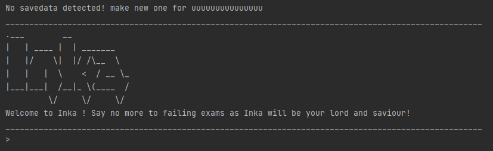

# User Guide

## Introduction

Inka is a CLI-based software that allows users to add Cards containing questions and answers, attach tags into each Card
and put groups of cards into a deck. Inka aims to help students revise for their exam by providing a flashcard-like
experience.

## Quick Start

1. Ensure that you have Java 11 or above installed.
2. Download the latest version of `Inka.jar` from [here](https://github.com/AY2223S2-CS2113-F10-1/tp/releases).
3. Copy the JAR file to the folder you wish to use as the Inka home folder -- your data will be saved here!
4. Open the JAR file, either by clicking or running `java -jar Inka.jar`. A command line interface should appear:



Enjoy your revision!

### Use Case

Cards that you add to Inka can be organized using tags, and decks can be flexibly constructed either by adding *
*individual cards** and/or multiple cards with the **same tag**.

For example, suppose you had the following cards:

|            | **Question**                 | **Answer**                  | **Tags**                 |
|------------|------------------------------|-----------------------------|--------------------------|
| **Card 1** | What does UML stand for?     | Unified Markup Language     | _cs2113-wk8_             |
| **Card 2** | What is my favourite module? | CS2113                      | _cs2113-wk1, freq-wrong_ |
| **Card 3** | Is P = NP?                   | Most definitely not         | _freq-wrong_             |
| **Card 4** | What does OOP stand for?     | Object-Oriented Programming | _cs2113-wk8_             |

You might organize your cards in the following fashion:

- Adding the `cs2113-wk1` and `cs2113-wk8` tags to group together cards of similar topics
- Adding the `freq-wrong` tag to cards that you wish to review more frequently

This allows you to create the following decks easily:

| **Deck Name**    | **Added Card(s)** | **Added Tag(s)**         | **Cards in Deck** |
|------------------|-------------------|--------------------------|-------------------|
| CS2113           | -                 | _cs2113-wk1, cs2113-wk8_ | Cards 1, 2, 4     |
| Frequently-Wrong | -                 | _freq-wrong_             | Cards 2, 3        |
| Acronyms         | Card 3            | _cs2113-wk8_             | Cards 1, 3, 4     |

## Usage of flags

Inka's command makes substantial use of flags to indicate certain parameters that users enter. Listed below are the
format specified :

- Required arguments are indicated by `-f ARG` format
- Optional arguments are indicated by `[-f ARG]`
- Mutually exclusive required arguments are `{-a ARG | -b ARG}`
- Mutually exclusive optional arguments are `[-a ARG | -b ARG]`

There will be many instances where users are allowed to choose how they want to identify a `Card`, `Tag` or a `Deck`.

Here are the list of flags that users can enter :

- `-c CARD_UUID` to identify a `Card` with its UUID
- `-i CARD_INDEX` to identify a `Card` with card index.
- `-t TAG_NAME` to identify a `Tag` with its tag name.
- `-x TAG_INDEX` to identify a `Tag` with its tag index.
- `-d DECK_NAME` to identify a `Deck` with its deck name.

For instance, in `card untag` command, since users are allowed to specify the `Card` with either its uuid or index,
specify the
`Tag` with either its tag name or index, the format of syntax in the documentation below will be written as :

`card untag {-c CARD_UUID | -i CARD_INDEX} {-t TAG_NAME | -x TAG_INDEX}`

## Features

### Get help manual :

Users can run `help` command to see the list of commands available for each feature.

***Sample output :***

```
Welcome to Inka! Type help at any time to show this message
== Deck Management (run `<keyword> help` for more info) ===
card         - Card-related functionality
tag          - Tag-related functionality
deck         - Deck-related functionality
================== Miscellaneous Commands =================
export       - Saves your deck
bye          - Exits Inka
```

Users can then run :

- `card help` for features related to cards
- `tag help` for features related to tags
- `deck help` for features related to decks

***Sample output for `tag help` :***

```
usage: `tag edit`
Edit existing tags
-n,--new <arg>          New tag name
-o,--old <arg>          Old tag name

usage: `tag delete`
Delete tags
-t,--tag <arg>          tag name

usage: `tag list`
List tags
-t,--tag <arg>          tag name (optional)
```

### Adding a card:

`card add -q QUESTION -a ANSWER`

Adds a new Card with its question and answer.

***Lists of flags (in any order)*** :

- `-q` followed by a String representing the question
- `-a` followed by a String representing the answer

Users can refer to this [section](#usage-of-flags) to recap on how the flag works.

While there is no restriction on how long the String that the user can enter,
String with length greater than 50 characters will be truncated in the display of `card list` command. The full version
can be viewed using the `card view` command below.

***Example of usage:***

`card add -q how do i use this command? -a by referring to this user guide`

***Sample Output :***

```
That's a good question for revision later!
You now have 4 questions in the bank.
```

### Listing all cards :

`card list`

List all existing cards in Inka.

***Lists of flags (in any order)*** :

- ***NONE***

***Sample output :***

```
Here is a list of your cards :

	1.	[1ddd9a67-f56c-4914-99c0-2f90c580f0e9]
	Qn:	What is the formula of force?
	Ans:    F = ma

	2.	[619c689d-395a-4bb8-ab00-6ae9972bb929]
	Qn:	How efficient is binary search?
	Ans:    O(log n)

	3.	[29bea83e-d864-48c4-bb9a-7fa817114fe1]
	Qn:	how do i use this command?
	Ans:	by referring to this user guide

	4.	[19d859b1-cede-467e-b384-7d6e690cdae6]
	Qn:	Lorem ipsum dolor sit amet, consectetur adipiscing
	Ans:	ans
	Note:	Actual question or answer is too long, string truncated
```

In `1.    [1ddd9a67-f56c-4914-99c0-2f90c580f0e9]` above, the `1` refers the card index and the
`1ddd9a67-f56c-4914-99c0-2f90c580f0e9` refers the UUID of the card. User can choose whether to refer to the card by UUID
or card index.

### Deleting a card :

`card delete {-c CARD_UUID | -i CARD_INDEX}`

Delete an existing card based on its UUID or its card index. The card will be removed from Inka as well as from
any `Tag` and `Deck`
that it was previously attached to.

***Lists of flags (in any order)*** :

- `-c` the UUID of the card to be deleted
- `-i` the index of the card to be deleted

Users can refer to this [section](#usage-of-flags) to recap on how the flag works.

***Example of usage :***

`card delete -c f8c3de3d-1fea-4d7c-a8b0-29f63c4c3454`

`card delete -i 3`

***Sample output :***

```
Too easy ha? You won't see that question again!
You now have 2 questions in the bank.
```

### Tagging a card :

`card tag {-c CARD_UUID | -i CARD_INDEX} -t TAG_NAME`

Tags a card by its UUID or card index with a specific tag name. If the tag does not exist, Inka will create a new one.
Otherwise, Inka will just tag the card.

***Lists of flags (in any order)*** :

- `-c` the UUID of the card to be tagged
- `-i` the index of the card to be tagged
- `-t` the name of the tag ***(no whitespaces allowed)***

Users can refer to this [section](#usage-of-flags) to recap on how the flag works.

***Example of usage :***

`card tag -c f8c3de3d-1fea-4d7c-a8b0-29f63c4c3454 -t physics`

`card tag -i 1 -t physics`

***Sample output :***

```
Tag does not exist.. creating a new tag: physics
Successfully added tag 83f26992-09d7-496b-b7a8-3ad05e43c8b7 to card f8c3de3d-1fea-4d7c-a8b0-29f63c4c3454
```

### Removing a Tag from a card :

`card untag {-c CARD_UUID | -i CARD_INDEX} {-t TAG_NAME | -x TAG_INDEX}`

Removes the specified Tag based on tag name or tag index from a specified Card based on its uuid or card index. The
tag index can be found in the later section from `tag list`.

***Lists of flags (in any order)*** :

- `-c` the UUID of the card to be untagged
- `-i` the index of the card to be untagged
- `-t` the name of the tag to be removed ***(no whitespaces allowed)***
- `-x` the index of the tag to be removed

Users can refer to this [section](#usage-of-flags) to recap on how the flag works.

***Example of usage :***

`card untag -c f8c3de3d-1fea-4d7c-a8b0-29f63c4c3454 -t physics`

`card untag -i 1 -x 1`

***Sample output :***

```
Successfully removed tag 83f26992-09d7-496b-b7a8-3ad05e43c8b7 from card f8c3de3d-1fea-4d7c-a8b0-29f63c4c3454
```

### Putting a card into a deck :

`card deck {-c CARD_UUID | -i CARD_INDEX} -d DECK_NAME`

Specify the card based on its UUID or card index and put it in the deck specified by deck name. If the deck does not
exist, Inka will create a new one.
Otherwise, Inka will just put the card in the deck

***Lists of flags (in any order)*** :

- `-c` the UUID of the card to be tagged
- `-i` the index of the card to be tagged
- `-d` the name of the deck ***(no whitespaces allowed)***

Users can refer to this [section](#usage-of-flags) to recap on how the flag works.

***Example of usage :***

`card deck -c f8c3de3d-1fea-4d7c-a8b0-29f63c4c3454 -d deckTest`

`card deck -i 1 -d midterms`

***Sample output :***

```
Deck does not exist.. creating a new one
Successfully added card f8c3de3d-1fea-4d7c-a8b0-29f63c4c3454 to deck fd2df33d-4bbe-4be7-83df-5ddaecd3f1ca
```

### Viewing a card :

`card view {-c CARD_UUID | -i CARD_INDEX} `

View the content of a Card based on its UUID or card index. This feature will allow users to have a more comprehensive
view of the card that was
not shown previously in `card list` such as the full version of the questions and answers if they are too long, and the
list of `tags` and `decks` that
the card belongs to.

***Lists of flags (in any order)*** :

- `-c` the UUID of the card to be viewed.
- `-i` the index of the card to be viewed.

Users can refer to this [section](#usage-of-flags) to recap on how the flag works.

***Example of usage :***

`card view -c f8c3de3d-1fea-4d7c-a8b0-29f63c4c3454`

`card view -i 3`

***Sample output :***

```
[19d859b1-cede-467e-b384-7d6e690cdae6]
Qn:  Lorem ipsum dolor sit amet, consectetur adipiscing elit, sed do eiusmod tempor incididunt ut labore et dolore magna aliqua. Ut enim ad minim veniam, quis nostrud exercitation ullamco laboris nisi ut aliquip ex ea commodo consequat. Duis aute irure dolor in reprehenderit in voluptate velit esse cillum dolore eu fugiat nulla pariatur. Excepteur sint occaecat cupidatat non proident, sunt in culpa qui officia deserunt mollit anim id est laborum
Ans:  ans

Here are your tags:
1.Tag name : longText, tag uuid : 8a6f3263-5d54-4267-9e8c-751074688e5a

There is no deck.
```

Similar to before `[19d859b1-cede-467e-b384-7d6e690cdae6]` refers to the UUID of the card that the user is currently
viewing.

---

### Editing a tag :

`tag edit -o {OLD_TAG_NAME} -n {NEW_TAG_NAME}`

Edit the name of an existing tag by specifying the old name and new name. This change of tag name will also take effect
in `tag list` and `card view`

***Lists of flags (in any order)*** :

- `-o` the old name of the tag.
- `-n` the new name of the tag

Users can refer to this [section](#usage-of-flags) to recap on how the flag works.

and they cannot be empty.

Example of usage :
`tag edit -o CS2113 -n CS2113T`

Sample output :

```
Tag 7a130cd5-8154-4aa7-870f-45d7d92970f9tag name has been changed from CS2113 to CS2113T
```

### Deleting a tag : `tag delete -t {tagName}`

Delete an existing tag by name, and remove the tag from all the cards which are previously under it.

The flag `t` must ***not*** contain any whitespaces.
and it cannot be empty.

Example of usage :
`tag delete -t CS2113T`

Sample output :

```
Successfully removed tag 7a130cd5-8154-4aa7-870f-45d7d92970f9 from card 3b86b31c-6289-4716-a5c6-5afd43b9bbd3
Successfully removed tag 7a130cd5-8154-4aa7-870f-45d7d92970f9 from the tag list.
```

### List all tags : `tag list`

List all current tags in the `tagList`

Example of usage :
`tag list`

Sample output :

```
Here is your current list of tags:
1.Tag name : CS2113, tag uuid : 15df3d00-d0ad-48e0-bd28-1f640b74789f
2.Tag name : CS2040C, tag uuid : 5d14dd29-e7e4-4b17-945a-ebf8598d4152
```

### List cards under tag : `tag list -t <tagName>`

List all cards under a specific tag indentified by its name.

Example of usage :
`tag list -t <tagName>`

Sample output :

```
Here is a list of your cards :
1.Qn: fdf
Ans: ffffffffff
UUID:  3b86b31c-6289-4716-a5c6-5afd43b9bbd3
```

---

### Edit a deck: `deck edit`

Rename an existing deck

Example of usage: `deck edit -o old-deck-name -n new-deck-name`

Sample output:

```
Deck 9dc5ab5f-75af-4b0d-b554-341f59ac829bdeck name has been changed from old-deck-name to new-deck-name
```

### [WIP] Delete a card/tag from deck: `deck delete -d {deckName} (-c {cardUUID} | -t {tagUUID})`

Delete a card from an existing deck either by specifying the cardUUID or tagUUID to delete.

To delete a card from an existing deck

Example of usage: `deck delete -c c2c61475-df53-4656-94c4-c2e36933d359 -d my-deck`

Sample output:

```
Successfully removed card c2c61475-df53-4656-94c4-c2e36933d359 from deck my-deck
```

Alternatively, delete a tag from an existing deck

Example of usage: `deck delete -t 833249f3-a090-474c-a3de-c1b5f25609d4 -d my-deck`

Sample output:

```
Successfully removed tag 833249f3-a090-474c-a3de-c1b5f25609d4 from deck my-deck
```

The entire deck can also be deleted (cards and tags that were in the deck are not deleted)

Example of usage: `deck delete -d my-deck`

Sample output:

```
Successfully removed deck 9dc5ab5f-75af-4b0d-b554-341f59ac829b from card c2c61475-df53-4656-94c4-c2e36933d359
Successfully removed deck 9dc5ab5f-75af-4b0d-b554-341f59ac829b from the deck list.
```

### List all decks: `deck list`

List all decks that have been created

Example usage: `deck list`

Sample output:

```
Here is your current list of decks:
1.Deck name : test-deck, deck uuid : 9dc5ab5f-75af-4b0d-b554-341f59ac829b
2.Deck name : another-deck, deck uuid : b7fa870a-e92c-4a74-90de-cfeafd6ec141```
```

---

### Exit the program :

User simply needs to run `bye`

Sample output :

```
 ____  _  _  ____    _   
(  _ \( \/ )(  __)  / \  
 ) _ ( )  /  ) _)   \_/  
(____/(__/  (____)  (_) 

 Bye! All the best for your exams man!!!
```

## FAQ

**Q**: Will deleting a card from a tag delete it from multiple decks?

**A**: Deleting a card from a tag deletes the card from all decks that contain its tag.

**Q**: Can I modify savedata.json to manually add cards?

**A**: No, data as the card ID is generated by the app. Please add cards through the app instead.

**Q**: Can I add multiple cards at the same time?

**A**: No, please add them one at a time using `card add`

**Q**: Can I transfer my cards to another computer?

**A**: You do so by following these steps:

1. Export the deck as a Json file using the command "export"
2. Navigate to the directory of your Inka installation.
3. The file will be named savedata.json. Copy this file.
4. Paste this file in the Inka's directory in the new computer

Your file will be loaded the next time you run Inka!

## Command Summary

{Give a 'cheat sheet' of commands here}

| **Command**                   | **Format**                                                                          |
|-------------------------------|-------------------------------------------------------------------------------------|
| Create a `Card`               | `card add -q {question_here} -a {answer_here}`                                      |
| Create a `Tag`                | `card tag -c {cardUUID} -t {tag_name}`                                              |
| Create a `Deck`               | `card deck -c {cardUUID} -d {deck_name}` OR `card deck -t {tagUUID} -d {deckName}`  |
| Add a `Card` to a `Deck`      | `card deck -c {cardUUID} -d {deckName}` OR `card deck -i {cardIndex} -d {deckName}` |
| Add a `Tag` to a `Deck`       | `tag deck -t {tagUUID} -d {deckName}`                                               |
| Add a `Card` to a `Tag`       | `card tag -c {cardUUID} -t {tagName}`                                               |
| Delete a `Card`               | `card delete -i {cardUUID}`                                                         |
| Delete a `Tag`                | `tag delete -t {tagName}`                                                           |
| Delete a `Deck`               | `deck delete -d {deckName}`                                                         |
| Delete a `Card` from a `Deck` | `deck delete -d {deckName} -c {cardUUID}`                                           |
| Delete a `Tag` from a `Deck`  | `deck delete -d {deckName} -t {tagUUID}`                                            |
| List `Cards`                  | `card list`                                                                         |
| List `Tags`                   | `tag list`                                                                          |
| List `Decks`                  | `deck list`                                                                         |
| List `Cards` under a `Deck`   | `deck list -c {deckName}`                                                           |
| List `Cards` under a `Tag`    | `tag list -t {tagName}`                                                             |
| List `Tags` under a `Deck`    | `deck list -d {deckName}`                                                           |
| Edit a `Tag`                  | `tag edit -n {newTagName} -o {oldTagName}`                                          |
| Edit a `Card`                 | `card edit -n {newTagName} -o {oldTagName}`                                         |
| Edit a `Deck`                 | `deck edit -n {newTagName} -o {oldTagName}`                                         |
| View a `Card`                 | `card view -c {cardUUID}`                                                           |
| Exits the program             | `bye`                                                                               |
| Help about `Deck`             | `deck help`                                                                         |
| Help about `Tag`              | `tag help`                                                                          |
| Help about `Card`             | `card help`                                                                         |
| Help in general               | `help`                                                                              |
