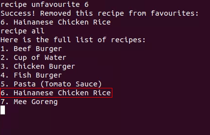

<link type="text/css" rel="stylesheet" href="main.css" />

# User Guide

## Introduction
Hey there! Thanks for choosing Meal Companion, your one-stop solution to handling meal prep, ingredient tracking and cookbook! This guide will show you how to get started, and take control of your own meal planning!

Meal Companion is designed by computing students, for computing students, especially those staying in hostels on campus, as a means to track ingredients and get started on their cooking and meal prep journey! Meal Companion provides recipes, as well as the ability to filter those recipes based on the ingredients you have, and many more features!

# Table of Contents
1. [Using this Guide](#using-this-guide)
1. [Getting Started](#getting-started)
2. [Features](#features)
   1. [Ingredients](#ingredients)
      - [Add Ingredients](#add-ingredients)
      - [Remove Ingredients](#remove-ingredients)
      - [List Ingredients](#list-ingredients)
      - [Search Ingredients](#search-ingredients)
      - [Clear Ingredients](#clear-ingredients)
   2. [Allergens](#allergens)
       - [Add Allergens](#add-allergens)
       - [Remove Allergens](#remove-allergens)
       - [List Allergens](#list-allergens)
   4. [Recipes](#recipes)
       - [Default Recipes](#default-recipes)
       - [All Recipes](#all-recipes)
       - [Recipe Details](#recipe-details)
       - [Possible Recipes](#possible-recipes)
       - [Random Recipe](#random-recipe)
       - [Check Ingredients for Recipe](#check-ingredients-for-recipe)
       - [Almost Completed Recipe](#almost-completed-recipe)
       - [Make Recipe](#make-recipe)
       - [Favourite/Unfavourite Recipe](#favouriteunfavourite-recipe)
   5. [Saving Data](#saving-data)
       - [Transferring Saved Data to other devices](#transferring-saved-data-to-other-devices) 
   6. [Help](#help)
   7. [Command List](#command-list)
3. [Conclusion](#conclusion)

# Using this Guide

The purpose of this guide is to introduce you to the basics of using Meal Companion and its current set of features. Here we will briefly explain the types of icons and text you can expect to see, and how to interpret them. 

`A code block` like this indicates a command you can input, or a file name. For example, `this is a command you can enter` or `this_is_a_file.exe`. 

Within the `code block` you may see segments of text wrapped in `<chevrons>`. These chevrons indicate that this text is meant to be replaced with your input. For example, a command `add <ingredient>` means you should enter the command `add apples`. 

#### [Back to table of contents](#table-of-contents)

# Getting Started

1. Java 11 is required for Meal Companion to function properly, please make sure your device has Java 11 installed. If not, you may download it [here](https://www.oracle.com/sg/java/technologies/downloads/#java11). If you need further asssistance installing Java 11, you may refer to the [Installation Guide](https://docs.oracle.com/en/java/javase/11/install/installation-jdk-microsoft-windows-platforms.html).

2. Once you have ascertained that your device has Java 11 installed, you may download the `.jar file` [here](https://github.com/AY2223S2-CS2113T-T09-3/tp/releases/tag/v2.0). 

    
    Fig 1: Version release page with download links for Meal Companion.

    Click on `mealcompanion.jar` to automatically download the file. Place the file in a folder of your choice.

3. Open the command terminal and navigate to the folder where you downloaded `mealcompanion.jar` using `cd <file_path>` commands as necessary.
4. Ensure the terminal is within the correct folder.
5. Use the command `java -jar mealcompanion.jar` to launch Meal Companion.
6. When you are finished using Meal Companion, use the `bye` command to terminate the application. This will ensure your stored data is saved correctly for future access.

      
    Fig 2: Command to start using Meal Companion.

7. To get started using Meal Companion, take a look at the [`add`](#add-ingredients) command to let the app know what ingredients you have available to you, then use the [`recipe possible`](#possible-recipes) command to figure out what recipes you can make!
8. Alternatively, if you don't have any ingredients on hand but are interested in learning a new recipe, you can use the [`recipe all`](#all-recipes) command to browse through our recipe book and find a recipe you're interested in making, then use the [`recipe details`](#recipe-details) command to view how to make it.

Meal Companion uses a Command Line Interface (CLI), as the current version is just a proof of concept. We have plans to further develop Meal Companion to include a Graphical User Interface (GUI), or even to a mobile application platform. However as we have not yet reached that stage in our development, the CLI will suffice as the input method to operate Meal Companion. We apologize for any inconvenience caused.

#### [Back to table of contents](#table-of-contents)  

# Features   
This section will focus on some of the key features of Meal Companion and explain their usage. We will go over several features, including the Ingredients functions, Allergen functions, and Recipe functions. 

## Ingredients
Meal Companion will assist you in tracking the items in your refrigerator, and is capable of adding new ingredients, removing used ingredients, as well as listing the available ingredients in your refrigerator. This guide will detail these features below.

### Add Ingredients
To add an ingredient of a certain quantity to Meal Companion's storage, use the command `add <ingredient> /qty <quantity>`.
The `/qty` portion of the command is necessary for Meal Companion to distinguish between the sections of the command. 
For example, `add ground chicken /qty 300`.

Note that the ingredient you add must be in the list of known ingredient names. If you're not sure what an ingredient is called, you can utilize the [`ingredients search`](#search-ingredients) command to figure it out.

  
Fig 3: Sample of Add Ingredients command with user input highlighted.

### Remove Ingredients
To remove an ingredient of a certain quantity from Meal Companion's storage, use the command `remove <ingredient> /qty <quantity>`. The `/qty` portion of the command is necessary for Meal Companion to distinguish between the sections of the command.
For example, `remove ground chicken /qty 100`.

  
Fig 4: Sample of Remove Ingredients command with user input highlighted.

### List Ingredients
In order to show a list of all ingredients currently stored in Meal Companion, use the command `ingredients list`.

  
Fig 5: Sample of Ingredients List command with user input highlighted.

### Search Ingredients
If you would like to search for a specific ingredient that Meal Companion recognizes as valid, use the command `ingredients search <keyword>`. For example, `ingredients search ground chicken`.

  
Fig 6: Sample of Ingredients Search command with user input highlighted.

Omitting the keyword will return a list of all valid ingredients.

  
Fig 7: Sample of Ingredients Search command with keyword omitted and user input highlighted.

### Clear Ingredients
To remove all ingredients from Meal Companion's storage, use the `clear` command.

  
Fig 8: Sample of Ingredients Clear command with user input highlighted.

> **Warning**: This move cannot be undone.
 
#### [Back to table of contents](#table-of-contents)

## Allergens
Meal Companion recognizes that you may have certain dietary restrictions. As such, we have provided a feature that allows you to track your allergens and block Meal Companion from showing you recipes that contain said allergens. We will go into more detail on the Allergens function below.

Note that all allergens must be known ingredient names, similar to the `add` command.

Once your allergies are added to Meal Companion, you may refer to the section on [Possible Recipes](#possible-recipes) to see how this will affect the recipes available to you.

Due to certain design constraints, do note that your allergens are not saved within Meal Companion, so you will have to re-enter them each time you launch Meal Companion. We have plans to improve this feature in future iterations. We apologize for any inconvenience caused.

### Add Allergens
You may inform Meal Companion of any allergens you have by using the command `allergen add <ingredient>`. For example, if you have an allergy to eggs, you may use the command `allergen add egg`.

  
Fig 9: Sample of Allergen Add command with user input highlighted.

### Remove Allergens
If you have erroneously entered an allergen, you may simply instruct Meal Companion to remove it from its list using the command `allergen remove <ingredient>`. For example, if you mistakenly entered an allergy to water, you may use the command `allergen remove water`.

  
Fig 10: Sample of Allergen Remove command with user input highlighted.

### List Allergens
If you wish to see the entire list of ingredients you are allergic to, you may simply use the command `allergen list`.

  
Fig 11: Sample of Allergen List command with user input highlighted.

If you wish to take a look at how the allergens you have added will affect the recipes available to you, please see the section on [Possible Recipes](#possible-recipes).

#### [Back to table of contents](#table-of-contents)
 
 

## Recipes
This segment will go into detail about the recipe features that Meal Companion contains, and the usage of these features.
 

### Default Recipes
 Meal Companion comes included with a list of default recipes already initialized. The list of default recipes are found here:
 1. Beef Burger
 2. Cup of Water
 3. Chicken Burger
 4. Fish Burger
 5. Pasta (Tomato Sauce)
 6. Hainanese Chicken Rice
 7. Mee Goreng

### All Recipes
To display all stored recipes including default recipes, you may use the command `recipe all` to list them.

  
Fig 12: Sample of Recipe All command with user input highlighted.

### Recipe Details
To go into details about a certain recipe, use the command `recipe <index_number>`, using the `<index_number>` from the generated list. 

For example, to view the recipe for Hainanese Chicken Rice, use the command `recipe 6`. The recipe displayed will also include the calorie count, to aid in your calorie tracking if necessary.

  
Fig 13: Sample of Recipe Details command showing the output of `recipe 6` , the recipe for Hainanese Chicken Rice, with user input highlighted.

### Possible Recipes
Meal Companion includes the functionality to suggest recipes based on ingredient availability. Simply use the command `recipe possible`, and Meal Companion will list out the recipes that can be made with the ingredients you currently have.

  
Fig 14: Sample of Recipe Possible command showing the list of ingredients and the recipes that can be made with those ingredients, with user input highlighted.

If you have entered an allergen that one of the recipes contains, you will not be shown this recipe. Please refer to the [Allergens](#allergens) section for more information. Below is an example of the allergen function in use.

  
Fig 15: Sample of Recipe Possible command after adding an allergy to ground beef, which is an ingredient in Recipe 1 (Beef Burger), showing that the recipe containing the allergen is no longer shown to the user. User input is highlighted.

### Random Recipe
Should you ever feel bored of cooking the same recipe over and over, Meal Companion provides you with the capability to choose a recipe at random. To make use of this feature, you may simply use the command `recipe random` to generate a random recipe.

  
Fig 16: Sample of Recipe Random command being run twice to generate two different outputs, with user input highlighted.

### Check Ingredients for Recipe
If you wish to check if your current list of ingredients is sufficient to cook any recipe, you may use the command `recipe need <index_number>`. Ingredients that you are missing will be listed along with the quantity required. For example, `recipe need 2`.

  
Fig 17: Sample of Recipe Need command showing missing ingredients required make Recipe 2 (Cup of Water), with user input highlighted.

### Almost Completed Recipe
If you would like to find out which recipes you are almost able to make with the ingredients you have on hand, you may run the command `recipe almost`. This will give you a list of recipes that are lacking at most 3 ingredients.

  
Fig 18: Sample of Recipe Almost command with 3 ingredients missing for Recipe 1 (Beef Burger) and 1 ingredient missing for Recipe 2 (Cup of Water), with user input highlighted.

### Make Recipe
If you decide to cook one of the recipes and you have sufficient ingredients, you do not need to manually remove all the ingredients you used. Meal Companion provides you with the functionality to remove all those ingredients at once if they are used to cook a recipe. Simply use the command `make <index_number>` to do so. For example, `make 1` (Recipe for Beef Burger).

  
Fig 19: Sample of Make command with Recipe 1 (Beef Burger) used, with user input highlighted.

### Favourite/Unfavourite Recipe  
If you would like to mark a recipe as your favourite, you may simply use the command `recipe favourite <index_number>`. For example, `recipe favourite 1` (recipe for beef burger). 

  
Fig 20: Sample of Recipe Favourite Command with Recipe 1 (Beef Burger) used, with user input highlighted.

  
Fig 21: Sample of Recipe list after Recipe 1 (Beef Burger) is added to favourites with the modified list highlighted.

 
 

If you would like to unmark a recipe as your favourite, you may use the command `recipe unfavourite <index_number>`. For example, `recipe unfavourite 1` (recipe for beef burger).  

  
Fig 22: Sample of Recipe Unfavourite command with Recipe 6 (Hainanese Chicken Rice) used, with user input highlighted.

  
Fig 23: Sample of Recipe list after Recipe 6 (Hainanese Chicken Rice) is removed from favourites with the modified list highlighted.

> **Warning**
> Please note that the current iteration of favourites does not preserve your preferences after closing the app. This functionality will be added in future iterations.

#### [Back to table of contents](#table-of-contents)

## Saving Data
Meal Companion automatically saves the ingredients you add to a text file named `ingredients.txt`. This text file can be accessed from the same folder where you downloaded the original `mealcompanion.jar` file. 

  
Fig 24: Location of saved file containing all user-entered ingredients, within the same folder that `mealcompanion.jar` is stored.

> **Warning**:
> Please refrain from editing the `ingredients.txt` file as it could result in undesirable behaviour of the program. 
> We cannot guarantee Meal Companion will perform as expected if the file is corrupted or modified incorrectly.

### Transferring Saved Data to Other Devices
If you would like to access your saved ingredients list on a new instance of Meal Companion on a different device, it is as simple as copying and pasting the `ingredients.txt` text file to the new device. As long as it is saved in the same folder, Meal Companion will be able to detect it and utilize the existing data. 

#### [Back to table of contents](#table-of-contents)

## Help
If you are unsure of which commands to use, the `help` command will display a list of available commands for you to use.

For a comprehensive list of commands available to you, please refer to the [Command List](#command-list) section.

  
Fig 25: Sample of Help command with listed output of in-built commands.

#### [Back to table of contents](#table-of-contents)

## Command List
Please see the below table for the list of available commands.

| Feature | Command | Examples |
| ------- | ------- | -------- |
| Add ingredients to your list | `add <ingredient> /qty <quantity>` | `add apple /qty 3` |
| Remove ingredients from your list | `remove <ingredient> /qty <quantity>` | `remove ground chicken /qty 100` |
| List all stored ingredients | `ingredients list` | `ingredients list` |
| Search for a valid ingredient | `ingredients search <keyword>` | `ingredients search salt` |
| Return all valid ingredients | `ingredients search` | `ingredients search` |
| Clear all stored ingredients | `clear` | `clear` |
| Add allergen | `allergen add <ingredient>` | `allergen add egg` |
| Remove allergen | `allergen remove <ingredient>` | `allergen remove water` |
| List allergen | `allergen list` | `allergen list` |
| List all stored recipes | `recipe all` | `recipe all` |
| List details of a specific recipe | `recipe <index of recipe>` | `recipe 6` (recipe for Hainanese Chicken Rice) |
| List recipes that can be made with current list of stored ingredients | `recipe possible` | `recipe possible` |
| Randomly choose a recipe from the stored list | `recipe random` | `recipe random` |
| Check if current list of ingredients is sufficient to cook a recipe | `recipe need <index_number>` | `recipe need 1` (recipe for Beef Burger) |
| See which recipe is lacking the fewest ingredients to complete | `recipe almost` | `recipe almost` |
| Remove all the ingredients that you used to cook a recipe | `make <index_number>` | `make 1` (recipe for Beef Burger) |
| Mark a recipe as your favourite | `recipe favourite <index_number>` | `recipe favourite 6` (recipe for Hainanese Chicken Rice |
| Unmark a recipe as your favourite | `recipe unfavourite <index_number>` | `recipe unfavourite 6` (recipe for Hainanese Chicken Rice |
| Terminate the program | `bye` | `bye` |
| Hello World | `hello world` | `hello world` |

#### [Back to table of contents](#table-of-contents)

# Conclusion
Congratulations! You have reached the end of this user guide, which means you are ready to make full use of Meal Companion! Of course, you may refer to this guide at any time, and if you have any further questions, feel free to reach out to the Meal Companion team at any of our contact links at the top of the page! Have a good time, and we hope you enjoy using Meal Companion!

#### [Back to top](#user-guide)
