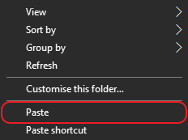
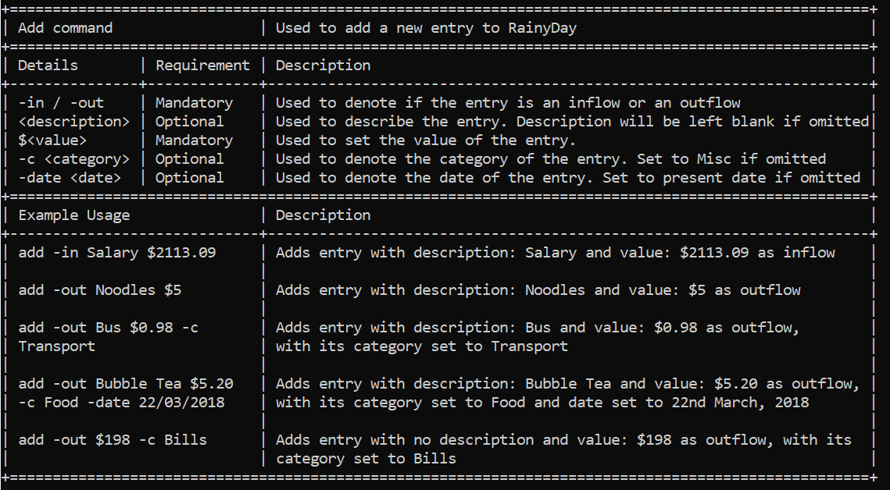
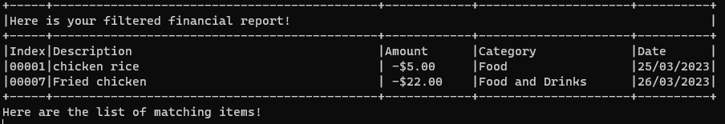

# rainyDay User Guide

## Introduction

rainyDay is a desktop application for managing your finances that runs on a Command Line Interface (CLI). rainyDay
provides a simple solution to track your finances and achieve your financial goals.

This user guide provides an in-depth documentation on how to install and use rainyDay. This guide caters to all users of
rainyDay, from people who are just starting out to advanced users looking for extra features they were unaware of.

## Content Page

<!-- TOC -->

* [rainyDay User Guide](#rainyday-user-guide)
    * [Introduction](#introduction)
    * [Content Page](#content-page)
    * [Acknowledgement](#acknowledgement)
    * [How to use the user guide](#how-to-use-the-user-guide)
    * [Quick Start](#quick-start)
    * [Features Overview](#features-overview)
    * [Features](#features)
        * [Viewing help](#viewing-help)
        * [Adding a transaction](#adding-a-transaction)
            * [Simple Usage](#simple-usage)
            * [Advanced Usage](#advanced-usage)
        * [Viewing the transactions](#viewing-the-transactions)
        * [Deleting a transaction](#deleting-a-transaction)
        * [Filter statements](#filter-statements)
        * [Editing a transaction](#editing-a-transaction)
        * [Setting a Monthly Budget](#setting-a-monthly-budget)
        * [Adding a shortcut](#adding-a-shortcut)
        * [Using a shortcut](#using-a-shortcut)
        * [Viewing a shortcut](#viewing-a-shortcut)
        * [Deleting a shortcut](#deleting-a-shortcut)
        * [Ignoring an entry](#ignoring-an-entry)
        * [Saving the data](#saving-the-data)
            * [Where is my saved file located?](#where-is-my-saved-file-located)
        * [Loading saved data](#loading-saved-data)
        * [Exporting to CSV](#exporting-to-csv)
            * [Where to locate exported CSV file?](#where-to-locate-exported-csv-file)
            * [How to view the CSV file using Microsoft Excel?](#how-to-view-the-csv-file-using-microsoft-excel)
        * [Exiting the application](#exiting-the-application)
    * [FAQ](#faq)
    * [Command Summary](#command-summary)
    * [An Example Usage of rainyDay](#an-example-usage-of-rainyday)
    * [Glossary](#glossary)

<!-- TOC -->

## Acknowledgement

Thank you for choosing rainyDay! We sincerely hope that rainyDay has made it easier for you to track your finances.
Should you have any feedback or enquiries, please do not hesitate to drop us an [email](add-link-to-email?)!

## How to use the user guide

This section assumes that you are a new user of rainyDay and are interested in learning more about the basic features
provided by rainyDay.

Some functions provided by rainyDays offer [simple usage](#glossary) and [advanced usage](#glossary) methods. New users
are recommend to start off with "simple usage", while more advanced users are encouraged to refer to
sections marked with "advanced usage" to enjoy the full capabilities of rainyDay.

Please note the following about the format of commands given under each [feature](#features).

* Words in CAPS are the parameters to be supplied by the user

* Words in `markdown` format are related to commands provided by the user

* Words in *italics* format are related to buttons that can be found on the screen

* Items surrounded by square brackets "[]" are mandatory fields, while the items in curly brackets "{}" are optional

* Words in "double quotation marks" are the names of items

## Quick Start

1. Ensure that you have Java 11 or above installed on your computer
    1. Click [here](https://www.java.com/en/download/help/version_manual.html) for steps on how to check your Java
       version
    2. Click
       [here](https://docs.oracle.com/en/java/javase/11/install/overview-jdk-installation.html#GUID-8677A77F-231A-40F7-98B9-1FD0B48C346A)
       for the guide on installing Java 11
2. Download the latest version of "rainyDay"
   from [here](https://github.com/AY2223S2-CS2113T-T09-1/tp/releases/download/v1.0/rainyDay.jar).
3. Move the "rainyDay.jar" file to the folder of your choice by doing the following steps:
    1. Locate the "rainyDay.jar" file in your "Downloads" folder
    2. Right-click the "rainyDay.jar" file and select cut from the table that appears  
       
    3. Go to the folder of your choice
    4. Right-click in the file window and select paste as seen below  
       
4. In order to run "rainyDay.jar" on the command line, we have to do the following:
    1. Open the folder containing "rainyDay.jar" and click on the address bar  
       
    2. Type the words "cmd" in the folder path in the address bar  
       
    3. Hit the "enter" key. Your Command Prompt should now be open in the folder containing "rainyDay.jar".
5. Type `java -jar rainyDay.jar` and press Enter on your keyboard to start the application

## Features Overview

* [Viewing help](#viewing-help)
* [Adding a transaction](#adding-a-transaction)
* [Viewing the transactions](#viewing-the-transactions)
* [Deleting a transaction](#deleting-a-transaction)
* [Filter statements](#filter-statements)
* [Editing a transaction](#editing-a-transaction)
* [Setting a Monthly Budget](#setting-a-monthly-budget)
* [Adding a shortcut](#adding-a-shortcut)
* [Using a shortcut](#using-a-shortcut)
* [Viewing a shortcut](#viewing-a-shortcut)
* [Deleting a shortcut](#deleting-a-shortcut)
* [Ignoring an entry](#ignoring-an-entry)
* [Saving the data](#saving-the-data)
* [Loading saved data](#loading-saved-data)
* [Exporting to CSV](#exporting-to-csv)
* [Exiting the application](#exiting-the-application)

## Features

### Viewing help

In case you need a reminder of the capabilities of rainyDay, the help command will give you a comprehensive list of all
the possible commands and their respective structures!

Format: `help`

The table below will be shown:  

For more information on each individual command, the help command can also provide a more detailed guide, including
details such as input constraints and examples for you to refer to

Format: `help {COMMAND}`

For instance, the table below are details for the add command:  

### Adding a transaction

An integral feature of any budgeting application is to add transactions. The "add" function of rainyDay allows you
to keep track of your inflows and outflows. The following explains how you can add different types of transactions
to rainyDay.

#### Simple Usage

Format: `add [-DIRECTION] [DESCRIPTION] [$AMOUNT]`

* `DIRECTION` should be either:
    * `in` signifying an inflow type of transaction, or
    * `out` signifying an outflow type of transaction
* `DESCRIPTION` signifies the description of the transaction, consisting of words
* `AMOUNT` signifies the cost of transaction, needs to be a number more than or equal to 0

Example of usage:

You received a gift of $500 from your mother. To add it to rainyDay, the following command can be provided to rainyDay:

* `add -in gift from mom $500` - Signifies an inflow with the description "gift from mom" of value "$500"

You paid for your school fees of $1000.50. To add it to rainyDay, the following command can be provided to rainyDay:

* `add -out school fees $1000.50` - Signifies an outflow with the description "school fees" of value "$1000.50"

#### Advanced Usage

Format: `add [-DIRECTION] [DESCRIPTION] [$AMOUNT] {-c CATEGORY} {-date DD/MM/YYYY}`

* `DIRECTION`, `DESCRIPTION`, `AMOUNT` is as mentioned under [Simple Usage](#simple-usage)
* `CATEGORY` can contain any characters and space
* `DD/MM/YYYY` represents a valid date, where
    * `DD` is a two-digit number representing the day
    * `MM` is a two-digit number representing the month
    * `YYYY` is a four-digit number representing the year

Example of usage:

You received your monthly income of $2000 on 05/03/2023. To add it to rainyDay, the following command can be provided to
rainyDay:

* `add -in income $2000 -c pay -date 05/03/2023` - Signifies an inflow with the description "income" of value "$2000",
  under the category of "pay" with the date "05/03/2023"

You had lunch at a hawker centre for $6.80 on 10/03/2023. To add it to rainyDay, the following command can be provided
to rainyDay:

* `add -out lunch at hawker centre $6.80 -c food and drinks -date 10/03/2023` - Signifies an outflow with the
  description
  "lunch at hawker center" of value "$6.80", under the category of "food and drinks" and with the date "10/03/2023".

> 💡**Tip:** The flags `-c` and `-date` can also be used exclusively. The following are also valid formats:
>
> * `add -DIRECTION DESCRIPTION $AMOUNT -c CATEGORY`
> * `add -DIRECTION DESCRIPTION $AMOUNT -date DD/MM/YYYY`

### Viewing the transactions

An important aspect to track your finances is to view all the transactions that you have already done before. The "view"
command of rainyDay can list all the transaction added, and the resultant amount of all your inflows and outflows.

Format: `view {TIMESPAN} {-sort}`

* `TIMESPAN` is used to denote how much history to show.
    * `1d - 31d` is used to view 1 to 31 days of history
    * `1w - 4w`  is used to view 1 to 4 weeks of history
    * `1m - 12m` is used to view 1 to 12 months of history
    * `1y - 10y` is used to view 1 to 10 years of history
* `-sort` can be included to sort entries in ascending order, with inflows displayed before outflows.

> 💡**Tip:** To view all entries you can use -all in place of a specific time in TIMESPAN

### Deleting a transaction

The transactions added into rainyDay are not fixed. For whatever reason that you require deleting any transaction data,
rainyDay's "delete" function supports removing any previous transaction from your overview.

Format: `delete [INDEX]`

* `INDEX` is the transaction number given by rainyDay to a transaction
    * The transaction number can be obtained from [viewing the transactions](#viewing-the-transactions)

Example of usage:

After requesting to view the transactions from rainyDay, the following is shown to you:  

To delete the transaction with the description "lunch at hawker centre", provide the command:

* `delete 2`

The transaction with the description "lunch at hawker centre" will be deleted, and the transactions shown to you
subsequently after requesting to view the transactions will be as such:  

### Filter statements

To ease your time searching through all the entries in the financial report, the "filter" function of rainyDay
will help you extract certain transactions based on a specific criteria

Format : `filter [FLAG] {FIELD}`

* The `FLAG` must be one of the following:
  * `-in` to filter by inflows
  * `-out` to filter by outflows
  * `-d` to filter by description
  * `-c` to filter by category
  * `-date` to filter by date
* date `FIELD` must be in the form DD/MM/YYYY

Example of usage:

After requesting to view the transactions from rainyDay, the following is shown to you:

Suppose you want to find out transactions related to chicken, you can use this command:

`filter -d chicken`

Suppose you want to check your outflows only, you can use this command:

`filter -out`

> 💡**Tip:** Multiple flags may be used at once but must be in this order:
>
> `-in` or `out` -> `-d` -> `-c` -> `-date`
>
> Suppose you want to find out what food you ate on a particular day, you can use this command:
>
> `filter -c Food and Drinks -date 26/03/2023`
>
> 

### Editing a transaction

Should you need to update details in a previous transaction, rainyDay's "edit" function supports changing the details of
a past transaction

Format : `edit [INDEX] [FLAG] {NEWFIELD}`

* The `FLAG` must be one of the following:
    * `-d` to edit the description
    * `-c` to edit the category
    * `-v` to edit the value
    * `-date` to edit the date
    * `-in` to change direction to inflow
    * `-out` to change direction to outflow

* No `NEWFIELD` required for changing direction

Example of usage:

After requesting to view the transactions from rainyDay, the following is shown to you:

Suppose you realised you made a mistake in the category of entry 1 and want to replace the category of entry 1 with
'Food and Drinks' instead of 'Food', you can use this command:
`edit 1 -c Food and Drinks`

> 💡**Tip:** Multiple flags may be used at once but must be in this order:
>
> `-in` or `out` -> `-d` -> `-v` -> `-c` -> `-date`
>
Suppose you want to edit multiple fields of an entry, and instead of deleting and adding a new entry, you can use
this command:
`edit 2 -out Beef noodles $15 -c Food -date 22/03/2023`

### Setting a Monthly Budget

In the process of keeping track of your expenses, you might feel inclined to stick to a budget. RainyDay can help
to give you reminders, and encourage you to stick to your budget!
With a set monthly budget, RainyDay will remind you how much you have spent for the month with
every new expense in the same month.

Format : `setbudget GOAL`

For example, if you would like to set a monthly budget goal of $1000, use the command below: 
`setbudget 1000`

An additional message will accompany new expenses on how much you have spent for the month!

If at any point of time you would like to remove this feature, simply set the goal to $0 
`setbudget 0`

### Adding a shortcut

If you happen to have certain commands that you find yourself frequently using, rainyDay's shortcuts can make it much
easier to execute those commands!

Format: `shortcut [SHORTCUTNAME] -maps [ACTUALCOMMAND]`

* `SHORTCUTNAME` can be any single word of your choice to save a reference to the actual command
* `ACTUALCOMMAND` is the actual command which you want your shortcut to perform

Example of usage:

You often eat the same noodle dish from your favourite coffee shop. To save yourself the trouble of typing the same
command in full, you could configure the shortcut as follows.

`shortcut FavLunch -maps add -out noodles $4 -c food`

>⚠️ Avoid adding a shortcut with the same name as an actual command. The actual command will take priority over your configured shortcut.
### Using a shortcut

After configuring your shortcuts, you may want to use the shortcut to save yourself the trouble of typing the
full command. This can be done by simply inputting the name of the configured shortcut.

Format: `[SHORTCUTNAME]`

Example of Usage:

You have configured the shortcut according to the example in the [adding a shortcut](#adding-a-shortcut) section. Now
all you have to do is input the name of the shortcut as follows.

`FavLunch`

Using the shortcut will allow you to add the same entry for noodles with a shorter command!

### Viewing a shortcut

After configuring all your shortcuts, the `shortcut_view` command can be used to keep track of all your shortcuts
that you have configured.

Example of Usage:

`shortcut_view`

The output will look something like this:

### Deleting a shortcut

At some point, you may discover that the shortcut you configured is no longer useful, or you may have misconfigured a
previously added shortcut. In these situations, the `shortcut_delete` command provided by rainyDay can prove to be quite
handy.

Format: `shortcut_delete [SHORTCUTCOMMAND]`

* `SHORTCUTCOMMAND` The shortcut command that you want deleted

Example of Usage:

You have configured the shortcut according to the example in the [adding a shortcut section](#adding-a-shortcut).
Unfortunately, your favourite coffee shop has closed down, and you are no longer able to enjoy your favourite noodle
dish. Now the shortcut you previously configured is no longer useful. All you have to do is delete the shortcut as
follows:

`shortcut_delete FavLunch`

### Ignoring an entry

Due to potential certain one-time payments or receivables that you encounter, rainyDay's ignore function can help you
keep a more accurate track of your finances by allowing you to ignore certain transactions from the overall calculation
of your inflow and outflow.
Conversely, the unignore function is to include a transaction that was previously ignored.

Format: `ignore [index]` or `unignore [index]`

* `index` The index of the entry you want to ignore, obtained by using the `view` command

Example of Usage:

You have received a one-time payment from government GST refunds. You would like to keep track of it however do not want
to include it in your budget calculations. After executing the add command, input view to find its index.

You can then execute the following command to ignore the entry:

`ignore 6`

### Saving the data

Your data will automatically be saved whenever any changes are made to your data. This includes your financial data and
your configured shortcuts.

#### Where is my saved file located?

It is located in the "data" folder within the same folder as your "rainyDay.jar" file. This should have
been configured in step 3 of the [Quick Start section](#quick-start). The data file will be named "rainyDay.json".

### Loading saved data

Whenever you start up your rainyDay application, previously saved data will automatically be loaded if such data exists.

### Exporting to CSV

Exports your financial statements into a [comma-separated values file](#glossary).

Format: `export`
> **Background:** A CSV file allows data to be saved in a format which can be viewed as a table.
>
>💡Saving your financial statements in a CSV file will allow you to view your statements in commonly use applications
> like *Microsoft Excel* and *Google Sheets*.

#### Where to locate exported CSV file?

The CSV file will be located in the "data" folder within the same folder as your "rainyDay.jar" file. This should have
been configured in step 3 of the [Quick Start section](#quick-start). The CSV file will be named "report".

#### How to view the CSV file using Microsoft Excel?

1. Open your Microsoft Excel application and open a blank workbook.
2. Click on the *Data* tab found at the top and click on *From
   Text/CSV*.
3. Navigate to the CSV file as directed in
   the [where to locate exported CSV file section](#where-to-locate-exported-csv-file).
4. Double-click on the CSV file and click the *load* button.
5. With steps 1-4, your financial statements should be viewable in a nicely formatted table as shown
   below.
   

### Exiting the application

After you have completed updating your transactions and would like to close the application, input the following
command:

Format: `bye`

## FAQ

**Q**: How do I transfer my data to another computer?

**A**: Copy the txt file named "rainyDay" that is in the same directory as rainyDay.jar to the new device and location
that "rainyDay.jar" is going to be stored in

## Command Summary

| Action          | Format   Example input                                                                                                                                                                                                                                                                                                                                                   |
|-----------------|-----------------------------------------------------------------------------------------------------------------------------------------------------------------------------------------------------------------------------------------------------------------------------------------------------------------------------------------------------------------------------|
| Add             | For beginner users:   `add -DIRECTION DESCRIPTION $VALUE`    **Example:**   `add -in angpao $300`   `add -out ipad $120`    For advanced users:   `add -DIRECTION $VALUE -c CATEGORY -date DD/MM/YYYY`    **Example:**   `add -in income $2000 -c pay -date 05/03/2023`   `add -out hawker food $6 -c food and drinks -date 10/03/2023` |
| Delete          | `delete INDEX`    **Example:**   `delete 1`   `delete 2`                                                                                                                                                                                                                                                                                                        |
| View            | `view TIMESPAN -sort`                                                                                                                                                                                                                                                                                                                                                       |
| Help            | `help` or `help COMMAND`                                                                                                                                                                                                                                                                                                                                                    |
| Filter          | `filter FLAG FIELD`    **Example:**   `filter -d school`  `filter -date 22/03/2023`                                                                                                                                                                                                                                                                             |
| Edit            | `edit INDEX FLAG NEWFIELD` or `edit INDEX FLAG`    **Example:**   `edit 1 -in Beef noodles $15 -c Food`   `edit -d school`   `edit -in`                                                                                                                                                                                                                      |
| Set Budget      | `setbudget VALUE`                                                                                                                                                                                                                                                                                                                                                           |   
| Add Shortcut    | `shortcut SHORTCUTCOMMAND -maps ACTUALCOMMAND`   **Example:**   `shortcut myshortcut -maps add -out noodles $4`                                                                                                                                                                                                                                                    |   
| Use Shortcut    | `SHORTCUTCOMMAND`                                                                                                                                                                                                                                                                                                                                                           |
| View Shortcuts  | `shortcut_view`                                                                                                                                                                                                                                                                                                                                                             |
| Delete Shortcut | `shortcut_delete SHORTCUTCOMMAND`   **Example:**   `shortcut_delete myshortcut`                                                                                                                                                                                                                                                                                    |
| Export to CSV   | `export`                                                                                                                                                                                                                                                                                                                                                                    |              
| Exit            | `bye`                                                                                                                                                                                                                                                                                                                                                                       |

## An Example Usage of rainyDay

{a walkthrough of possible usage of the product (so that users know how the product works without using the product), to
update when product is finalised}

## Glossary

Advanced usage

- A thorough usage method for a given function provided by rainyDay, suitable for more advanced users who are already
  familiar with the basic functions of rainyDay. Highly recommended to get the full potential that rainyDay has to
  offer. Such as allowing for greater control and flexibility in using rainyDay to fit specific needs and preferences.

Command Line Interface

- An interface that uses text as the mode of interaction between the user and the program.

CSV

- Stands for Comma Separated Value, a type of file format that can be imported to other statistical software such as
  Microsoft Excel, R Commander or Google Sheets.

Filter

- A function to narrow down the range of items to be shown.

Financial Statement

- Represents a transaction.

Financial Report

- Represents a compilation of financial statements.

Flags

- Has a "-" appended to the front of a symbol, example: "-d", "-date", "-c", etc.

Inflow

- Signify an increment of money on your side, such as deposits into your wallet.

Outflow

- Signify a decrement of money on your side, such as payments from your wallet.

Simple usage

- A less overwhelming usage method for a given function provided by rainyDay for a more user-friendly experience. Highly
  recommended for new users who are just starting to learn how to use the basic functions.

Transaction

- An activity relating to transferring of money.