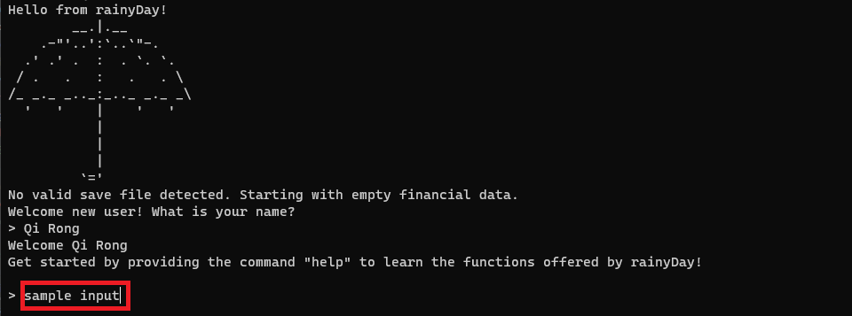
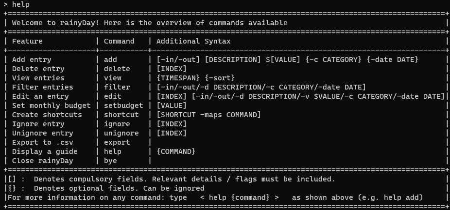
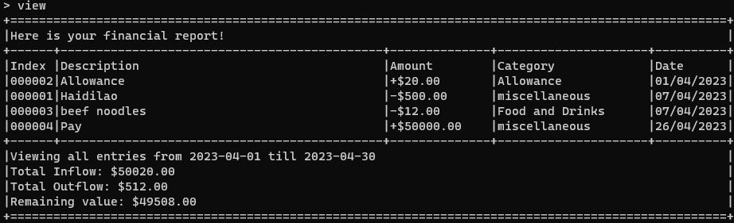
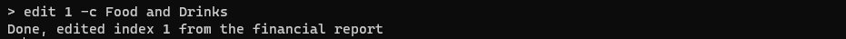
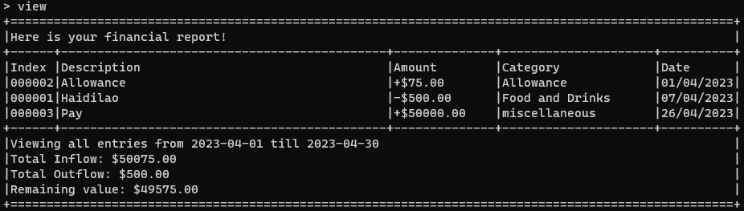
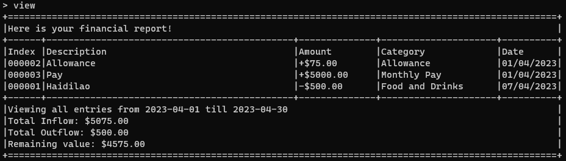
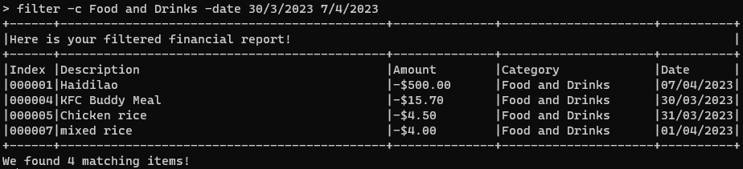

# rainyDay User Guide

Welcome to rainyDay's user guide! Thank you so much for choosing rainyDay. We sincerely hope that rainyDay can
successfully take you one step closer to reaching your financial goals!
Should you have any feedback or enquiries, please do not hesitate to drop us at
[rainydayfinancialtracker@gmail.com](mailto:rainydayfinancialtracker@gmail.com).

## Introduction

### Motivation of creating rainyDay

In addition to rising costs of living, young adults like yourself just entering the workforce will be exposed to new
sources of expenses and income. Thus, rainyDay was created to aid you in keeping track and managing your finances well.
rainyDay accomplishes this by providing an easy-to-use and convenient platform to track
your [inflows and outflows](#glossary),
to help you achieve your financial goals.

Despite the availability of other financial trackers, only a handful of them have integrated a
[Command Line Interface (CLI)](#glossary) into their systems. However, the utilisation of a CLI can significantly
improve the speed and accuracy of user-provided information. Do not fret if you have not used a CLI before as we
will guide you through the [process](#understanding-cli).

With this user guide, you will be guided through every step of the way from installation to the usage of advanced
features
so that you can be an expert at rainyDay.

### What rainyDay can do for you

rainyDay supports a variety of features for you to view your [transactions](#glossary). A basic overview is provided as
follows:

**Transaction related** - adding, deleting and editing transaction entries  
**Viewing related** - View, filter or sort transactions based on criteria   
**Budget related** - Setting a budget to adhere to

For more in-depth information, please refer to the [Features Overview](#features-overview) section.

## Content Page

<!-- TOC -->

* [How to use the user guide](#how-to-use-the-user-guide)
* [Quick Start](#quick-start)
* [Understanding CLI](#understanding-cli)
* [Features Overview](#features-overview)
* [FAQ](#faq)
* [Command Summary](#command-summary)
* [Glossary](#glossary)

<!-- TOC -->

## How to use the user guide

The first step to using rainyDay effectively is to learn how to use the user guide. This section assumes that you are a
new user of rainyDay and are interested in learning more about the basic features provided by rainyDay.

Please note the following about the format of commands given under each [feature](#features).

* CAPS are the parameters to be supplied by the user e.g. DESCRIPTION

* `inline code` format are related to commands provided by the user e.g. `help`

* *italics* format are related to buttons that can be found on the screen e.g. *From Text/CSV*

* Items surrounded by [square brackets] are mandatory fields, while the items in {curly brackets} are optional e.g.
  [DESCRIPTION] {TIME}

* Words in "double quotation marks" are the names of items e.g. "beef noodles"

* 💡 indicates helpful suggestions that will enhance your experience

* ⚠️ highlights actions you should avoid
* Some technical terminologies are defined in the [glossary](#glossary), clicking on the links will navigate you to the
  glossary where you can read their definitions

## Quick Start

Now that you have learnt how to use this user guide, you are ready to begin! Next, we will show you how to
install rainyDay on your device and start using it. Please refer to the steps below:

1. Ensure that you have Java 11 installed on your computer
    1. Click [here](https://www.java.com/en/download/help/version_manual.html) for steps on how to check your Java
       version
    2. Click
       [here](https://docs.oracle.com/en/java/javase/11/install/overview-jdk-installation.html#GUID-8677A77F-231A-40F7-98B9-1FD0B48C346A)
       for the guide on installing Java 11
2. Download the latest version of "rainyDay"
   from [here](https://github.com/AY2223S2-CS2113T-T09-1/tp/releases/download/v2.1/rainyDay.jar)
3. Move the "rainyDay.jar" file to the folder of your choice by doing the following steps:
    1. Locate the "rainyDay.jar" file in your "Downloads" folder
    2. Right-click the "rainyDay.jar" file and select cut from the option that appears  
       
    3. Go to the folder of your choice
    4. Right-click in the file window and select paste as seen below  
       
4. To run "rainyDay.jar" on the command line, do the following:
    1. Open the folder containing "rainyDay.jar" and click on the address bar  
       
    2. You will need to open rainyDay in your CLI. This can be done by typing the word ["cmd"](#glossary) in the folder
       path in the address bar as shown  
       
    3. Press Enter. Your Command Line should now be open in the folder containing "rainyDay.jar" as shown below. The
       location you saved rainyDay should be shown, in this example we saved it in the path
       "\Users\Qi Rong\Downloads\rainyDay Folder"
       
5. Type `java -jar rainyDay.jar` in the terminal and press Enter on your keyboard to start the application. You should
   see the following if the start up is successful.
   
6. Type your name and press Enter. The following will be shown:
   

## Understanding CLI

- For those who are familiar with what a CLI is, go ahead and proceed to view the [features](#features-overview) we
  offer!
- A [CLI](#glossary) receive commands from a user, that is you, in the form of lines of text.
- In rainyDay, we make it simple for you. Whenever we require you to input, we will prompt you with a `>` as shown below
  with a sample input boxed in red.
  
- If you are interested in learning more about CLI, you may refer to the following
  [guide](https://www.freecodecamp.org/news/how-to-use-the-cli-beginner-guide/).

## Features Overview

* [Viewing help](#viewing-help)
* [Transactions](#transactions)
    * [Adding a transaction](#adding-a-transaction)
    * [Viewing the transactions](#viewing-the-transactions)
    * [Deleting a transaction](#deleting-a-transaction)
    * [Editing a transaction](#editing-a-transaction)
    * [Filter transactions](#filter-transactions)
    * [Ignoring a transaction](#ignoring-a-transaction)
* [Setting a Monthly Budget](#setting-a-monthly-budget)
* [Shortcuts](#shortcuts)
    * [Adding a shortcut](#adding-a-shortcut)
    * [Using a shortcut](#using-a-shortcut)
    * [Viewing a shortcut](#viewing-a-shortcut)
    * [Deleting a shortcut](#deleting-a-shortcut)
* [Data Management](#data-management)
    * [Saving the data](#saving-the-data)
    * [Where is my saved file located?](#where-is-my-saved-file-located)
        * [Loading saved data](#loading-saved-data)
    * [Exporting to CSV](#exporting-to-csv)
        * [Where to locate exported CSV file?](#where-to-locate-exported-csv-file)
        * [How to view the CSV file using Microsoft Excel?](#how-to-view-the-csv-file-using-microsoft-excel)
* [Exiting the application](#exiting-the-application)

## Features

### Viewing help

Welcome to the help section of rainyDay! Now that you have started rainyDay by following [Quick Start](#quick-start),
you will need to know the format of inputs to send to rainyDay. Whenever you find yourself stuck trying to perform a
certain task, don't worry! The help command is here to help you every step of the way!

To get an overview of possible commands and their respective formats, you can use the `help` command as seen
below:

Format: **`help`**

The table below will be shown with the `help` command:  

After reading the overview, suppose you require more details on any of the other commands, you can use the following:

Format: `help {COMMAND}`

This command will give you more information on the particular command, such as input constraints and examples.

For instance, suppose you want to find out more information on rainyDay's `add` command, you can type the following
command:  

### Transactions

Next is the transaction management section of our guide! In this section, we'll cover all the key details to manage your
transactions effectively. Whether you need to add, view, delete, or edit transactions, rainyDay has got you covered.
We'll also show you how to filter and ignore any transactions that are irrelevant to your
needs. So, if you're ready to take control of your finances and maintain accurate data, let's begin!

* [Adding a transaction](#adding-a-transaction)
* [Viewing the transactions](#viewing-the-transactions)
* [Deleting a transaction](#deleting-a-transaction)
* [Editing a transaction](#editing-a-transaction)
* [Filter transactions](#filter-transactions)
* [Ignoring a transaction](#ignoring-a-transaction)

### Adding a transaction

An integral feature of any financial tracker is to add transactions. The "add" feature of rainyDay allows you
to keep track of your inflows and outflows. The following explains how you can add different types of transactions
to rainyDay.

Format: `add [DIRECTION] [DESCRIPTION] [AMOUNT] {CATEGORY} {DATE}`

* `DIRECTION` should be either:
    * `-in` signifying an [inflow](#glossary) type of transaction, or
    * `-out` signifying an [outflow](#glossary) type of transaction
* `DESCRIPTION` signifies the description of the transaction, consisting of any characters and space
* `AMOUNT` signifies the value of the transaction, where the number needs to be more than 0, with `$` appended
  before the number
* `CATEGORY` is a field representing the category to be tagged with the transaction, where category can contain any
  characters and space, with `-c` appended before the category
* `DATE` is a field representing the date to be tagged with the transaction, where date needs to be in the format
  of `DAY/MONTH/YEAR`, with  `-date` appended before the date
    * `DAY` and `MONTH` can either be single or double-digit number
    * `YEAR` needs to be a four-digit number
    * When this field is omitted, the default date will be set to the day when the transaction is added to rainyDay

> ⚠️ Amount provided must be a positive value and cannot be more than $21,474,836.47!
>
> ⚠️ `DESCRIPTION` and `CATEGORY` cannot contain dash `-`.

> 💡 The flags `-c` and `-date` can be used exclusively. The following are also valid formats:
>
> * `add -DIRECTION DESCRIPTION $AMOUNT -c CATEGORY`
> * `add -DIRECTION DESCRIPTION $AMOUNT -date DD/MM/YYYY`

Example of usage:

You had dinner at Haidilao for $500. To add it to rainyDay, you can use the following command:

You received an allowance of $20 on 01/03/2023. To add it to rainyDay, you can use the following command:

You had beef noodles for $12. To add it to rainyDay, you can use the following command:

You received your pay of $50000 on 26/03/2023. To add it to rainyDay, you can use the following command:

[Jump back to features overview](#features-overview)

### Viewing the transactions

After adding your transaction data into rainyDay, you can view them by using the "view" feature of rainyDay.
This lists all the transaction added, and the summary of all your inflows and outflows.

Format: `view {TIMESPAN} {-sort}`

* `TIMESPAN` is used to specifically denote how much history to show from the current day.
    * `1d - 31d` is used to view 1 to 31 days of history
    * `1w - 4w`  is used to view 1 to 4 weeks of history
    * `1m - 12m` is used to view 1 to 12 months of history
    * `1y - 10y` is used to view 1 to 10 years of history
* `-sort` can be included to sort entries in ascending order of their absolute value,
  with inflows displayed before outflows.

> 💡 To view all entries you can use -all in place of a specific time in TIMESPAN

Example of usage:

You would like to view all of your transactions for the current month, to check if you are staying within your budget.
To do that, you can use the following command:

You want to know what you spent the most on in the past 3 months. To do that you can use the following command:

[Jump back to features overview](#features-overview)

### Deleting a transaction

The transactions added into rainyDay are not fixed. For whatever reason that you require deleting any transactions,
rainyDay's "delete" feature supports removing any previous transaction from your overview.

Format: `delete [INDEX]`

* `INDEX` is the transaction number given by rainyDay to identify a transaction
    * The transaction number can be obtained from [viewing the transactions](#viewing-the-transactions)

Example of usage:
Your current financial report is at the same state as in the previous example given in
[viewing the transactions](#viewing-the-transactions).
To delete the transaction with the description "beef noodles", you can use the command:

`delete 3`

The transaction with the description "beef noodles" will be deleted, and the transactions shown to you
subsequently after requesting to view the transactions will be as such:  

[Jump back to features overview](#features-overview)

### Editing a transaction

Should you need to update details in a previous transaction, rainyDay's "edit" feature supports this.

Format : `edit [INDEX] [FLAG] {NEWFIELD}`

* The `FLAG` must be one of the following:
    * `-d` to edit the description
    * `-c` to edit the category
    * `-v` to edit the value
    * `-date` to edit the date in `DD/MM/YYYY` format
    * `-in` to change direction to [inflows](#glossary)
    * `-out` to change direction to [outflows](#glossary)
* No `NEWFIELD` is required for changing direction

Example of usage:

Suppose you realised you forgot to add the "Category" for entry 1, and you would like to place it under
"Food and Drinks". You can use the following command:

and use the "view" command to verify the edits are accurate.

Perhaps you realised you made a mistake in the "Amount" for entry 2 and your allowance is $75 instead.
You can use the following command:

What happens if you realised you made multiple mistakes in entry 3. Don't worry! You can edit multiple fields at the
same time using multiple flags. However, do take note of the flag order as listed below.
> ⚠️ Multiple flags may be used at once but must be in this order:
>
> `-in` or `out` -> `-d` -> `-v` -> `-c` -> `-date`

So instead of deleting and adding an entirely new entry, you can use the following command to update the required
fields:

[Jump back to features overview](#features-overview)

### Filter transactions

To save time searching through all the entries in the financial report, the "filter" feature of rainyDay
helps you extract certain transactions based on specific criteria.

Format : `filter [FLAG] {FIELD}`

* The `FLAG` must be at least one of the following:
    * `-in` to filter by [inflows](#glossary)
    * `-out` to filter by [outflows](#glossary)
    * `-d` to filter by description
    * `-c` to filter by category
    * `-date` to filter by a specific date or timespan
* No `FIELD` is required when `-in` or `-out` flag is used
* date `FIELD` must be in the form DD/MM/YYYY
* For the `-date` flag, if one date `FIELD` is specified then it is for a specific date. If two date `FIELD` is present
  then it filters by a range. An example is provided below.

Example of usage:

Let's say you added a couple more entries. And using `view -all` provides you with this

> 💡 Note the use of `view -all` instead of `view` as `view` only provides entries in the current month.

Suppose you want to find out transactions labelled "Food and Drinks", you can use the following command:

What happens if you want to filter the transactions based on multiple criteria? We got you covered!
But do take note of the order as listed below:

> ⚠️ Multiple flags may be used at once but must be in this order:
>
> `-in` or `out` -> `-d` -> `-c` -> `-date`

Suppose you want to find out what "Food and Drinks" you had from 30th March 2023 to 7th April 2023, you
can use the following command:

> 💡 Note that the first date(e.g. 30/3/2023) provided must be before the second date(e.g. 7/4/2023) when you are
> indicating a date range.

[Jump back to features overview](#features-overview)

### Ignoring a transaction

Due to potential one-time payments or receivables that you encounter, rainyDay's "ignore" feature can help you
keep a more accurate track of your finances by allowing you to ignore certain transactions from the overall calculation
of your inflow and outflow.
Conversely, the "unignore" feature is to include a transaction that was previously ignored.

Format: `ignore [INDEX]` or `unignore [INDEX]`

* `index` The index of the entry you want to ignore, obtained by using the `view` command

Example of Usage:

You have received a one-time payment from government GST refunds. You would like to keep track of it, however you do
not want to include it in your budget calculations.

To ignore the entry, you can use the following command:

[Jump back to features overview](#features-overview)

### Setting a Monthly Budget

After knowing how to manage your transactions, the next step to reach your financial goals is to set a monthly budget!
rainyDay can help you by giving you reminders and encouraging you to stick to your budget! With a set monthly budget,
rainyDay will remind you how much you have spent for the month with every new expense.

Format : `setbudget [VALUE]`

For example, if you would like to set a monthly budget goal of $1000, you can use the following command:

An additional message will accompany new expenses on how much you have spent for the month!

If at any point of time you would like to remove this feature, simply set the goal to $0 by using the following command:

[Jump back to features overview](#features-overview)

### Shortcuts

After using rainyDay for a period of time, you realise that there are some commands that you seem to repeat more
often. rainyDay's "shortcut" feature can be utilised to save time! In this section, we'll show you how to create and
use shortcuts effectively. Whether you need to add a new shortcut, view an existing one, or delete an old one, we'll
cover them all. So, if you're ready to start working smarter, not harder, let's dive into the world of shortcuts!

* [Adding a shortcut](#adding-a-shortcut)
* [Using a shortcut](#using-a-shortcut)
* [Viewing a shortcut](#viewing-a-shortcut)
* [Deleting a shortcut](#deleting-a-shortcut)

#### Adding a shortcut

If you would like to add some shortcuts, this is how you can create one!

Format: `shortcut [SHORTCUTNAME] -maps [ACTUALCOMMAND]`

* `SHORTCUTNAME` can be any single word of your choice to reference an actual command
* `ACTUALCOMMAND` is the actual command which you want your shortcut to perform

Example of usage:

You often eat the same noodle dish from your favourite coffee shop. To save yourself the trouble of typing the same
command in full, you can create a shortcut by using the following command:

> ⚠️ Your created shortcut should map to a valid full command for it to work correctly.

#### Using a shortcut

After creating your shortcuts, you may want to use the shortcut to save yourself the trouble of typing the
full command. This can be done by simply inputting the name of your created shortcut.

Format: `[SHORTCUTNAME]`

Example of Usage:

You have created the shortcut according to the example in the [adding a shortcut](#adding-a-shortcut) section. Now
all you have to do is input the name of your created shortcut.

#### Viewing a shortcut

After creating your shortcuts, the `shortcut_view` command can be used to keep track of all your shortcuts.

Example of Usage:

Here's how you can view your shortcuts:

#### Deleting a shortcut

At some point, you may discover that the shortcut you created is no longer useful, or you may have incorrectly created a
previously added shortcut. In these situations, the `shortcut_delete` command provided by rainyDay can prove to be quite
handy.

Format: `shortcut_delete [SHORTCUTNAME]`

* `SHORTCUTCOMMAND` The shortcut command that you want deleted

Example of Usage:

You have created the shortcut according to the example in the [adding a shortcut section](#adding-a-shortcut).
Unfortunately, your favourite coffee shop has closed down, and you are no longer able to enjoy your favourite noodle
dish. Now the shortcut you previously created is no longer useful. All you have to do is delete the shortcut with the
command below:

[Jump back to features overview](#features-overview)

### Data Management

Saving and loading your data is something you don't have to worry about as we got it covered! In this section,
we'll show you where to locate your saved files and how to export your data to a [CSV](#glossary) file, which is a
widely-used file format that can be opened in a variety of software applications. We'll also show you how to export and
view
the CSV file using [Microsoft Excel](https://www.microsoft.com/en-us/microsoft-365/excel),
which is a popular spreadsheet program used by many people around the world. Let's get started!

* [Saving the data](#saving-the-data)
* [Where is my saved file located?](#where-is-my-saved-file-located)
    * [Loading saved data](#loading-saved-data)
* [Exporting to CSV](#exporting-to-csv)
    * [Where to locate exported CSV file?](#where-to-locate-exported-csv-file)
    * [How to view the CSV file using Microsoft Excel?](#how-to-view-the-csv-file-using-microsoft-excel)

### Saving the data

Your data will automatically be saved whenever any changes are made. This includes your financial data and
your created shortcuts.

#### Where is my saved file located?

It is located in the "data" folder within the same folder as your "rainyDay.jar" file. This should have
been configured in step 3 of the [Quick Start section](#quick-start).

The data file is named "rainyDay.json".

> ⚠️ Do not make any direct changes to the "rainyDay.json" file unless you are familiar with [json](#glossary). Making
> invalid changes may result in the saved file being lost permanently!

### Loading saved data

Whenever you start up your rainyDay application, previously saved data will automatically be loaded if such data exists.

[Jump back to features overview](#features-overview)

### Exporting to CSV

Exports your financial statements into a [comma-separated values file (CSV)](#glossary).

Format: `export`
> **Background:** A CSV file allows data to be saved in a format which can be viewed as a table.
>
>💡 Saving your financial statements in a CSV file will allow you to view your statements in commonly used applications
> like *Microsoft Excel* and *Google Sheets*.

#### Where to locate exported CSV file?

The CSV file will be located in the "data" folder within the same folder as your "rainyDay.jar" file. This should have
been configured in step 3 of the [Quick Start section](#quick-start). The CSV file will be named "report".

#### How to view the CSV file using Microsoft Excel?

1. Open your Microsoft Excel application and open a blank workbook.
2. Click on the *Data* tab found at the top and click on *From
   Text/CSV*.
3. Navigate to the CSV file as directed in
   the [where to locate exported CSV file section](#where-to-locate-exported-csv-file).
4. Double-click on the CSV file and click the *load* button.
   
5. With steps 1-4, your financial statements should be viewable in a nicely formatted table as shown
   below.

[Jump back to features overview](#features-overview)

### Exiting the application

After you have completed updating your transactions and would like to close the application, input the following
command:

Format: `bye`

[Jump back to features overview](#features-overview)

## FAQ

**Q**: How do I transfer my data to another computer?

**A**: Copy the txt file named "rainyDay" that is in the same directory as rainyDay.jar to the new device and location
that "rainyDay.jar" is going to be stored in

**Q**: I tried to input a value, but it is not showing up as what I typed!

**A**: The value of transactions has a maximum of $21,474,836.47 and will also be rounded down to 2 decimal places!

**Q**: I remember having saved data, but why is it that when I start rainyDay, it says that the report is empty?

**A**: When rainyDay detect a [corrupted saved data](#glossary), the data will automatically be deleted. To prevent
this, it is recommended keep an extra copy of the data somewhere else before you edit the original saved data.

**Q**: I used rainyDay and a folder named "logs" appeared. What is the "logs" file and what is the content inside it?

**A**: The "logs" folder contains files that record the process and status of rainyDay. The files are non-malicious and
their content does not affect rainyDay's function. The "logs" folder and its content can be ignored or deleted.

## Command Summary

| Action                                          | Format   Example input                                                                                                                                                                                                                                    |
|-------------------------------------------------|--------------------------------------------------------------------------------------------------------------------------------------------------------------------------------------------------------------------------------------------------------------|
| [Help](#viewing-help)                           | `help {COMMAND}`                                                                                                                                                                                                                                             |
| [Add a transaction](#adding-a-transaction)      | `add [DIRECTION] [DESCRIPTION] [AMOUNT] {CATEGORY} {DATE}`    **Example:**   `add -in angpao $300`   `add -out ipad $120`   `add -in income $2000 -c pay -date 05/03/2023`   `add -out hawker food $6 -c food and drinks -date 10/03/2023` |
| [View transactions](#viewing-the-transactions)  | `view {TIMESPAN} {-sort}`                                                                                                                                                                                                                                    |
| [Delete a transaction](#deleting-a-transaction) | `delete [INDEX]`    **Example:**   `delete 1`   `delete 2`                                                                                                                                                                                       |
| [Edit a transaction](#editing-a-transaction)    | `edit [INDEX] [FLAG] {NEWFIELD}`    **Example:**   `edit 1 -c Food and Drinks`   `edit 3 -v $5000 -c Monthly Pay -date 01/04/2023`                                                                                                               |
| [Filter transactions](#filter-transactions)     | `filter [FLAG] {FIELD}`    **Example:**   `filter -d school`  `filter -date 22/03/2023`   `filter -date 01/01/2023 18/03/2023`                                                                                                                |
| [Ignore transaction](#ignoring-a-transaction)   | `ignore [INDEX]`    **Example:**   `ignore 1`   `ignore 2`                                                                                                                                                                                       |
| [Unignore transaction](#ignoring-a-transaction) | `unignore [INDEX]`    **Example:**   `unignore 1`   `unignore 2`                                                                                                                                                                                 |
| [Set Budget](#setting-a-monthly-budget)         | `setbudget [VALUE]`                                                                                                                                                                                                                                          |   
| [Add Shortcut](#adding-a-shortcut)              | `shortcut [SHORTCUTNAME] -maps [ACTUALCOMMAND]`   **Example:**   `shortcut FavLunch -maps add -out noodles $4`                                                                                                                                      |   
| [Use Shortcut](#using-a-shortcut)               | `[SHORTCUTNAME]`                                                                                                                                                                                                                                             |
| [View Shortcuts](#viewing-a-shortcut)           | `shortcut_view`                                                                                                                                                                                                                                              |
| [Delete Shortcut](#deleting-a-shortcut)         | `shortcut_delete [SHORTCUTNAME]`   **Example:**   `shortcut_delete FavLunch`                                                                                                                                                                        |
| [Export to CSV](#exporting-to-csv)              | `export`                                                                                                                                                                                                                                                     |              
| [Exit](#exiting-the-application)                | `bye`                                                                                                                                                                                                                                                        |

[Jump back to Table of Contents](#content-page)

## Glossary

| Term                   | Explanation                                                                                                                                                      |
|------------------------|------------------------------------------------------------------------------------------------------------------------------------------------------------------|
| Cmd                    | Acronym for Command, which is the command-line interpreter of Windows Operating Systems                                                                          |
| Command Line Interface | An interface that uses text as the mode of interaction between the user and the program                                                                          |
| Corrupted saved data   | When data saved is not understandable by rainyDay. May occur due to editing of saved file to a condition that violates the saving format                         |
| CSV                    | Stands for Comma Separated Value, a type of file format that can be imported to other statistical software such as Microsoft Excel, R Commander or Google Sheets |
| Filter                 | A function to narrow down the range of items to be shown                                                                                                         |
| Financial Statement    | Represents a transaction                                                                                                                                         |
| Financial Report       | Represents a compilation of financial statements                                                                                                                 |
| Flags                  | Has a "-" appended to the front of a symbol, example: "-d", "-date", "-c", etc                                                                                   |
| Inflow                 | Signify an increment of money on your side, such as deposits into your wallet                                                                                    |
| Json                   | Stands for JavaScript Object Notation. It is a file format that uses human-readable text to store data                                                           |
| Outflow                | Signify a decrement of money on your side, such as payments from your wallet                                                                                     |
| Transaction            | An activity relating to transferring of money                                                                                                                    |

[Jump back to Table of Contents](#content-page)