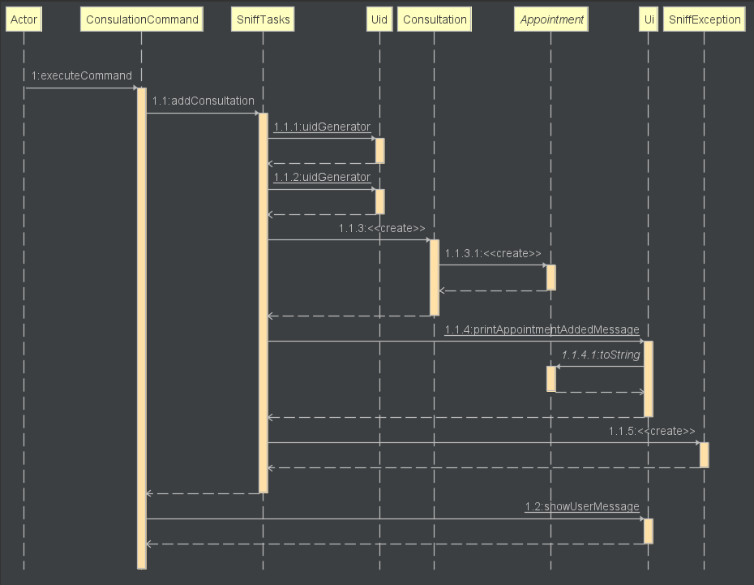
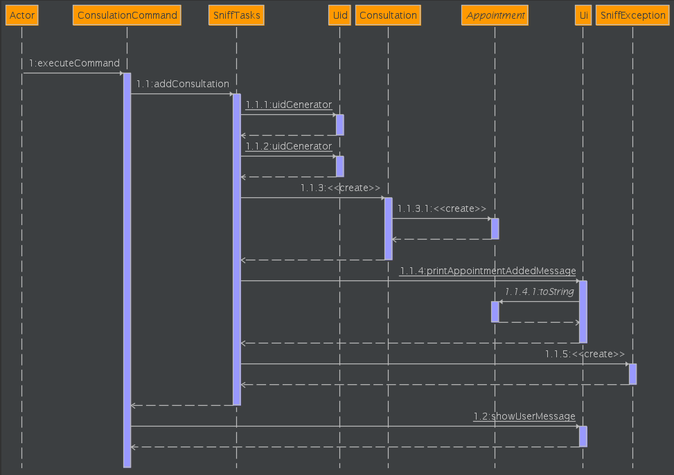

# GitHub User Guide for BadMaths ➕➖✖️➗

## Table of Contents:
<!-- TOC -->
* [GitHub User Guide for BadMaths ➕➖✖️➗](#github-user-guide-for-badmaths-)
  * [Table of Contents:](#table-of-contents-)
  * [Introduction 🧮](#introduction-)
  * [Quick Start](#quick-start)
  * [Features](#features)
    * [1) Graph Analyser and Visualiser: `Graph`](#1--graph-analyser-and-visualiser--graph)
    * [2) Matrix Calculation: `Matrix`](#2--matrix-calculation--matrix)
    * [3) Store Notes: `Store`](#3--store-notes--store)
    * [4) Display All Notes: `List`](#4--display-all-notes--list)
    * [5) Display A Specific Note: `List <index>`](#5--display-a-specific-note--list-index)
    * [6) Delete Notes: `Delete <index>`](#6--delete-notes--delete-index)
    * [7) Clear All Notes Stored In Notes List `Clear`](#7--clear-all-notes-stored-in-notes-list-clear)
    * [8) Mark Notes: `Mark`](#8--mark-notes--mark)
    * [9) Unmark Notes: `Unmark`](#9--unmark-notes--unmark)
    * [10) List All Items Marked As Completed: `FindMark`](#10--list-all-items-marked-as-completed--findmark)
    * [11) List All Notes That Are Not Marked As Completed: `FindUnmark`](#11--list-all-notes-that-are-not-marked-as-completed--findunmark)
    * [12) Find Notes Using Keyword: `FindInfo`](#12--find-notes-using-keyword--findinfo)
    * [13) Prioritize A Note](#13--prioritize-a-note)
    * [14) Display All Notes Based On All Priority Types:](#14--display-all-notes-based-on-all-priority-types-)
    * [15) Display All Notes Of A Certain Priority Type: `FindPrior`](#15--display-all-notes-of-a-certain-priority-type--findprior)
    * [16) Solving Quadratic Equations: `Quadratic`](#16--solving-quadratic-equations--quadratic)
    * [17) Help Manual `Help`](#17--help-manual-help)
    * [18) Exit BadMaths `Bye`](#18--exit-badmaths-bye)
  * [FAQ](#faq)
  * [Command Summary](#command-summary)
<!-- TOC -->

## Introduction 🧮

Hello! Welcome to BadMaths! BadMaths is an integrated study tool that performs Mathematical Operations and contains
various features for note-taking.

To help you get started, our team has put together this user guide to guide you on
the steps to operate BadMaths for your study woes.

## Quick Start

Before you start using BadMaths, make sure you have the following ready!

1. Ensure that you have Java 11 or above installed.
2. Down the latest version of `BadMaths` from [here](https://github.com/AY2223S2-CS2113-F10-2/tp.git).

## Features

### 1) Graph Analyser and Visualiser: `Graph`
This feature accepts a trigonometry equation (Sinusoidal signal) and outputs the amplitude, frequency, phase, and vertical shift.
It also displays the image of the corresponding graph. 

Format: `Graph [Amplitude]*[Trigo]([Frequency]*x[sign][PhaseShift])[sign][VerticalShift]`

* `Amplitude` can be any positive number. E.g. `15.5`, `4`, `0`
* `Trigo` can be sin, cos or tan. 
* `Frequency` can be any positive integer (more than 0). E.g. `100`
  * When entering frequency, one can include 𝜋 by typing `2*pi*x` instead of `6.283*x`
* `PhaseShift`, `VerticalShift` can be any positive number. E.g. `15.1`, `4`, `0`,`1`
* `sign` can be + or - .
* `[` and `]` are not needed when entering the input.
* Some form of elimination is possible: 
  * When `Amplitude` is 1, `1*cos(1*x)` can be shortened to `cos(1*x)`
  * When `PhaseShift` or `verticalShift` is 0, `[sign][PhaseShift]` or `[sign][VerticalShift]` are not needed.

**Note: Accuracy of graph drawn is up to 4 digits (Thousand place) for numerical inputs. E.g. `9999`.**


Example input 1:
```
Graph 2985*sin(5999*x+2665)-8678
```
Example output 1:
```
This is the amplitude: 2985.0
This is the freq (Hz): 954.7705036082801
This is the phase: 2665.0
This is the vertical shift: -8678.0
```


Example input 2:
```
Graph 2*sin(5*pi*x-2)+5.6
```
Example output 2:
```
This is the amplitude: 2.0
This is the freq (Hz): 2.5
This is the phase: -2.0
This is the vertical shift: 5.6
```


Example input 3: 
```
Graph cos(5*x)
```
Example output 3:
```
This is the amplitude: 1.0
This is the freq (Hz): 0.7957747154594768
This is the phase: 0.0
This is the vertical shift: 0.0
```


### 2) Matrix Calculation: `Matrix`
This feature accepts matrix equation and outputs calculation result.

Format: `Matrix. [Matrix] [operator] [Matrix]`

* `[Matrix]` is the 2 dimensional matrix with integer elements. When you declare the matrix, you should follow the matrix format below:
  ```
  [1,2;3,4]
  ```
   * You should separate the elements with comma (,) in the single row.
   * You should separate the rows with the semicolons.

  ```
  [1,2;3,4].T
  ```
   * You can declare transposed matrix with the transpose annotation `.T`.
   * Transposed matrix above is equal with matrix `[1,3;2,4]`.

* `[operator]` is the matrix operator. You can use 4 operators below:
   * `.*` : matrix multiplication
   * `*` : element wise product
   * `+` : matrix addition
   * `-` : matrix subtraction

Example input:
 ```
 Matrix. [1,2;3,4] .* [4,5;6,7]
 ```
### 3) Store Notes: `Store`
* Adds a new item to the Notes list.
* Format: `Store <item description>`

Example input:
```
Store isNote
```
Expected output:
```
You have added this note: 
isNote
Now you have <number> of notes in the list
```

### 4) Display All Notes: `List`
* Display a list of all items stored by user.
* Format: `List`

Example input:
```
List
```
Expected output:
```
Here are the notes you have stored:
1. [LOW][N][0]note_item_1
2. [LOW][N][0]note_item_2
3. [LOW][N][0]note_item_3
```

### 5) Display A Specific Note: `List <index>`
* Display a particular item in the Notes list through index of list item.
* Format: `List <index of list item>`

Example input:
```
List 2
```
Expected output:
```
Here is the note you are looking for
2. [LOW][N][0]note_item_2
```

### 6) Delete Notes: `Delete <index>`
* Delete a particular item stored in the Notes list through index of list item.
* Format: `Delete. <index of list item>`

Example input:
```
Delete 2
```
Expected output:
```
You have removed this note:
[LOW][N][0]note_item_2
Now you have <number> notes in the list.
```

### 7) Clear All Notes Stored In Notes List `Clear`
* Delete all note items stored in Notes List.
* Format: `Clear.`

Example input:
```
Clear
```
Expected output:
```
File content cleared successfully!
```
### 8) Mark Notes: `Mark`
* Mark a particular item in Notes List as completed.
* The mark bracket will change from `[N]` to `[Y]`.
* Format: `Mark <number>`

Example input:
```
Mark 2
```
Expected output:
```
You have marked this note as done:
[LOW][Y][0]note_item_2
```
### 9) Unmark Notes: `Unmark`
* Unmark a particular item in Notes List as incomplete.
* The mark bracket will change from `[Y]` to `[N]`.

* Format: `Unmark <number>`

Example input:
```
Unmark 2
```
Expected output:
```
You have unmarked this note:
[LOW][N][0]note_item_2
```
### 10) List All Items Marked As Completed: `FindMark`
* Display a list of all note items marked as completed.
* All items with mark bracket `[Y]` will be displayed.
* Format: `FindMark`

Example input:
```
FindMark
```
Expected output:
```
Here are the notes you are searching for:
1. [LOW][Y][0]note_item_1
2. [LOW][Y][0]note_item_3
```

### 11) List All Notes That Are Not Marked As Completed: `FindUnmark`
* Display a list of all incomplete note items.
* All items with mark bracket `[N]` will be displayed.
* Format: `FindUnmark`

Example input:
```
FindUnmark
```
Expected output:
```
Here are the notes you are searching for:
1. [LOW][N][0]note_item_2
```

### 12) Find Notes Using Keyword: `FindInfo`
* Find items stored in Notes by searching for a keyword.
* Format: `FindInfo <description>`

Assuming that the List is as follows:
```
1. [LOW][N][0]Add
2. [LOW][N][0]Subtract
3. [LOW][N][0]Multiply
```
Example input:
```
FindInfo Add
```
Expected output:
```
Here are the notes you are searching for:
1. [LOW][N][0]Add
```

### 13) Prioritize A Note
Change the priority of a certain note in the notes list.

Format: `<Priority Type>. Index`
Example of usage: `High .1`

* The `<Priority Type>` must be one of the three: `High`, `MEDIUM`, `LOW`.

Example of usage:

`High. 1`

Expected outcome:

````
You have changed its priority to HIGH
1: [HIGH][N][0]Note 1
````
Example of usage:

`Medium. 3`

Expected outcome:

````
You have changed its priority to MEDIUM
3: [MEDIUM][N][0]Note 3
````

### 14) Display All Notes Based On All Priority Types:
Display all items stored in the Notes List based on the respective priority rankings.

Format: `Rank. Priority`
Example of usage: `Rank. Priority`

### 15) Display All Notes Of A Certain Priority Type: `FindPrior`
* Find all notes stored in the list based on the priority that users are searching for.
* Format: `FindPrior <Priority Type>`
* The `<Priority Type>` must be one of the three types: `High`, `MEDIUM`, `LOW`.


Example input:
```
FindPrior LOW
```

Expected outcome:
````
Here are the notes you are searching for:
1. [LOW][N][0]note_item_1
2. [LOW][N][0]note_item_2
3. [LOW][N][0]note_item_3
````

### 16) Solving Quadratic Equations: `Quadratic`
Solves for `x` in a quadratic equation.

Format: `Quadratic [quadratic equation]`

- `Quadratic` must be in this exact format (With uppercase Q)
- The quadratic equation must look like this: `2x^2 + 2x + 1` with spaces between each value. Both double and integer
  numbers are acceptable (eg. `-2.5x^2 + 3 + 1`). Inputting just the sign is also acceptable (eg. `-x^2 + x - 1`).

Examples:

- Input: `Quadratic 2x^2 + 2x + 1` 
- Output:
````
x is imaginary.
````
- Input: `Quadratic x^2 + 4x - 5`
- Output:
````
x1 = 1.0 , x2 = -5.0
There is a minimum point: (-2.0, -9.0)
````
- Input: `Quadratic x^2 + 3`
- Output:
````
Please use the format as shown below:
ax^2 + bx + c
````

### 17) Command History `History`
* Display a list of Command History that users have
  entered during the current programme run session.
* Format: History

Assuming that user have input `Store index` after starting badMaths:

Example input:
```
History
```
Expected output:
```
Here are the list of commands that you have entered so far:
Store index
History
```

### 18) Help Manual `Help`
* Display the content of Help Manual for BadMaths.
* Format: `Help`

Example input:
```
Help
```
Expected output:
```
------------------------------------------------------------------
Hello! What can I do for you?
------------------------------------------------------------------
1. Type -> Graph equation <- to do graph calculation
2. Type -> Matrix equation <- to do matrix calculation
3. Type -> Store any_string <- to add notes
4. Type -> List <- to list stored notes
5. Type -> Bye <- to exit program
-------------------------------------------------------------------
For more details, please visit our GitHub website [https://github.com/AY2223S2-CS2113-F10-2/tp].
If you have any queries, please contact [wilsonleejunwei@u.nus.edu].
-------------------------------------------------------------------
```

### 18) Exit BadMaths `Bye`
* Exit and leave BadMaths:
* Format: `Bye`

Example input:
```
Bye
```
Expected outcome:

````
Goodbye!
````

## FAQ

**Q**: How do I start and run BadMaths?

**A**: 

- Download the latest release of BadMaths [here](https://github.com/AY2223S2-CS2113-F10-2/tp/releases).
- Save the java file to a new folder.
- Open command prompt by typing `cmd` in the Windows search bar.
- Navigate to the folder via `cd "folder path"`. (eg. `cd C:\Users\your_name\Desktop\BadMaths`).
- Type `java -jar BadMaths.jar` to run BadMaths.
- Follow the `User Guide` to begin testing.

**Q**: How do I exit and leave BadMaths?

**A**: You can terminate the MathHelp programme by simply typing
`Bye` in the command.

## Command Summary

### Graph
 ```
 Graph 2*tan(2*pi*x+5)
 ```
 ```
 Graph sin(1*x)
 ```
 ```
 Graph 2*cos(1*x-6)-100
 ```