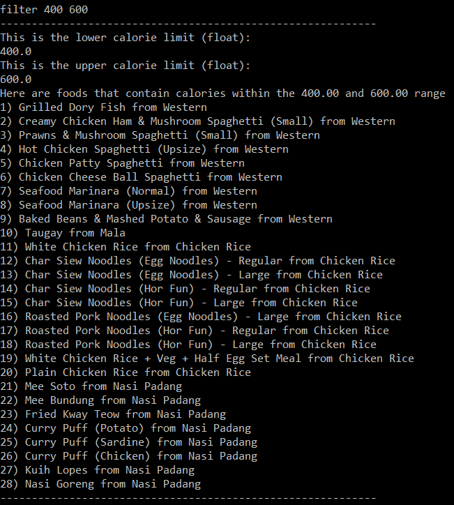
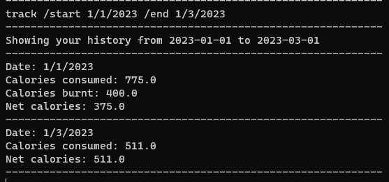

# ***LifeTracker user guide***

## Introduction

**_LifeTracker_** is an application that allows users who are health conscious automate the tracking of their calories and keep a record of 
their calorie intake history.

The app also allows users to keep track of their daily exercises to compute their calorie loss.

Their net calorie gain/loss can then be viewed.

- [Quick Start](https://github.com/AY2223S2-CS2113-W15-1/tp/blob/master/docs/UserGuide.md#quick-start)
- [Features](https://github.com/AY2223S2-CS2113-W15-1/tp/blob/master/docs/UserGuide.md#features-v20)
  - [Viewing User Profile](https://github.com/AY2223S2-CS2113-W15-1/tp/blob/master/docs/UserGuide.md#viewing-user-profile-view)
  - [Updating User Profile](https://github.com/AY2223S2-CS2113-W15-1/tp/blob/master/docs/UserGuide.md#updating-user-profile-update)
  - [Adding a meal](https://github.com/AY2223S2-CS2113-W15-1/tp/blob/master/docs/UserGuide.md#adding-a-meal-add)
  - [Listing foods](https://github.com/AY2223S2-CS2113-W15-1/tp/blob/master/docs/UserGuide.md#listing-foods-list)
  - [Listing meals](https://github.com/AY2223S2-CS2113-W15-1/tp/blob/master/docs/UserGuide.md#listing-meals-list)
  - [Listing exercises](https://github.com/AY2223S2-CS2113-W15-1/tp/blob/master/docs/UserGuide.md#listing-exercises-list)
  - [Deleting meals](https://github.com/AY2223S2-CS2113-W15-1/tp/blob/master/docs/UserGuide.md#deleting-meals-delete)
  - [Filtering foods](https://github.com/AY2223S2-CS2113-W15-1/tp/blob/master/docs/UserGuide.md#filtering-foods-filter)
  - [Viewing nutrition content of foods](https://github.com/AY2223S2-CS2113-W15-1/tp/blob/master/docs/UserGuide.md#view-nutrition-content-of-food-nutrition)
  - [Adding an exercise](https://github.com/AY2223S2-CS2113-W15-1/tp/blob/master/docs/UserGuide.md#adding-an-exercise-exercise)
  - [Tracking net calorie intake](https://github.com/AY2223S2-CS2113-W15-1/tp/blob/master/docs/UserGuide.md#tracking-net-calorie-intake-track)
  - [Displaying examples of meals and exercises](https://github.com/AY2223S2-CS2113-W15-1/tp/blob/master/docs/UserGuide.md#displaying-examples-of-meals-and-exercises-examples)
 - [Exiting the application](https://github.com/AY2223S2-CS2113-W15-1/tp/blob/master/docs/UserGuide.md#exiting-the-application-bye)
- [FAQ](https://github.com/AY2223S2-CS2113-W15-1/tp/blob/master/docs/UserGuide.md#faq)
- [Command Summary](https://github.com/AY2223S2-CS2113-W15-1/tp/blob/master/docs/UserGuide.md#command-summary)

## Quick Start

1. Ensure that you have Java 11 or above installed.
2. Down the latest version of `LifeTracker` from [here](https://github.com/AY2223S2-CS2113-W15-1/tp).
3. Copy the file to the folder you want ot use as the home folder for your LifeTracker.
4. Open a command terminal, `cd` into the folder you put the jar file in, and use the `java -jar tp.jar` command to run the application.
5. Type the command in the command box and press Enter to execute it. 
6. Refer to the features below for details of each command.

## Features

* View and Update user profile
* Add meal
* Delete meal
* Add Exercise
* Calculate caloric needs
* Calculate amount of calories left in the day
* Find the nutrition of a certain kind of food
* Filter foods based on calories
* Track Calorie Intake

### Viewing User Profile: `view`

To view user's profile. 
User can simply input a single line command to view the specific information in their user profile using the format
below.

Format: `view /[fieldName]`

Here is a table of the information that the user can choose to view alongside the field name of it:

| Information                  | /[fieldName]  |
|------------------------------|---------------|
| Name                         | /name         |
| Weight                       | /weight       |
| Height                       | /height       |
| Age                          | /age          |
| Gender                       | /gender       |
| Daily caloric limit          | /caloricLimit | 
| Calories remaining for today | /caloriesLeft |
| Target weight                | /targetWeight | 

Example:

### Updating User Profile: `update`

Allows the user to update any of their information.
User can simply input a single line command to update the specific information in their user profile using the format
below.

Format: `update /[fieldName] [newInfo]`

Here is a table of the information that the user can choose to update alongside the field name of it:

| Information   | /[fieldName]  |
|---------------|---------------|
| Name          | /name         |
| Weight        | /weight       |
| Height        | /height       |
| Age           | /age          |
| Gender        | /gender       |
| Target weight | /targetWeight | 

Example:

### Adding a meal: `add`

Adds a new meal to database

Format: `add /on [date] /type [MealType] /foods [foods]`

* The `date` should be in `d/M/yyyy` format
* The `MealType` can be one of the following
  * Breakfast
  * Lunch
  * Dinner
* The `foods` is a list of foods seperated by `, ` (Comma with a space after)

Example of usage:

`add /on 3/3/2023 /type Lunch /foods Spaghetti, Alfredo (Small)`

#### Alternatives

For users who are not experienced with typing fast on keyboards, *LifeTracker* offers a menu option to add meal

Format: `add`

### Listing foods: `list`

For users to view all foods currently supported in the *LifeTracker* database

Format: `list foods`

Example:

### Listing meals: `list`

For users to view previously added meals

Format: `list meals`

Example:

### Listing exercises: `list`

For users to view previously added exercises

Format `list exercises`

Example:

### Deleting meals: `delete`

For users to remove previously added meals and exercises

Format: `delete [/meal, /exercise] [index]`

* The `index` should be a positive integer and must be less than number of meals/exercises added
* It is recommended to run `list meals/exercises` beforehand to get the index of the meal/exercise you want to delete

Example:

### Filtering foods: `filter`

For users to filter the foods by their calorie content. The user inputs the lower and higher bound that they want to filter the food by,
in terms of the calorie content of the food.

The list of food within the range will then be displayed, from which the user can choose from.

Format: `filter [lower_bound] [upper_bound]`

* The lower and upper bound should be a `float` value
* The lower bound should be lower than or equal to the upper bound

Example:

### View nutrition content of food: `nutrition`

For users to view the nutrition content of the food. The user first needs to search for the food, then the nutrition content of the food will be printed.

Format: `nutrition`

* The first food search should be in English
* To select the particular food filtered, an integer should be inputted

Example:

### Adding an exercise: `exercise`

For user to input the exercise done previously

Format: `exercise /type [exercise name] /description [exercise description] /calories [calories burnt] /on [date]`

* The `exercise name` and `exercise description` accepts any input
* The `calories` should be in `float` format
* The `date` should be in `d/M/yyyy` format

Example:

### Tracking net calorie intake: `track`

For user to track their previous net calorie intake

Format: `track /start [start date] /end [end date]`

* `/start` and `/end` arguments are optional
* The dates should be in `d/M/yyyy` format
* If `/start` command is not provided, defaults to earliest date with meal/exercise added
* If `/end` command is not provided, defaults to latest date with meal/exercise added

Output:

### Displaying examples of meals and exercises: `examples`

For the user to gain some inspiration on exercises to do, as well as some idea on the meals that they can eat.

Format: `examples [meal/exercise]`

Example:

### Exiting the application: `bye`
Allows user to exit the application.

Format: `bye`

Output:

## FAQ

**Q**: How do I transfer my data to another computer? 

**A**: Do copy the `data` folder and its contents to the new computer

**Q**: Where do you get the data for the food from?

**A**: The nutrition data is based on food from NUS TechnoEdge canteen, as this application would be mainly targeted at NUS Engineering students who eats there regularly. 

## Command Summary

| Action    | Format, Examples                                                                                         |
|-----------|----------------------------------------------------------------------------------------------------------|
| View      | view                                                                                                     |
| Update    | update                                                                                                   |
| Add       | add /on [date] /type [MealType] /foods [foods]                                                           |
| List      | list foods or list meals                                                                                 |
| Delete    | delete INDEX e.g delete 3                                                                                |
| Filter    | filter [lower_bound] [upper_bound]                                                                       |
| Nutrition | nutrition                                                                                                |
| Exercise  | exercise /type [exercise name] /description [exercise description] /calories [calories burnt] /on [date] |
| Track     | track                                                                                                    |
| Examples  | examples [meal/exercise]                                                                                 |
| Bye       | bye                                                                                                      |

