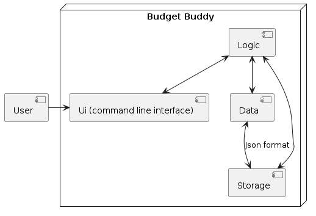

# Benjamin Long - Project Portfolio Page

## Overview

MoneyMoover is a **CLI application for managing and transferring international currencies**, optimized for use via a
Command Line Interface (CLI)
while still having the features of other money management applications.

Our app will help students to **track their expenses and income** in order to stay within their budgets, so that they
have enough money to travel.
It will also help them convert to foreign currencies so they can see how much they have to spend overseas.

## Summary of Contributions

* Code Contributed:
  [RepoSense Link](https://nus-cs2113-ay2223s2.github.io/tp-dashboard/?search=bawfen&breakdown=true)

##### Main Class

I implemented the foundation for the Main class, which was the entry point of the program.
The main class initializes the core components of the application, such as the Parser, Storage and Ui classes.
It also instantiates the logger, and configures it to write to a log file.
Once all the relevant components are loaded, it runs the main input loop until the program exits.

##### Feature: Parser Class

The Parser class is responsible for parsing user input and returning the appropriate `Command` object.
It was designed to be simple and extensible, allowing for easy addition of new commands.

##### Feature: Loading from file

I implemented most of the read logic for the Store class, allowing the program to load data from previous sessions.

* Stubs and Dependency Injection were used to bypass the Store class methods in the `AccountList`
  and `TransactionManager` classes during automated testing.
* The `AccountList` and `TransactionManager` classes were designed to make use of StoreInterface
  allowing for easy replacement of the Store class with a different implementation.
* The `LocalDateTimeAdapter` converts the `LocalDateTime` objects to and from a string format
  that is compatible with the JSON format used by the Store class. This required an understanding of generics and
  the Gson library.

### Contributions to team-based tasks

* I was responsible for the initial translation of User Stories into
  issues and delegation of work to different members of the team
* I advocated for the use of PR templates to ensure that all PRs were consistent, easy to review and passed
  all the necessary checks
* I proposed the usage of the BigDecimal library for floating point arithmetic, which was used in the
  implementation of many features in the application.

### Community

* PRs reviewed
    * [#39](https://github.com/AY2223S2-CS2113-T13-1/tp/pull/39)
    * [#98](https://github.com/AY2223S2-CS2113-T13-1/tp/pull/98)
    * [#104](https://github.com/AY2223S2-CS2113-T13-1/tp/pull/104)

* Suggestions for other teams
    * [Food Supply Tracker](https://github.com/nus-cs2113-AY2223S2/tp/pull/9)
    * [WellNUS++](https://github.com/bawfen/ped/issues)

### Documentation

* User Guide
    * Added section on Storage Related, Currency Related and Date Related inputs under Notes
* Developer Guide
    * Added Architecture section and architecture diagram
    * Added General Sequence section
    * Added Parser section
    * Added Storage section
    * Added Appendix - Requirements
    * Added Appendix - Instructions for Manual Testing
    * Added Appendix - Instructions for updating the API Key

#### Contributions to Developer Guide Extracts

##### Architecture

The diagram above provides a high-level overview of how the project is structured. The main components are:

1. The `Main` class which initialises all the other components at startup, and connects them with each other
2. The `UI` component which is responsible for all user input and output
3. The `Parser` component which parses user input and creates the relevant Command objects
4. The `Command` component which executes the logic
5. The `Accounts` component which manages the user's accounts
6. The `Forex` (Foreign Exchange) component which handles exchange-rate related logic
7. The `Transactions` component which manages the user's transactions
8. The `Storage` component which handles the saving and loading of data to disk

##### General Sequence

The following is a high-level sequence of a single `create-account SGD` command, which demonstrates how the components
interact with each other:

##### Parser component

The `Parser` Component

- Parses the user input and creates the relevant `Command` object
- Makes use of the `CommandType` enum to determine the type of command to create

### Storage Component

The following is a class diagram of the `Storage` component

- The `Storage` component is responsible for saving and loading data from disk.
- It stores the account and transaction data in JSON format using the Gson library.
- The `Storage` component makes use of dependency injection with the `StoreInterface` so that a stub (`TestStore`) can
  be injected when running automated tests. This prevents the automated tests from modifying the actual data stored on
  disk or having to consider potential side effects from previous tests.