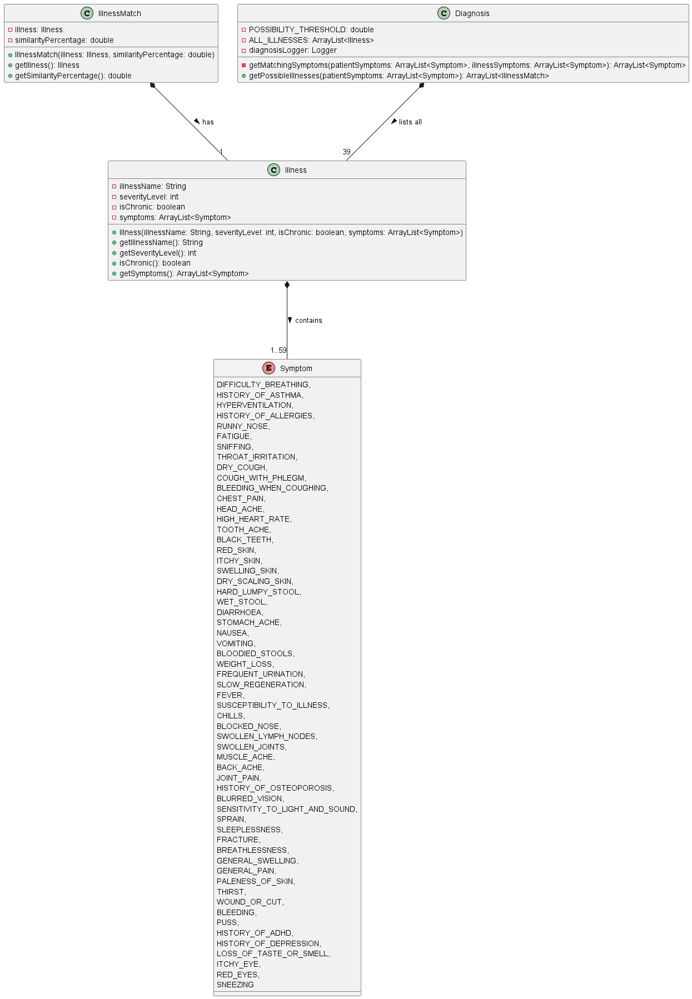
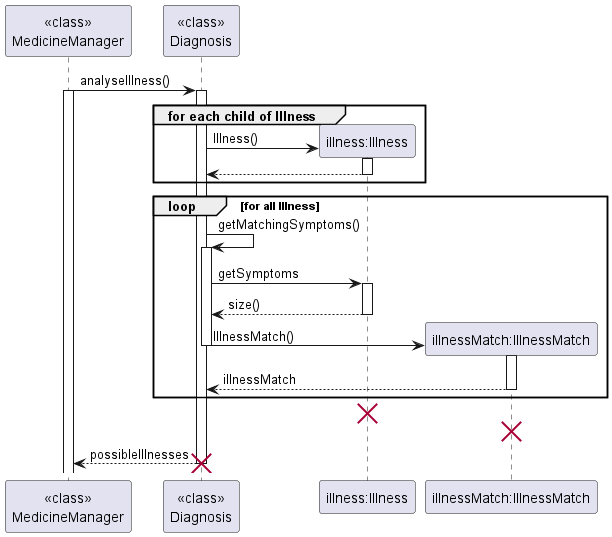

# Brannon Aw Xu Wei - Project Portfolio Page

## Overview of Dr. Duke
Dr. Duke is a medical commandline interface (CLI) software designed for clinics to automate the diagnosis of patients and dispense the appropriate medicine. In short, it: 
1. Mimics the registration at a polyclinic.
2. Asks for the patient's symptoms and matches them to known illnesses.
3. Outputs the most likely illnesses.
4. Prescribes medicine for the illnesses, and if the illness is severe or unknown, the patient is referred to the doctor instead.
5. Keeps record of the patient's login details, medical history and prescriptions across instances. It is written in Java and has about 5000 lines of code.

### Summary of Contributions
* **Code contributed**: [RepoSense](https://nus-cs2113-ay2223s2.github.io/tp-dashboard/?search=brennanzuz&breakdown=true)

* **Added features** :

  * Added symptom repository [#22](https://github.com/AY2223S2-CS2113-W13-1/tp/pull/22):
    * **What it does**: Holds information of all 59 common symptoms of which includes, but is not limited to: throat irritation, headache, sleeplessness, loss of taste or smell and many more. Uses actual symptoms from common illnesses.
    * **Justification**: These common symptoms will be used in higher levels in the software and allows the illnesses that commonly share them to reuse this clearly defined library. This will also be used in the main user interface and symptom history for the patient to indicate their symptoms and have them be stored.

  * Added illness repository [#22](https://github.com/AY2223S2-CS2113-W13-1/tp/pull/22):
    * **What it does**: Holds information of all 39 common and non-sever classified illnesses which includes but is not limited to: common cold, coronavirus, migraine, conjunctivitis, and many more. List many actual common illnesses.
    * **Justification**: Each illness contains information about their common symptoms and severity and is useful for the diagnosis process to easily identify what each illness entails. This clearly defined list of illnesses will be useful for keeping records on the patient's medical history.

  * Added the diagnosis process [#22](https://github.com/AY2223S2-CS2113-W13-1/tp/pull/22):
    * **What it does**: This is an integral part of the project that deals with taking in the patient's symptoms as inputs and interpreting them into a list of possible illnesses as output.
    * **Justification**: This module is essential as it is the first in the entire Dr. Duke usage sequence; it provides the list of symptoms required for medication output and for recording in the system.

* **Improved features**

  * Symptom selection options [#73](https://github.com/AY2223S2-CS2113-W13-1/tp/pull/73):
    * **What it does**: Added 15 more selectable symptoms in the main menu to allow more illnesses to be detected. Moved boilerplate code for the menu into a neater function.
    * **Justification**: To solidify the software's usefulness, it needed more selectable options for the patient to treat more patients and be more applicable.

* **User Guide improvements**

  * Added and changed few lines to clarify the reporting of symptoms [#105](https://github.com/AY2223S2-CS2113-W13-1/tp/pull/105).

* **Developer Guide improvements**:

  * Added detailed explanation of the diagnosis process [#80](https://github.com/AY2223S2-CS2113-W13-1/tp/pull/105).

  * Added class diagram describing the various classes involved in the diagnosis process and how they interact with one another [#80](https://github.com/AY2223S2-CS2113-W13-1/tp/pull/80/files). 

  * Added sequence diagram describing diagnosis algorithm and how it works with the objects involved in the diagnosis process [#107](https://github.com/AY2223S2-CS2113-W13-1/tp/pull/107). 

* **Team-based contributions**:

  * Initiated Developer Guide diagrams implementation [#79](https://github.com/AY2223S2-CS2113-W13-1/tp/pull/79).

  * Raised issue on medication crash in intermediate iteration [#74](https://github.com/AY2223S2-CS2113-W13-1/tp/issues/74).

* Community-based contributions:

  * Reported bugs for other teams [#1](https://github.com/Brennanzuz/ped/issues/1) [#2](https://github.com/Brennanzuz/ped/issues/2) [#3](https://github.com/Brennanzuz/ped/issues/3) [#4](https://github.com/Brennanzuz/ped/issues/4) [#5](https://github.com/Brennanzuz/ped/issues/5) [#6](https://github.com/Brennanzuz/ped/issues/6) [#7](https://github.com/Brennanzuz/ped/issues/7) [#8](https://github.com/Brennanzuz/ped/issues/8).

  * Enquired on the forums [#18](https://github.com/nus-cs2113-AY2223S2/forum/issues/18) [#34](https://github.com/nus-cs2113-AY2223S2/forum/issues/34).